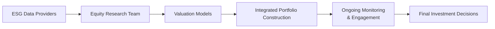

## Collaboration Across Teams

It might sound obvious, but trust me, I’ve seen too many cases where folks in the same firm act like they’re operating on different planets. In an ideal scenario, the portfolio manager, analyst, and risk manager should sit down at the very beginning of the ESG analysis and hammer out what the team is looking for, what data they need, and where the major vulnerabilities might lie. Establishing this collaboration prevents a scenario where the portfolio manager says, “Oh, I wasn’t aware the company had unresolved environmental liabilities,” after an unfortunate news headline appears.

For ESG integration to be truly robust, stewardship or engagement teams also need to be in the mix. They’re the ones on the front lines, having dialogues with senior management about environmental concerns, board diversity, and labor relations. We can’t just keep them in a silo and read their engagement notes at the tail end; we need them involved in shaping the overall investment thesis, risk analysis, and scenario testing right from the start. This cross-team collaboration can significantly update the perspectives discussed in Chapter 6 (Company Analysis—Past and Present) by adding another layer of due diligence and insight on a firm’s ethical or sustainability practices.

## Materiality Mapping

Materiality mapping means figuring out which ESG factors matter most to the industries or companies you’re analyzing. This practice is especially relevant to equity research, because, as we all know, certain ESG factors are just more critical to certain sectors. A chemical manufacturer, for instance, has a massive environmental footprint (e.g., waste disposal, toxic spills), whereas a software company might be more exposed to social issues (e.g., data privacy or employee relations).

If you’re short on time and can’t map out absolutely every possible risk (and let’s face it, that’s often the case), a robust materiality map tells you where to focus your efforts. The idea is that if a factor isn’t actually material to long-term financial performance, you can devote fewer resources to it. On the flip side, if the factor is critical—say, water consumption in beverage manufacturing—then you know to deep-dive into that aspect. It’s a great alignment tool that ensures resources aren’t wasted on fluff.

## Engagement Strategies

An essential best practice in ESG integration is direct engagement with management teams about ESG matters. Engagement is more than politely emailing an investor relations person; it’s about actively pushing for better reporting, better policies, or more transparency in financial disclosures. As covered back in Chapter 5 (Overview of Equity Securities), shareholders often have voting rights and can leverage those rights to spark positive change. For example, if an investment manager is concerned about the board’s independence, the manager can file or support shareholder proposals calling for more robust governance structures.

Sometimes, engagement can be done in collaboration with other investors (often called “collaborative engagement”). When I first heard of collaborative engagement, I was like, “Wait, so I’m teaming up with other funds—aren’t they my competitors?” Actually, getting multiple large shareholders on the same page can result in much stronger influence over a company’s behavior. You can achieve improvements more quickly and efficiently than by going it alone.

## Continuous Monitoring of ESG Performance

Companies aren’t static, so your ESG assessment shouldn’t be either. I remember analyzing a large retail chain that had stellar ESG ratings for years—until it suddenly faced a major scandal involving labor rights violations at its overseas factories. Boom, the company’s social rating tanked overnight. That’s exactly why continuous monitoring matters. If your due diligence is a one-and-done exercise, you’re basically setting yourself up for unpleasant surprises.

This dynamic approach also includes setting up alerts or triggers for adverse media coverage, regulatory changes, or controversies. Chapter 4 (Market Efficiency and Behavioral Insights) highlights how new information gets priced in quickly; failing to respond fast enough to ESG signals can be costly. Continuous monitoring can help you beat the market to the punch on negative developments, or, in more positive terms, help you capitalize on emerging sustainability trends.

## Integrated Portfolio Construction versus ESG Overlay

Although both methods aim to improve ESG performance, they differ in how deeply ESG data penetrates the investment process:

• Integrated Analysis (Preferred): ESG metrics and insights feed directly into valuation models, risk assessments, and portfolio construction decisions. Instead of tacking it on at the end, you incorporate ESG from the get-go. 

• ESG Overlay (Less Comprehensive): You build a portfolio using standard financial factors, then apply a final “screen” or “score” to weed out certain securities or impose certain constraints, like “exclude tobacco.” It’s simple, but it often misses opportunities to uncover alpha or manage risk more proactively.

Below is a quick look at how integrated analysis compares with an overlay approach:

| Feature                     | Integrated Analysis                          | ESG Overlay                            |
|----------------------------|----------------------------------------------|----------------------------------------|
| Timing of ESG Incorporation| Early (during security selection & valuation)| Late (after initial portfolio is formed)|
| Depth of Insights          | More nuanced, linked to financial modeling  | High-level filters, less nuance        |
| Potential for Alpha        | Higher (detecting neglected ESG factors)    | Lower (mainly negative screening)      |
|Contribution to Risk Control| Robust (embedded in risk models)            | Relies on broad exclusions             |

## Setting Measurable ESG Goals and Reporting

Transparency is your friend. By establishing measurable ESG objectives, such as reducing the weighted-average carbon intensity of your portfolio by 10% over the next year, you create a tangible target that fosters accountability. You can then outline how these goals tie back to your investment strategy (see Chapter 9 on Equity Valuation—Concepts and Basic Tools, which covers how financial metrics and forecasts can incorporate ESG-driven assumptions).

Progress reports to clients or beneficiaries help keep everyone in the loop—and keep the investment manager honest. If you are consistently missing goals, it forces you to ask why and adjust tactics. It also supports a “virtuous cycle,” encouraging deeper in-house ESG expertise since you’re measuring something that actually matters for both performance and societal impact.

## Collaborative Engagement

Though it overlaps with “Engagement Strategies” above, collaborative engagement is significant enough to stand on its own. If you want to move the needle on something systemic, like labor standards across an entire industry or better climate disclosures, you often need more heft than an individual investor can muster. This is where alliances come in—pooling both influence and resources with other institutional investors.

For instance, if you notice that a company’s supply chain extends across multiple regions with different labor standards, you might join forces with other investors to pressure the company into adopting a universal code of conduct. When multiple major shareholders speak in unison, the message carries a lot of weight.

## Third-Party Verification and Certification

At times, you’ll see asset managers highlight that they are signatories to the Principles for Responsible Investment (PRI) or have other sustainability certifications. Some managers even invite external auditors to verify their ESG processes. This approach can strengthen credibility—particularly with clients who are skeptical about “greenwashing.”

For compliance, it’s also wise to pay attention to the CFA Institute’s ongoing guidance in responsible investing and their ESG standards for disclosures. In the future, you may well see even more formal frameworks emerge, especially given the global direction towards standardizing ESG reporting. If you’re working in a regulated environment, keep an eye on how new guidelines might affect your day-to-day processes.

## AI-Driven ESG Analysis

Big data and artificial intelligence can track all sorts of “red flags.” Over time, AI-powered models can detect patterns in social media sentiment, negative news coverage, or governance changes that might predict future risk events. If you leverage these prompts early enough, you can reevaluate your positions before reputational damage or financial losses become irreversible.

To illustrate, consider the following simplistic Python snippet that outlines how an AI might process social media sentiment for a publicly traded company:

```python
import pandas as pd
from textblob import TextBlob

data = pd.read_csv('tweets_about_company.csv')

def get_sentiment(text):
    return TextBlob(text).sentiment.polarity

data['sentiment_score'] = data['tweet_text'].apply(get_sentiment)

daily_sentiment = data.groupby('date')['sentiment_score'].mean()
print(daily_sentiment)
```

Naturally, advanced practitioners will train sophisticated natural language processing (NLP) models on curated ESG topics, but the principle remains: AI can comb through troves of unstructured data—like news articles, social media, and corporate filings—to flag potential controversies well before they blow up in the mainstream press.

## An Illustration of ESG Integration

Here’s a visual overview of how ESG data might flow through an investment process. Notice how each stage feeds into the next, creating a loop of continuous improvement:



• A: ESG data providers supply raw data and ratings on environmental, social, and governance aspects.  
• B: The research team evaluates these data points, analyzing material ESG risks and opportunities.  
• C: Insights are factored into the firm’s valuation models (e.g., adjusting discount rates or growth assumptions).  
• D: The portfolio is constructed with ESG as a core consideration, rather than as a separate screen.  
• E: Managers continually monitor the portfolio’s ESG profile and engage with companies.  
• F: The ultimate buy/sell or hold decisions reflect the integrated ESG insights at each step.

## Potential Pitfalls

• Greenwashing: Firms may overstate their ESG credentials. Cross-check reported data with independent sources and never rely solely on corporate marketing materials.  
• Data Inconsistency: ESG ratings differ widely across providers. One solution is to combine multiple data sets, ensuring more holistic coverage.  
• Overemphasizing Short-Term Indicators: Some ESG changes—like building up a more diverse leadership pipeline—take years to bear fruit, so short-term metrics might miss the bigger picture.  
• Lack of Standardization: Different regions have different rules or standards for ESG disclosures, complicating direct comparisons.  
• Behavioral Biases: In Chapter 4, we touched on how biases can affect investments. The same is true for ESG; you might fall into the trap of ignoring negative news or overweighting certain sustainability themes you’re personally passionate about, leading to suboptimal decisions.

## CFA Exam Relevance: Integrating ESG at Level III

Although we’re covering this topic in Equity Investments at the Level I program, it becomes even more critical at Level III, where portfolio management is a central theme. Expect to see scenario-based questions where you must incorporate ESG factors into a larger portfolio context—perhaps calibrating the risk–return profile for a client with specific sustainability objectives or analyzing how the corporate oversight structure might influence your recommended weighting in a particular industry. You may be required to discuss engagement strategies or how to measure the impact of ESG on portfolio performance over multiple periods.

During constructed-response (essay) questions, you might have to articulate a rationale for recommending a buy but also propose ESG-based governance improvements. In item sets, you could see tables of conflicting ESG data from different providers and need to form a well-reasoned opinion on which data source is more appropriate or how to reconcile them.

## Conclusion

ESG integration is no longer an optional extra. In many cases, it’s an expected part of a prudent fiduciary process. By focusing on materiality, engagement, ongoing monitoring, integrated portfolio construction, and advanced analytics, investment professionals can identify both risks and opportunities. On top of that, measurable targets and transparent reporting help build trust with clients and stakeholders. We are not only aligning with ethical or social objectives—these approaches often bring real financial benefits, from risk mitigation to discovering emerging growth areas. In a rapidly evolving investment landscape, best practices in ESG integration could be the secret sauce that sets high-performing portfolios apart.

## References and Further Reading

• PRI (Principles for Responsible Investment): “Blueprint for Responsible Investment”  
   https://www.unpri.org  
• “Handbook on Strategy and ESG Integration” by CFA Institute  
   https://www.cfainstitute.org  
• “The Investment Integration Project” (TIIP)  
   https://www.tiiproject.com  
• Bril, Herman et al. “Sustainable Investing: Revolutions in Theory and Practice.” Routledge, 2020  

## Test Your Knowledge: Best Practices in ESG Integration Quiz



### Which description best captures materiality mapping in the ESG context?

- [ ] Including every possible ESG factor in the analysis, regardless of its relevance
- [x] Prioritizing ESG factors most relevant to an industry or company’s financial performance
- [ ] Ignoring ESG factors that cannot be measured numerically
- [ ] Conducting random checks of ESG disclosures after finalizing investment decisions

> **Explanation:** Materiality mapping focuses on identifying which ESG factors truly matter for a particular industry or firm, ensuring time and resources are allocated effectively.

### Which of the following approaches typically embeds ESG considerations into the security selection and valuation process from the start?

- [x] Integrated analysis
- [ ] Negative screening based purely on ethical preferences
- [ ] Thematic investing based on global megatrends
- [ ] ESG overlay applied after constructing a portfolio

> **Explanation:** Integrated analysis incorporates ESG data directly into the valuation and risk modeling process, rather than applying it as a separate screen or layer.

### How does continuous ESG monitoring mitigate risk in an equity portfolio?

- [x] It allows investors to identify emerging controversies or changes in a firm’s ESG profile before they become major problems.
- [ ] It forces companies to raise more capital to address social concerns.
- [ ] It prevents analysts from using fundamental valuation techniques.
- [ ] It guarantees higher returns than non-ESG portfolios at all times.

> **Explanation:** Continuous monitoring helps detect early warning signs of ESG deterioration, allowing managers to respond quickly and mitigate potential downside risk.

### In collaborative engagement, why might multiple institutional investors join forces?

- [ ] To reduce the costs of short selling underperforming stocks
- [ ] To avoid their own fiduciary responsibilities
- [x] To amplify influence and push for more significant ESG improvements
- [ ] To share proprietary research data and eliminate competition

> **Explanation:** By working together on key ESG issues, investors can exert greater pressure on companies to improve their practices than any single investor could on its own.

### What’s an important pitfall to look out for when combining ESG data from multiple providers?

- [x] Inconsistency in ratings and definitions, leading to conflicting signals
- [ ] Overlapping data sets that strengthen data integrity
- [ ] Perfectly consistent reporting from all providers
- [ ] Inability to quantify emissions from any industry

> **Explanation:** Different ESG providers might use different methodologies and criteria, producing conflicting information that must be reconciled for clarity.

### Which practice best demonstrates good stewardship in ESG investing?

- [x] Voting on shareholder resolutions that promote stronger governance or environmental policies
- [ ] Ignoring all non-financial factors in the investment process
- [ ] Outsourcing every engagement activity to third-party consultants
- [ ] Divesting from any stock with less than perfect ESG scores

> **Explanation:** Good stewardship involves using shareholder rights—such as proxy voting—to engage with and push companies toward better ESG standards.

### According to best practices, what is a direct advantage of integrating ESG factors into equity valuation models?

- [x] It helps uncover overlooked risks and opportunities that may affect valuation
- [ ] It eliminates all market risk from the portfolio
- [x] It increases the correlation of the portfolio’s returns to the benchmark
- [ ] It makes regulatory compliance optional

> **Explanation:** Incorporating ESG factors into valuation can highlight risks and value drivers traditional models might miss, potentially improving risk-adjusted performance.

### Why is it useful to set measurable ESG goals in an investment strategy?

- [x] They create tangible targets for accountability and performance tracking
- [ ] They are legally mandated in all markets by global ESG regulations
- [ ] They let managers ignore traditional financial metrics
- [ ] They replace the need for corporate financial disclosures

> **Explanation:** Setting, reporting, and measuring progress on specific ESG targets helps ensure transparency and drives real improvements over time.

### How can AI-driven ESG analysis benefit equity managers?

- [x] By detecting ESG controversies or sentiment changes from large volumes of unstructured data
- [ ] By automatically ensuring any selected stock will outperform the market
- [ ] By removing the need for any human equity research analysts
- [ ] By guaranteeing zero carbon footprint in the portfolio

> **Explanation:** AI tools can quickly sift through news, social media, and other sources to identify emerging ESG risks or trends, enhancing an investment team’s speed and accuracy.

### True or False: Collaborative investor efforts in ESG engagement can lead to more significant shifts in a company's practices than solo engagements.

- [x] True
- [ ] False

> **Explanation:** When multiple large investors collaborate, they usually have greater influence on corporate behavior, often resulting in faster or more significant ESG improvements.


