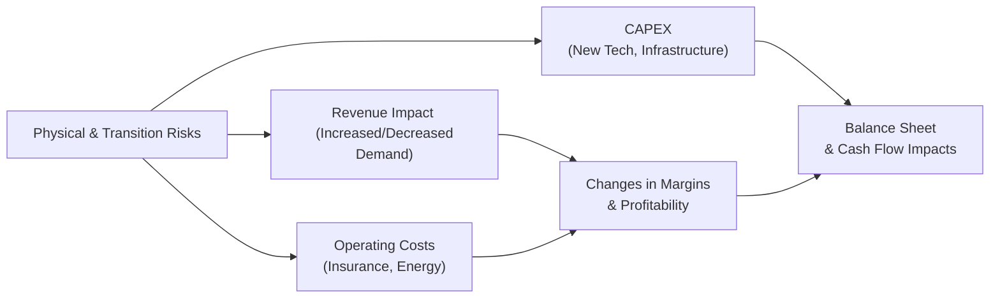

## Introduction and Context

Let’s be honest: sometimes, when we talk about climate change and carbon footprints in the investment world, it can feel a bit abstract. I remember chatting with a friend who manages a small equity portfolio. He once told me, “I know climate change is real, but I’m just trying to pick winners in the next quarter or two—how do I even start thinking about sea levels and carbon taxes?” Well, the world is changing rapidly. Investors who don’t integrate climate risks into their frameworks could end up with portfolios that miss out on crucial trends or suffer from unforeseen losses. 

In this section, we’ll dive into the nitty-gritty of integrating climate risk metrics into equity selection. We’ll explore some of the most common metrics, show you how to interpret them, and provide a roadmap for weaving them into your investment process.

## Understanding Climate Risk in Equity Analysis

Climate risk in equity investing can be broadly categorized into physical and transition risks:

• Physical risk arises from events like intense hurricanes, flooding, droughts, or rising sea levels. These can damage infrastructure, disrupt supply chains, and create unexpected costs.  
• Transition risk relates to the shift toward policies and technologies that reduce greenhouse gas emissions. This might include new carbon taxes, stricter environmental regulations, or widespread adoption of clean energy.

Both types of risks can affect a company’s bottom line, making it essential for analysts to understand how they might impact revenue, operating costs, investment requirements, and overall business strategies.

### Key Climate Metrics

A range of metrics has emerged to quantify and assess these risks:

• Carbon Footprint: An aggregate measure of the total greenhouse gas (GHG) emissions connected to a company (sometimes measured per unit of revenue).  
• Carbon Intensity: Emissions per economic unit (e.g., metric tons of CO₂ equivalent per million dollars of revenue). This helps compare companies of different sizes or sectors.  
• Climate Value-at-Risk (Climate VaR): An estimate that models how a portfolio or single stock might be impacted by different climate-related scenarios—both in terms of physical damage and costs associated with the transition to a low-carbon economy.  
• Alignment with Climate Scenarios: An assessment of whether a company’s business plans and capital expenditures are aligned with scenarios (like “net zero by 2050”) proposed by bodies such as the Intergovernmental Panel on Climate Change (IPCC).

## Integrating Climate Metrics into Equity Valuation

### Modeling and Assumption Adjustments

The simplest way to integrate climate metrics into your equity models is by adjusting assumptions around a company’s revenue growth, cost of capital, or capital expenditure requirements. For instance, if a company is in a highly emission-intensive industry (e.g., metals, utilities, or oil & gas), you might model a higher capital expenditure to reflect investments in cleaner technology or carbon capture. Similarly, you might lower revenue CAGR assumptions if you think a carbon tax will curb demand for the company’s products.

To illustrate, suppose you’re modeling a coal mining company. You anticipate a future carbon tax. Instead of forecasting stable margins, you could apply a discount to the firm’s expected free cash flows to account for that potential legislative cost. Your discount might be based on the company’s carbon footprint relative to its peers, giving you a more refined (albeit uncertain) scenario.

### Scenario Planning

Scenario analysis is a helpful tool for capturing the wide range of uncertainties around climate change. You can construct several potential futures—such as a rapid transition scenario, a moderate transition scenario, and a “business-as-usual” scenario—each with varying implications for corporate earnings and valuation. 

The Task Force on Climate-related Financial Disclosures (TCFD) recommends that companies disclose how they perform under various climate scenarios (like a 2°C or 4°C temperature rise). As an investor, you can use these same scenarios to:

1. Estimate potential changes in demand for the company’s products or services.  
2. Project cost impacts from regulatory changes (e.g., carbon taxes, fossil fuel phaseouts).  
3. Adjust discount rates or the cost of equity to reflect additional climate-related risks.

Here’s a simple depiction of scenario analysis, focusing on potential physical and transition risks, along with how they might flow through income statements and balance sheets:



## Evaluating Company Responses to Climate Risk

### Climate Adaptation vs. Mitigation

Companies can respond to climate risk by either adapting to its effects or mitigating their impact:

• Adaptation: Improving physical resilience (e.g., flood barriers, diversifying supply chains) or resorting to climate insurance products.  
• Mitigation: Reducing GHG emissions through energy efficiency, adopting renewables, or investing in alternative technologies.

Analyzing a firm’s strategy and capital allocation in these areas can reveal how prepared it is to handle future climate uncertainties. Climate-forward firms often disclose these strategies through Sustainability Reports or TCFD-aligned disclosures.

### IPCC Pathways and Transition Readiness

The IPCC offers a variety of temperature scenarios based on projected emissions pathways. If a company heavily invests in fossil fuel exploration but the global economy transitions rapidly to a greener path (like an IPCC 1.5°C or 2°C scenario), that business might face “stranded assets.” In contrast, companies focused on developing electric vehicle (EV) technologies or renewable power solutions may thrive.

You might see rating agencies or ESG data providers label firms as “1.5°C-aligned” or “2°C-aligned,” reflecting their expected ability to operate profitably under certain climate policy pathways. This forward-looking perspective can help investors compare multiple companies under a consistent climate lens.

## Practical Example Using Python

Below is a short Python snippet illustrating how one might combine carbon intensity data and scenario-based modeling to estimate changes to net operating cash flows. Note that this is a simplified example purely for demonstration:

```python
import pandas as pd

data = {
    "Company": ["Alpha Mining", "Beta Energy", "Gamma Renewables"],
    "Carbon_Intensity": [2.3, 1.8, 0.2],  # metric tons CO2/revenue million
    "Baseline_CashFlow_millions": [500, 300, 200]
}
df = pd.DataFrame(data)

carbon_tax_per_ton = 50

df["Tax_Impact_millions"] = df["Carbon_Intensity"] * carbon_tax_per_ton
df["New_CashFlow_millions"] = df["Baseline_CashFlow_millions"] - df["Tax_Impact_millions"]

print(df)
```

In this simplistic table, you might capture how a higher carbon intensity leads to a higher tax impact. In reality, you’d layer multiple factors—insurance premiums, supply chain disruptions, demand changes—to get a more complete picture.

## TCFD Disclosures and the Importance of Data

Climate data can be patchy or inconsistent, making it one of the trickiest areas in ESG investing. The TCFD framework helps standardize climate-related financial disclosures, encouraging companies to describe how they identify, evaluate, and manage climate risks and opportunities. Key pillars of TCFD:

• Governance: The board’s oversight of climate-related risks and opportunities.  
• Strategy: The resilience of a firm’s strategy under different climate scenarios.  
• Risk Management: Processes to mitigate or transfer climate risk (e.g., insurance).  
• Metrics & Targets: Quantitative measures such as GHG emissions, energy use per output, or water usage.

As TCFD reporting becomes more prevalent and standardized, analysts gain deeper insights into a company’s climate exposure. However, data challenges remain. Historical climate data might not reliably capture the rapidly evolving nature of policy changes or extreme weather events, requiring analysts to rely on specialized external data sets (e.g., from climate scientists or NGOs).

## Incorporating Climate Risks into Portfolio-Level Decisions

### Portfolio Construction

When constructing an equity portfolio, climate risk metrics can guide which companies or sectors to overweight or underweight. For example, you might:

• Set thresholds on carbon intensity, restricting investment in high-intensity industries.  
• Factor in climate VaR to optimize the portfolio’s overall risk exposure to climate events.  
• Use scenario analysis to measure the portfolio’s alignment with net-zero targets, then rebalance if it deviates too far.

### Engagement vs. Exclusion

Some investors, particularly those with an active stewardship philosophy, engage with high-emission companies to advocate for better disclosure and transition strategies rather than excluding them altogether. This approach can be beneficial if you believe the company can transform its business model or shift its product mix. On the other hand, you might consider exclusion if a firm is unwilling or unable to adapt to looming climate regulations.

### Common Pitfalls

1. Overreliance on a Single Metric: Though carbon footprint or carbon intensity can be helpful, these metrics don’t capture the full story (e.g., water intensity, biodiversity impacts).  
2. Ignoring Physical Risks: Focusing solely on emissions and ignoring potential manufacturing disruptions from severe weather can lead to underestimating true portfolio risks.  
3. Underestimating Timing: Regulators can suddenly adopt new carbon taxes or stricter emissions constraints. Scenario analysis must consider both near-term and long-term horizons.

## Exam Tips for CFA Level III Candidates

• Familiarize Yourself with the TCFD Framework: Expect scenario-based or multi-part item set questions that require you to analyze how climate risk might shift corporate earnings or valuations.  
• Understand Key Metrics: Be able to calculate or interpret carbon intensity and carbon-related taxes in a free cash flow or earnings forecast context.  
• Practice Scenario Analysis: You may see questions asking you to apply different temperature pathways or carbon tax assumptions to evaluate a company’s profitability.  
• Incorporate ESG Standards into the Code of Ethics: Show that you know how to integrate climate considerations responsibly, in line with the CFA Institute’s guidance on stewardship.  
• Time Management: For essay questions about climate risk, structure your response clearly. Outline the scenario assumptions, the company’s potential response, and the valuation impact.  

## References

• TCFD Recommendations: https://www.fsb-tcfd.org  
• Institutional Investors Group on Climate Change (IIGCC): “Measuring Portfolio Carbon Footprints”  
• IPCC Reports: https://www.ipcc.ch  
• BlackRock Investment Institute: “Investing in the Era of Climate Change”  

--------------------------------------------------------------------------------

## Test Your Knowledge: Climate Risk Metrics and Equity Valuation



### Which of the following best describes transition climate risk in equity analysis?

- [ ] Risk of physical damage to corporate infrastructure caused by extreme weather events.
- [ ] Risk of a temporary market downturn affecting equity valuations broadly.
- [x] Risk associated with changing regulations, technology shifts, or market preferences that favor low-carbon operations.
- [ ] Risk of currency fluctuations driven by international trade policies.

> **Explanation:** Transition climate risk captures costs or lost opportunities from evolving regulations, carbon taxes, or a shift in consumer preferences toward greener solutions.

### When applying emissions data to an equity valuation model, which aspect might you adjust to reflect climate taxation?

- [ ] Company sales growth rate.
- [x] Operating expense or capital expenditure estimates.
- [ ] Weighted average cost of capital.
- [ ] Company dividend policy.

> **Explanation:** Emissions-based taxes will either raise operating expenses or require additional capital expenditures (e.g., for pollution control equipment), so adjustments to costs are common.

### Carbon intensity typically measures:

- [ ] The weight of a company’s GHG emissions divided by its number of employees.
- [x] The level of GHG emissions per a given economic unit (e.g., per million dollars of revenue).
- [ ] The monetary penalty levied on a company by environmental regulators.
- [ ] The frequency of climate-related events over a given time frame.

> **Explanation:** Carbon intensity standardizes emissions relative to a firm’s revenues or output, allowing better comparisons across companies of differing sizes.

### Under TCFD guidelines, which area focuses on disclosing the processes a firm uses to handle potential climate-related disruptions?

- [ ] Governance
- [ ] Strategy
- [x] Risk Management
- [ ] Metrics and Targets

> **Explanation:** The Risk Management disclosure outlines how a firm identifies, assesses, and responds to climate risks (e.g., operational disruptions or policy changes).

### Which scenario would most likely increase transition risk for an oil and gas company?

- [x] Sudden implementation of a high carbon tax rate by various governments.
- [ ] More frequent hurricanes across coastal regions.
- [ ] A stable global policy requiring minor emissions reductions.
- [x] Rapid technological breakthroughs in carbon capturing, benefiting only small renewable firms.

> **Explanation:** Transition risk is about the financial repercussions of shifting away from high-carbon solutions, and a sudden carbon tax or technology breakthroughs favoring competitors would significantly amplify that risk.

### Why might historical climate data alone be insufficient for projecting future climate risks?

- [ ] Because it is always inaccurate.
- [ ] Because it indicates only positive trends.
- [x] Because climate change is accelerating, policy shifts are rapid, and data lacks predictive power without forward-looking context.
- [ ] Because greenhouse gas emissions remain constant over time.

> **Explanation:** Solely relying on historical data overlooks accelerating climate trends and unforeseen regulations, making forward-looking scenario planning essential.

### How can an investor use “Climate VaR” in equity portfolio construction?

- [x] To estimate potential losses under various climate scenarios and adjust holdings accordingly.
- [ ] To determine the probability of default for corporate bonds.
- [x] To identify specific assets most vulnerable to weather events and transition policies.
- [ ] To guarantee outperformance in low-carbon strategies.

> **Explanation:** Climate VaR helps quantify the worst-case financial loss (both physical and transition) so investors can optimize holdings and potentially hedge or de-risk weaker assets.

### An investor is evaluating a manufacturing firm that relies on complex supply chains in low-lying coastal regions. Which measure would be most relevant in assessing potential disruptions?

- [ ] Carbon intensity
- [x] Physical climate risk metrics (like flood or hurricane exposure)
- [ ] Level of corporate governance risk
- [ ] Scope 1 GHG emissions only

> **Explanation:** Physical climate risk metrics measure the threat posed by weather events or rising sea levels, critical for companies with facilities in vulnerable areas.

### When analyzing a firm’s climate adaptation strategy, which of the following would you most likely examine?

- [ ] Changes in company dividend policy.
- [ ] Auditors’ opinion on financial statements.
- [x] Investments in renewable energy projects, flood barriers, or diversification of transportation routes.
- [ ] Stock buyback programs during high inflation.

> **Explanation:** Adaptation involves tangible efforts or expenditures to protect against climate change impacts—like investing in flood defenses or supply chain resilience.

### True or False: “Companies aligned with a 2°C global warming scenario will face no climate-related financial risks in the future.”

- [x] True
- [ ] False

> **Explanation:** This statement is actually false. Even under a 2°C scenario, companies still face climate-related financial risks, such as policy changes, extreme weather events, or the cost of transitioning technologies. So the correct choice here is that the statement is False—no scenario guarantees the complete elimination of risks.


