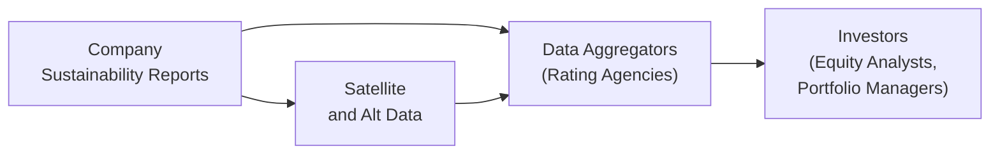

## Introduction

So, maybe you’ve heard that incorporating Environmental, Social, and Governance (ESG) factors is all the rage—like everyone is talking about it. And it’s kind of a big deal for investors who want to understand not just the financials of a company but also its sustainability profile, labor practices, and boardroom ethics. The trouble is, ESG data can be a bit messy. Companies report different metrics, rating agencies weigh them differently, and definitions can change depending on who you ask. You might be scratching your head: “Wait, how can I actually compare these data points when everything seems all over the place?” That’s exactly the challenge of ESG data standardization. Let’s walk through the main issues and see how we can make sense of them.

## The Patchwork of ESG Data Sources

ESG data is collected from a variety of source documents: corporate sustainability reports, regulatory filings, media coverage, NGO or watchdog reports, and sometimes even satellite imagery (yep, that happens for environmental monitoring). But each source can define sustainability-speak in its own way—one firm’s “sustainable sourcing” might not align with another’s. For instance, if Company A reports that 60% of its raw materials are “responsibly sourced,” that figure might not be comparable to Company B’s 70% if the companies are using totally different standards.

In financial analysis, this is particularly problematic. You want apples-to-apples comparisons across firms, but you end up with apples-to-sardines. The lack of a universal framework means data might be missing, incomplete, or just plain incomparable. And if we can’t compare Company A to Company B in the same industry, it’s tough to incorporate ESG factors reliably in our equity valuations.

## Divergent ESG Ratings and Methodologies

You’ve probably noticed: ESG ratings from major providers (think MSCI, Sustainalytics, S&P Global, and more) can be all over the place. Why? Because each agency:

- Uses its own proprietary weighting systems.  
- Applies distinct data-collection approaches.  
- Covers different sets of companies or focuses on different metrics.

This divergence can cause confusion and frustration among investors. One rating agency might consider carbon footprint the most critical factor, while another might emphasize diversity and labor practices. So, an “A” rating from one provider doesn’t necessarily match an “A” from another.

### A Quick Example

Imagine an auto manufacturer with a strong record of reducing carbon emissions but a track record of employee disputes. One rating agency that emphasizes environmental metrics might give it a top-tier ESG score. Another that weighs labor relations heavily might downgrade it significantly. The result? Mixed signals for investors trying to figure out if the equity price adequately reflects the company’s “true” ESG performance.

## Self-Reporting Pitfalls

It’s no secret that companies often put their best foot forward, especially in their official sustainability disclosures. If a firm is compiling a single ESG highlights document, do you think it will lean more heavily into its success stories or emphasize its shortcomings? Yeah, exactly. This selective disclosure can lead to:

- Incomplete Data: Negative indicators might simply go unmentioned.  
- Biased Representation: Self-reported metrics might be overly optimistic.  
- Potential Greenwashing: Firms spin their sustainability stories to appear more environmentally friendly than they really are.

And because many ESG frameworks still rely on voluntary compliance (though regulations are tightening in some jurisdictions), there’s no guarantee that every relevant data point is disclosed. It’s kind of like social media: everyone posts the coolest vacation photos, but you rarely see the rough days.

## Multiple Frameworks, Multiple Definitions

We do have some industry-specific frameworks—such as SASB (Sustainability Accounting Standards Board) and GRI (Global Reporting Initiative)—that try to help companies focus on material ESG factors for each sector. But ironically, the proliferation of frameworks can itself create confusion. If Company A uses SASB standards to talk about product lifecycle management, while Company B relies on GRI guidelines, you might still be left with mismatched or incomplete data sets.

### Material-Sector Approach

SASB, for example, helps identify the most relevant ESG factors for a given industry, such as “water management” for mining or “data privacy” for tech. But not every company chooses to adopt the same approach, which results in potentially missing or hard-to-compare metrics. A universal standard is still elusive, meaning that while frameworks help, they don’t fully solve the cross-comparison conundrum.

## Emerging Markets and Limited Disclosure

Another big challenge is data availability from emerging or frontier markets. Disclosure requirements can be weaker, or enforcement less robust, meaning we have bigger data gaps. Sometimes, it’s not that companies in emerging markets are less ESG-friendly; they might just have fewer resources or incentives to disclose as comprehensively as firms listed in more stringent jurisdictions.

Imagine analyzing a multinational corporation with subsidiaries in various emerging markets. Some of those subsidiaries might face local disclosure policies that are not up to par with global best practices, resulting in patchy or incomplete data. As an investor, you then have to guess or infer the ESG performance, which obviously increases uncertainty in your valuations or portfolio allocations.

## Technological Advancements in Data Collection

Before we start thinking it’s all doom and gloom, let’s acknowledge we’ve got some cool, hi-tech stuff going on in ESG data collection. Natural Language Processing (NLP) can scan corporate filings and pick out meaningful ESG statements or metrics. Satellite imagery can assess environmental impacts, track deforestation, or gauge mines’ environmental footprints. Alternative data from sensors or social media further enriches the ESG dataset. So, we do see improvements toward a more objective, real-time perspective on how a company interacts with its environment and stakeholders.

But we’re not at the stage where these tools are universally adopted or standardized. Investors using high-end NLP and big-data solutions might have an edge in identifying greenwashing or inconsistent disclosures, while others are simply reliant on the standard rating agencies or company reports. So, we have a technology gap that can further widen the discrepancy in ESG analyses.

Here’s a quick mermaid diagram to illustrate how ESG data might flow from companies to rating agencies, then onward to investors:

As you can see, data is gathered from multiple points (corporate reports, satellites, etc.), processed by rating agencies, then provided to investors. Each step can create variations or distortions due to methodology differences, incomplete disclosure, or selective reporting.

## Best Practices for Investors

It’s not all chaos and guesswork—there are ways to approach this problem strategically:

**1. Due Diligence on Data Providers**  
   Scrutinize the methodology used by your ESG data source. Understand the weighting scheme, coverage universe, and data-collection strategies. Don’t just trust a simple letter rating without exploring how that rating came to be.

**2. Cross-Verification**  
   Rely on more than one data source. Compare multiple ratings or frameworks, and if you see divergences, investigate why. This can help uncover blind spots or biases in a single ESG rating agency.

**3. Engage with Companies**  
   If you have the resources, directly engage with the companies. Ask for clarifications on disputed data points. Request more detailed disclosures or third-party verifications (e.g., external ESG audits).

**4. Focus on Materiality**  
   Not every ESG factor matters equally to every industry. Using a materiality framework (like SASB) ensures you pay attention to factors most likely to affect the firm’s financial performance. This approach tightens data requirements and reduces extraneous noise.

**5. Embrace Technology Wisely**  
   Consider new data-collection approaches such as NLP or alternative data sets. But be mindful of potential integration challenges and the cost or complexity involved.

## Common Pitfalls and How to Avoid Them

**Pitfall 1: Over-Reliance on a Single Rating**  
   An ESG rating can be “off” if the methodology doesn’t align with your investment philosophy or if the data is incomplete. Use multiple ratings—or dig deep into the methodology—to form your own view.

**Pitfall 2: Ignoring Local Context**  
   Perhaps you’re comparing a tech start-up in an emerging market with a well-established multinational in Europe. Their reporting maturity might differ drastically. Adjust your analysis for those differences instead of penalizing one company purely for the environment it operates in.

**Pitfall 3: Greenwashing Traps**  
   Companies know “green” sells. Keep an eye out for marketing spin. Watch for a discrepancy between a firm’s public commitments (like “net-zero by 2030”) and its actual operational metrics or capital expenditures. If they’re saying one thing but investing in the opposite direction, that’s a red flag.

## Exam Tips and Applications

In the CFA® Program context, especially for Level I but also relevant for more advanced analysis later, be prepared to interpret ESG data from multiple sources. You might see an exam question presenting two different ESG scores for the same firm, and you’ll have to reason about which rating is more credible or relevant. Or you might be asked which elements of ESG are most material to a specific industry scenario.

When you see a question on “higher-level risk management” or “portfolio construction,” keep in mind that ESG data inconsistency can lead to errors. If the exam question provides incomplete data or mentions a questionable rating factor, you might need to highlight the limitations or recommend additional investigation. The key is recognizing that ESG data must be critically examined, just like any other aspect of financial analysis.

## Glossary (Key Definitions)

- **Inconsistent Methodologies**: Variations in how ESG data is gathered, weighted, and interpreted by different rating agencies or data providers.  
- **Self-Reported Data**: Information that companies voluntarily disclose, often without independent verification. This can lead to potential bias or omissions.  
- **SASB (Sustainability Accounting Standards Board)**: An organization that creates sustainability disclosure standards by industry, emphasizing material ESG topics most relevant to financial performance.  
- **GRI (Global Reporting Initiative)**: A widely used global framework for sustainability reporting, focusing on transparency and stakeholder engagement.  
- **NLP (Natural Language Processing)**: An AI technique that reads and interprets textual data (like corporate reports) to extract ESG insights.  
- **Data Gap**: Shortfalls or inconsistencies in the availability of ESG-related information, making it difficult to compare firms on an equal footing.  
- **Verification**: External auditing or assurance that the ESG data a company reports is accurate and complete.  
- **Material-Sector Approach**: Assessing only the ESG metrics that substantially affect the financial health or operational stability of a company in a given industry.

## References and Further Reading

- “Rate the Raters” reports by SustainAbility (<https://www.sustainability.com>)  
- SASB Standards: <https://www.sasb.org>  
- GRI Standards: <https://www.globalreporting.org>  
- “The ESG Data Challenge,” CFA Institute Research Foundation  

---

## Test Your Knowledge: ESG Data Standardization Challenges



### Which factor contributes most to inconsistent ESG ratings among different data providers?

- [ ] A uniform global ESG standard applied consistently across providers
- [ ] Widespread, standardized verification of corporate disclosures
- [x] Unique weighting methodologies and data-collection methods used by each agency
- [ ] Companies universally disclosing only negative performance data

> **Explanation:** Each data provider has its own proprietary methodology, which leads to diverging ESG ratings. This includes varying data sources, weighting schemes, and coverage.

### When relying solely on self-reported ESG data, which major concern should an analyst keep in mind?

- [ ] Inability to gather any data from the company
- [x] Possible omission of negative information or biased presentation
- [ ] Complete access to all relevant ESG metrics
- [ ] Guarantees of consistent reporting across companies

> **Explanation:** Self-reported data may reflect intentional or unintentional bias. Companies tend to highlight favorable indicators and downplay or omit adverse ones, which can lead to reporting distortions.

### How do frameworks like SASB and GRI attempt to address ESG standardization?

- [ ] By eliminating the need for third-party ESG ratings
- [x] By specifying material ESG factors and structured reporting guidelines
- [ ] By mandating identical metrics for all companies worldwide
- [ ] By providing real-time, verified data to investors

> **Explanation:** SASB and GRI both provide guidelines on what companies should disclose and how these disclosures should be structured. They focus on material ESG issues relevant to specific sectors.

### In emerging markets, ESG data gaps often arise because:

- [ ] Companies have no social or environmental impacts
- [ ] Regulators mandate excessive ESG disclosures that lead to confusion
- [x] Disclosure requirements can be less stringent, and enforcement may be weaker
- [ ] Local investors do not care about ESG

> **Explanation:** Emerging markets may not have the same level of regulatory enforcement or established reporting frameworks. This frequently results in incomplete or less rigorous data.

### What is a key benefit of using alternative data (e.g., satellite imagery) in ESG analysis?

- [ ] It eliminates the need for any company disclosure
- [ ] It makes corporate sustainability reports irrelevant
- [ ] It validates ESG ratings by rating agencies automatically
- [x] It provides potentially objective, real-time insights into environmental or operational impacts

> **Explanation:** Satellite imagery can independently verify information like deforestation or mining activities, offering a more objective view and reducing reliance on self-reported data alone.

### To avoid greenwashing, investors should:

- [ ] Accept corporate sustainability reports at face value
- [ ] Rely solely on news releases from the company’s public relations team
- [x] Compare public commitments to actual spending and operational metrics
- [ ] Ignore companies’ environmental claims and focus solely on financial metrics

> **Explanation:** By analyzing whether actual expenditures and ongoing operations match stated green objectives, investors can catch discrepancies that suggest possible greenwashing.

### When two rating providers offer drastically different ESG scores for the same firm, the most appropriate investor response is:

- [ ] Disregard both ratings
- [x] Investigate the differences in methodologies and data inputs
- [ ] Invest based on the lower score to minimize risk
- [ ] Immediately conclude the firm is untrustworthy

> **Explanation:** Instead of dismissing the ESG ratings entirely, it’s prudent to examine how each provider arrived at its score. Methodology and data-collection differences could explain the discrepancy.

### Which step can best help investors address inconsistent sector-specific ESG metrics?

- [x] Employ a materiality-based framework (like SASB) that focuses on sector-relevant issues
- [ ] Use only one authoritative source for ESG data
- [ ] Assume that all companies within a sector have uniform disclosure
- [ ] Ignore any ESG data disparities altogether

> **Explanation:** By using a material-sector approach, analysts focus on the most financially relevant ESG factors for each industry, thus filtering out extraneous metrics and reducing inconsistency.

### How might NLP (Natural Language Processing) improve ESG analysis?

- [x] By scanning large volumes of text in corporate filings to identify relevant ESG data
- [ ] By mandating a unified ESG standard
- [ ] By preventing companies from reporting biased data
- [ ] By adding mandatory disclaimers to all ESG reports

> **Explanation:** NLP tools enable systematic reading and extraction of data points in corporate disclosures, news articles, and other documents, possibly uncovering inconsistencies or omissions.

### True or False: The differences in ESG data reporting standards and methodologies always lead to completely unreliable ESG assessments.

- [x] True
- [ ] False

> **Explanation:** While “always” might be a strong word, significant variations in reporting and methodology can indeed undermine the reliability of ESG assessments unless analysts carefully investigate sources, apply materiality principles, and cross-verify data.


