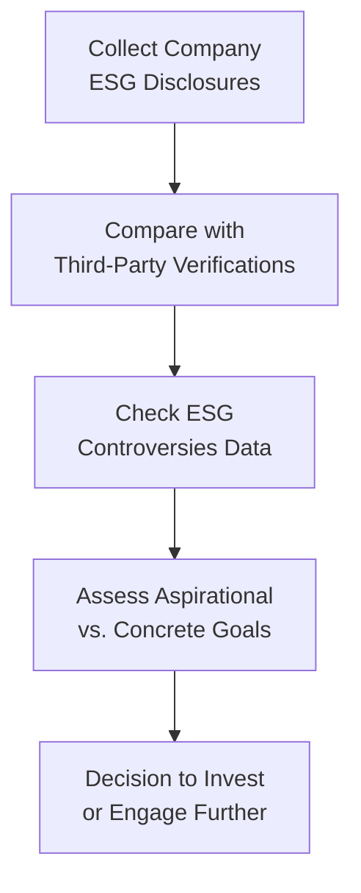

## Introduction and Relevance

Greenwashing—this is one of those buzzwords you see popping up everywhere in the ESG space. At first glance, it sounds like well-intentioned marketing, but, well, it can actually be quite deceptive and harmful. Greenwashing occurs when a company (or an investment product) knowingly or inadvertently misrepresents its ESG practices or environmental performance. As an investor, especially one focused on ESG considerations, recognizing—and avoiding—greenwashed investments is important. 

It’s not just that you might end up with an investment that doesn’t match your personal or institutional values; you could also risk significant financial drawdowns if the truth emerges and the company faces reputational loss or regulatory sanctions. In a portfolio management context, this can be especially challenging, since data on sustainability performance isn’t always standardized or fully reliable. 

So, if you’re aiming to incorporate ESG factors effectively in equity analysis (consistent with the broader insights we’ve been discussing throughout this chapter), you really need to recognize the red flags of greenwashing and know how to dig beneath the marketing slogans. Let’s talk about how.

## Different Shades of Greenwashing

Greenwashing can appear in quite a few guises. Occasionally, a company might mildly “polish” its environmental record, framing relatively small improvements as if they are major transformations. At the more severe end, firms might fabricate sustainability data or outright lie about their carbon footprint, water usage, or social initiatives. For instance, you might see:

• Exaggerated Claims: A simple advertisement touting “100% organic cotton” while ignoring that the rest of the product’s supply chain relies on heavy pollutant practices.  
• Selective Disclosure: Reporting only narrow, positive metrics while leaving out big environmental disasters or controversies.  
• Aspirational Goals with No Substance: Statements like “We’re going net-zero by 2030!”—with no credible roadmap to get there.  

From a financial perspective, these misrepresentations can artificially inflate a company’s share price if markets assume higher demand for its “ethical” or “green” products. When the truth emerges, the damage can be swift. (I still remember the shock on a colleague’s face when a certain “green tech” startup’s IPO crumbled after they were caught falsifying supply-chain data.)

## Core Drivers of Greenwashing

Companies often face mounting pressure from stakeholders—customers, regulators, and investors—to demonstrate positive environmental and social impact. Demand for ESG-themed investments has skyrocketed over the last decade, with guidelines emerging in multiple jurisdictions. This environment often creates incentives for firms to splash “sustainable” claims wherever possible to attract capital and brand loyalty.

However, because ESG regulations and frameworks are still evolving (and sometimes inconsistent across regions), there’s room for creative interpretations of what “sustainable” actually means. Combine that with intangible brand value linked to “green” images, and you have prime conditions for greenwashing to flourish. 

## The Risks to Investors

While you might initially think greenwashing only poses a moral or reputational risk, there are concrete financial implications as well:

• Valuation Risk: If markets discover that a company has lied about key sustainability metrics, a correction in the stock price may follow.  
• Regulatory Penalties: Firms can face fines or sanctions from bodies like the Securities and Exchange Commission (SEC) or the European Securities and Markets Authority (ESMA). This leads to potentially large legal costs and brand damage.  
• Portfolio Contamination: A single greenwashing scandal can undermine the credibility of an entire ESG-themed fund. This can be particularly damaging for asset managers who have built an ESG-friendly brand.  

From a CFA Level III perspective, these considerations align with risk management and portfolio monitoring. Even if your investment process includes fundamental analysis of a company’s financials, re-checking the authenticity of ESG data is crucial to avoid undesired exposures.

## Key Tools and Techniques for Detection

### 1. Due Diligence on ESG Disclosures

When reading an annual report or sustainability report, it’s tempting to take bold statements at face value. But verifying those claims can make the difference between a genuine ESG investment and a potential greenwashing trap. Here’s where you might:

• Examine third-party certifications or audits.  
• Find documented evidence of compliance with recognized frameworks (e.g., Sustainability Accounting Standards Board (SASB), Task Force on Climate-related Financial Disclosures (TCFD)).  
• Analyze trends in disclosures: Are they consistent over time, or do they spike abruptly in certain areas without explanation?

### 2. Cross-Verification with ESG Controversies Data

ESG controversies data—sourced from media reports, NGOs, or specialized rating agencies—acts like a reality check. If a company claims to have cut carbon emissions by 30%, but there’s a widely publicized issue with polluting factories or toxic waste mismanagement, that discrepancy might be a major red flag. It’s especially helpful to look for:

• Labor exploitation cases.  
• Environmental violations or litigation history.  
• Repeated controversies in the same area (e.g., repeated incidents of chemical spills).  

Take time to cross-check with multiple sources; sometimes, controversies may disappear quickly from mainstream headlines but remain documented in NGO or specialized databases.

### 3. Scrutinizing Aspirational vs. Concrete Goals

Organizations often tout ambitious targets like “net-zero by 2030” or “completely deforestation-free supply chains.” But if they’re not detailing the steps to reach these goals, that’s a potential sign of greenwashing. You might ask:

• Are milestone targets disclosed along the way—like 10% reduction by 2025, 20% by 2028, etc.?  
• Is there any external verification of these targets by credible agencies?  
• How does management plan to finance and implement the necessary transformations?

In the absence of actual spending commitments or project-specific details, these visions might be little more than PR.

### 4. Evaluating ESG Ratings and Underlying Components

You’ve probably seen a single “ESG score” from a rating agency. It’s tempting to rely on that to say, “This company is green,” or “this other one isn’t.” But, oh man, that can be misleading. Different agencies weight and define ESG factors differently. So:

• Look into the sub-pillars (E, S, and G) to see whether strong governance or a decent social policy might overshadow a poor environmental record.  
• Compare multiple rating providers where feasible. A big discrepancy might signal that a deeper investigation is warranted.  
• Note whether controversies are addressed in the score or if there’s a time lag in updates.

### 5. Negative Screening Approaches

This technique systematically excludes companies that fail certain criteria—like repeated environmental infractions or controversies. If you consistently find a company popping up in controversy databases, consider whether their processes could be a repeated pattern rather than an isolated incident.

### 6. Direct Engagement with Management

As an analyst or portfolio manager, sometimes the best clarity comes from direct conversations. Ask specific questions during earnings calls or investor presentations:
- “How do you plan to achieve your stated carbon-neutral goals by 2035?”  
- “Have you allocated capital expenditures specifically to reduce your reliance on coal or other fossil fuels, and by how much?”  
- “How do you handle allegations of labor exploitation in your supply chain?”

If management provides vague answers—like “We’ll figure it out”—that might be a red flag. A thorough portrayal of their roadmap can help you determine sincerity versus marketing hype.

### 7. Regulatory Actions and Press Release Monitoring

Regulators worldwide are tightening oversight on ESG branding. In the European Union, for instance, the Sustainable Finance Disclosure Regulation (SFDR) requires fund managers to clarify how they incorporate ESG. The U.S. SEC also has ongoing initiatives to police misleading ESG disclosures. If you see announcements about investigations or fines, that’s obviously a huge sign to dig deeper.  

## Visualizing an Anti-Greenwashing Workflow

Below is a simple diagram illustrating an investor’s workflow for verifying a company’s ESG claims:

This workflow can be integrated into your broader equity-selection process. Once you identify potential greenwashing, you can either engage with management to clarify, or exclude such companies from your portfolio.  

## Consequences of Poor Detection

Investors who fail to spot greenwashing can face both reputational and financial fallout:

• Reputational Damage: Accusations of hypocrisy if your ESG fund invests in a firm later revealed to be polluting or violating labor laws.  
• Increased Volatility: Stock prices could drop sharply on any negative news.  
• Opportunity Cost: You could miss out on genuinely responsible companies in the same sector with real initiatives and stable, sustainable growth prospects.

In advanced portfolio management contexts (like the heavy-lifting we do at the CFA Level III stage), greenwashing detection folds into risk control. Thorough due diligence is essential to confirm that your ESG-themed assets align with the portfolio’s investment thesis and your client’s expectations.

## Best Practices to Avoid Greenwashing

• Diversify Your ESG Data Sources: Rely on more than one ESG rating platform to reduce data bias.  
• Incorporate Qualitative Analysis: Statements from management, internal memos, or project details can reveal new insights beyond superficial metrics.  
• Continuous Monitoring: ESG isn’t a static dimension. Companies evolve, controversies arise, and new regulations get introduced. Stay updated.  
• Engagement and Activism: If you’re a large enough shareholder, use your proxy votes or activism to press for transparent reporting and genuine sustainability efforts.

## Final Thoughts for Exam Success

In the context of your CFA Level III exam, greenwashing might come up if you’re asked to evaluate a hypothetical ESG-centric portfolio or to analyze how sustainability factors affect stock valuation. A typical scenario-based question could present a company’s sustainability claims alongside contradictory media reports, asking how you’d respond or adjust your valuation model. My advice: look for discrepancies, dig into underlying data, and apply the same rigor you do in financial analysis. Remember: it’s not just about finding the “right” ESG brand; it’s about verifying the substance behind it.

## References

• “Greenwashing or Best Practice?” by the OECD (www.oecd.org)  
• “How to Spot and Avoid Greenwashing in ESG Investing,” Bloomberg Green  
• “The Race to Net Zero and the Risk of Greenwashing,” KPMG Insights  
• Regulatory guidance from the European Securities and Markets Authority (www.esma.europa.eu)  

## Exam Tips

• Practice scenario-based questions: If a vignette presents sustainability claims, identify potential holes or red flags.  
• Validate corporate disclosures: Familiarize yourself with recognized frameworks (like SASB, TCFD) and how to verify compliance.  
• Don’t ignore controversies: Historical or repeated environmental or social controversies can be critical in identifying misrepresentation.  
• Show your work: In essay-format answers, outline a clear structure—data sources, verification steps, engagement methods.  
• Integrate quantitative and qualitative insights: Explain how greenwashing risk might affect required returns, discount rates, or cash flow projections.

## Test Your Knowledge: Detecting and Addressing Greenwashing



### Which of the following best describes “greenwashing”?

- [ ] A situation where a company refuses to engage in ESG initiatives.
- [x] Misleading stakeholders about environmental or social benefits of products or practices.
- [ ] Outsourcing supply chain tasks to reduce environmental impact.
- [ ] Collecting greenhouse gas emissions data from internal sources only.

> **Explanation:** Greenwashing is the deliberate or accidental misrepresentation of a firm’s sustainability practices, causing stakeholders to assume better performance than is actually the case.

### Which of the following is most helpful in verifying a company’s ESG claims?

- [ ] Relying on the company’s marketing brochures for all research.
- [ ] Considering only a single ESG rating from a specialized agency.
- [x] Conducting cross-checks using controversies data sources and third-party verification.
- [ ] Trusting management if they mention “green initiatives” in an earnings call.

> **Explanation:** Controversies data acts as a reality check, and third-party verification confirms the reliability of disclosed information.

### What is a potential financial consequence of greenwashing for investors?

- [ ] Increased stock price stability.
- [ ] Guaranteed higher returns due to ESG popularity.
- [x] Sudden stock price declines if misleading claims are exposed.
- [ ] Elimination of legal or regulatory risks over time.

> **Explanation:** When false claims are exposed, market confidence can plummet, potentially causing a sharp drop in the stock price.

### A company announces a “net-zero” carbon target by 2027. Which of the following would help you gauge if it’s a credible goal rather than mere greenwashing?

- [x] Detailed action plans, spending allocations, and interim checkpoints to measure progress.
- [ ] A single infographic in the company’s annual report with minimal details.
- [ ] Public endorsement by a social media influencer without technical expertise.
- [ ] Vague statements about potential future investments.

> **Explanation:** Credible action plans and tangible measurements are key to differentiating real progress from mere hype.

### Why might negative screening be employed to reduce exposure to greenwashing?

- [x] It filters out companies with repeated environmental or social controversies.
- [ ] It automatically calculates the ESG score of all companies in the universe.
- [x] It may exclude habitual offenders from an investment portfolio.
- [ ] It ensures full compliance with financial disclosures.

> **Explanation:** Negative screening deliberately removes companies that repeatedly engage in controversies or harmful activities, reducing greenwashing risk.

### Which regulatory body is known to scrutinize ESG-labeled products within the EU?

- [x] The European Securities and Markets Authority (ESMA).
- [ ] The U.S. Federal Reserve.
- [ ] The Nasdaq Stock Market.
- [ ] The Association of Certified Fraud Examiners.

> **Explanation:** ESMA enforces regulations related to financial markets in the EU, including oversight of ESG labels and disclosures.

### In which circumstance are investors most likely facing greenwashing?

- [x] Substantial discrepancies between a company’s stated policies and media-reported controversies.
- [ ] A minor difference in ESG ratings from various agencies.
- [x] Corporate goals labeled as “aspirational” but with no plans or deadlines.
- [ ] Changes in board composition aimed at improving governance.

> **Explanation:** Major contradictions in reported claims and real-world behavior strongly suggest greenwashing, as do grand claims lacking action steps or timelines.

### How does direct engagement with company management help mitigate greenwashing?

- [x] It can reveal specific details on how reported ESG targets will be achieved.
- [ ] It eliminates the need for controversies data providers.
- [ ] It guarantees higher ESG scores in rating agencies.
- [ ] It automatically triggers a regulatory investigation.

> **Explanation:** Engaging management with pointed questions can unearth deeper operational plans and timelines, shedding light on the genuineness of their claims.

### An asset manager finds that a company’s sustainability claims are not consistent with its supply chain data. Which of the following actions is most appropriate?

- [x] Investigate further and consider engagement or possible exclusion from the ESG portfolio.
- [ ] Rely solely on the company’s CEO statements defending their “green” status.
- [ ] Immediately exit all equity positions in the ESG sector.
- [ ] Ignore these discrepancies since consistent supply chain data is rarely available.

> **Explanation:** Uncovering a mismatch between stated claims and supply chain reality should prompt deeper investigation or potential divestment decisions.

### True or False: If a company has received a positive ESG rating from one agency, it is unlikely to be engaging in greenwashing.

- [x] True
- [ ] False

> **Explanation:** Actually, this statement is tricky—having a single positive ESG rating doesn’t eliminate the possibility of greenwashing. But if we interpret “it is unlikely” in a strictly scenario-based sense, a positive rating often suggests some scrutiny, making greenwashing less likely. Nonetheless, you always need deeper verification from multiple sources and ongoing investigation.


