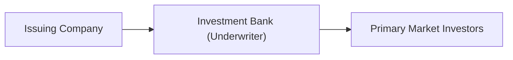

## Introduction
Ever feel a bit uncertain about how companies actually get their shares into the hands of investors—or how, once issued, those shares zip around the market like hotcakes? I certainly remember my first dive into this topic. Truth is, understanding primary and secondary markets might seem intimidating at first, but it’s really just about where shares are born and where they hang out for the rest of their trading life. Whether you’re learning from scratch or just brushing up, you’ll find that the distinction between primary and secondary equity markets is incredibly straightforward once you get the basics. 

In this article, we’ll walk through:  
• How new shares are created and sold to investors in the primary market.  
• How previously issued shares trade on the secondary market.  
• The role of underwriters, regulatory bodies, and market participants in facilitating trust and liquidity.  
• A few personal tidbits I’ve picked up along the way to make it feel a bit more real (and maybe a tad less intimidating).  

Let’s get started by picturing a company on the verge of raising capital. 

## The Primary Market
The primary market is like the corporate “birthplace” for new shares. Companies issue fresh equity here, often because they’re trying to expand, pay down debt, fund R&D, or even just strengthen their balance sheets. When we talk about an Initial Public Offering (IPO), we’re talking about a company selling its shares to the public for the very first time.

### Key Players in the Primary Market
• Issuing Company: The firm that’s selling new shares to raise money.  
• Underwriters: Typically investment banks that purchase these shares from the issuing company and then resell them, ensuring the company gets the funds upfront.  
• Institutional Investors and Retail Investors: Buyers of these new shares—anyone from massive pensions and mutual funds to folks dabbling in their first stock investment app on their phone.  

### IPOs and Follow-On Offerings
• IPO (Initial Public Offering): The big debut. A private company “goes public,” listing its shares on a recognized stock exchange (or through another mechanism like a direct listing, though that’s a slight twist on the classic IPO approach).  
• Follow-On (Seasoned) Offerings: After the company is already public, it can still issue additional shares, sometimes called “secondary offerings.” This doesn’t refer to the same “secondary market” we’ll discuss later—yes, naming can be confusing. Think of a follow-on as the company deciding to sell new shares again, possibly to fund additional expansions or acquisitions.  

### Underwriting and the Flow of Funds
Underwriting is essentially the investment bank’s promise to the company: “We’ll buy this many shares from you at a set price—risk is on us.” The underwriter organizes the marketing (known as a roadshow), attempts to gauge investor demand (bookbuilding), and strives to price the offering such that the shares will sell at (or hopefully above) that price in the actual market.

When the underwriter sells the shares to the public (or private institutional clients), the issuing company receives the net proceeds—money that can go straight into R&D, new factories, marketing expansions, or that dream headquarters with a million-dollar painting in the lobby (though hopefully they invest in something more value-adding than paintings).

Below is a simplified flowchart of the primary market process:

In this diagram, the arrow from “Issuing Company” to “Investment Bank (Underwriter)” represents the underwriter’s purchase of the shares (often at a discount). The arrow from “Investment Bank (Underwriter)” to “Primary Market Investors” reflects the underwriter selling those shares to the investing public.

### Why Primary Markets Matter
• Capital Raising: Companies often need large sums of money, and the primary market is a direct source of such funding.  
• Valuation Benchmarks: The initial pricing in an IPO kicks off the public valuation of a company.  
• Ownership and Control Shifts: Selling new shares can dilute existing shareholders’ stakes, which can have implications for control and voting power.  

To keep things mildly personal, I recall chatting with an old colleague who worked on a high-profile IPO back in 2012. The tension in the air was unreal—they needed to gauge demand, finalize a price, and ensure the shares didn’t flop onto the market at a discount. It’s a delicate balancing act, and it truly hammered home for me how critical the underwriter’s role can be.

## The Secondary Market
Now let’s look at where the shares hang out after they’re already issued. The secondary market is where you and I can trade shares with each other (through brokers, exchanges, or other venues) without the issuing company being directly involved in the transaction. 

### Defining Secondary Markets
• A secondary market is any venue where existing shares are bought and sold among investors.  
• The issuing company doesn’t see any of the proceeds from these trades (hence “secondary”). The money flows between investors, not from investors back to the company.  
• Stock exchanges like the NYSE, NASDAQ, London Stock Exchange, and Tokyo Stock Exchange are the most recognized forms of secondary markets. Over-the-counter (OTC) trading networks also exist, especially for smaller or more thinly traded equities, but those are a bit more specialized.  

### Price Discovery
One of the key services secondary markets provide is price discovery: the process by which the market integrates all available information to arrive at a fair price. Favorable news about a company leads to more buyers, which pushes prices up. Negative developments do the opposite. 

In a well-functioning market, price discovery happens quickly. This allows markets to reflect changes in demand or supply almost instantaneously. Overly optimistic? Prices might spike. Suddenly worried? Prices might tumble. It could seem fickle, but it’s basically a conversation between thousands or even millions of investors sharing their views through trades.

### Liquidity
By far one of the biggest advantages of the secondary market is liquidity—think about the ease with which you can enter or exit a position without drastically affecting the price. Liquid markets are characterized by:  
• Narrow bid-ask spreads.  
• A robust number of buyers and sellers willing to trade at or near the current market price.  
• High trading volume.  

When a market is liquid, you can sell your shares fairly quickly if, say, you need cash for an emergency. You don’t have to wait weeks or accept a big discount. The presence of numerous active participants fosters that liquidity. If no one’s trading, the share price could swing wildly on small orders. That’s helpful to keep in mind if you’re investing in smaller markets or frontier exchanges.

Below is a simplified illustration of what trades look like in a secondary market:

Here, buyers and sellers trade shares among themselves; the original issuer is not directly in the loop. Money flows between investors, which is the hallmark of a secondary market.

## Importance of Transparency and Regulation
Well-functioning equity markets don’t just magically appear. They require frameworks that foster trust and fairness. 

• **Primary Market Regulations**: Agencies like the U.S. Securities and Exchange Commission (SEC) insist on a properly filed prospectus and audited financial statements to ensure that new investors know what they’re buying. In many other jurisdictions, similar regulatory bodies (like ESMA in the EU, SEBI in India, etc.) handle these functions. This helps reduce information asymmetry—where the company knows infinitely more than the potential investors.  
• **Secondary Market Regulations**: Once the shares are out, regulators focus on promoting a fair trading environment—banning insider trading, requiring transparent order-book systems, and ensuring robust disclosure of material events. Investor confidence is central—if investors don’t believe the game is fair, the market quickly collapses.  

I once heard a story about a small exchange overseas that had very loose rules around disclosures. The result? Investors fled, refusing to trade in that environment. The exchange’s volumes plummeted, and companies struggled to find capital. Regulation may seem like a headache, but it’s absolutely critical.

## Best Practices and Common Pitfalls
Below are some tips and common mistakes to keep in mind about primary and secondary market interactions:

• **Best Practices**  
  1. Carefully read the prospectus or offering documents before participating in a primary offering.  
  2. Compare the underwriter’s track record: some banks are better at setting realistic IPO prices; others might be more known for “hot” offerings.  
  3. Keep an eye on the liquidity profile and trading volumes of shares you’re interested in on the secondary market.  

• **Common Pitfalls**  
  1. Overvaluing Hype: Thinking every IPO is “the next big thing” can lead to paying inflated prices.  
  2. Ignoring Liquidity: Buying thinly traded shares in the secondary market can hamper your ability to exit a position at a fair price.  
  3. Underestimating Fees and Spreads: Costs matter, especially if you’re frequently trading in the secondary market.  

## Glossary
• **Underwriting**: The process by which investment banks commit to buy newly issued shares from the issuing company, reselling them to the public.  
• **Follow-On Offering (Seasoned Equity Offering)**: Additional share issuance by a company that’s already publicly traded.  
• **Price Discovery**: Mechanism by which market prices reflect all known information about a security, aligning buyers and sellers to a fair price.  
• **Liquidity**: The ease and speed with which a security can be traded without significantly affecting its price.  
• **Prospectus**: A legal document detailing information about the issuer and offering, required to be shared with potential investors during the primary market process.  

## Conclusion
Primary and secondary markets for equity form the foundational backbone of the global financial ecosystem. Primary markets get capital to the company for growth, while secondary markets keep the investment wheel spinning by allowing investors to trade among themselves. Regulations ensure trust, and trust begets liquidity and fair prices. If you plan on diving deeper into equity investments, internalizing these basics will serve as a sturdy springboard—just like it did for me back when I was wide-eyed at my very first IPO observation.

Feel free to dig deeper, check out official filings on the SEC website, or read up on more advanced texts like Bodie, Kane, and Marcus. But for now, if you leave with the knowledge of how a share comes to life in the primary market, and how it “lives” in the secondary market, you’re off to a great start.

## References
• Bodie, Z., Kane, A., & Marcus, A. (2021). “Investments.” McGraw-Hill Education.  
• Securities and Exchange Commission (SEC): [https://www.sec.gov](https://www.sec.gov)  
• CFA Institute. (Current Year). “Equity Investments” in CFA Program Curriculum.  

## Assess Your Knowledge: Primary and Secondary Markets Quiz



### Which of the following best describes a primary market offering?
- [ ] A situation where the issuing company sells shares directly to investors in a secondary transaction.  
- [x] A situation where new shares of a company are created and sold to investors to raise capital.  
- [ ] A situation where shares change hands purely among existing shareholders on an exchange.  
- [ ] An arrangement for investors to short-sell the shares of a company at a future date.  

> **Explanation:** In a primary market, the company creates brand-new shares that investors can purchase to provide fresh capital.

### In an IPO, the underwriter’s main responsibility typically includes:
- [ ] Setting strict government regulations for how many shares can be issued.  
- [ ] Determining which secondary market the shares must list on post-issue.  
- [x] Purchasing the shares from the issuer and reselling them to investors.  
- [ ] Establishing margin requirements for institutional buyers.  

> **Explanation:** The underwriter buys the new shares at an agreed price (often at a slight discount) and then markets and sells them to the public (or specific investors), thus assuming the underwriting risk.

### What does the term “follow-on offering” refer to in equity markets?
- [ ] The process of repurchasing shares through a buyback program.  
- [x] The issuance of additional shares by a company that is already publicly traded.  
- [ ] The transfer of shares between two institutional investors on the secondary market.  
- [ ] The issuance of convertible bonds that could become equity in the future.  

> **Explanation:** A follow-on offering, also called a seasoned equity offering, occurs when an already public company decides to raise additional funds by selling more shares.

### Which of the following statements about secondary markets is most accurate?
- [ ] In secondary markets, the issuing company receives capital from each trade.  
- [x] The issuing company does not receive proceeds from secondary market transactions.  
- [ ] Secondary markets only exist for large institutional trades.  
- [ ] Stocks do not experience price fluctuations in secondary markets.  

> **Explanation:** After the initial issuance, the company no longer receives capital from the buying and selling of its shares. Funds pass between investors.

### Liquidity in the secondary market is best described as:
- [x] The ability to buy or sell shares quickly without causing drastic changes in their prices.  
- [ ] The guarantee that a stock’s price will always go up.  
- [ ] A condition requiring stock issuers to provide daily valuations of their shares.  
- [ ] A form of advanced derivative ensuring constant trading volume.  

> **Explanation:** Liquidity is the ease of transacting (buying or selling) in a security without significantly impacting its price.

### Price discovery occurs primarily when:
- [ ] The issuing company's board of directors determines a fair stock price.  
- [ ] Regulators fix the price of the stock based on market conditions.  
- [x] Investors place buy and sell orders, leading to a market equilibrium price.  
- [ ] The underwriter adjusts the offering price after the IPO is complete.  

> **Explanation:** The market arrives at a price for the stock based on collective buy and sell orders—the essence of price discovery.

### Which statement about regulatory oversight is correct?
- [x] Primary market regulations usually mandate disclosure of critical company information before selling shares.  
- [ ] Secondary market regulations typically require the issuing company to repurchase shares from investors.  
- [ ] There is no difference between primary and secondary market regulations.  
- [ ] Regulators only focus on insider trading during the IPO stage.  

> **Explanation:** In the primary market, regulators demand transparency about the company’s financial state and operations. In the secondary market, they enforce fair trading practices and monitoring for insider trading and market manipulation.

### Under what scenario does a company typically receive no further capital from the sale of stocks?
- [x] When shares trade on the secondary market between two investors.  
- [ ] During an IPO, when the company sells new shares.  
- [ ] During a follow-on offering.  
- [ ] When underwriters purchase newly issued shares at a discount.  

> **Explanation:** Once on the secondary market, shares trade among investors, and the issuing company is no longer part of the transaction.

### A common pitfall for retail investors in an IPO is:
- [ ] Performing due diligence on the company’s fundamentals.  
- [ ] Consulting the official prospectus.  
- [ ] Understanding the long-term business model.  
- [x] Overvaluing the hype of the new listing and paying an inflated price.  

> **Explanation:** Hype can lead to investors bidding up a newly listed company’s shares well beyond its underlying value.

### True or False: The price discovery function in the secondary market benefits only large institutional investors.
- [x] True  
- [ ] False  

> **Explanation:** While some might suspect only large institutions benefit, in reality, price discovery benefits every market participant—small or large—by ensuring transparent and fair market pricing.  


