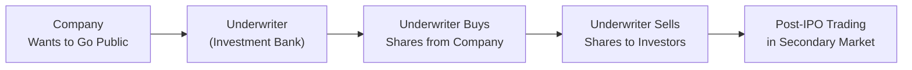
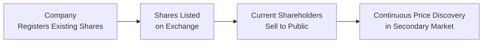

## Introduction

I’ll be honest: when I first heard the term “direct listing,” I didn’t completely grasp how it stacked up against the big, splashy underwritten IPOs I kept seeing on the news. Underwritten IPOs (Initial Public Offerings) have been around forever—or at least it sometimes feels that way. A direct listing? That was definitely a twist on the usual path to going public. It reminded me of that time I was torn between asking a pro to broker a deal on my used car or just listing it on a website, hoping for the best. Obviously, taking a company public is a bit more complicated than selling a car, but the comparison sort of resonated with me. So let’s dig in: we’ll unravel how these two approaches differ, why they even exist, and what the pros and cons look like from a company’s perspective—plus how we, as investors, might view them.

## Traditional Underwritten IPO

### Overview

A traditional underwritten IPO is the classic route for a private company that wants to become publicly traded. In this process, the company works with one or more investment banks (often called underwriters). These underwriters purchase shares from the issuing firm (sometimes at a discount) and then sell them to the public in what’s known as a primary market transaction. Once the shares are sold to investors, trading starts in the secondary market, giving shareholders the ability to buy or sell shares among themselves.

By the way, you may hear folks talk about “the dog and pony show,” which is a rather informal way of referring to the “roadshow.” The roadshow is a series of presentations organized by underwriters where the company’s management meets potential investors—like institutional portfolio managers, hedge funds, and perhaps big private wealth clients. During these sessions, management attempts to drum up interest in the new offering and ideally secure some firm commitments before the big day.

### Underwriter’s Role and Bookbuilding

One of the core tasks an underwriter does is “bookbuilding.” This is where underwriters gauge investor demand for the IPO by soliciting non-binding indications of interest—essentially seeing who wants how many shares at what price range. Based on that feedback, the underwriter arrives at an offering price that (hopefully) optimally balances what the company wants to raise with what investors are willing to pay.

It might feel like underwriters have a lot of power here, and honestly, they do. A strong underwriter can attract quality institutional buyers, ensuring high demand and stable post-IPO trading. Meanwhile, the issuer typically pays an underwriting fee or commission, which, for large IPOs, can be substantial. I remember reading about investment banking fees in the range of 5%–7% (sometimes even more for smaller deals)—not exactly couch-cushion change.

### Pricing and Potential Underpricing

Underwriting also comes with the risk of mispricing—often referred to as “underpricing.” You might have heard stories of an IPO that closed its first day of trading dramatically above its offering price. Sounds great for those lucky day-one buyers, but that difference represents money the company could have raised if the IPO had launched at a higher price. There’s a common belief that underwriters err on the side of caution to ensure a successful first-day pop, but the trade-off is that the company receives less capital than it might have if the shares had been priced more aggressively.

### Lock-Up Period and Trading Restrictions

In many underwritten IPOs, there’s a lock-up period—commonly around 90 to 180 days—during which existing shareholders (like founders, early investors, and employees) are barred from selling their shares. The goal is to prevent a flood of selling right after the IPO goes live, which could drive the share price down. This lock-up can provide some short-term stability, but once the lock-up expires, there can be a wave of additional selling that might spike volatility.

### Visual Representation of a Traditional Underwritten IPO

Below is a simplified Mermaid diagram illustrating the basic flow of a traditional underwritten IPO:

## Direct Listing

### How It Works

Now for the main event: direct listings. In a direct listing, the company essentially skips the whole “let’s sell shares to an underwriter” step. Instead, it just lists its existing shares on an exchange, allowing current shareholders to sell their shares directly to the public. And new public investors can simply buy those shares without an underwriter playing matchmaker or collecting underwriting fees.

### Key Characteristics

• No underwriter purchasing shares and reselling.  
• Typically, no new shares are created (unless the direct listing is combined with a concurrent primary offering, which is a newer variant).  
• There’s no lock-up period in most direct listings, meaning insiders can sell right away.  
• Price discovery happens entirely in the open market, not through a bookbuilding process.

Some well-publicized direct listings include Spotify and Slack. These companies had strong brand recognition, which probably helped them pull this off. Investors already knew who they were and had a sense of their potential. It’s a bit like selling your famous antique at an auction that the whole world tunes in to—if the brand is strong, you trust the market to find the right price, and you don’t need an intermediary to help set it.

### Cost Implications

One of the main attractions of the direct listing path? Lower fees. Without underwriters taking a big slice, companies can save a chunk of money, which is appealing. Of course, they might still hire financial advisors to help with the process, but it’s typically cheaper than paying the usual IPO underwriting spread.

### Price Discovery and Volatility

Because there’s no formal bookbuilding in a direct listing, the opening price is often set by real-time supply and demand among potential buyers and sellers. That can lead to more volatility on day one—especially because insiders can sell immediately, so the supply of shares can suddenly spike. Over time, the market finds equilibrium, but the earliest trades can resemble a roller coaster.

### Example Flow for a Direct Listing

Here’s a conceptual Mermaid diagram of how direct listings typically function:

## Key Differences Between a Traditional IPO and a Direct Listing

Let’s put the main differences side by side. (Note: This is a simplified summary, and real-world scenarios can vary.)

| Aspect                | Traditional Underwritten IPO                                                                      | Direct Listing                                                                                                       |
|-----------------------|---------------------------------------------------------------------------------------------------|----------------------------------------------------------------------------------------------------------------------|
| **Issuance of Shares**        | Company typically issues new shares (primary offering) + possibly sells existing shares (secondary).  | Mainly existing shares. New capital not raised unless paired with a concurrent offering (less common).               |
| **Underwriter Role**  | Underwriters purchase shares from issuer and resell to investors. They facilitate price setting.  | No conventional underwriter. Company may hire financial advisors but not in a traditional underwriting capacity.      |
| **Fees**              | Company pays underwriting fees—often a percentage of total proceeds.                               | Lower fees because no underwriter spread, although advisory fees may apply.                                          |
| **Lock-Up Period**    | Often 90–180 days preventing insiders from selling.                                                | Typically none, so insiders can sell immediately.                                                                     |
| **Price Discovery**   | Determined through bookbuilding with underwriter; potential for underpricing or first-day “pop.”  | Determined by supply and demand in the market on listing day; can be more volatile.                                  |
| **Marketing & Roadshow** | Formal roadshow led by underwriters.                                                             | Company might do investor outreach but no traditional roadshow.                                                     |
| **Best For**          | Companies seeking a reliable distribution network for shares, brand-building, and capital raise.   | Companies with strong brand recognition, who may not need as much underwriter support and brand marketing.           |

## Strategic Considerations for Issuers

### Brand Recognition and Demand

In my opinion, a direct listing works best if the company is already well-known. If you’re a brand-new tech startup with zero name recognition, going public via direct listing could mean insufficient initial demand, confusion about valuation, and maybe some messy price discovery. But if you’re a household name like Spotify—hey, the market already knows you and trusts the story.

### Need for Fresh Capital

If your main motive is to raise a significant chunk of primary capital (to build new manufacturing plants or fund expansion, for instance), a traditional IPO might be more suitable. Some direct listings now allow concurrent capital raises, but that remains less common. In many direct listings, the company itself doesn’t raise capital on day one; it’s mainly existing investors or employees cashing out shares.

### Volatility Tolerance

Without a lock-up, prices can move wildly once the shares start trading. Companies (and shareholders) opting for direct listings must be braced for that volatility and potential short-term selling pressure.

## Investor Perspective

### Early Access

In a traditional IPO, many small or retail investors don’t get access to IPO share allocations at the offering price—those often go to large institutional clients of the underwriters. Retail investors usually have to buy on the secondary market, possibly paying a higher price if the stock soars on day one. With a direct listing, there’s no set offering price that’s reserved for insiders or big institutions, and in theory, everyone is on equal footing once the market opens.

### Liquidity and Price Stability

Traditional IPOs can benefit from underwriter support, including possible stabilization measures in the early days of trading. Direct listings offer no such cushion. If big shareholders want to sell in large volumes, they can do so, which might drive heightened volatility.

### Potential Opportunities

From a portfolio management or equity analysis perspective, a direct listing can provide more transparent price discovery—some might argue it leads to more “true” market-based pricing from day one. Others are concerned about missing the protective aspects of an underwriter who might help ensure a stable floor price.

## Regulatory and Governance Considerations

From a regulatory standpoint, both strategies must comply with strict disclosure requirements. Direct listings must file registration documents with the relevant securities regulators (e.g., the SEC in the United States). The big difference is the absence of an underwriter that might typically be subject to liability under certain securities laws in the traditional approach. Of course, that doesn’t remove regulatory scrutiny from the company, which still needs to produce the usual offering documents and risk disclosures.

## Real-World Examples

• Spotify (2018): One of the first high-profile direct listings. The company was already known globally, had a massive user base, and wanted to avoid typical IPO fees. Spotify did not sell new shares; existing shareholders listed and sold their shares directly.  
• Slack (2019): Followed in Spotify’s footsteps. Slack’s direct listing was also widely covered in the financial press.  
• Palantir (2020): Another direct listing with a big brand name behind it.  

Conversely, if you look at many biotech or smaller tech firms, you’ll notice they often go with a traditional IPO, particularly if they want to raise new capital to fund R&D or expansions—plus, they may value the marketing push from well-known underwriters.

## Best Practices, Common Pitfalls, and Conclusion

One big pitfall in a direct listing is insufficient education of prospective investors. A company might think, “We’ll just list our shares, no problem.” But if the market doesn’t have a good sense of the company’s business model, risks, or prospects, the share price could fluctuate wildly as investors scramble for information. For an underwritten IPO, the roadshow process often helps build interest and clarify the story. In a direct listing, you might have to handle investor outreach yourself or hire advisors to help.

A best practice that’s emerging is for direct listing companies to define a robust investor relations strategy. That might include a series of “virtual roadshows,” open calls, or additional disclosures to ensure the market is well informed. Meanwhile, keep in mind no lock-up period can also be a double-edged sword: you’re not restricting employees from selling, which is nice for them, but the potential for a mass sell-off early on is higher than in a traditional IPO.

In the final analysis, if your company is a recognized brand that doesn’t need immediate new capital and wants cost savings on underwriting fees, a direct listing could be a neat move. But if you’re a smaller outfit needing the capital infusion (or the marketing push that underwriters can provide), the traditional IPO route is still probably your best bet. As an analyst or investor, understanding these differences is crucial because it helps you interpret the signals behind a particular company’s choice of listing route, and it also helps in your valuation process—particularly on that chaotic first day of trading.

## References and Further Reading

• NYSE Direct Floor Listing Guide:  
  https://www.nyse.com/introducing-nyse-direct-floor-listings

• Spotify Direct Listing SEC Filings:  
  https://www.sec.gov

• CFA Institute. (Current Year). “Corporate Issuers” in CFA Program Curriculum.  

• For deeper insights into IPO pricing controversies and lock-up dynamics, see:  
  Ritter, J. (2021). “Initial Public Offerings” in Journal of Finance.

• For a fascinating look at the economics of underpricing, see:  
  Ljungqvist, A. (2007). “IPO Underpricing” in Handbook of Empirical Corporate Finance.

--------------------------------------------------------------------------------

## Test Your Knowledge: Direct Listings vs. Traditional IPOs



### Which of the following is a key feature of a traditional underwritten IPO?

- [x] The company primarily relies on an underwriter to purchase shares and resell them to the public.
- [ ] There are typically no lock-up periods for insiders.
- [ ] The company doesn’t incur any significant fees associated with underwriting.
- [ ] Existing shares are listed on an exchange without underwriter involvement.

> **Explanation:** In a traditional underwritten IPO, underwriters fulfill critical roles, including purchasing shares from the issuer and distributing them to the public. Lock-up periods are common, and fees can be substantial.

### In a direct listing, which party is generally responsible for setting the initial public price?

- [ ] The underwriting syndicate through bookbuilding.
- [ ] The company itself, based on internal valuations.
- [x] The market, through supply and demand interactions.
- [ ] Government-appointed regulators.

> **Explanation:** In a direct listing, there is no formal bookbuilding. The share price is driven by real-time investor demand and supply, leading to a market-driven opening price.

### Which of the following reduces in a direct listing compared to a traditional IPO?

- [x] Underwriting fees.
- [ ] Volatility on the first day of trading.
- [ ] Business risk for the issuer.
- [ ] Lock-up period restrictions.

> **Explanation:** One of the main draws of a direct listing is that the issuer can forego hefty underwriting fees. Direct listings often entail greater volatility (not less) because insiders can sell immediately and there is no underwriter price stabilization.

### A lock-up period serves primarily to:

- [x] Prevent insiders from selling shares immediately after the IPO.
- [ ] Guarantee higher trading volume after the IPO.
- [ ] Allow institutional investors to buy shares at a discount.
- [ ] Increase fees paid to underwriters.

> **Explanation:** Lock-up periods typically restrict certain insiders from selling their shares right after an IPO, reducing immediate selling pressure and helping stabilize the share price in the short term.

### Which approach typically involves new capital being raised for the company?

- [ ] Both a direct listing and a traditional IPO, with no distinctions.
- [x] Traditional underwritten IPO (unless a direct listing has a concurrent primary issuance).
- [ ] Direct listing always results in a large primary capital raise.
- [ ] Neither method ever raises primary capital.

> **Explanation:** Traditional IPOs typically include the issuance of new shares, providing new capital for the company. While direct listings often only list existing shares, they can occasionally be paired with a primary raise, but that is less common.

### When might a direct listing be most appropriate for a company?

- [x] When the company’s brand is already well-known and it doesn’t require a large new capital injection.
- [ ] When the company wants to heavily restrict insider share sales.
- [ ] When underwriters are needed for bookbuilding and price stabilization.
- [ ] When the company is entirely unknown and needs maximum exposure.

> **Explanation:** A well-known company that doesn’t need a roadshow or new money is more suited to a direct listing. Powerful brand recognition substitutes for the marketing benefits of an underwriter.

### Underwriters in a traditional IPO assist with:

- [x] Pricing the IPO shares and distributing them to investors.
- [x] Organizing a roadshow and building investor interest.
- [ ] Setting the market opening price without any investor feedback.
- [ ] Reducing market liquidity for the issuer’s shares.

> **Explanation:** Underwriters help with bookbuilding, pricing, and distribution, often supported by extensive roadshow presentations. This fosters initial liquidity rather than reducing it.

### One potential downside of a direct listing is:

- [x] The lack of underwriter support can lead to higher first-day price volatility.
- [ ] Underwriting fees tend to be significantly higher than with a traditional IPO.
- [ ] Existing shareholders must wait for a lock-up period to sell shares.
- [ ] Companies are typically mandated to issue new shares.

> **Explanation:** Because there is no underwriter stabilization or lock-up constraint, the market can experience higher volatility on day one, and insiders can sell immediately.

### In both a traditional IPO and a direct listing, the company must:

- [x] File registration statements and disclosures with regulators.
- [ ] Engage underwriters for bookbuilding and distribution.
- [ ] Impose a 180-day lock-up period on insiders.
- [ ] Issue new shares to raise fresh capital.

> **Explanation:** Whether using a direct listing or an underwritten IPO, the company must adhere to regulatory requirements, including filing registration documents. However, underwriters and lock-up periods aren’t mandatory in direct listings.

### A direct listing offers an equal chance for all investors to buy shares immediately after listing, relative to a traditional IPO because:

- [x] There is no allocation of shares at an IPO price facilitated by underwriters.
- [ ] Regulators mandate uniform pricing for all participants in a direct listing.
- [ ] Institutional investors are excluded from direct listings.
- [ ] The stock price is fixed for retail participants.

> **Explanation:** In a direct listing, there isn’t an initial share allocation to select investors at a specific offering price as in a traditional IPO, creating a level playing field at the opening trade.


