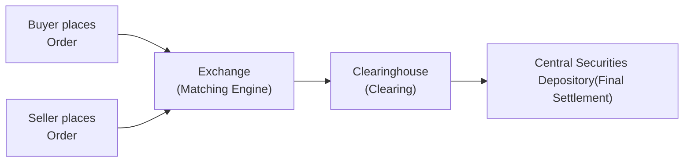

## Overview and Context

Equity trading might look straightforward from the outside—buyers buy, sellers sell, and everyone goes home happy. But peel back the curtain, and you’ll find a whole ecosystem of sophisticated order types, mechanics of trade executions, and the crucial settlement process that ensures each trade is properly closed out. If you’ve ever placed a trade and wondered, “Um, how exactly did that happen?” or “Why didn't my trade execute immediately?,” then this discussion is for you. Throughout this piece, we’ll explore the main kinds of orders (market, limit, stop, and stop-limit), detail how execution occurs in different venues, and explain the post-execution settlement infrastructure that keeps the entire system running smoothly. And I'll sprinkle in a few stories along the way—like the time I panicked and placed a market order at 3 a.m. for a stock in a foreign market. (Spoiler: it didn’t go as planned.)

## Understanding Common Order Types

Equity orders come in many varieties, each designed to address a particular goal: locking in a particular price, ensuring immediate execution, or perhaps capping your risk exposure. Whatever your plan, it’s wise to know which order fits your strategy best, because picking the wrong one can be a rookie mistake.

### Market Orders

A market order is basically telling your broker, “Just get it done right now at the best price you can find.” If you’re buying, you take the lowest available ask price; if you’re selling, you take the highest available bid price. Because it prioritizes speed over price, you might get your shares a bit more expensively (when buying) or sell a bit more cheaply (when selling), especially if the market is moving fast or the security is not very liquid.

• Pros: Speedy execution (the order typically fills ASAP).  
• Cons: No control over final execution price.

It’s kind of like buying tickets to a concert at the last minute. You’re pretty much guaranteed a seat, but you might pay top dollar if demand spikes unexpectedly.

### Limit Orders

A limit order says, “I want to buy (or sell) this stock, but only if I can get at or better than this specific price.” You specify a maximum price for a buy (or a minimum price for a sell), and the order won’t fill if the market doesn’t meet that price.

• Pros: Price certainty—you won’t pay more (when buying) or receive less (when selling) than your limit.  
• Cons: No guarantee of execution. If the market never trades at your limit or better, you might sit there all day unchanged.

I used to place limit orders with an overly ambitious price—like setting a buy limit for 25% below the current market level because “maybe the price will drop.” Then I’d wait forever and wonder why my order wasn’t filled. Well, the reality was the market never dipped that low.

### Stop Orders (Stop-Loss Orders)

A stop order is triggered when the price of the security hits a particular level, known as the stop price. Once triggered, a stop order converts into a market order that executes at the best available price. You’ll often see “stop orders” referred to as “stop-loss orders” since a common use case is to sell and limit your losses if the price falls below a specified threshold.

• Pros: Can help protect gains or prevent catastrophic losses.  
• Cons: Once triggered, it functions like a market order and may fill at a price you didn’t expect, especially in a fast-moving or illiquid market.

In my early trading days, I’d place stop-loss orders on a high-flyer tech stock, only to find out that the share price gapped overnight. By the time the market opened, my “stop price” was long gone, so the sell turned into a market order at a much lower price. Ouch.

### Stop-Limit Orders

A stop-limit order marries the above concepts. It triggers when the price hits a “stop,” then becomes a limit order rather than a market order. The advantage is that once triggered, your trade will only execute if it remains within the limit price you set.

• Pros: Limits the price slippage compared to a normal stop order.  
• Cons: May not execute at all if the price moves too far away, even if your stop was triggered.

This is like telling your friend, “If the stock hits $100, I want to sell—but I refuse to accept anything less than $99.50.” If no one is willing to buy at $99.50 or higher, your order stays unfilled.

## From Order Entry to Execution

Having a sense of order types is important, but equally important is how these orders are actually executed in the market. After all, there’s a difference between telling your broker or trading platform what to do and getting the trade done at your desired price, quantity, or speed.

### Execution Venues

1. Centralized Exchanges (e.g., NYSE, LSE):  
   These are traditional exchanges where buyers and sellers gather (physically in the old days, now mostly electronically) to trade. Orders are matched based on a set of rules—often price-time priority—to ensure fairness.

2. Alternative Trading Systems (ATS) and Dark Pools:  
   These are private trading platforms where institutional players often seek large-volume trades with minimal market impact. Think of them as less visible venues where big orders can be processed without instantly moving the market price.

3. Over-the-Counter (OTC) Trading:  
   In OTC, trades are typically negotiated directly between brokers and dealers, often dealing with less liquid securities or special circumstances.

### Broker vs. Dealer

• Brokers: Agents that route your order to an exchange or other venue. They do not commit their own capital to take the opposite side of your trade. They just “broker” the transaction for a fee or commission.  
• Dealers: Stand ready to buy or sell securities from their own inventory, committing their own capital. If you sell to a dealer, the dealer might hold the stock until a buyer comes along, earning a spread in the process.

### Quality of Execution

When you tap that “Buy” or “Sell” button, how do you measure the result? Execution quality is often judged by metrics such as:

• Speed: How fast was your order filled?  
• Fill Rate: Did you get all the shares or only part of them (partial fills)?  
• Price Improvement: Did you get an average execution price that was better than the quote you saw on your screen?

Market participants often track these metrics over time to see if particular brokers or trading algorithms give them consistent performance.

## Clearing and Settlement

Let’s say you’ve placed a buy order on an exchange, and it’s executed. Congrats, you now “own” the shares, right? Well, in a sense, yes—but from a back-office perspective, a few more steps remain before that ownership is legally reflected on the books.

### Clearing vs. Settlement

“Clearing” is the process that occurs after a trade is executed but before final settlement. It includes matching trade details (making sure buyer and seller agree on all the specifics) and confirming that both parties are capable of fulfilling their obligations. “Settlement” is the actual exchange of money for securities—i.e., the buyer hands over the cash, and the seller hands over the shares.

### T+2, T+1, and Beyond

Many equity markets have a settlement cycle referred to as T+2, meaning settlement happens two business days after the trade date (T). It used to be T+3 in many places, and some markets (particularly in Asia) are pushing to T+1 or even same-day settlement for certain securities. A shorter settlement cycle generally reduces counterparty risk since the buyer and seller finalize their obligations more quickly.

### Role of Central Securities Depositories (CSDs) and Clearinghouses

Central Securities Depositories (CSDs) hold securities in electronic (book-entry) form. When you buy shares on an exchange, the ownership record in the CSD is updated, transferring shares from the seller’s account to yours. Clearinghouses, on the other hand, serve as the middle entity guaranteeing the trade. They stand between buyers and sellers to mitigate default risk. That is, the clearinghouse typically ensures each party’s obligations are met (or if not, the clearinghouse steps in to find a resolution).

Below is a simplified diagram showing the lifecycle from trade execution to settlement:



1. Buyer and seller submit orders (or quotes) to the exchange.  
2. The exchange ‘matches’ the orders at a certain price.  
3. Once matched, the clearinghouse registers the trade obligations, verifying both sides can fulfill them.  
4. On settlement date, the clearinghouse instructs the Central Securities Depository to transfer securities to the buyer and cash to the seller.

## Example: Placing a Limit Buy and Settlement Flow

Let’s walk through a quick example:  
• You place a Limit Buy at $100 for 100 shares of XYZ Inc., while the stock is trading around $101.  
• The market dips to $100, triggering your limit. Your order gets filled entirely.  
• The trade date is Monday. Settlement occurs on Wednesday if your market uses T+2.  
• Between Monday and Wednesday, the clearinghouse ensures both you and the seller can make good on the trade.  
• On Wednesday morning, the Central Securities Depository updates its records, transferring those 100 shares of XYZ Inc. to your account and moving your cash to the seller’s account.

Voila! You’re officially a shareholder.

## Common Pitfalls and Best Practices

• Using Market Orders in Thin Markets: In a low-liquidity stock, a market order might fill at a significantly worse price than you’d hoped. Consider a limit order if you’re worried about major slippage.  
• Stops Triggering During Volatile Gaps: Stop (or stop-loss) orders can fill at unexpected prices in fast markets. A stop-limit might reduce risk but can also miss execution entirely.  
• Ignoring Settlement Cycles: If you need immediate access to your sale proceeds, remember you might not see those funds until settlement day (though margin accounts can mitigate this).  
• Failing to Track Order Status: Orders sometimes partially fill or remain open. Always review your trade confirmations and ongoing order book to avoid confusion.  

## Short Python Snippet: Analyzing Order Book Depth

Below is a very simplified Python snippet that demonstrates checking a hypothetical live order book for a stock, computing the best bid and ask:

```python
import pandas as pd

data = {
    'Price': [100.10, 100.00, 99.95, 100.20, 100.25],
    'Size':  [  2000,   5000,  3000,  1500,    800],
    'Side':  ['Ask', 'Bid', 'Bid', 'Ask', 'Ask']
}
df = pd.DataFrame(data)

best_bid = df[df['Side'] == 'Bid'].max()
best_ask = df[df['Side'] == 'Ask'].min()

print("Best Bid: $", best_bid['Price'], "with size", best_bid['Size'])
print("Best Ask: $", best_ask['Price'], "with size", best_ask['Size'])
```

In this example, we identify the highest “Bid” price and the lowest “Ask” price, a standard measure for the best quote in a market. This kind of analysis is often performed automatically within high-speed trading engines.

## Final Exam Tips

• Familiarize yourself with the nuances of order types—especially how stops, stop-limits, and limit orders behave differently in dynamic market conditions.  
• Understand how a trade flows from the moment it’s placed to the final settlement stage, including the roles of clearinghouses and CSDs.  
• Keep track of the “why” behind T+2, T+1, and T+0 settlement cycles—particularly how they reduce (or increase) counterparty risk.  
• Expect scenario-based exam questions measuring your ability to pick the right type of order for a given situation, or to determine how a partial fill might affect your position.  
• Practice a few quick calculations around execution price vs. quoted price to see if you grasp price improvement and transaction costs (commissions, spread, etc.).

## Key References
• Fabozzi, F. J. (Ed.). (2020). “Handbook of Finance.” Wiley.  
• London Stock Exchange Order Types: [https://www.londonstockexchange.com](https://www.londonstockexchange.com)  
• CFA Institute. (Current Year). “Equity Investments” in CFA Program Curriculum.  

## Test Your Knowledge: Order Types, Trade Execution, and Settlement



### Which of the following best describes a market order?

- [ ] An order to buy or sell at a specific price or better.
- [x] An order to buy or sell immediately at the best available price.
- [ ] An order to start as soon as the market opens.
- [ ] A standing instruction to cancel if not executed within the trading day.

> **Explanation:** A market order seeks immediate execution at the current best market price, prioritizing speed over price certainty.

### When a stop order is triggered, it generally becomes:

- [ ] A limit order that executes at the specified limit price.
- [x] A market order that executes at the best available price.
- [ ] A combination order that cancels remaining quantities.
- [ ] An invalid order that must be re-entered with a new limit.

> **Explanation:** A traditional stop order becomes a market order once the stop price is reached, which can cause unexpected fills if the market moves quickly.

### What is the main risk associated with using a stop-limit order to sell during a sudden price drop?

- [ ] The order might convert into a market order prematurely.
- [ ] The order will always execute at a price better than the stop price.
- [ ] The order will cancel if not fully executed immediately.
- [x] The order might not execute at all if the price falls below the limit.

> **Explanation:** While stop-limit orders protect you from a “bad fill,” they can remain unfilled if the security’s price declines quickly through your limit.

### Which of the following is the primary advantage of placing a limit order to buy?

- [x] Price certainty, as the order is executed only at or below the limit.
- [ ] Guaranteed full execution at the current best ask price.
- [ ] Automatic conversion into a stop order once triggered.
- [ ] Indefinite validity unless manually canceled.

> **Explanation:** A limit buy order ensures you don’t pay more than the price you specify, but it doesn’t guarantee that the market will move to meet your limit.

### In a T+2 settlement system, which of the following is true?

- [x] Ownership of shares is officially transferred two business days after the trade date.
- [ ] Ownership of shares changes on the same day as the trade.
- [x] Counterparty risk extends beyond the trade date until settlement is complete.
- [ ] No clearinghouse is required to handle the transaction.

> **Explanation:** T+2 means final settlement (ownership and cash exchange) happens two business days after the trade date, during which time the clearinghouse acts as an intermediary.

### What is the role of a clearinghouse in the equity trade process?

- [x] It guarantees that both parties fulfill their obligations, reducing counterparty risk.
- [ ] It brokers trades on behalf of retail investors.
- [ ] It sets the stop price for all stop-loss orders.
- [ ] It directly holds all shares traded on an exchange.

> **Explanation:** Clearinghouses act as middlemen, ensuring a trade’s buyer and seller each receive what they are owed, thus reducing default risk.

### How would you categorize a trading firm that purchases shares from its own account to provide liquidity?

- [x] Dealer.
- [ ] Broker.
- [x] Market maker.
- [ ] Transfer agent.

> **Explanation:** A trading firm that commits its own capital to facilitate trading is acting as a dealer or market maker. Brokers solely match orders and typically do not commit capital.

### Why do institutional investors often use dark pools?

- [x] To execute large trades with minimal market impact.
- [ ] To guarantee lower settlement fees.
- [ ] Because dark pools are regulated differently from exchanges.
- [ ] To avoid regulatory reporting requirements entirely.

> **Explanation:** Dark pools provide a venue where large block trades can be executed without broadcasting the size or details to the broader market, thus mitigating price moves.

### If you place a market order to sell 1,000 shares in a thinly traded stock, what is a possible outcome?

- [x] You may receive a significantly worse price than expected due to limited liquidity.
- [ ] You will receive the national best bid price published on major exchanges.
- [ ] You cannot lose money because your order is guaranteed at your entered price.
- [ ] The order will never fill completely due to lack of matching orders.

> **Explanation:** In a thinly traded market, a market order can cause slippage as it “walks” the available bids down.

### True or False: A stop-limit order always ensures your trade is executed at your specified limit price once the stop is reached.

- [x] True
- [ ] False

> **Explanation:** After the stop is triggered, the order converts to a limit order. It will only fill at or better than your limit price—otherwise, it will not execute.


