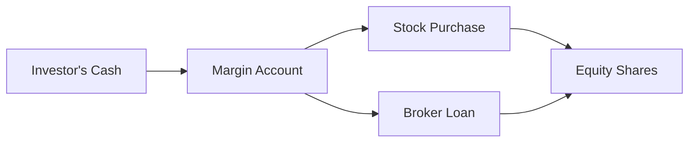
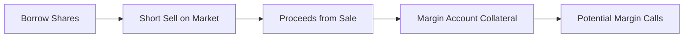

## Understanding Margin Trading

If you’ve ever found yourself thinking, “Gosh, if I only had a bit more capital, I’d buy more shares of this stock,” margin trading might be the friend you never knew you needed—or, in some market environments, your worst enemy. Basically, margin trading is when you borrow money from a broker to purchase stocks. This borrowed money, or “margin loan,” leverages your position, meaning you can control more shares than you could with your own cash alone. But as you might suspect, bigger potential gains also come with higher possible losses.

In practice, margin trading is governed by a set of rules and margin requirements, often issued by regulators like the Federal Reserve in the United States under Regulation T, or by self-regulatory organizations such as FINRA. Brokers also have their own stricter internal policies. The general idea is that you must put up a certain amount of the trade’s value with your own money—this is known as your initial margin. For example, if the initial margin requirement is 50%, you pay 50% in cash and borrow the remaining 50% from your broker.

### Initial Margin vs. Maintenance Margin

• Initial Margin: This is your down payment, so to speak. If the stock’s total purchase price is USD 10,000 and your broker requires an initial margin of 50%, you must pay USD 5,000 in cash. The rest is a loan from the broker.  

• Maintenance Margin: After you open a margin position, you must keep a minimum percentage of the position’s value as equity. Suppose your broker’s maintenance margin requirement is 25%. If the equity in your account dips below 25% of the total position value because of a stock price decline, you’ll get the dreaded “margin call.”  

A margin call means you have to deposit more funds (cash or securities) or risk your broker selling some of your shares to reduce the loan balance.

### Mechanics of a Margin Call

Let’s do a quick theoretical snippet—just to see how margin calls might arise. Suppose you buy 200 shares of a stock at USD 50 each (so total USD 10,000). Your initial margin is 50%, so you pay USD 5,000, and you borrow USD 5,000 from your broker.

• Your equity = (Number of shares × Price) – Loan  
• After the purchase: Equity = USD 10,000 – USD 5,000 = USD 5,000  

Let’s say the stock price goes down to USD 40. Now the position is worth USD 8,000, but you still owe USD 5,000. So:

• Your equity = USD 8,000 – USD 5,000 = USD 3,000  
• Maintenance margin requirement = 25%  

Since the total position is now USD 8,000, 25% of 8,000 is USD 2,000. You still have USD 3,000 in equity, so you’re above the maintenance margin. That means: no margin call… yet. If the price fell further to, say, USD 35 (value of USD 7,000), your equity becomes USD 7,000 – USD 5,000 = USD 2,000, which is exactly 25% of the total position. Fall below that level, and you get a margin call. That’s the quick gist.

### A Quick KaTeX Formula

Sometimes the critical price at which you’d get a margin call is approximated by:


P_{\text{call}} = \frac{\text{Initial Amount Borrowed}}{\text{Number of Shares} \times (1 - \text{Maintenance Margin})}


where  
• \\( \text{Initial Amount Borrowed} \\) is your loan.  
• \\( \text{Number of Shares} \\) is how many shares you purchased.  
• \\( \text{Maintenance Margin} \\) is the decimal form of your requirement (e.g., 0.25).

This formula doesn’t account for accrued interest or dividends, but it gives a general idea for a margin call threshold.

### Visualizing Margin Trading

Below is a simple Mermaid diagram that shows the flow of money (and ownership) when you trade on margin:



• Investor's Cash: Your initial margin investment.  
• Broker Loan: The amount you borrow.  
• Equity Shares: The stock position you control with the combination of your cash and borrowed funds.

## Short Selling Mechanics

Now let’s pivot to short selling. If margin trading can feel a bit nerve-racking, short selling can be downright terrifying—at least for the uninitiated. Short selling is when you borrow shares from your broker and sell them immediately in the market with the belief (or hope!) that the share price will fall. If the price does drop, you buy the shares back later at that lower price. Then you return them to the lender, and you pocket the difference. Fancy, right?

### Obligations and Dividends

When shorting, keep in mind:  
• You owe any dividends or other corporate actions to the lender. So if the stock pays a dividend of USD 1.00 per share while you’re short, that’s coming out of your pocket.  
• The broker typically requires margin for short positions too, because if the asset’s price goes up instead of down, you’re on the hook for the difference. Theoretically, there’s no upper bound for a stock’s price, so your potential losses could be unlimited.

One surprising event for many novices is the possibility of a “buy-in.” The broker can force you to repurchase shares if the lender wants them back (maybe they want to vote those shares or simply restrict further lending). If that happens at a bad time (like a big price spike), it can be a real headache.

### Visualizing a Short Sale

Here’s a simplified Mermaid diagram showing the path of shares being borrowed, sold, and eventually repurchased:



• Borrow Shares: You get them from a broker or a separate institutional lender.  
• Short Sell on Market: You sell those borrowed shares.  
• Proceeds from Sale: The cash you receive from selling. Usually, the broker holds this in your margin account.  
• Potential Margin Calls: If the stock price goes up, you may need to deposit additional funds to maintain the required margin.

## Comparing Margin Trading and Short Selling

The biggest difference is that with margin trading, you’re typically bullish on the stock. You want the price to go up so you can leverage your returns. With short selling, you’re bearish—you see a chance to profit if the price drops. However, both strategies can (and do) exist in the same margin account structure. And both can generate margin calls if the market moves against you.

### Short Interest and Market Sentiment

For more on using short positions to gauge investor sentiment, refer to Section 2.10 “Short Interest as a Sentiment Indicator.” Understanding outstanding short positions can signal widespread bearish sentiment or possible short squeezes when the price unexpectedly rises.

## Risks and Regulations

### High Leverage = High Risk

It’s been said that leverage is like a lever—obviously—but in finance, it means you’re magnifying gains and losses. That’s the key point: if your position tanks, you can lose more than you initially put in. In the extreme example, if a shorted stock soars 100%, your broker might close you out or demand a large deposit. This risk is vital to appreciate before taking on a leveraged position.

### Regulatory Environment

Regulators stockpile a range of tools to curb “excess” risk in the system. For instance, some authorities impose rules like:  
• No short selling during market freefalls (temporary bans).  
• An uptick rule, which requires short sales to be executed at a higher price than the last trade.  
• Increased margin requirements when volatility is high.

Keep in mind that these regulations can vary significantly from one country to another, so be sure to check local guidelines if you’re trading abroad.

## Interest and Other Costs

Now, you don’t just get to borrow for free. You pay interest on margin loans. And if you’re short selling, you might also pay a stock-borrow fee, especially if the stock is hard to borrow (a “hot” short). It’s easy to overlook these costs, but they can erode profits significantly in both margin trading and short selling. If you’re a CFA exam taker, remember to factor these carrying costs into your net return calculations.

## Practical Example of Margin Trading

Let’s walk through a quick scenario that might appear on the CFA exam:

Suppose you have USD 20,000 in cash and decide to open a margin account to buy USD 40,000 of shares in Company XYZ at USD 80 per share (that’s 500 shares). You meet a 50% initial margin requirement. Maintenance margin is 30%.

• Initial equity = USD 20,000  
• Borrowed = USD 20,000  

One month later, the market price is USD 70. So your position is worth 500 × USD 70 = USD 35,000. Your outstanding loan is still USD 20,000 (ignoring interest).  

• Equity = 35,000 – 20,000 = USD 15,000  
• As a percentage of the position: 15,000 ÷ 35,000 = 42.9%  

You’re above the 30% maintenance margin, so no margin call yet. But you are losing money (your equity has dropped from 20,000 to 15,000). If the price went down to USD 50, then equity would be 25% of the position, which triggers a margin call. You’d have to add cash or liquidate shares. That’s how quickly losses can compound.

## Brief Python Snippet: Margin Call Check

If you enjoy coding simple checks (and to show how folks might automate margin tracking), here’s a very short Python snippet:

```python
def margin_call_check(price, shares, loan_amount, maintenance_margin):
    position_value = price * shares
    equity = position_value - loan_amount
    equity_ratio = equity / position_value
    if equity_ratio < maintenance_margin:
        return f"Margin Call! Equity ratio is {equity_ratio:.2%}."
    else:
        return f"No call. Equity ratio is {equity_ratio:.2%}."

print(margin_call_check(70, 500, 20000, 0.30))
```

This would output something like “No call. Equity ratio is 42.86%.”

## Avoiding Common Pitfalls

• Overleverage: Even if the numbers look great, borrowing too much can quickly lead to forced liquidations in a downturn.  
• Ignoring Costs: Interests, fees, and dividends paid out on short positions can eat into profits.  
• Timing Risk: Markets can stay irrational longer than you can stay solvent, especially with short positions.  
• Emotional Stress: Dealing with margin calls or short squeezes can be psychologically taxing. Don’t underestimate the toll.

## Exam Tips and Strategies

From a CFA exam standpoint, be prepared to:  
• Calculate margin call prices given an initial margin and maintenance requirement.  
• Analyze short-sale profitability, including dividends owed.  
• Understand how margin interest costs affect net returns.  
• Discuss regulations restricting short selling and how they might reduce market liquidity or influence pricing.  
• Evaluate portfolio leverage decisions within an asset allocation and risk management framework (cross-reference with other derivatives or risk management sections in the curriculum).

Having a solid footing in margin mechanics is crucial for addressing scenario-based questions where you must compute how a margin call might occur or how short selling can enhance or hedge a position.

## References

• Securities Industry and Financial Markets Association (SIFMA):  
  <https://www.sifma.org>  
• CFA Institute. (Current Year). “Equity Investments” in CFA Program Curriculum.  
• FINRA Margin Rules:  
  <https://www.finra.org/rules-guidance/rulebooks/finra-rules>  

## Test Your Knowledge on Margin Trading and Short Selling



### Which of the following best describes a margin call?
- [ ] A demand from the investor to buy more shares at a discount.
- [ ] A broker's suggestion to hold a position due to bullish signals.
- [x] A broker’s demand for additional capital or securities to restore the required margin.
- [ ] A direct penalty fee imposed for late trading.

> **Explanation:** A margin call arises when an investor’s equity in a margin account drops below the required maintenance margin. The broker demands additional capital/securities to bring equity at or above the required level.

### What is the main reason short sellers must repay dividends on borrowed shares?
- [ ] They are required to pay the broker for every stock transaction.
- [ ] They are offsetting an arbitrage opportunity on bond equivalents.
- [ ] They need to increase the marginal cost of borrowing.
- [x] They owe any benefits of share ownership back to the original lender.

> **Explanation:** When short selling, you borrow shares from a lender who remains the rightful owner. Because the lender would have received dividends if they still held the shares, the short seller must compensate them for dividends declared.

### An investor purchases shares on margin. Which of the following outcomes is possible?
- [x] The investor can lose more than the initial equity investment.
- [ ] Margin trading eliminates the risk of overall market declines.
- [ ] Shares purchased on margin pay higher dividends.
- [ ] Maintenance margin requirements do not apply to leveraged positions.

> **Explanation:** Margin amplifies both gains and losses; if the stock price declines substantially, the investor may owe more than the initial equity. Maintenance margin requirements always govern leveraged positions.

### Which best explains “maintenance margin”?
- [ ] The percentage of your profits you keep after taxes.
- [ ] A fixed rate of interest the broker charges on borrowed funds.
- [x] The minimum proportion of equity an investor must maintain in a margin account.
- [ ] The difference between the bid and ask price.

> **Explanation:** Maintenance margin is the ongoing minimum equity threshold. Dropping below it triggers a margin call.

### In short selling, which statement is most accurate regarding potential losses?
- [x] Losses can theoretically be unlimited because a stock’s price can rise indefinitely.
- [ ] Losses are capped at the amount of collateral posted initially.
- [x] Losses are limited to twice the amount invested in the short sell.
- [ ] Losses cannot exceed 100% of the short position’s value.

> **Explanation:** Because there is no ceiling on how high a stock can go, short sellers face unlimited theoretical loss potential.

### If the share price is rising sharply, which scenario commonly threatens a short seller?
- [x] A short squeeze, where forced buybacks drive the price even higher.
- [ ] A dividend freeze, which reduces short holding costs.
- [ ] A margin reduction that automatically reduces the short position.
- [ ] A guaranteed buy-in below the current market price.

> **Explanation:** During a short squeeze, multiple short sellers attempt to buy back shares simultaneously, causing the price to spike further and increasing losses.

### What should be included when calculating the total cost of a short position?
- [x] Borrow fees, dividends paid, and any margin interest.
- [ ] Only the stock price at the time of purchase.
- [x] Only the broker’s transaction fee.
- [ ] Only the realized gains upon covering the short position.

> **Explanation:** Short sellers typically owe short stock-borrow fees, must reimburse dividends to the share lender, and may pay margin interest if borrowed funds are required.

### Which of the following best describes the reason behind maintenance margin in short positions?
- [x] It protects the broker from losses if the share price increases significantly.
- [ ] It allows the broker to share in the profits of a successful short.
- [ ] It ensures the short seller gains leverage without risk.
- [ ] It only applies to positions held for more than one trading day.

> **Explanation:** Maintenance margin ensures that the broker has sufficient collateral from the short seller in case the stock price goes up, limiting the broker’s risk.

### During volatile market conditions, what regulatory measure might be imposed on short sales?
- [x] A temporary ban or restrictions to reduce potential downward price pressure.
- [ ] Removal of all margin requirements.
- [ ] Forced short selling to increase liquidity.
- [ ] Direct government guarantees on short-selling profitability.

> **Explanation:** Regulators may impose bans or restrictions on short selling to reduce extraordinary volatility and downward pressure on asset prices.

### True or False: In a margin purchase, the investor’s potential loss is capped at the initial investment.
- [ ] True
- [x] False

> **Explanation:** Because you are borrowing money to buy additional shares, a severe price drop could leave you with debts exceeding your initial equity.


