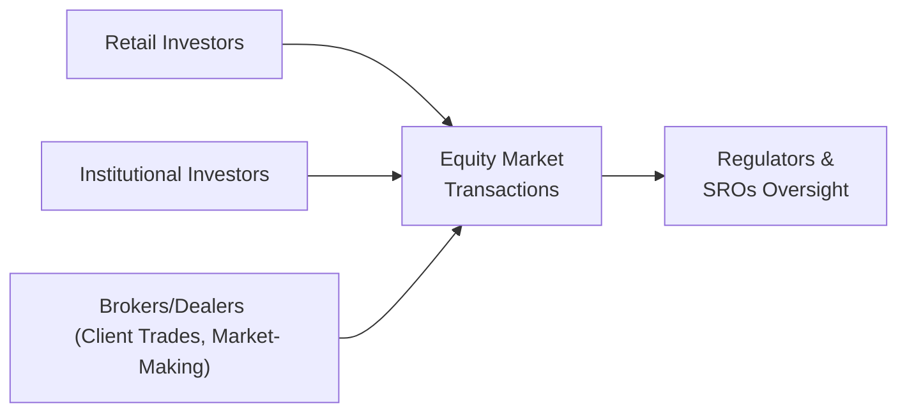

## Introduction and Overview

Let’s start with a quick reflection: if the equity markets were one enormous party, each type of participant—retail investors, institutions, brokers, dealers, and market makers—would play a unique role on the dance floor. (I always envision brokers as the busy folks ushering guests around so nobody misses a beat.) But of course, none of these groups would be able to keep the music going without rules to ensure everyone plays nicely. That’s where regulatory frameworks come in. So, in this section, we’ll talk about who is who in this “equity-market party,” how they operate, and what laws and guidelines keep the party from turning into a free-for-all.

This discussion will be particularly relevant for advanced CFA candidates seeking to integrate knowledge of real-world market structures with the responsibilities of different players. You will see how all these market participants, along with strict oversight, help maintain liquidity, transparency, and investor confidence—essentials to any well-functioning capital market.

## Market Participants

### Retail Investors

Retail investors are everyday individuals like you, me, or your neighbors who invest personal funds in equity markets—often aiming to grow their wealth for retirement, education funds, or a dream home. They typically access the markets through:

• Online brokerages: Platforms like E*TRADE or Interactive Brokers in many regions.  
• Full-service brokers: Firms offering personalized advice, portfolio management, and research.  

From a regulatory standpoint, retail investors are usually considered less sophisticated, so the rules provide them with broad protections like suitability requirements and mandatory investment disclosures. Some might say these folks have the most to gain from a fair and well-regulated system because they generally lack the resources to deeply research each opportunity or recover from big losses.

### Institutional Investors

While retail investors can create buzz in certain areas (think the surge of online communities discussing specific stocks), institutional investors are the real heavyweights. Pension funds, insurance companies, banks, hedge funds, and mutual funds invest large pools of money on behalf of third parties. Because of their size, they can singlehandedly move markets, influence stock prices, and shape corporate policy. Institutions often have:

• Specialized research teams to identify value opportunities, anticipate industry shifts, or weigh in on long-term macroeconomic trends.  
• The ability to influence corporate governance, particularly if they hold significant ownership in a firm.  

Institutions are generally subject to more sophisticated regulatory scrutiny. For instance, regulators carefully monitor whether a hedge fund might be employing excessive leverage or influencing stocks in ways that threaten market stability.

### Brokers and Dealers

Brokers make trades happen on behalf of their clients (retail or institutional), earning commissions or fees for matching buy or sell orders. Dealers, meanwhile, can take positions themselves, holding inventory in specific securities. They may earn revenue from the bid–ask spread, or from short-term trading strategies.

In practice, it’s common to see broker-dealer firms that perform both activities under different departments, each strictly regulated to prevent conflicts of interest. In many jurisdictions, regulators require broker-dealers to maintain detailed records of their activities, monitor their employees’ personal trades, and protect client assets in segregated accounts.

### Market Makers

Market makers typically specialize in specific securities and promise to always quote both a bid (price at which they buy) and an ask (price at which they sell). By doing so, they keep trading activity flowing and reduce the risk that an investor can’t purchase or sell a security quickly. In return, market makers get certain benefits—like reduced transaction fees on an exchange—and earn revenue from the spread between their bid and ask quotes.

This role is pretty critical for liquidity. From your perspective, it’s like having a convenience store open 24/7 so you can buy or sell whenever you want—even though something might be going on outside, you’ll still find a counterparty. In the equity universe, the narrower the spread, the more cost-effective it is to trade, which boosts efficiency and fairness.

Mermaid diagram to visualize types of participants and their interaction with the market:

## Regulatory Frameworks

Regulatory frameworks are essentially the rulebook and referees that keep the markets honest. (Personally, I’m always thankful for frameworks that reduce my chance of buying shares in a company that turns out to be a massive fraud—um, that’s definitely not fun.)

### Government Agencies and Self-Regulatory Organizations (SROs)

Government agencies like the Securities and Exchange Commission (SEC) in the United States or the Financial Conduct Authority (FCA) in the UK create laws and rules that participants need to follow. They enforce compliance, investigate insider trading or fraud, and can levy fines or take legal action if the rules are broken.

Self-Regulatory Organizations (SROs) include entities such as FINRA (Financial Industry Regulatory Authority) in the U.S. or IIROC (Investment Industry Regulatory Organization of Canada). SROs can write and enforce additional rules to protect investors and promote market integrity. Exchanges themselves can be considered SROs when they set membership requirements, listing standards, and codes of conduct for their participants.

### Core Objectives of Regulation

Market regulations aim to accomplish the following:

• Protect investors: By ensuring they receive accurate, timely information.  
• Preserve market integrity: By preventing manipulation, insider trading, or other unscrupulous practices.  
• Maintain fair access: By making sure that both big institutions and smaller investors can participate without undue discrimination.  
• Promote transparency: Through disclosure rules, reporting guidelines (IFRS, US GAAP), and price dissemination.  

### Listing Requirements and Disclosure

Every publicly listed company has to meet the exchange’s listing requirements. These typically discuss:

• Minimum financial thresholds: Such as a certain market capitalization, revenue, or shareholder equity.  
• Corporate governance standards: Independent boards, committees, and certain codes of conduct.  
• Ongoing disclosure: Filing periodic financial statements and material events with regulators to keep investors informed.

If a company cannot maintain these requirements—like a sustained drop in share price or financial health—exchanges may delist them. This ensures that only issuers that meet certain benchmarks remain in the public equity market and helps maintain investor confidence in the listed securities.

## Enforcement and Compliance

### Role of Regulators in Enforcement

Regulators have a broad toolset for ensuring compliance:

• Investigative Powers: Subpoenaing documents, interviewing witnesses, and analyzing transaction records.  
• Legal Action: Filing charges against companies/individuals for securities violations or fraud.  
• Penalties: Imposing fines, revoking licenses, or issuing bans on participating in securities markets.  

One of my colleagues used to say that if you feel a regulatory arm around your shoulder—especially if you’re a broker or an analyst—it’s not always a friendly hug. It might be an investigation. So compliance systems must be robust to keep everything squeaky clean.

### Exchange Rules

Exchanges also set rules for their member firms, such as:

• Reporting guidelines for trades and quote activity.  
• Requirements for minimum capital and net worth.  
• Standards for fair dealing and best execution.

Violations can lead to large penalties or the suspension of trading privileges. Exchanges want to maintain their reputations as trustworthy marketplaces; lax oversight could drive legitimate participants elsewhere, reducing volume and liquidity.

### Global Harmonization Efforts

As capital markets have become more interconnected, regulatory bodies and SROs increasingly collaborate to standardize. The International Organization of Securities Commissions (IOSCO), for instance, works toward consistent global standards around disclosure, auditing, and enforcement. This matters for you as a strategic investor because it reduces the friction across foreign equity markets, potentially simplifying cross-border investments and mitigating regulatory arbitrage.

## Glossary

Market Maker  
A participant obligated to provide liquidity in a given security by posting continuous bid and ask quotes. They profit from the bid–ask spread and help ensure smooth trading.

Self-Regulatory Organization (SRO)  
An entity that has the power to create and enforce industry regulations and standards. FINRA in the U.S. is a prime example.

Insider Trading  
The illegal practice of trading on material, nonpublic information to gain an unfair advantage. Regulators investigate and prosecute such activity to maintain market integrity.

Prospectus Requirements  
Disclosure mandates for companies issuing public securities, ensuring potential investors have adequate information to make informed decisions.

## Practical Examples and Case Studies

Case Study 1: Retail Investor Protection  
Consider a hypothetical scenario where a retail investor reads a “hot tip” on a social media forum about a small biotech firm. The investor promptly buys shares without researching the fundamentals or verifying the information. If the company is legitimate and properly regulated, it has likely filed up-to-date reports, and the exchange has vetted it. Regulators can also investigate if the “hot tip” was part of a pump-and-dump scheme. Thus, a regulated environment offers at least some guardrails.

Case Study 2: Institutional Investor Activism  
Imagine a large pension fund that invests heavily in a multinational corporation. The pension fund may engage in shareholder activism if it believes the firm’s board is not aligned with shareholder interests. Under strong corporate governance regulations, the corporation must provide certain disclosures and hold votes on significant changes. Institutional investors use these mechanisms to influence firm policies, ensuring their portfolios align with risk-return objectives.

## Best Practices and Potential Pitfalls

Best Practices  
• Ensure robust internal compliance: Have well-documented policies and train staff on insider trading rules, recordkeeping, and conflict-of-interest mitigation.  
• Maintain transparency: Retail and institutional investors alike should access the same essential information about a security or market condition.  
• Stay updated on regulatory changes: Rules evolve, particularly when new technologies or financial instruments emerge (e.g., high-frequency trading, digital assets).

Potential Pitfalls  
• Overemphasis on compliance at the expense of strategy: There’s a balance to strike. Compliance is a must, but an overly bureaucratic approach can hinder operational efficiency.  
• Regulatory arbitrage: Firms might gamble on differences between jurisdictions (for instance, listing in a market with lax oversight), which can jeopardize investor confidence.  
• Lack of investor education: Without the ability to interpret disclosures or compliance data, retail investors might still be vulnerable to making uninformed decisions.

## Practical Tips for the CFA Exam and Real-World Application

• Understand the roles and motivations of retail vs. institutional investors. This provides insight into how trading volume, volatility, and price discovery might evolve throughout a trading day.  
• Connect the dots between form (e.g., broker, dealer) and function (e.g., providing liquidity, seeking alpha). You may see item-set questions analyzing the risk exposures of each market participant type.  
• Maintain a mental map of global regulatory bodies; exam questions can appear about cross-border transaction oversight or about how different listing requirements affect valuation or liquidity.  
• Even as advanced CFA practitioners, you’ll want to remain aware of your responsibilities under the CFA Institute Code of Ethics and Standards, especially regarding material nonpublic information and personal trading policies.

## Concluding Thoughts

The equity markets might feel chaotic, but they are, in fact, an orchestrated dance of diverse participants. Each participant adds its own rhythm, and regulators make sure the music keeps playing fairly and transparently. It’s crucial for you as a future or current CFA charterholder to not only grasp these fundamentals but to apply these concepts in real-world investment decision-making and ethics. The interplay between market participants and regulatory frameworks greatly influences liquidity, price efficiency, and overall trust in the financial system. Embrace it, and you’ll find it’s a robust foundation for navigating both domestic and global equity markets.

## References and Further Reading

• Securities and Exchange Commission:  
  – https://www.sec.gov  
• FINRA (Financial Industry Regulatory Authority):  
  – https://www.finra.org  
• CFA Institute. (Current Year). “Code of Ethics and Standards of Professional Conduct.”  
• IOSCO (International Organization of Securities Commissions):  
  – https://www.iosco.org  

--------------------------------------------------------------------------------

## Mastering Market Participants & Regulatory Frameworks: A Practice Quiz



### Which of the following best describes a key objective of listing requirements on major stock exchanges?

- [ ] To reduce the number of listed companies and limit investment opportunities  
- [x] To set minimum financial and governance standards for public firms  
- [ ] To inflate stock prices artificially  
- [ ] To guarantee investors a certain return on their securities  

> **Explanation:** Stock exchange listing requirements exist to ensure companies meet certain financial and corporate governance thresholds. This maintains an environment where investors can rely on accurate and timely disclosures.

### How do self-regulatory organizations (SROs) differ from government agencies in the context of securities regulation?

- [x] SROs are industry-run organizations that create and enforce rules among their members  
- [ ] SROs are government bodies that handle only enforcement but not rule creation  
- [ ] SROs do not have the authority to sanction market participants  
- [ ] SROs exclusively regulate retail investors  

> **Explanation:** SROs, such as FINRA in the U.S., are industry-led organizations that set and enforce rules. They operate under the oversight of government bodies but are not themselves government agencies.

### Which statement about market makers is most accurate?

- [x] Market makers provide continuous two-sided quotes (bid and ask) to enhance liquidity in a security  
- [ ] Market makers are prohibited from trading for their own accounts  
- [ ] Market makers only facilitate trades for retail investors  
- [ ] Market makers set share prices independently of supply and demand  

> **Explanation:** By quoting both bid and ask prices, market makers ensure liquidity is always available for a given security. They can and do trade on their own accounts, and their quotes are still subject to supply and demand pressures in the broader market.

### Which of the following is an example of an institutional investor?

- [ ] A college student investing through a mobile app  
- [x] A multi-billion-dollar pension fund managing retirement assets  
- [ ] A retiree using a discount brokerage to buy dividend stocks  
- [ ] A high-net-worth individual investing personal savings  

> **Explanation:** Institutional investors are entities (like pension funds, insurance companies, or mutual funds) that typically manage large sums of money on behalf of others. A multi-billion-dollar pension fund clearly qualifies.

### What is the primary role of a broker?

- [ ] To invest their own funds for profit in market-making  
- [ ] To set regulatory policy for listed companies  
- [ ] To manipulate prices for private gain  
- [x] To execute trades on behalf of clients and receive a commission or fee  

> **Explanation:** Brokers operate as intermediaries, executing trades for clients. They do not generally trade on their own accounts (that’s the dealer function) and they do not set policy or prices.

### Which best captures the main reason regulators require up-to-date disclosures from publicly traded companies?

- [x] To ensure investors have accurate information to make informed decisions  
- [ ] To prevent corporate management from owning shares in their own company  
- [ ] To hasten the delisting of underperforming companies  
- [ ] To grant guaranteed returns on stock investments  

> **Explanation:** Knowledge is power. Regulators require continuous disclosure to keep investors informed, enabling them to evaluate the risks and returns effectively.

### If a broker-dealer consistently uses confidential, nonpublic information to trade profitably, this behavior might constitute:

- [ ] Legitimate market-making  
- [ ] Coalition trading  
- [ ] Regulated position-building  
- [x] Insider trading  

> **Explanation:** Trading on material, nonpublic information (i.e., insider trading) is illegal and can lead to severe regulatory action.

### Which of the following bodies is primarily responsible for creating uniform global standards for securities regulation?

- [x] International Organization of Securities Commissions (IOSCO)  
- [ ] Financial Industry Regulatory Authority (FINRA)  
- [ ] U.S. Securities and Exchange Commission (SEC)  
- [ ] Federal Reserve Board  

> **Explanation:** IOSCO coordinates among securities regulators worldwide to set global standards, while entities like FINRA and the SEC operate mainly at national or regional levels.

### How does a self-regulatory organization such as FINRA maintain market integrity?

- [ ] By issuing sovereign debt  
- [ ] By providing liquidity in illiquid securities  
- [x] By enforcing ethical and compliance standards among industry members  
- [ ] By guaranteeing profits for market participants  

> **Explanation:** FINRA writes and enforces rules for broker-dealers, ensuring they comply with ethical, operational, and disclosure requirements. This promotes fairness and integrity in the market.

### True or False: Institutional investors can have significant influence on a company’s governance due to their large shareholdings.

- [x] True  
- [ ] False  

> **Explanation:** Institutional investors often own substantial positions and can leverage that ownership to influence corporate decisions, board composition, and strategic direction.


