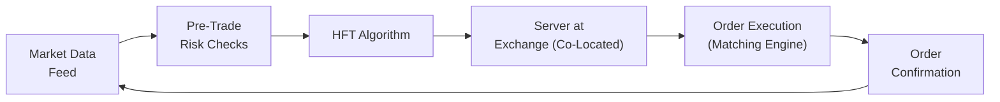

## Introduction

High-frequency trading (HFT) has transformed the modern equity market landscape—not just in the sense of speed, but also in terms of the strategies used to discover market inefficiencies and exploit even the tiniest price discrepancies. If you’ll allow me to share a quick story, I remember sitting in on a roundtable discussion with HFT developers a few years ago—one even joked that, in the race to reduce latency, he was more worried about the time it takes for electrons to travel through fiber cables than anything else. That’s how high-stakes and precise this business can be. And it sure sounds thrilling, right? But with that thrill comes complexity, risk, and the potential for regulatory headaches.

HFT simultaneously offers liquidity and, if you want to be dramatic about it, the possibility of market instability. Put simply, HFT participants frequently operate as market makers by posting bids and asks, only to change or cancel them in fractions of a second. Well-executed HFT can narrow spreads and improve price discovery. In less ideal scenarios—like the infamous “Flash Crash” of 2010—there’s a risk that large volumes of orders get canceled so quickly that liquidity effectively vanishes, leaving typical investors scrambling.

In this article, we’ll explore the nuts and bolts of high-frequency trading, with a special focus on market liquidity, risk considerations, regulatory updates, and the practical implications for equity investors. We’ll keep it a bit casual, so you shouldn’t expect to be reading dense legalese every other paragraph. At the same time, because you’re studying for the CFA exam, we’ll keep the content thorough, tying real-world examples back to fundamental concepts that might show up on your test.

## Key Components of High-Frequency Trading

High-frequency trading generally involves placing thousands (or even millions) of orders across various markets and instruments in an effort to capture minuscule but consistent profits. Below are some of its most important components:

### Algorithmic Trading

Algorithmic trading is broader than HFT. Think of it as the umbrella under which HFT sits. Algorithmic trading involves using computerized strategies to execute orders based on pre-set rules—these rules might concern timing, price, volume, or even more complex features such as technical indicators or real-time news. HFT simply ratchets this up a thousand notches and focuses on very short holding periods, ultra-high speed, and massive order volumes.

### Latency Minimization

Latency means delay. The shorter the delay, the faster you can react to price movements. HFT participants spend enormous resources on:

• Optimizing hardware.  
• Acquiring premium data feeds.  
• Co-location (placing servers physically close to exchange servers to reduce signal travel time).  

It’s almost funny how people will measure time in microseconds, or even nanoseconds, to see who can get that teeny advantage. Many times, the edge is no more than a fraction of a millisecond.

### Quote Updates and Market Data Feeds

HFT strategies rely heavily on real-time market data. Traders subscribe to direct exchange data feeds—bypassing potential data “bottlenecks” from third-party aggregators. Some HFT firms even purchase fiber routes that literally try to follow the Earth’s curvature in the shortest possible path. The reason is simple: If you can know the best bid or ask price a microsecond ahead of your competitor, you can submit trades at a more favorable price.

## HFT and Market Liquidity

High-frequency traders are often liquidity suppliers. They post thousands of orders at both the bid and ask sides. Because they continuously revise these orders, the result is typically narrower bid-ask spreads. Narrower spreads, in turn, mean lower transaction costs for other market participants. Everything sounds wonderful, right?

### The Good: Immediate Liquidity

Many market makers today employ HFT strategies to facilitate efficient order matching. For large institutions, transacting in markets populated by HFT can serve as a double-edged sword, but under typical conditions, it offers:

• Deep order books, as HFT participants place an enormous quantity of small orders.  
• Tighter spreads, which reduces the overall cost of trading.  
• Rapid price discovery, especially useful in times of normal or moderate volatility.  

If an investor like you or me wants to buy shares of an actively traded stock, the presence of HFT typically ensures we can do it at a near-instantaneous price that is closer to “fair value” (whatever that might be at the moment).

### The Bad: Flash Crashes and Liquidity Droughts

Let’s cut to the chase: One of the major criticisms is that HFT firms can withdraw their liquidity in a heartbeat. If an algorithm detects an unusual or adverse event, it can cancel or retract orders in microseconds, effectively causing a “liquidity vacuum.” That’s precisely what happened during the Flash Crash on May 6, 2010. The official story goes that a massive trade in the futures market triggered certain algorithms to start selling aggressively. Then, as prices fell, many HFT algorithms simply stopped providing liquidity and canceled their resting orders. This caused prices to plunge rapidly—some big-name stocks briefly traded at a penny (!)—before everything snapped back.

The overall effect:  
• Extreme intraday volatility.  
• Rapid dislocation of prices from underlying fundamentals.  
• A potential loss of confidence in the market’s stability.

In a way, the presence of HFT can be a boon or a bane, and the line between the two can be minuscule. If we’re discussing “typical” conditions, it’s incredibly helpful for liquidity. But under extreme stress, it can be a different story.

## Risk and Regulatory Considerations

Regulators and exchanges worldwide are grappling with how to manage HFT. There’s nothing inherently illegal about using fast, data-driven strategies, but certain practices have been flagged as manipulative or detrimental to market integrity.

### Algorithmic Risk and Volatility Bunching

When you have a bunch of algorithms chasing each other’s trades, especially if they all incorporate similar triggers—well, you might see herd-like behavior, only in microseconds. This can cause volatility to spike out of nowhere. For big institutional traders, it’s a real concern because sudden price swings can disrupt portfolio rebalancing or even trigger margin calls.

### Market Manipulation Tactics

We can’t ignore that HFT, if used nefariously, can facilitate manipulative techniques such as:

• Quote-stuffing: Submitting a massive number of orders and cancellations in quick succession, bogging down exchange systems, and creating illusions of volume.  
• Spoofing: Placing large orders without the intention of executing them, so as to mislead the market about supply or demand.  
• Layering: Placing multiple orders at different price levels to create a false impression of depth.

In many jurisdictions, spoofing is explicitly illegal and punishable by hefty fines and prison sentences. The U.S. Dodd-Frank Act singled out spoofing as a form of manipulation. Similarly, the European Union’s Markets in Financial Instruments Directive (MiFID II) and Market Abuse Regulation (MAR) address manipulative practices in algorithmic and high-frequency trading.

### Exchange-Level Mechanisms and Safeguards

Some common measures to keep HFT in check include:

• Circuit Breakers: Automated halts in trading if prices move beyond predefined thresholds.  
• Limit Up/Limit Down: Rules that prevent trades from occurring outside a specific range around the most recent reference price.  
• Fee Structures: Exchanges may alter fees for adding or removing liquidity to discourage excessive canceled orders.  

From a regulatory standpoint, authorities also require HFT firms to stress test their algorithms, maintain audit trails, and comply with pre- and post-trade risk checks. The message is clear: If you want to trade in high-speed markets, you’d better be prepared to show you’re doing so in a fair and well-controlled manner.

## Technological Arms Race

The speed factor in HFT can’t be stressed enough. Traders co-locate servers within the same data centers as major exchanges. Fiber cables are replaced with even faster mediums—some firms have tested microwave and laser-based communication lines to shave off microseconds. The advantage can be ephemeral: once you have it, your competitors will race to beat you. The arms race is constant and expensive.

Below is a simplified depiction of a typical HFT order flow:

To clarify, here’s what happens:

1. The market data feed (A) updates continuously with price quotes and trade executions from an exchange.  
2. Pre-trade risk checks (B) ensure that any orders about to be sent out pass compliance and basic risk controls.  
3. The HFT algorithm (C) processes updated prices, searching for profitable opportunities.  
4. The co-located server (D) sends orders in microseconds to the exchange matching engine (E).  
5. Once trades execute, the matching engine returns an execution confirmation (F).  
6. The new market data feed then updates, closing the loop.

## Practical Insights for Equity Investors

You might be wondering: “How does all of this speed and complexity affect me as an investor, or even a portfolio manager?” Well, in normal market conditions, HFT:

• Reduces spreads.  
• Increases order book depth.  
• Potentially enhances price discovery.

Where you might see a negative impact is in scenarios involving big trades. A large institutional investor might use a specialized algorithm (not necessarily HFT) to split a big order over time to minimize market impact. However, sophisticated HFTs can sometimes sniff out these “footprints” and trade ahead, a tactic colloquially known as “front-running” (though front-running in a legal sense typically implies a broker misusing client information).

Furthermore, from a portfolio management perspective:

• Transaction cost analysis becomes more complicated. You need to factor in not just commissions and fees but also slippage and the possibility of HFT targeting large orders.  
• Risk management needs to account for the possibility of sudden liquidity pullbacks.  
• Short-term anomalies or “mini-flash crashes” might create opportunities or hazards, depending on whether your systems can respond as quickly.

## Best Practices and Common Pitfalls

### Best Practices

1. Granular Risk Controls: Ensure every algorithmic strategy has robust guards—like kill switches that halt trading if abnormal patterns are detected.  
2. Thorough Testing: Simulations and backtests in normal, high-volatility, and “flash crash” conditions help identify weaknesses.  
3. Regulatory Compliance: Maintain logs and refine your internal compliance procedures to avoid any suspicion of manipulative practices.  
4. Data Quality: Double-check for potential data feed errors or incomplete data. Bad data can wreak havoc at high speeds.

### Pitfalls

1. Over-Optimization: An algorithm that looks perfect in your simulated environment could fail spectacularly under real-world volatility.  
2. Latency Over Everything: It’s possible to become so obsessed with speed that you neglect robust risk management.  
3. Herding Risk: In a frantic moment, algorithms chase the same signals, amplifying a market move beyond what fundamentals suggest.  
4. Reputational Damage: If your algorithm inadvertently triggers weird price swings or engages in manipulative-looking order patterns, expect intense scrutiny.

## Real-World Examples and Case Studies

### The 2010 Flash Crash

One of the most infamous examples was the May 6, 2010 Flash Crash, when the Dow Jones Industrial Average plummeted roughly 1,000 points in minutes, then quickly reversed. Investigators found that a large sell order in E-mini futures, combined with certain HFT algorithms, led to a feedback loop that ultimately drained liquidity. The result was a jaw-dropping but brief market collapse.

### Knight Capital Glitch (2012)

Knight Capital lost hundreds of millions of dollars in less than an hour due to a faulty software deployment. A code glitch erroneously sent large orders to the market, demonstrating what can happen when risk controls and systems testing do not catch errors in a high-speed environment.

### Spoofing Cases

There have been many high-profile spoofing cases. Regulators in the U.S., UK, and across Europe have levied fines on individuals and firms that placed large orders with no intention of executing them, purely to manipulate market sentiment. This underscores how swiftly authorities have cracked down on nefarious HFT strategies.

## Exam Relevance and Application

In the CFA Program—especially at Level I and Level II—topics like primary vs. secondary markets, order types, and the fundamentals of market microstructure are core. By Level III, you’re looking at portfolio-level insights and advanced risk management. HFT ties together market organization, microstructure, portfolio execution cost analysis, and regulation.

From an exam standpoint, watch for:

• Item sets (vignettes) describing abnormal trading behavior.  
• Questions on how liquidity and spreads are affected by technology-driven trading.  
• Ethical and professional standards scenarios addressing market manipulation.  
• Structured response prompts that ask you to evaluate the effect of HFT on trade execution costs or portfolio volatility.

And remember, whenever an exam question touches on new regulatory reforms or best execution policies, consider how HFT might be impacted or how it might factor into a recommended course of action.

## Final Exam Tips

• Be Familiar with Definitions: Know the difference between algorithmic trading and HFT. Understand what spoofing, layering, and quote stuffing look like.  
• Connect HFT to Liquidity: The exam might test your ability to argue both sides—how HFT can improve liquidity under normal conditions but also threaten it under stress.  
• Think About Regulatory Regimes: Expect references to U.S. and EU frameworks. The CFA Institute Code of Ethics and Standards of Professional Conduct also addresses market manipulation.  
• Prepare for Scenario-Based Questions: They might give you a scenario involving a flash crash-like event and ask how a portfolio manager should respond, or how risk controls could mitigate the damage.

## References

• Aldridge, I. (2013). High-Frequency Trading: A Practical Guide. Wiley.  
• CFA Institute. (Current Year). “Market Organization and Structure” in CFA Program Curriculum.  
• Bank for International Settlements. BIS Papers on High-Frequency Trading: https://www.bis.org  

## High-Frequency Trading and Market Liquidity Practice Questions



### In a typical high-frequency trading setup, which of the following most accurately describes the primary motivation for co-located servers?

- [ ] To comply with exchange rules on minimum order size.  
- [x] To minimize signal transmission latency and gain a speed advantage.  
- [ ] To simplify exchange membership requirements.  
- [ ] To improve corporate governance practices.  

> **Explanation:** HFT firms use co-location to place their servers physically close to the exchange’s servers, reducing the time it takes for order messages to travel back and forth.  

### Which of the following is a potential benefit of HFT for everyday traders under normal market conditions?

- [ ] Increased long-term corporate governance oversight.  
- [ ] Elimination of market volatility.  
- [x] Narrower bid-ask spreads and deeper liquidity.  
- [ ] Removal of regulatory reporting obligations.  

> **Explanation:** HFT firms typically quote buy and sell orders at very tight spreads, enhancing liquidity. This can reduce transaction costs for retail traders and institutional investors in normal market conditions.

### During the Flash Crash of 2010, which factor significantly amplified the price decline?

- [ ] Government restrictions on retail trading.  
- [ ] Widespread insider trading.  
- [x] HFT algorithms withdrawing liquidity en masse.  
- [ ] Imposition of higher margin requirements on all stocks.  

> **Explanation:** When HFT algorithms detected extreme volatility, many stopped posting liquidity, leaving the market vulnerable to a rapid price drop.

### Which of the following is an example of market manipulation prohibited by global financial regulators?

- [x] Spoofing.  
- [ ] Arbitrage.  
- [ ] Hedging.  
- [ ] Buying on margin.  

> **Explanation:** Spoofing refers to placing orders with no intention of executing them, just to deceive other market participants about supply or demand.

### What is one reason regulators may impose circuit breakers on major exchanges?

- [ ] To prevent investors from accessing their brokerage accounts.  
- [x] To temporarily halt trading if prices move beyond set thresholds.  
- [ ] To ensure short selling is always available.  
- [ ] To guarantee infinite liquidity in all circumstances.  

> **Explanation:** Circuit breakers suspend trading momentarily or for a set duration if prices move too rapidly, giving the market time to recalibrate.

### How can high-frequency trading negatively impact the market during periods of extreme stress?

- [x] By quickly cancelling orders, reducing liquidity.  
- [ ] By preventing flash crashes through forced liquidity injection.  
- [ ] By ensuring that circuit breakers close the market.  
- [ ] By voluntarily paying additional transaction taxes.  

> **Explanation:** If algorithms simultaneously remove their liquidity in sudden market turmoil, liquidity can dry up instantly, exacerbating the crash.

### Which term best describes placing so many orders and cancellations that it overwhelms trading systems?

- [ ] Batching.  
- [ ] Dark pooling.  
- [ ] Crossing.  
- [x] Quote stuffing.  

> **Explanation:** The practice of quote stuffing floods the market with excessive orders and cancellations, which can be used to slow down competitors or distort market signals.

### In the Knight Capital mishap, which major lesson emerged for HFT participants?

- [x] Robust testing and kill-switch controls are critical to contain software glitches.  
- [ ] Latency is an insignificant concern for real-time trading.  
- [ ] Marketing expenditure is more important than system development.  
- [ ] Spoofing is a legitimate market-making strategy.  

> **Explanation:** The Knight Capital case highlighted the catastrophic consequences of a code glitch that was not caught by proper testing or risk controls.

### From a portfolio management perspective, how might HFT most directly affect overall transaction costs?

- [ ] By eliminating all brokerage fees.  
- [ ] By guaranteeing zero slippage for large orders.  
- [ ] By providing guaranteed profits for short sellers.  
- [x] By reducing or increasing slippage depending on liquidity conditions.  

> **Explanation:** HFT can narrow spreads and reduce slippage under normal conditions. However, in extreme scenarios, the opposite might occur if liquidity vanishes.

### HFT can both improve and impair market efficiency. Which statement about HFT is TRUE?

- [x] HFT narrows bid-ask spreads under normal conditions but can withdraw liquidity in stressed markets.  
- [ ] HFT is always detrimental to price discovery.  
- [ ] HFT has no effect on market stability.  
- [ ] Regulators universally endorse unlimited HFT activity.  

> **Explanation:** HFT tends to improve efficiency during normal times by providing liquidity, but the sudden withdrawal of HFT orders can exacerbate stress during periods of massive volatility.


