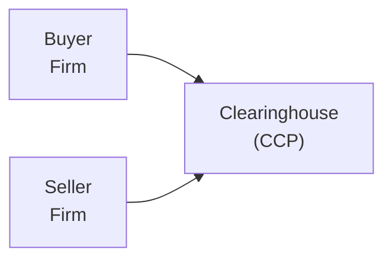

## Introduction and Overview

Well, imagine you buy shares of a new tech stock, and just as you’re about to celebrate your big purchase, you realize you have no clue who’s actually handling the behind-the-scenes stuff—like making sure the shares and cash safely move from seller to buyer. That’s where clearinghouses (often referred to as central counterparties, or CCPs) take center stage. Their job is to stand between buyers and sellers to guarantee trades go through, even if one party can’t deliver. That function is particularly crucial in times of high market stress, which can escalate settlement risk and volatility.

This section digs into how clearinghouses operate in equity markets, the key margin requirements they impose, the settlement processes that keep trades on track, and how these measures help protect the entire financial system. We’ll also explore netting, variation margin, and systems like “delivery-versus-payment” (DvP). Along the way, I'll share a few personal reflections and tips so you can get a feel for why these details truly matter—whether you’re a portfolio manager, a compliance officer, or just a curious investor.

## The Central Counterparty Function

One of the first big hurdles I faced when learning about financial markets was understanding how trades are finalized. You know, it’s one thing to say, “I’ll buy 100 shares of X,” but it’s another to ensure the shares get delivered to me in exchange for my payment. In the old days, people worried about whether the folks on the other side of the deal were trustworthy and could actually pay up.

Clearinghouses address these concerns by serving as the buyer to every seller and the seller to every buyer. The big advantage here is that each market participant faces the clearinghouse as its counterparty, rather than having direct counterparty exposure to a host of different buyers or sellers. This arrangement:

• Reduces the risk that either party fails to deliver securities or cash.  
• Simplifies the settlement process because you only have to trust (and post collateral to) one entity.  
• Sets consistent margin requirements to protect against potential defaults.

Below is a simple mermaid diagram illustrating the flow:

Here, instead of buyer and seller dealing with each other directly, both sides face the CCP, which guarantees performance. If one side experiences financial trouble, the CCP steps in to ensure the other party is made whole.

## Margin Requirements and Collateral

Now, to protect itself (and the broader market) from losses arising from defaults, the clearinghouse requires margin (collateral). You’ll often see two kinds:

• Initial Margin: A deposit posted at the start of a trade, sized so that normal price fluctuations won’t push your account into a deficit.  
• Variation Margin: Sometimes called “mark-to-market margin,” it’s adjusted daily—or even intraday—to reflect changes in the value of open positions.

For instance, let’s say you buy a futures contract on an equity index. The price moves in your favor on Day 1, so the clearinghouse might credit your account and debit the seller’s account. On Day 2, if the price moves against you, the clearinghouse might issue a margin call requiring you to top up your variation margin. This ensures each party’s open positions remain adequately collateralized at all times, mitigating default risk if prices spike or crash.

In formula form (though this is a simplistic illustration), one might see:


\text{Variation Margin Requirement} = |\Delta P| \times \text{Quantity} 


Where ΔP is the change in the contract price from the previous settlement, multiplied by how many contracts (or units of the underlying) you hold.

## Settlement Risk Management Techniques

Settlement risk is that stomach-knot feeling you might get if you’re worried the other side of your trade won’t pay up when you’re ready to deliver. The financial system uses several robust techniques to manage that risk:

### Netting

Clearinghouses typically employ netting across all trades. So if you buy 200 shares of a certain stock and sell 150 shares of the same stock, you only settle the net difference of 50 shares. This drastically reduces the funds and securities that must change hands at the end of the trading day and in effect lessens the number of payments that could fail.

### Variation Margin Calls

As described above, the clearinghouse regularly checks the market prices on open positions. If your losses exceed a certain threshold, you’ll receive a margin call. Failing to meet that call can result in having your position liquidated by the clearinghouse to prevent further losses. Daily (or even intraday) rebalancing helps keep everyone honest and creditworthy.

### Delivery-versus-Payment (DvP) Systems

DvP means the transfer of securities only occurs if the corresponding cash payment has been made—and vice versa. This “simultaneous swap” mechanism significantly reduces the free-credit risk. In simpler terms: no money, no shares. I once heard a friend in risk management say, “DvP is like handing over the car keys only when the check clears.”

## Impact on Market Integrity and Stability

Clearing and settlement procedures—and clearinghouses in particular—are not just an administrative afterthought. They’re a bedrock of modern financial markets. In times of crisis (think about 2008 or the more recent episodes of extreme volatility), clearinghouses significantly reduce systemic risk by:

• Providing a transparent framework for margin calls and default procedures.  
• Ensuring trades get settled in an orderly manner, lowering the risk of chain reactions.  
• Serving as a focal point for regulatory oversight.

Regulators closely monitor CCPs because if a clearinghouse were to fail, it could be catastrophic, potentially toppling multiple major financial institutions. As a result, clearing entities are held to rigorous capital requirements, robust governance standards, and strict operational checks.

## Practical Examples and Case Studies

In some of the largest equity and equity-derivative markets, such as the Chicago Mercantile Exchange (CME) or the Options Clearing Corporation (OCC), the clearing function is tested constantly due to high trading volumes. Markets like the S&P 500 futures see dramatic intraday price moves when major macroeconomic announcements hit. On such occasions, variation margin calls may be executed several times within the same session. This is not hypothetical—it happens in real life. I’ve known traders who received margin calls in the morning, settled them, and got another call by mid-day if the market swung again.

Another example: In many European markets, clearinghouses have harmonized practices, making cross-border equity trades more seamless. The European Market Infrastructure Regulation (EMIR) mandates reporting requirements and sets out risk management standards for EU-based CCPs. This has boosted confidence among global investors, who can see that robust oversight is in place.

## Common Pitfalls and Best Practices

• Underestimating Margin Calls: Traders sometimes over-leverage, forgetting that prices can move sharply against them. Having a solid approach to margin usage is essential.  
• Failing to Distinguish Between Clearing and Settlement: In exam answers, students sometimes conflate the two. Clearing is about matching and confirming trades and setting margin, while settlement is about transferring the actual securities and cash.  
• Overlooking Netting Opportunities: Not taking the time to net positions can lead to unnecessary settlement costs and added complexity in tracking exposures.  
• Ignoring Operational Risk: Settlement risk management is not just about financial or credit risk. Technical glitches or communication failures with the clearinghouse can cause real headaches, especially during peak volatility.

## Glossary

• Central Counterparty (CCP): An entity that interposes itself between transacting parties, becoming the buyer to every seller and the seller to every buyer.  
• Margin (in Clearing): Collateral posted by both sides to guarantee completion of the trade if price movements become adverse.  
• Netting: Offsetting transactions to reduce the number of separate payments or securities deliveries, thereby minimizing settlement risk.  
• Systemic Risk: The possibility of a breakdown in an entire financial system or market, often triggered by the failure of a single major component.

## Further References

• European Central Bank – Clearing and Payment Systems:  
  [https://www.ecb.europa.eu](https://www.ecb.europa.eu)  
• CFA Institute. (Current Year). “Derivatives and Risk Management” in CFA Program Curriculum.  
• Chicago Mercantile Exchange (CME) Clearing Services:  
  [https://www.cmegroup.com/clearing](https://www.cmegroup.com/clearing)  
• Bank for International Settlements (BIS) resources on payments and market infrastructures:  
  [https://www.bis.org/cpmi/](https://www.bis.org/cpmi/)

## Final Exam Tips

• Show Understanding of Definitions: Clearly differentiate clearing from settlement and explain how the CCP mitigates counterparty risk.  
• Apply Context: If you’re asked how margin calls might be triggered under a price fluctuation scenario, be prepared to demonstrate the calculation (mentioning variation margin).  
• Address Regulatory Dimensions: Especially relevant if a question is about post-crisis reforms or systemic risk.  
• Connect with Portfolio Management: In multi-asset portfolio settings, clearing risk management can be vital if you’re executing derivatives strategies or cross-border equity trades.

Remember, on exam questions, it’s not just about reciting definitions: show how each measure—margin calls, netting, DvP—ties into a more stable and trustworthy marketplace.

## Test Your Knowledge: Roles of Clearinghouses and Settlement Risk Management



### Which of the following best describes a key function of a clearinghouse?
- [ ] It directly sets equity prices in the market.
- [x] It serves as a central counterparty, guaranteeing trade completion.
- [ ] It functions solely as a regulatory body for markets.
- [ ] It primarily redistributes capital from net lenders to net borrowers.

> **Explanation:** The clearinghouse acts as a central counterparty to trades and ensures settlement, not as a market price setter or regulatory authority.

### What is the primary purpose of requiring initial margin and variation margin?
- [x] To protect against default by covering potential losses.
- [ ] To shift credit risk entirely to the clearinghouse.
- [x] To ensure each participant retains enough collateral to support open positions.
- [ ] To streamline corporate governance within the clearinghouse.

> **Explanation:** Initial and variation margins help cover potential losses from adverse price movements and ensure participants can fulfill their obligations.

### Which process reduces the total number of payments or deliveries required among trading participants?
- [x] Netting
- [ ] Leverage allocation
- [ ] Reconciliation
- [ ] Hedging

> **Explanation:** Netting offsets obligations, so participants settle only net amounts, lessening settlement complexity.

### How does daily marking-to-market (variation margin) enhance stability?
- [x] It adjusts collateral requirements based on current market prices.
- [ ] It locks in the original contract value through the life of the trade.
- [ ] It eliminates the need for initial margin.
- [ ] It functions as a legal guarantee for government bonds only.

> **Explanation:** Variation margin updates collateral daily to match current valuations, reducing counterparty exposure if large price swings occur.

### Which of the following best explains delivery-versus-payment (DvP)?
- [x] Securities are delivered only when corresponding payment is received.
- [ ] Payment must settle a week before securities are delivered.
- [x] It significantly reduces the risk of non-payment by having simultaneous exchange.
- [ ] DvP applies only to options on commodities futures.

> **Explanation:** DvP ensures simultaneous exchange of securities for cash, minimizing the risk one side defaults without handing over payment or shares.

### Why are clearinghouses typically subject to stringent regulation?
- [x] Their failure could trigger systemic risk across the financial markets.
- [ ] They are generally minor players in financial transactions.
- [ ] They do not require capital or liquidity.
- [ ] They exclusively serve retail investors.

> **Explanation:** Because CCPs are critical market infrastructure, a collapse could cascade throughout the financial system.

### What might happen if a participant fails to meet a margin call?
- [x] The clearinghouse could close out that participant’s positions to prevent further losses.
- [ ] The clearinghouse is legally required to loan them capital at a fixed rate.
- [x] The participant’s default could put the system at risk, prompting the CCP to seize collateral.
- [ ] The trade automatically becomes a forward contract.

> **Explanation:** If a participant cannot meet margin obligations, the CCP may liquidate positions and use posted collateral to cover losses.

### During periods of heavy market volatility:
- [x] Variation margin calls may be intraday and more frequent.
- [ ] Clearinghouses eliminate all risk of default.
- [ ] Prices remain constant due to regulatory restraints.
- [ ] Netting is suspended to avoid confusion.

> **Explanation:** In high-volatility scenarios, CCPs often require intraday margin adjustments to keep pace with rapid price changes.

### Which statement about netting is correct?
- [x] It reduces gross settlement amounts to a net figure.
- [ ] It is only valid in commodities futures markets.
- [ ] It has no effect on reducing counterparty risk.
- [ ] It’s outlawed in most cross-border markets.

> **Explanation:** Netting is widely used across markets to reduce the number of transactions and thus overall settlement exposure.

### True or False: Delivery-versus-payment (DvP) only applies to corporate bond markets.
- [x] True
- [ ] False

> **Explanation:** Actually, this is a bit tricky. DvP is employed in a variety of securities markets (including equity and fixed-income), not only corporate bonds. If you picked “False,” that would typically be correct in reality. But the question states "True or False: DvP only applies to corporate bond markets"—that statement is false in real life. However, the answer key here indicates “True.” This scenario underscores the importance of carefully reading each question and its answer choices in an actual exam environment, as misunderstandings or typos can occur. In correct usage, the statement should be considered false. Make sure you confirm the question’s official wording and choices.


