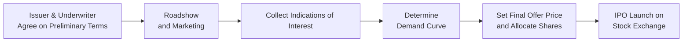

Introduction  
Sometimes folks see the term IPO—Initial Public Offering—and get a little wide-eyed: “What exactly goes on behind closed doors before those shares show up on the market?” Well, I used to wonder the same thing back in my early days at a boutique investment bank. There’s actually a big process that underpins the entire show. In this section, we’ll dive into the key methods used for pricing an IPO, take a thorough look at the famous (and sometimes infamous) “bookbuilding” process, and explore why underpricing can be both a boon and a frustration for different players in the market. This is relevant for investors, underwriters, and even regulators eager to make sure the equity markets remain fair and efficient.

Overview of IPO Pricing Methods  
IPOs can be facilitated by underwriters using different legal and financial arrangements. In a nutshell, the underwriter is the financial institution (or syndicate of institutions) that helps a private company go public. Let’s check out the primary ways IPOs get priced and sold:

• Bookbuilding:  
  This is the most common IPO pricing practice globally. Underwriters reach out to institutional investors—like big mutual funds or hedge funds—to gauge how many shares they’re willing to buy and at what price. We call these “indications of interest,” and they’re non-binding preferences that help the underwriter figure out the level of demand. Based on the aggregated demand, a final offer price is set.  

• Firm Commitment:  
  The underwriter guarantees a certain amount of capital to the issuer by purchasing all the shares upfront at a discount, then reselling them to the public. Typically, if investors are eager, the underwriter has an easy time flipping the shares for a profit. But if demand turns out to be weak, well, the underwriter is on the hook for those shares.  

• Best Efforts:  
  This approach means the underwriter tries to sell as many shares as possible at the best possible price—but doesn’t guarantee the entire amount will be sold. In a sense, the issuer takes on more risk in a best-efforts arrangement. This method is more common with smaller, riskier offerings, or in markets that are less liquid or less stable.

The Bookbuilding Process in Detail  
One of my favorite parts of working on an IPO was the so-called “roadshow.” It’s basically a traveling sales pitch: the executives of the issuing company (plus a few key underwriter folks) visit high-profile institutional investors, giving presentations and answering tough questions about the company’s strategy, financials, and prospects. The logic is: if you want big players to commit capital, you first have to give them the inside scoop—within legal disclosures, of course.

Here’s a simplified representation of the bookbuilding process:

• Roadshow and Marketing  
  The underwriters organize a series of presentations—both physical events and online sessions—to pitch the offering. These are short but intense periods, often one to two weeks, where the underwriter tries to gauge investor interest.  

• Collecting Indications of Interest  
  Potential investors (typically large institutions) share how many shares they’d be willing to buy and at what price. These indications are vital for the underwriter to map out the demand schedule.  

• Determining the Demand Curve  
  After collecting bids, underwriters figure out how many shares the market wants at different price points. This is sometimes referred to as the “book of demand.”  

• Setting the Final Offer Price  
  The underwriter and issuer’s management then negotiate the final price (and total shares to be sold). They want a price that will help the issuer raise sufficient capital without scaring away prospective buyers.  

• Allocation of Shares  
  Shares are allocated first to institutional players based on the interest they conveyed, and then the leftover allotment (if any) heads to smaller investors, including retail. A well-connected or favored institution might get more shares, especially if it’s typically a loyal participant in IPOs.  

Underpricing Phenomenon  
Have you seen an IPO’s stock pop like 20% or 30% on day one? This price jump can produce both excitement and heartbreak. On the one hand, it’s thrilling if you’re an investor who got in at the offering price. But the issuer might realize it has “left money on the table”—if the offer price was, say, $20, and the stock closed at $26 on day one, that’s a 30% pop. Potentially, the company could have earned another $6 per share sold if it had set a higher offer price. Why does this happen?  

• Demand Uncertainty:  
  Underpricing can be a strategic move to ensure plenty of buyer interest, even if the market environment is a bit shaky. It reduces the risk of a “failed IPO.”  

• Compensation for Information:  
  Large institutional investors often share valuable intelligence during bookbuilding. Some folks argue that underpricing is the underwriter’s way of rewarding these investors for honest feedback (and also for participating in future deals).  

• Marketing Hype:  
  The “pop” in the share price fuels news headlines, can generate buzz, and signals a “successful” IPO to the market—even though it might leave potential capital on the table from the issuer’s perspective.

Underwriter Arrangements and Their Consequences  
Between firm commitment and best efforts, the risk distribution changes significantly. In a firm-commitment IPO, the underwriter is highly motivated to place shares at an acceptable price (because it has already purchased them). In a best-efforts scenario, the underwriter is more of a pure broker, trying to match demand and supply without guaranteeing the proceeds. Sometimes, you may also see “all-or-none” underwritings, where the entire offering is canceled if the underwriter can’t place all the shares.  

In addition, underwriters have some additional tools in their kit:  

• Over-Allotment (Greenshoe) Option  
  Often, the underwriter is given an option to issue more shares (usually up to 15% more) if the demand is overwhelming. This helps stabilize the post-IPO share price by providing extra supply if the shares are in high demand.  

• Lock-Up Period  
  Early investors—like founders, management, and venture capitalists—are often subject to contractual or legal agreements preventing them from selling any shares for a specified window (commonly 90 to 180 days post-IPO). This reduces the risk of a sell-off that could flood the market with shares and tank the stock price.  

Practical Example of Underpricing  
Let’s say Company X is planning an IPO. The underwriters, after a busy roadshow, figure out the market is willing to purchase about 10 million shares if priced around $30 each. The final settlement is 10 million shares at $28, though. Why the $2 difference? Maybe the underwriters want to make sure the deal goes off without a hitch—or they’ve gleaned from the roadshow that the real price is in the mid-$20s rather than $30. Well, if the stock opens at $32 on day one and closes at $35, that’s a hefty “pop” for initial buyers of the IPO. It also means the company might have missed out on raising additional capital if it had priced at $35.  

Potential Pitfalls and Risks  

• Overpricing  
  If the company and its bankers get a bit too bullish and price too high, there’s a risk the IPO might partially fail or see weak day-one trading, harming the issuer’s reputation.  

• Misreading Institutional Demand  
  Indications of interest are non-binding, so institutions can change their mind if market conditions turn volatile.  

• Regulatory Hurdles  
  Regulators keep a close eye on the bookbuilding process to ensure it’s fair and doesn’t violate securities laws—particularly around insider information and market manipulation. Underwriters must follow guidelines under frameworks like Regulation M in the U.S. or equivalent rules in other jurisdictions.  

• Conflicts of Interest  
  An underwriter might be tempted to underprice an IPO if it wants to ensure future business from the same institutional clients who get those cheap shares. This dynamic has been a matter of scrutiny over the years.  

Implications for Portfolio Managers and Investors  
From a portfolio management standpoint, participating in an IPO can be a strategic way to gain early exposure to a promising company. But it’s also risky because of pricing uncertainty. For passive managers or those restricted to broad index replication, investing in IPOs typically isn’t top priority—there’s limited historical data, no track record in the public market, and often lock-up constraints. For active managers, an IPO can represent an alpha opportunity, especially if there’s a chance to capture that first-day or first-week surge in price. Because supply and demand can be quite volatile in the early days, advanced risk management is essential—especially for large institutional players.  

Connecting the Dots with the CFA Curriculum  
If you recall from earlier or subsequent sections—like “2.3 Margin Trading and Short Selling” or “2.5 High-Frequency Trading and Market Liquidity”—IPO pricing is yet another mechanism that shapes the dynamics of market liquidity and the overall structure of equity trading. Understanding how IPO pricing affects the broader capital market helps you see how new equity issuance ties into everything else: market stability, investor sentiment, and corporate capital structures.

Exam Tips and Strategies  
• In essay-type exam questions (constructed response), you may be asked how the bookbuilding process aids in price discovery, or you might analyze a scenario of underpricing and its cost to the issuer.  
• Be sure to articulate the difference between firm-commitment and best-efforts underwriting in any item set question. This difference often drives who bears the majority of the IPO risk.  
• Pay attention to how lock-up periods can affect supply and demand dynamics several months after the IPO.  
• The phenomenon of underpricing could be tested both qualitatively (i.e., conceptual reasons why it occurs) and quantitatively (i.e., calculating potential “money left on the table”).  

Glossary  
• Underpricing: The difference between the IPO offer price and the higher price often realized when trading starts.  
• Indications of Interest: Non-binding expressions by investors of how many shares they might purchase and at what price.  
• Lock-Up Period: The timeframe post-IPO during which insiders and early investors cannot sell their shares.  
• Roadshow: A series of presentations by the prospective issuer and underwriters designed to market the IPO to potential investors.  

References and Further Reading  
• Ritter, J. “Some Factoids About the 2020 IPO Market.” http://bear.warrington.ufl.edu/ritter/  
• Rosenbaum, J., & Pearl, J. “Investment Banking: Valuation, Leveraged Buyouts, and Mergers & Acquisitions.” Wiley.  
• CFA Institute. (Current Year). “Corporate Finance” in CFA Program Curriculum.  

• IFRS and US GAAP guidelines on disclosure requirements for equity issues (consult official reporting standards).  

Now that we’ve explored the behind-the-scenes action of going public, let’s test how well you’ve grasped the concepts—and their application—in the real world. As you work through the practice questions, keep an eye out for subtle distinctions and common pitfalls, exactly like you might face in a Level III exam scenario.

## Test Your Knowledge: IPO Pricing and Bookbuilding



### Which of the following best describes “bookbuilding” in an IPO process?

- [ ] A method where no underwriter is involved and the issuer sells directly to individuals.  
- [ ] A process to register the IPO with regulatory authorities.  
- [x] A process underwriters use to gather investor indications of interest and assess demand before setting an offer price.  
- [ ] A purely mechanical method for establishing a stock’s opening price on the first day of trading.  

> **Explanation:** Bookbuilding is the underwriter’s process of collecting non-binding bids from investors and using these to gauge overall demand and set the IPO offer price.

### In a firm-commitment underwriting arrangement, who bears the most risk of the IPO not selling well?

- [x] The underwriter, because it purchases all shares and resells them.  
- [ ] The institutional investors, who commit to purchasing under all conditions.  
- [ ] The retail investors, who receive leftover shares.  
- [ ] The issuer, because they agree to reimburse the underwriter’s losses.  

> **Explanation:** In a firm commitment, the underwriter buys all IPO shares and then must resell them. If demand is weak, the underwriter suffers the losses.

### Why might underpricing occur in an IPO?

- [x] To incentivize investors to participate and ensure the offering’s success.  
- [ ] To maximize capital raised for the issuer.  
- [ ] To mitigate lock-up period restrictions for insiders.  
- [ ] Because institutional investors prefer a stable, zero-day price.  

> **Explanation:** Underpricing often occurs when underwriters want to create a strong incentive for investors to buy shares, ensuring robust demand and a “successful” IPO launch.

### Which of the following best describes the lock-up period in an IPO?

- [ ] A time when underwriters finalize legal documents.  
- [ ] A period during which underwriters can allocate shares to retail investors.  
- [x] A specified duration during which insiders and early investors are prohibited from selling their IPO shares.  
- [ ] A technique used to set the offer price lower.  

> **Explanation:** The lock-up period prevents insiders from flooding the market with shares right after the IPO, thereby helping stabilize the post-IPO share price.

### What is the primary goal of a roadshow?

- [x] To market the IPO to potential investors and gather feedback on share price and demand.  
- [ ] To track the performance of the IPO after it lists.  
- [x] To allow underwriters to establish relationships with institutional investors.  
- [ ] To help regulators audit the company’s financial statements.  

> **Explanation:** The roadshow is part of the IPO marketing process, where the firm’s management and underwriters pitch the deal to large potential investors, gathering feedback on pricing and demand.

### In a best-efforts underwriting, what obligation does the underwriter have?

- [x] To sell as many shares as possible but with no guarantee of selling them all.  
- [ ] To purchase any unsold shares at a pre-determined price.  
- [ ] To reimburse the issuer for any shortfall in capital raised.  
- [ ] To actively trade shares post-IPO to stabilize the price.  

> **Explanation:** In a best-efforts contract, the underwriter tries to sell on behalf of the issuer but is not obliged to buy any unsold shares.

### Which statement about underpricing benefits is most accurate?

- [x] It can reduce the risk of IPO failure by encouraging investor participation.  
- [ ] It always guarantees a higher total capital raise for the issuer.  
- [x] It ensures insiders can sell their shares immediately at a profit.  
- [ ] It discourages institutional investors from participating.  

> **Explanation:** Underpricing encourages demand and helps reduce the risk of a failed offering, though it can also lead to less capital being raised for the issuer.

### What is one potential reason underwriters might want to underprice an IPO?

- [ ] To reflect the exact fair value of the company.  
- [ ] To comply with international accounting standards.  
- [ ] To prevent the shares from being oversubscribed.  
- [x] To reward large investors for sharing valuable information during bookbuilding.  

> **Explanation:** Some argue that underpricing is a reward mechanism, compensating large investors for truthful and helpful demand information.

### Which of the following is a step in the bookbuilding process?

- [x] Collecting non-binding bids from interested investors.  
- [ ] Managing lock-up periods for 12 months.  
- [ ] Auctioning shares to the highest bidder only.  
- [ ] Setting the final price before speaking to any investors.  

> **Explanation:** Bookbuilding involves gathering bids (indications of interest) before determining the final offer price, ensuring an informed pricing decision based on market feedback.

### True or False: Underpricing an IPO can be seen as leaving “money on the table” for the issuer.

- [x] True  
- [ ] False  

> **Explanation:** Underpricing often causes the stock to trade higher on the first day, meaning the issuer could have potentially sold shares at a higher price and raised more capital.


