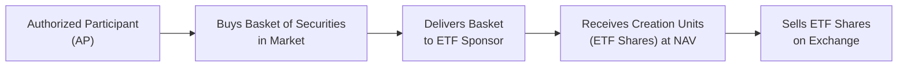
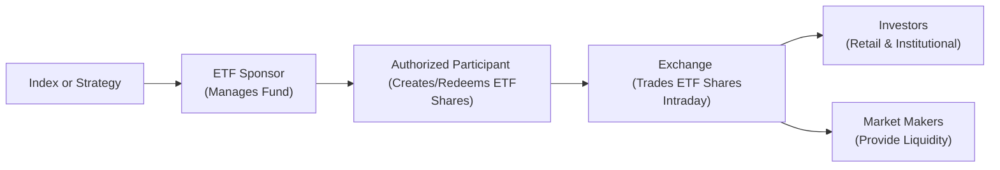

## Introduction
Exchange-Traded Funds (ETFs) can be a bit of a visionary concept for anyone first encountering them. I remember the first time I added an ETF to my personal portfolio: I was excited to get immediate diversification across dozens—if not hundreds—of individual securities, bundled into a single, tradeable share. At their core, ETFs are funds that hold a basket of underlying assets (such as stocks, bonds, or commodities) while trading on an exchange like an individual stock. This unique structure combines the diversification typically associated with mutual funds with the convenience of intraday trading. Let’s walk through the essentials, from how ETFs are created and redeemed all the way to their structural variations and key risk factors.

## ETF Basics
An ETF is essentially a pooled investment vehicle. You can think of it like a “basket” of securities that often tracks an index (e.g., the S&P 500) or follows a particular strategy (such as sector exposure, factor investing, or thematic themes like clean energy). Each share of the ETF represents an ownership interest in that basket.

• Intraday Trading: Because ETFs are listed on stock exchanges, you can buy or sell them throughout the trading day at market prices.  
• Typically Low Expense Ratios: Many ETFs track well-known market benchmarks “passively,” meaning there is no (or limited) active security selection. This passive approach typically keeps costs down, often lower than actively managed mutual funds.  
• Diversification: ETFs allow broad exposure to certain asset classes—or even entire markets—through a single share property.

## ETF Creation and Redemption
One of the most special features of ETFs is the creation/redemption mechanism that helps keep their market prices closely aligned with their Net Asset Value (NAV). Here’s a quick story: I once noticed an ETF that appeared to be trading at a slight premium to its NAV, and I overheard a market maker say, “Don’t worry; the authorized participants will straighten that out.” That’s precisely the point: large institutional players, known as authorized participants (APs), have the ability to create or redeem ETF shares in large batches called “creation units.” They deliver (or receive) an in-kind basket of the underlying securities to (or from) the ETF provider, receiving in exchange (or surrendering) newly formed ETF shares.

### How the Mechanism Works
1. Suppose the ETF shares are trading at a market price above their NAV.  
2. An authorized participant will buy the underlying securities in the correct proportion from the open market.  
3. The AP then delivers these securities to the ETF sponsor in exchange for creation units (blocks of ETF shares).  
4. Because the AP obtains these ETF shares at NAV (plus a nominal transaction fee) and can then sell them in the market at the higher market price, there’s an arbitrage profit.  
5. This buying and selling action in turn pushes the ETF’s market price back toward its NAV.

Likewise, if ETF shares are trading below NAV:

1. The AP will buy ETF shares on the open market.  
2. The AP redeems those shares with the ETF provider for the underlying securities.  
3. The AP can then sell those securities on the market, profiting from the difference.  
4. This process pulls the ETF’s market price back upward toward its NAV.

In short, any significant premium or discount to NAV is rapidly corrected by these AP-driven arbitrage trades. This keeps ETFs priced “fairly” most of the time (barring extreme market disruptions).

Below is a simple flow diagram depicting the creation side of the process:

## Physical vs. Synthetic Replication
In replicating a given benchmark or strategy, two general methods exist:

• Physical Replication: The ETF actually buys and holds the underlying securities in essentially the same proportions as the index it tracks. For instance, a physically replicating S&P 500 ETF would hold all (or a representative sample of) the companies in the S&P 500 Index.  
• Synthetic Replication: Instead of buying all the underlying assets, the ETF enters into derivatives contracts (such as total return swaps) with counterparties (often large financial institutions). The counterparty agrees to pay the ETF the return of the targeted index, and the ETF often posts collateral and pays a fee or receives a yield depending on the contract specifics.

### Why Synthetic?  
Synthetic replication can reduce some transaction costs, especially when replicating thinly traded or hard-to-access markets (like certain emerging/frontier markets or specialized commodities). However, synthetic ETFs introduce counterparty risk—if the derivative counterparty defaults, the ETF may not receive the promised index return.

## Advantages of ETFs
ETFs rock, if you ask me. They’re popular with institutional and retail investors for a handful of good reasons:

• Tax Efficiency: In many jurisdictions, the in-kind creation/redemption process helps keep capital gains distributions low.  
• Liquidity: ETFs trade intraday, and major ETF markets often have high trading volumes—though this liquidity also hinges on the underlying assets.  
• Diversification: Even a single share of a broad-based ETF can provide exposure to hundreds of companies or multiple asset classes.  
• Transparency: Most ETFs publish their holdings daily, so you always know what you’re getting.  
• Lower Expense Ratios: ETFs tracking broad indexes typically charge well below 1% annually, often just a few basis points. This can be especially cost-effective for long-term investors.

## Risks Associated with ETFs
While there are many benefits, you should also keep an eye on potential pitfalls:

• Tracking Error: Even passively managed ETFs sometimes deviate from the performance of their benchmarks due to expenses, rebalancing frequencies, sampling techniques, or transaction costs.  
• Market Risk: If the underlying securities decline, the ETF’s value generally goes down. The fancy structure doesn’t eliminate plain old market risk!  
• Liquidity Risk: The market for some specialized ETFs (particularly in niche sectors) may not be highly liquid. Also, if the underlying assets are illiquid, large trades might widen bid-ask spreads.  
• Synthetic ETFs and Counterparty Risk: If the swap counterparty or derivative sponsor fails to pay, the ETF could incur losses.  
• Operational Risk: Mechanisms can break down in extreme market conditions; mispricing can occur if authorized participants step away, as sometimes happens during major market stress.

## ETF Glossary
• Net Asset Value (NAV): The total value of the ETF’s assets minus its liabilities, divided by the shares outstanding.  
• Authorized Participant (AP): Large institutional player or market maker able to exchange baskets of the underlying securities for creation units of the ETF.  
• Creation Unit: A large block of ETF shares (often 50,000 shares or more) that an AP creates or redeems at once.  
• Tracking Error: The difference between the ETF’s return and that of its benchmark.  
• Passive Management: Using an index-based or rules-based approach to replication rather than relying on active judgment.

## Practical Example
Let’s say the “Fictitious Growth 500” Index sits at 2,000. The corresponding “FG500 ETF” trades at $100 per share. If strong demand among retail investors pushes the ETF’s price to $102 (creating a premium), an authorized participant would spot the arbitrage opportunity. The AP goes out and acquires the underlying securities that match the FG500 index weighting. They “trade in” those securities to the FG500 ETF sponsor and receive new creation units—each share effectively worth the $100 NAV. The AP can then sell those shares in the market at $102, pocketing (minus fees and transaction costs) roughly $2 per share. This selling pressure on the ETF ultimately pushes the price closer to $100, while the AP’s purchase of the underlying securities supports the underlying prices. Equilibrium is restored.  

## Best Practices and Common Pitfalls
• Monitor Premiums/Discounts: If an ETF is parading a big divergence from its NAV, ask why. Low liquidity or market disruptions might be the culprit.  
• Understand Replication Method: Synthetic ETFs can be cheaper or easier to manage in certain markets, but they carry that extra counterparty risk.  
• Be Aware of Tax Nuances: Even though ETFs are broadly considered tax-efficient, regional regulations differ, so be mindful of how capital gain distributions and withholding taxes might apply.  
• Diversify Appropriately: Overconcentration in a single ETF—even if that ETF is “broad-based”—may not meet your portfolio’s unique risk-return profile.

## Diagram: Overview of ETF Structure
Here’s a simplified flowchart showing how the overall ETF ecosystem might look:

1. The ETF sponsor designs or licenses an index (A) or invests along a particular strategy.  
2. The authorized participant (C) deals directly with the sponsor (B) to create or redeem ETF shares in large blocks.  
3. The shares then trade on an exchange (D), where investors (E) and market makers (F) transact throughout the day.

## Exam Relevance and Real-World Considerations
For the CFA exam, consider how ETF structures can appear in item-set and scenario-based questions:

• You may be asked to evaluate whether an investor is best served by a physically replicating ETF or a synthetic ETF.  
• You might see questions calculating or discussing tracking error, or analyzing how arbitrage leads an ETF’s price back to its NAV.  
• Ethics and professional standards could arise in the context of recommending suitable funds, ensuring fair treatment of clients, or explaining the structural risks inherent in synthetic products.

In practice, too, portfolio managers might use ETFs not only for core market exposure but also for tactical plays—like rotating into a specific sector or hedging with an inverse or leveraged ETF (though those come with additional risks and complexities).

## References and Further Reading
• BlackRock iShares Education Center: [https://www.ishares.com](https://www.ishares.com)  
• CFA Institute (Current Year). “Portfolio Management” in CFA Program Curriculum.  
• Fuhr, D. “ETFs and Indexing.” Journal of Index Investing.  
• CFA Institute Code of Ethics & Standards of Professional Conduct.

## Test Your Knowledge: Exchange-Traded Funds (ETFs) Quiz



### Which of the following best describes the mechanism that helps keep an ETF’s market price close to its NAV?

- [ ] The ETF sponsor issues shares daily to retail investors at the previous day’s close.  
- [x] Authorized participants create or redeem large blocks of shares through in-kind transactions that facilitate arbitrage.  
- [ ] The fund uses a central exchange to automatically adjust its price.  
- [ ] A high-frequency trading algorithm directly controls the ETF’s NAV.  

> **Explanation:** ETFs rely on authorized participants (APs) to create and redeem shares in large blocks. These APs can exploit pricing discrepancies between the ETF and its underlying assets, arbitraging away premiums or discounts to NAV.

### An ETF that replicates an index by holding exactly the same stocks in the same proportions is referred to as:

- [x] A physically replicating ETF.  
- [ ] A synthetic ETF.  
- [ ] A leveraged ETF.  
- [ ] An inverse ETF.  

> **Explanation:** Physical replication means the ETF holds the actual underlying assets in line with the benchmark index. Synthetic ETFs use swaps or derivatives.

### When an ETF trades at a discount to its NAV, the arbitrage mechanism generally works by:

- [x] Authorized participants buying ETF shares in the market, redeeming them for the underlying securities, and selling those securities.  
- [ ] ETF shareholders petitioning the fund sponsor to boost the NAV.  
- [ ] Delisting the ETF until the market price rises.  
- [ ] Stopping creation units until the discount disappears.  

> **Explanation:** By purchasing the discounted ETF shares on the open market and redeeming them for the underlying securities, the AP profits, thus pushing the ETF’s price back toward NAV.

### Which of the following is most likely to create counterparty risk in an ETF?

- [ ] Physical replication.  
- [ ] A wide bid-ask spread.  
- [x] Synthetic replication.  
- [ ] Tracking error.  

> **Explanation:** Synthetic ETFs rely on derivative contracts. Any default or failure of the swap counterparty can expose the ETF to loss.

### Which factor typically contributes to lower capital gains distributions in ETFs relative to some traditional mutual funds?

- [x] The in-kind creation/redemption process.  
- [ ] Higher turnover within the ETF.  
- [ ] Enforcement of daily settlement on all trades.  
- [ ] The standardization of all ETFs globally.  

> **Explanation:** The in-kind transfer of securities among authorized participants, rather than cash transactions, helps reduce the need to sell securities and realize taxable gains.

### What is the primary role of an authorized participant?

- [ ] To hold ETF shares for long-term capital appreciation.  
- [ ] To actively manage the ETF’s portfolio.  
- [x] To create and redeem ETF shares and help maintain price alignment with NAV.  
- [ ] To conduct all trading on behalf of retail investors.  

> **Explanation:** APs engage in the creation and redemption process, thus facilitating arbitrage between the ETF’s market price and its NAV.

### If an ETF sponsor chooses not to hold all the underlying stocks in the benchmark and instead holds only a representative sample, this is known as:

- [ ] Synthetic replication.  
- [ ] Sector rotation.  
- [x] Sampling.  
- [ ] Momentum weighting.  

> **Explanation:** Sampling (or stratified sampling) is used to approximate the performance of the benchmark when full replication might be too costly or impractical.

### In times of severe market stress, premiums or discounts on ETFs can widen significantly. One of the main reasons for this is:

- [x] Authorized participants may temporarily stop creating or redeeming shares.  
- [ ] Regulators force all ETFs to increase trading hours.  
- [ ] Stock exchanges suspend price reporting.  
- [ ] Increasing the number of creation units solves the issue.  

> **Explanation:** If APs step away due to volatility, full arbitrage may not happen, causing ETF prices to deviate more from NAV.

### Which of the following best characterizes tracking error?

- [x] The divergence between the ETF’s performance and the linked index.  
- [ ] The difference between the ETF’s premium and discount.  
- [ ] A measure of the fund’s performance over a single day.  
- [ ] The direct cost an ETF pays to the index sponsor.  

> **Explanation:** Tracking error captures how closely an ETF follows its benchmark. It can be caused by fund expenses, sampling methods, or other operational considerations.

### True or False: Leveraged ETFs carry no additional risks beyond those found in traditional broad-based ETFs.

- [x] True  
- [ ] False  

> **Explanation:** This is intentionally tricky. Actually, the statement is false: Leveraged ETFs do carry additional risks, including daily rebalancing risk and higher turnover, which can increase volatility and tracking error. The correct statement is that leveraged ETFs do introduce additional risks compared to standard ETFs.  

  
