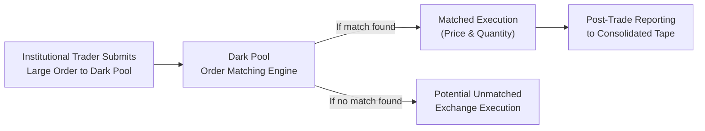

## Introduction
I remember one of my early days on a trading desk, sipping a lukewarm coffee and watching large block orders magically materialize after-hours—almost as if whole trades were happening off in a corner that only a select few knew about. I was both fascinated and slightly confused: Where did all these big orders come from, and why weren’t they clamoring for center stage on the main exchange? Well, turns out, these block orders often get executed quietly in so-called dark pools or on alternative trading systems (ATS). Perhaps you’ve heard about them in passing or read about them in a financial headline. They’re private, they’re hush-hush, and they’re crucial for traders who want to avoid telegraphing their moves to the broader market.

In this article, we’ll explore how these sometimes-shadowy venues function, why they exist, and what controversies swirl around them. While it might seem mysterious, dark pools are simply another mechanism in our ever-evolving market structure. After reading this, you’ll have a pretty good idea why institutional investors turn to them and how regulators keep a watchful eye on these private playgrounds.

## Core Concepts of Dark Pools
Dark pools are, in the simplest sense, private electronic trading venues that allow market participants to execute large trades away from the prying eyes of the public order book. Unlike traditional exchanges where orders are displayed, dark pools keep transaction details (prices, volumes, participants) hidden until after trades are executed. This anonymity is a big deal, especially for institutional investors who fear that tipping off the rest of the market will move prices before they can complete their trades.

• Minimizing Market Impact: Imagine you have to buy a million shares in a somewhat thinly traded stock. If you place that massive order on a public exchange, you risk pushing the stock price up just by showing the big demand. Dark pools shield the identity and size of your order, helping you get a better (or at least more predictable) average price.  
• Reduced Spy Effect: For large traders, showing one’s hand can invite front-running or other predatory behaviors. Dark pools aim to minimize that.  
• Anonymous Matching: The matching is typically done on a price derived from the national best bid and offer (NBBO) or another reference price, which effectively ensures trades are executed at fair market levels but with minimal market disturbance.

### Benefits of Dark Pools
1. Anonymity: Orders remain undisclosed until after the transaction is complete.  
2. Reduced Market Impact: Large orders often avoid “slippage” that might occur on open exchanges.  
3. Potential Price Improvements: Some dark pools offer trades at the midpoint of the NBBO, allowing participants a slight price advantage (known as midpoint pricing).

### Limitations and Risks
1. Reduced Transparency: Critics argue that if too much volume migrates to dark pools, price discovery on lit (i.e., fully transparent) venues might degrade.  
2. Potential Conflicts of Interest: In some cases, dark pool operators (like broker-dealers) may match client orders internally, which raises the question of whether they always seek best execution.  
3. Fragmented Liquidity: With multiple dark pools, the overall liquidity can become scattered, potentially complicating the search for best price.

## Alternative Trading Systems
Alternative Trading Systems (ATS) is a broader category of off-exchange platforms that includes dark pools. ATS are generally regulated differently from traditional exchanges but must still adhere to certain guidelines (like fair access and best execution) depending on the jurisdiction. If you think about it, an ATS is any venue that isn’t a formal exchange yet brings buyers and sellers together.

• Reduced Costs and Flexibility: Many ATS have built a reputation for lower transaction fees than major exchanges. They also often provide specialized matching algorithms.  
• Diverse Participants: ATS can serve high-frequency traders, institutional block traders, or even retail investors via electronic communication networks (ECNs).  
• Customized Features: Some ATS are built around crossing networks—venues that match buy and sell orders at a reference price (e.g., the midpoint of the public market quote). Others might focus on speed, anonymity, or specific asset classes.

## Types of ATS
It’s helpful to break ATS down into a few subcategories. While not every venue fits neatly into a single box, these distinctions can provide a mental map.

### Crossing Networks
A crossing network typically receives orders from institutional clients and then matches them at a set reference price (often the midpoint of the NBBO). By matching these orders internally, crossing networks can often reduce transaction costs as well as market impact since the trades do not appear in the lit order book. It’s kind of like a members-only club where trades quietly cross at fair prices, with minimal fanfare.

### Electronic Communication Networks (ECNs)
ECNs are electronic matching systems that typically display orders to their participants and match trades automatically. They cater to multiple participants, from institutions to day traders, and can offer a continuous market. Some well-known trading platforms in the past started as ECNs and then transformed into recognized exchanges. ECNs are also lauded for their speed and transparency relative to dark pools, but they remain outside the scope of a “traditional” stock exchange.

### Dark Pools
Dark pools are often organized either as broker-dealer-owned or agency broker-sponsored venues. They can be considered a subset of ATS specifically designed for large or anonymous trading. While crossing networks might also be “dark” in the sense that orders aren’t widely displayed, the term “dark pool” typically implies a higher degree of opacity and an explicit focus on large order execution.

## Mermaid Diagram: Trade Execution in a Dark Pool

Below is a simplified diagram depicting the trade initiation and execution flow in a dark pool setting versus a traditional exchange. Orders remain hidden from the public order book until a match is found.

The steps are:
1. An institutional trader sends a large buy or sell order to the dark pool.  
2. The dark pool’s internal matching engine looks for a corresponding sell or buy order.  
3. If a match occurs, the trade is executed at a reference price, and the details remain hidden until a post-trade report is filed.  
4. If no match is found, the order might be partially or wholly routed out to a public exchange (or another venue) to be executed there.

## Controversies and Regulatory Concerns
Anyways, while dark pools and other ATS can be a boon for reducing market impact costs, they’ve been quite controversial. Regulators worry that if significant order flow shifts off-exchange, the overall price discovery mechanism can suffer.

• Limited Transparency: When large volumes are traded in darkness, the public doesn’t see those trades immediately, which can lead to inaccurate assumptions about supply and demand in the broader market.  
• Conflicts of Interest: Some dark pools are run by broker-dealers who also execute trades for retail clients on other platforms. Critics question whether all clients get truly optimal prices.  
• Regulatory Response: In many jurisdictions, regulators have increased disclosure requirements for dark pools. Some have introduced thresholds for how much volume a dark pool can handle before it must adhere to exchange-like transparency rules.

### Fair Access
Fair access generally means that if an ATS or dark pool is of a certain scale, it can’t discriminate among participants. However, critics say that some dark pools favor liquidity-providing high-frequency traders or can exclude slower, smaller institutions.

### Monitoring and Oversight
Regulators mandate that dark pools provide detailed transaction data to oversight bodies. The goal is to detect manipulative or abusive behavior (like layering, spoofing, or front-running). That said, the complexity of these off-exchange venues is a challenge for surveillance.

## Practical Examples and Case Studies
• Case of Large Pension Fund Trades: Imagine a large pension fund wanting to offload a substantial number of shares in a mid-cap security. Instead of tipping the entire market, the fund manager routes the order to a dark pool where the order is matched with one or several interested counterparties at the midpoint price. The general market remains somewhat unaware until the trade is printed.  
• Case of Broker-Dealer Conflicts: In some historical controversies, broker-dealers operated internal dark pools and allegedly routed retail orders there for internal matching. In certain situations, they might have favored the dealer’s proprietary trading desk over best execution for clients. Lawsuits often revolve around how transparent these dark pool operators were about such conflicts.

## Potential Impact on Investors and the Market
It’s not just big institutional players who feel the effects of dark pools; smaller investors are also indirectly impacted.

• Price Discovery: Let’s say a significant portion of daily volume in a stock is executed on dark pools. The official last price on the exchange might no longer reflect the full demand or supply, which can introduce slight inefficiencies for anyone referencing that price.  
• Execution Quality: Retail investors typically rely on broker-dealers’ best execution obligation. If brokers use dark pools effectively, they may deliver price improvements; if not, the retail investor might unknowingly be at a disadvantage.  
• Liquidity Considerations: Multiple dark pools can fragment liquidity, making it trickier for a large investor to find a single, reliable source for big trades.

## Best Practices and Strategies
• Conduct Thorough Venue Analysis: Market participants should evaluate which dark pools or ATS best suit their strategy, focusing on fill rates, price improvement potential, and overall reliability.  
• Regulatory Compliance: Firms operating or routing to these platforms must remain vigilant about local regulations—including fair access and best execution.  
• Ethical Considerations: The CFA Institute Code of Ethics emphasizes transparency and fairness. While dark pools are legal, investment professionals must ensure they’re used in a manner consistent with client interests and market integrity.

## Exam Relevance and Tips for CFA Candidates
At the CFA Level I, you’ll likely encounter questions about different market structures, order types, and the functions of dark pools and ATS. While the details can appear in item sets involving equity investments, you might also see them pop up in ethics or regulatory questions. The key points to remember:

• Know the distinctions between dark pools, ECNs, and crossing networks.  
• Understand how dark pools reduce market impact but can hamper price discovery.  
• Be aware of controversies, such as conflicts of interest and regulatory pushback.  
• Identify conditions under which a trade might be routed to a dark pool versus a public exchange.  
• Learn how usage of dark pools can affect liquidity, volatility, and investor confidence in the broader market.

### Common Pitfalls
• Mistaking ATS in general for dark pools: A dark pool is a subset, but not the only type of ATS.  
• Oversimplifying the benefits: Yes, anonymity is an advantage, but it’s not always beneficial for overall market transparency.  
• Ignoring global variations: Regulatory approaches differ. For instance, the EU’s MiFID II includes caps on dark pool trading volumes, while in the United States, certain volume thresholds trigger additional reporting requirements.

## Conclusion
Dark pools and alternative trading systems operate in a gray area between meeting legitimate institutional needs—like reducing market impact and transaction costs—and challenging the ideals of absolute transparency and fairness in equity markets. Despite concerns, these venues play a key role in modern market structure. They serve as a reminder that financial markets are constantly evolving, balancing needs for liquidity, transparency, efficiency, and fairness.

In the end, whether you think dark pools are a modern marvel or an opaque side channel that’s messing with market clarity (or maybe a bit of both), the best approach is to understand how they function, keep an eye on regulatory developments, and stay alert to the ways these “unlit” venues could affect both your portfolio and the market as a whole.

## References and Further Reading
• CFA Institute. (Current Year). “Market Microstructure.”  
• SEC Dark Pools Overview:  
  https://www.sec.gov/spotlight/dark-pools.shtml  
• Madhavan, A. (2016). Exchange-Traded Funds and the New Dynamics of Investing. Oxford University Press.

-----

## Test Your Knowledge: Dark Pools and ATS Quiz



### 1. Which best describes a dark pool?
- [ ] A public order book with hidden volumes but visible price levels.  
- [x] A private trading venue where orders and trades are not displayed until after execution.  
- [ ] A real-time electronic crossing network that discloses all bids and offers.  
- [ ] A platform that can only be used for municipal bond trading.

> **Explanation:** Dark pools are private venues where trade details remain hidden from the public until after execution, minimizing market impact.

### 2. Which of the following is most likely a potential risk associated with dark pools?
- [ ] Lower transaction costs for smaller investors.  
- [x] Reduced price discovery due to hidden trading volumes.  
- [ ] Excess regulatory reporting requirements.  
- [ ] Enhanced lit market efficiency.

> **Explanation:** Because large volumes can be executed without public disclosure, the market loses critical information on supply and demand, impacting price discovery.

### 3. In which scenario would an institutional investor be most inclined to use a dark pool?
- [ ] To advertise intentions of a large trade and boost public liquidity.  
- [x] To execute a large order without influencing the stock price in the public market.  
- [ ] To fulfill a regulatory requirement of trading only on an exchange.  
- [ ] To allow other market participants to front-run their order.

> **Explanation:** Dark pools are particularly useful for institutional investors seeking to limit their market impact for large trades.

### 4. Which statement about alternative trading systems (ATS) is correct?
- [ ] They are legally recognized as national stock exchanges.  
- [ ] They can only trade government securities.  
- [ ] They must display full order details publicly.  
- [x] They provide a platform for trading that is not classified as a traditional exchange.

> **Explanation:** ATS are off-exchange platforms that match buyers and sellers, but they are not legally categorized as exchanges.

### 5. What best characterizes a crossing network?
- [ ] A venue that aligns orders at the midpoint of the NBBO in a single aggregated transaction.  
- [ ] A lit order book regularly updated in real-time.  
- [ ] A system that charges the highest possible fees to retail brokers.  
- [x] A system that matches participant buy and sell orders at a reference price (like the NBBO midpoint).

> **Explanation:** Crossing networks match trades internally at a predetermined reference price, minimizing market impact.

### 6. What is the main concern regulators have with heavy reliance on dark pools?
- [ ] That small retail investors cannot access them.  
- [x] That price discovery might become less efficient if too many trades occur in the dark.  
- [ ] That high transaction fees discourage participation.  
- [ ] That trading hours are too short.

> **Explanation:** Regulators worry that if large volumes trade away from public visibility, the official market price may not reflect true supply and demand, eroding price discovery.

### 7. Which of the following is NOT a typical characteristic of a dark pool?
- [x] Real-time public order book quotes.  
- [ ] Anonymity for traders.  
- [ ] Large block executions with minimal market impact.  
- [ ] Delayed trade reporting until after execution.

> **Explanation:** Dark pools conceal orders from public view, so reporting occurs after trades are executed. They do not provide real-time public quotes.

### 8. How might a dark pool operator potentially create a conflict of interest?
- [ ] By evenly matching all participant trades.  
- [ ] By providing trading data only to regulators.  
- [x] By routing orders to its own proprietary traders before matching client trades.  
- [ ] By obeying best execution rules.

> **Explanation:** If a broker-dealer-owned dark pool routes orders to the firm’s own trading desk prior to matching client orders, it creates a conflict vis-à-vis best execution.

### 9. What is a common advantage of using an ECN over a traditional exchange?
- [x] Lower transaction fees and faster execution speeds.  
- [ ] Complete anonymity of trade information.  
- [ ] Exemption from any form of regulation.  
- [ ] Restriction against any form of high-frequency trading.

> **Explanation:** ECNs often feature reduced fees compared to traditional exchanges, and they generally offer rapid electronic matching.

### 10. True or False: Dark pools are unregulated venues that can operate without oversight.
- [ ] False  
- [x] True and False (Read explanation)

> **Explanation:** This is tricky. While dark pools may not be regulated as full-fledged exchanges, they are still subject to oversight and must file reports with regulatory authorities. They operate under specific rules that differ from traditional exchange regulations, but they are not simply “unregulated” free-for-alls.


