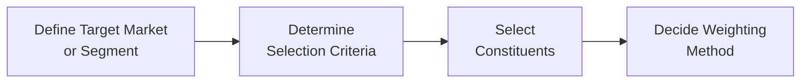
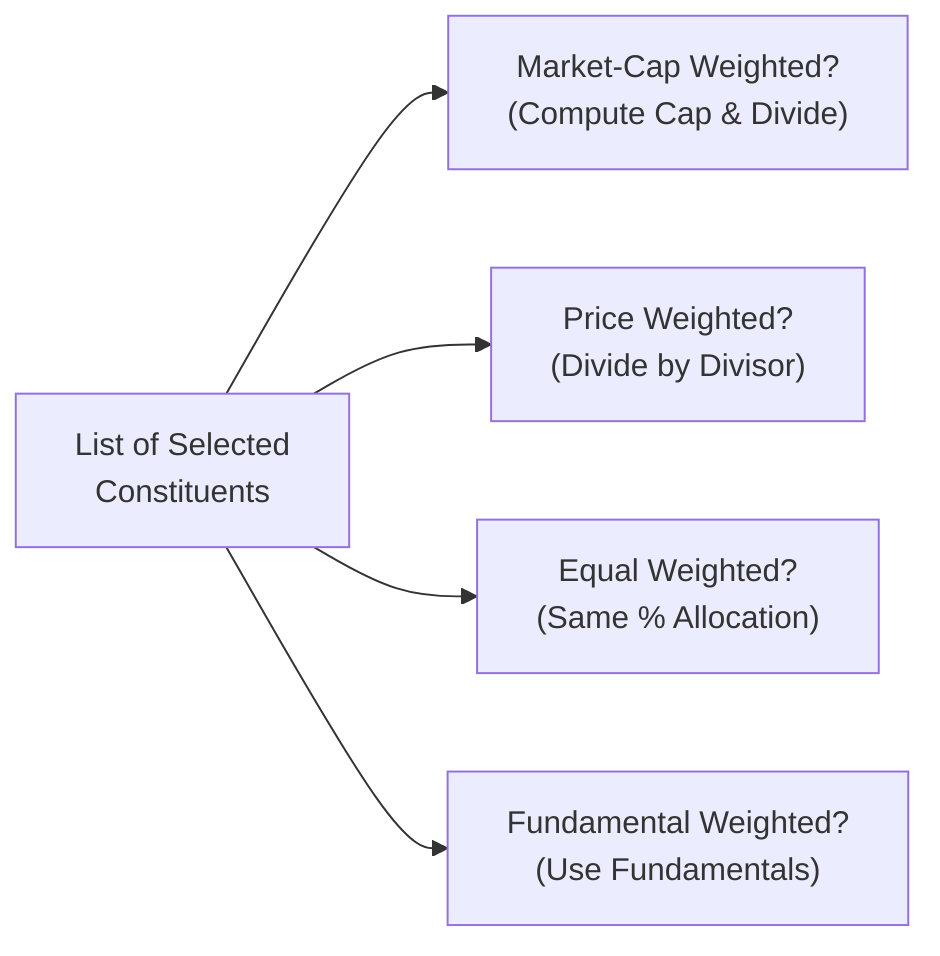

## Introduction

Let’s say you’re looking at a market benchmark—maybe the S&P 500 in the United States or the FTSE 100 in the United Kingdom—and you wonder, “What exactly makes this index tick?” We see these indexes mentioned in financial media every day, but behind the scenes, index providers must follow systematic rules to design, maintain, and rebalance these portfolios of securities. Understanding how an index is constructed, along with its weighting methodology, is crucial not only for Level I analysts tackling fundamental ideas, but also for Level III candidates who want to use these benchmarks effectively in multi-asset or active-passive portfolio management strategies.

In this article, we’ll discuss the key steps necessary to create a security market index, touch on the concept of constituents, and highlight the most common weighting schemes—market capitalization weighting, price weighting, equal weighting, and fundamental weighting. We’ll then explore the subtle distinction between price return and total return indexes, examine deeper portfolio implications, and finally, consider pitfalls that arise when implementing an index-based investment strategy. Let’s dive right in.

## The Role of Security Market Indexes in Portfolio Management

Before we dissect construction details, it’s helpful to remember why indexes matter to portfolio managers. Security market indexes:

• Provide benchmarks against which professional and private investors measure portfolio performance.  
• Act as investable products themselves (e.g., index mutual funds or ETFs) for passive investors.  
• Serve as performance proxies for entire asset classes or specific market segments (like large-cap growth or emerging markets).  
• Offer insights into market trends, volatility, and risk sentiment.

For CFA Level III candidates, using indexes goes beyond mere comparisons. You might apply an index in a strategic asset allocation context, or you may fine-tune your factor exposures by comparing your portfolio’s factor loadings to certain indexes with known biases (like a small-cap tilt in an equal-weighted index). A thorough knowledge of index construction helps ensure you’re aligning your benchmarks with your actual investment objectives.

## Steps in Index Construction

Constructing a security market index generally involves four foundational steps:

1. Defining the Target Market or Segment  
2. Determining Selection Criteria  
3. Selecting Constituents  
4. Deciding on the Weighting Method  

### Defining the Target Market or Segment

If you’re building an equity index, you must decide which part of the equity market you care about. For instance, maybe you’re focusing on large-cap U.S. equities, or you want an index that measures the performance of global technology companies. The scope can also be narrower―like an ESG-focused index or a sector-specific index (e.g., biotech).

### Determining Selection Criteria

Once the market segment is set, index providers establish criteria that securities must meet to qualify for inclusion. These criteria might represent:

• Size (market capitalization thresholds).  
• Liquidity (minimum average daily trading volume).  
• Listing or domicile requirements (e.g., only U.S.-listed stocks).  
• Sector membership or industry classification.  
• Fundamental filters such as profitability, revenue growth, or dividend policy.

### Selecting Constituents

The providers then select the specific stocks (or bonds, if it’s a fixed income index) that fulfill those criteria. Some indexes, like the S&P 500, have committees that make discretionary decisions, while others follow purely rules-based approaches (e.g., the Russell 1000). The selection also includes how many stocks make it in. For instance, the S&P 500 includes about 500 leading U.S. companies, whereas the Ftse 100 includes 100 of the largest UK-listed firms.

### Deciding on the Weighting Method

After choosing which securities to include, the index provider needs to answer: how much of each stock goes into the index? This weighting step profoundly affects the risk and return characteristics of the index. Let’s examine the main weighting methods below.

Here’s a simple diagram that summarizes index construction steps:



## Common Weighting Methods

### Market-Capitalization Weighting

Market-cap weighting is arguably the most prevalent weighting method. In capspeak:

• Each security’s weight is proportional to its market capitalization, i.e., (share price × number of shares outstanding).  
• Companies worth more in market value naturally hold a greater share of the index.  
• Movements in large-cap firms dominate index returns.

#### Why Portfolio Managers Care

Market-cap-weighted indexes are widely seen as “the market portfolio.” They can be used as broad passively managed alternatives for many asset classes (domestic, international, emerging, or sector-based). From a portfolio management perspective:

• Cap-weighted indexes tend to have lower turnover relative to other weighting schemes, which helps reduce transaction costs.  
• On the downside, a mega-cap stock can begin to outsize the entire index. For example, during certain market climates, a few technology giants can significantly influence the entire index’s performance.

#### A Small Numeric Example

Suppose an index includes three stocks with the following market caps:

Stock A: USD 50 billion  
Stock B: USD 30 billion  
Stock C: USD 20 billion  

The total market cap is USD 100 billion. The market-cap weights are:

• Stock A: 50%  
• Stock B: 30%  
• Stock C: 20%

### Price Weighting

A price-weighted index invests in proportion to each security’s share price. In other words, you hold the same number of shares of each constituent, ignoring market cap altogether. Classic example: the Dow Jones Industrial Average (DJIA).

#### Portfolio Observation

You might wonder: “Wait, a company’s share price alone doesn’t always reflect its economic size or fundamental strength.” True. Price weighting introduces certain biases:

• A stock with a high absolute price influences index performance more than a lower-priced stock, even if the lower-priced stock has a far greater market value.  
• Stock splits can have a surprising impact on weightings.  

Hence, price-weighted indexes can seem almost archaic or less representative in some modern circles. Yet they remain historically significant and widely cited by financial media.

### Equal Weighting

In an equal-weighted index, each constituent has the same percentage allocation, say 1% each if there are 100 stocks. Equal weighting:

• Ensures smaller companies have a greater relative impact than they would in a market-cap index.  
• Tends to produce a “smaller cap bias,” especially in large universes.  
• Requires frequent rebalancing to maintain equal proportions, which can lead to higher transaction costs and potential tax implications.

#### Example

Imagine an index of four stocks, each assigned a 25% weight at the start. If Stock A outperforms the rest significantly over a quarter, it might grow to 35% of the portfolio. The index sponsor must rebalance (sell some of Stock A, buy other stocks) to push each weight back to 25%.

### Fundamental Weighting

Here, weighting is based on a company’s fundamental metrics, not price alone. These metrics might be:

• Earnings  
• Dividends  
• Book value  
• Cash flow  

A fundamental-weighted index will allocate more to companies with stronger fundamental attributes. Proponents argue that fundamentals-based allocations provide a value tilt and avoid some of the overvaluation pitfalls that might come with cap-weighting. Nevertheless, from a portfolio manager’s standpoint:

• Fundamental weighting may deliver factor exposures (e.g., value factor).  
• Rebalancing can be more intensive than a pure cap-weighted index.  
• The methodology can become complex if multiple factors are used (e.g., combining earnings and book value data).

## Price Return vs. Total Return Indexes

Security market indexes are typically presented in two forms:

• Price Return: reflects only the price changes of the constituents. Dividends or other cash distributions are not considered reinvested.  
• Total Return: includes both price changes and the effect of dividends (or interest, if it’s a bond index) reinvested back into the index.

For many portfolio managers—particularly at the Level III stage—total return is a more accurate benchmark because it mirrors the real-world practice of reinvesting income. If you rely on a price return index, you might underestimate the overall performance of the market, especially for sectors that pay significant dividends.

## Implementation for Investors

When you, as a portfolio manager or analyst, decide which index to track, you want to grasp how the weighting affects both return potential and risk characteristics. Let’s quickly highlight typical uses and considerations:

• A **market-cap-weighted** index (like the S&P 500) might be a fair reflection of the “market portfolio” used in CAPM discussions.  
• A **price-weighted** index (e.g., DJIA) is more of a traditional measure, but less favored in academic circles due to inherent biases.  
• An **equal-weighted** index might appeal to an investor wanting to mitigate concentration risk in mega-cap stocks. However, it can inadvertently create small-cap tilts. It’s also more costly to replicate because of frequent rebalancing.  
• A **fundamental-weighted** index can cater to factor- or style-based investing, particularly for those leaning toward value or quality factors.  

In practice, you might hold an ETF designed to replicate these different weighting approaches or use multiple indexes to capture distinct factor exposures in a multi-asset portfolio. Index selection can also matter in liability-driven or risk parity strategies, where the weighting scheme affects your factor exposures.

## Potential Pitfalls

No weighting scheme is perfect. Some pitfalls to watch out for:

• **Concentration Risk in Market-Cap Weighted:** If the top few stocks become extremely large relative to the rest (e.g., certain technology behemoths), the index’s performance can hinge disproportionately on their fortunes.  
• **Rebalancing Costs in Equal Weighting:** If you adopt an equal-weighted approach, rebalancing can erode returns over time. High turnover can also generate short-term capital gains or friction in certain tax jurisdictions.  
• **Data Availability and Accuracy in Fundamental Weighting:** If you rely heavily on reported fundamentals, you must trust that data is timely, accurate, and consistent. Various accounting standards (IFRS vs. US GAAP) might complicate cross-border comparisons.

## In-Practice Anecdotes

Sometimes, you’ll see an index that’s soared because a handful of its largest corporate constituents soared. I remember once analyzing a client’s portfolio that tracked a market-cap-weighted technology sector index. The performance looked phenomenal when a few big tech names went on a tear. The client felt invincible—until a single earnings miss from the biggest index constituent triggered a waterfall decline. This concentration risk, while often overshadowed by strong upward moves, is a real concern for portfolio managers.

## Analyzing Index Construction for Portfolio Benchmarking

At the Level III exam, you’ll likely see scenario-based questions asking you to select an appropriate benchmark. Maybe you’re tasked with evaluating an active manager’s alpha or investigating factor tilt. Indices aren’t only about broad exposures—they can be specialized, thematic, or outcome-oriented. You should be able to:

• Dissect how an index’s weighting scheme might bias it toward or away from certain sectors, styles, or factors.  
• Distinguish between a price return vs. total return measure and how that might affect performance comparisons.  
• Recognize that rebalancing schedules differ. Some indexes rebalance monthly, others quarterly, and some only annually.

## Best Practices and Common Strategies

• **Align the Index with Investment Objectives**: For example, if you’re running a large-cap core strategy, you probably want a large-cap, market-cap-weighted index as your benchmark.  
• **Regularly Reassess**: Over time, your portfolio might evolve. If your mandate shifts toward a growth style, you might need an index more representative of growth stocks.  
• **Review Rebalancing Policies**: The frequency and method of rebalancing have cost implications and can introduce short-term tracking error.  
• **Understand Factor Exposure**: A fundamental or equal-weighted index can produce biases (like value, quality, or smaller cap). Make sure that’s consistent with your investment philosophy.

## Technical Illustration: Quick Python Snippet for Weighting

Let’s show how you might code simple weighting logic. Suppose you have a list of stock prices and shares outstanding, and you want to compute a market-cap-weighted index:

```python
import numpy as np

prices = np.array([100, 50, 25])  # example prices
shares_out = np.array([1e6, 2e6, 3e6])  # shares outstanding
mkt_caps = prices * shares_out   # compute market caps
total_mkt_cap = np.sum(mkt_caps)
weights = mkt_caps / total_mkt_cap

print("Weights: ", weights)
```

In a real portfolio management setting, you’d rebalance the portfolio’s holdings to match these weights. For advanced processes, you might incorporate fundamental data or apply rebalancing triggers if weights stray from predetermined thresholds.

## Diagram of Weighting Methods

Below is a toy flowchart to illustrate the weighting approach once constituents are chosen:



## Final Exam Tips

• **Read the Question Carefully**: Index construction scenarios can involve multiple steps. You may need to recommend one weighting method over another based on a client’s risk preference or style tilt.  
• **Recognize Index Limitations**: Know how weighting choices affect risk, turnover, and performance biases.  
• **Practice Real-World Problems**: Index-based performance measurement is central to manager selection and to analyzing active vs. passive approaches.  
• **Time Management in Essay Questions**: The exam might ask you to compare indexes or weigh pros and cons. Outline your approach quickly; then deliver concise, direct answers.  
• **Be Ready for Factor Exposures**: Fundamental or custom indexes can represent factor strategies. Understand how that might interact with the portfolio’s style or the sponsor’s constraints.

## Glossary

• **Market Capitalization**: The total market value of a company’s outstanding shares. Typically computed as Share Price × Number of Shares.  
• **Price Weighting**: An index weighting scheme giving more influence to higher-priced stocks, regardless of market cap.  
• **Equal Weighting**: All constituents receive identical percentage allocations.  
• **Fundamental Weighting**: Index weighting based on metrics like revenue, earnings, dividends, or book value.  
• **Price Return Index**: Measures only price changes in the underlying securities; excludes dividends or other distributions.  
• **Total Return Index**: Measures both price changes and the reinvestment of dividends or distributions.

## References

- Bodie, Z., Kane, A., & Marcus, A. (2019). “Investments.” McGraw-Hill Education.  
- CFA Institute. (n.d.). “Equity Investments: Security Market Indexes.” CFA Program Curriculum.  
- Fabozzi, F. J. (Ed.). (2004). “Handbook of Index Investing.” Wiley.

---

## Test Your Knowledge: Index Construction & Weighting Methods



### Which step normally comes first in constructing a market index?

- [ ] Decide on weighting method
- [x] Define the target market or segment
- [ ] Select constituents
- [ ] Determine rebalancing frequency

> **Explanation:** The first step is to determine which market or segment (e.g., large-cap U.S. equities) the index will represent. Weighting decisions come later.

### Which statement best describes a market-cap-weighted index?

- [ ] Every constituent is assigned the same percentage weight.
- [x] Each stock’s weight is proportional to its market value.
- [ ] Each stock’s weight is proportional to its share price.
- [ ] Weights are determined by dividends paid out.

> **Explanation:** In a market-cap-weighted index, the company’s weight is share price times shares outstanding, divided by the sum of market caps of all constituents.

### Which of the following is a key drawback of an equal-weighted index?

- [ ] Too much concentration in a few large stocks
- [ ] Extremely low turnover
- [x] Higher transaction costs due to frequent rebalancing
- [ ] Reduced exposure to smaller companies

> **Explanation:** Equal weighting requires periodic rebalancing to maintain equal weights, which increases turnover and transaction costs.

### If equal weighting is applied to ten stocks in a portfolio, which weighting percentage is allocated to each stock?

- [ ] 10% for large-cap and 5% for mid-cap
- [x] 10% for each constituent
- [ ] Based on share price
- [ ] Based on shares outstanding

> **Explanation:** By definition, an equal-weighted scheme allocates the same percentage to each constituent, so each of the ten stocks has a 10% weight.

### A price-weighted index tends to:

- [ ] Overweight companies with more shares outstanding
- [ ] Reduce the impact of high-priced stocks
- [x] Give more influence to stocks with higher share prices
- [ ] Weigh all stocks equally

> **Explanation:** In a price-weighted index, the stock price (rather than total market value) determines the index weighting, leading high-priced stocks to drive overall index performance.

### Which index type implicitly assumes the reinvestment of dividend distributions?

- [ ] Price return index
- [ ] Price-weighted index
- [x] Total return index
- [ ] Equal-weighted index

> **Explanation:** A total return index includes both price appreciation and reinvested dividend income, typically offering a more realistic representation of actual investment returns.

### When an index uses book value or earnings to set stock weights, we call it:

- [ ] A price-weighted index
- [ ] An equal-weighted index
- [ ] A price return index
- [x] A fundamental-weighted index

> **Explanation:** An index that relies on financial metrics (like book value or earnings) to determine weights is known as a fundamentally weighted index.

### A major risk in a market-cap-weighted index is:

- [x] Overconcentration in a few large-cap stocks
- [ ] High maintenance costs
- [ ] Underrepresenting large-cap stocks
- [ ] Consistently lower turnover

> **Explanation:** Market-cap weighting can lead to a handful of large, dominant firms driving significant portions of the index’s performance, creating concentration risk.

### Why might an equal-weighted benchmark not be suitable for a large-cap portfolio strategy?

- [ ] It has lower returns
- [x] It introduces a tilt toward smaller-cap stocks
- [ ] Rebalancing is too easy
- [ ] It is always the best reflection of the market portfolio

> **Explanation:** Equal weighting often increases allocations to smaller-cap names relative to a market-cap-weighted approach, which may not align with a strictly large-cap focus.

### True or False: A price return index underestimates investor returns by ignoring dividend income.

- [x] True
- [ ] False

> **Explanation:** Price return indexes leave out dividends and other cash distributions, making them a less comprehensive measure of returns for dividend-paying securities.


