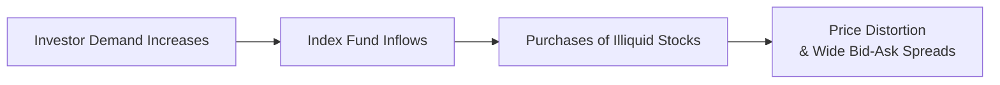

## Introduction

In the world of equity indexes, we often assume that these baskets of stocks reflect broad market performance in a fairly efficient way. Yet, lurking behind the scenes, there’s a potential pitfall: illiquid constituents. When large sums of capital pour into index funds that hold shares with limited trading volume or wide bid-ask spreads, this can trigger something known as a “liquidity trap.” The result? Distorted prices and unexpected volatility. It might sound a bit abstract at first, but in truth, liquidity traps can be surprisingly influential—especially when markets get stressed and everyone seems to head for the exits at once.

Index investing is typically lauded for cost efficiency and diversification. However, not all indexes are created equal, and some aim at niche sectors or small-cap stocks. These indexes, especially if they’re replicated by large index-tracking funds, can amplify small pricing inefficiencies. If the underlying stocks barely trade but suddenly get a wave of inflows, the gap between real intrinsic value and market price can grow—to the point where some investors suddenly find they can’t get out at a fair price.

Below, we’ll dig into how liquidity traps happen, why they matter, and what you, as an investor (or maybe just a curious finance enthusiast), can do to avoid them. We’ll also connect these ideas to the broader indexing concepts from earlier sections—like weighting methodologies, rebalancing, and factor-based indexes. By the end, you’ll have a well-rounded sense of why illiquidity can make indexing trickier than it first appears.

## Defining Liquidity Traps in Index Investing

A liquidity trap in index investing arises when certain stocks that make up an index have relatively low daily trading volumes and widely spaced bid-ask quotes. Once large inflows move into index funds—often from major institutional or retail channels—these illiquid stocks can experience disproportionate price spikes simply because there aren’t enough willing sellers at moderate prices. The opposite effect, a rapid price collapse, can occur when investors try to sell in a hurry.

This situation is somewhat analogous to a narrow side street on a busy day. If too many cars try to turn into the street, traffic immediately jams. Prices for the few available shares can get driven up, sometimes well above any rational fundamental value. Then, if a wave of redemptions hits the fund (think: sudden fear in the market or a broad shift away from the sector), there may not be enough buyers to absorb the selling pressure, creating a swift downward price movement.

### Key Points to Remember

• Liquidity traps typically concern smaller-cap stocks or those with limited free float.  
• They can be accentuated in thematic or sector-specific indexes lacking deep secondary markets.  
• They expose investors to higher transaction costs, price volatility, and execution risk.  

## How Liquidity Traps Arise

There are several intertwined reasons why a liquidity trap can develop:

• Niche or Small-Cap Company Inclusion: Companies with smaller market capitalizations often have lower trading volumes. When these stocks get included in an index, the influx of mandatory buying from index funds can inflate their prices dramatically.

• Limited Free Float: Some firms maintain substantial insider ownership, leaving fewer shares actually available in the open market. Even if a company’s total market cap is large, if the free float is minimal, trading volumes might remain small.

• Thematic Index Concentration: Indexes geared toward specialized industries—like biotech or renewable energy—may include multiple constituents with current popularity but limited float or uncertain valuations. If the sector becomes hot, large inflows chase a limited number of shares.

• Portfolio Reconstitution: Indexes change constituents at certain intervals (see Section 3.3 on Rebalancing, Reconstitution, and Index Changes). Around these dates, newly added illiquid stocks see big volume spikes from index trackers, which can push liquidity-based price jumps.

Below is a simple diagram illustrating how a surge in index fund inflows can lead to price dislocations in illiquid constituents:

As you can see, the dynamic is self-explanatory: investor demand flows into the index fund; that fund must purchase all constituents of the index (including illiquid stocks), which can lead to price distortions in those less-traded names.

## Implications for Investors

### Elevated Transaction Costs

When you invest in a fund that holds illiquid stocks, you could face wider bid-ask spreads, meaning you either buy at premium prices or sell at discounted ones, at least relative to mid-market levels. This hidden cost chips away at returns, even if the fund itself advertises a low expense ratio.

### Price Distortions and Execution Risk

During high market volatility, prices for illiquid index constituents can swing wildly, even more than those of bigger, more liquid stocks. Some investors might believe they’re diversified across the entire index, only to discover they’re more exposed to market microstructure quirks in these thinly traded corners.

### Potential for Amplified Losses

While liquidity traps can inflate prices in calm or bullish times, they pose an even bigger threat in downturns. If many investors decide to sell at once, an illiquid stock simply doesn’t have enough bids near the previous high. Prices can gap down, exacerbating losses.

### Real-World Example

I remember chatting with a friend (another portfolio manager) who once held shares of a small-cap renewable energy firm that had just been included in a popular “Green Energy” index. For a while, the stock soared, in part because index funds scrambled to buy it. The daily volume wasn’t robust in the first place, so even a moderate wave of index demand pushed the share price up significantly. Unfortunately, when overall sentiment shifted and outflows flooded the sector, that same stock plunged almost as fast as it had risen. The entire experience was like a quick rollercoaster—rising meticulously, then crashing in record speed. Talk about dizzying.

## Practical Mitigation Strategies

### Monitor Index Liquidity Profiles

Before investing in a specialized index fund, look beyond top holdings. Investigate whether the index is dominated by illiquid mid- or small-cap names. Data providers often offer metrics on average daily trading volume or free-float market capitalization.

### Weighting Adjustments and Reconstitution

Some indexes use liquidity-based weighting or liquidity screens to avoid extremely difficult-to-trade stocks. Tracking broad market indexes that emphasize liquidity (for instance, by capping the weight of smaller or illiquid constituents) can reduce the risk of getting stuck in a liquidity trap. Also, keep an eye on the timing of index reconstitution. Substantial additions of less-liquid stocks can signal a price and liquidity pinch.

### Use the Right Investment Vehicle

If strict indexing in a niche area exposes you to liquidity risk, you could consider active or semi-active strategies that allow portfolio managers to skip or reduce positions in the most illiquid constituents. Another alternative is investing in a more diversified, broader market ETF or mutual fund that dilutes exposure to any single illiquid name.

### Stay Alert During Market Stress

In periods of stress, bid-ask spreads widen, and price discovery can suffer. Limit orders rather than market orders can help manage execution risk. This approach may not eliminate illiquidity, but it might soften its worst effects.

## A Closer Look at Potential Price Distortion

Suppose an illiquid stock trades around $10.00, with a relatively wide bid-ask: $9.80 bid and $10.50 ask. Now imagine a modest wave of buying from an index fund that tracks a specialized sector index. Because the order sizes are large relative to daily trading volume, the fund has to push its bids higher—perhaps going to $10.40 or $10.45—just to fill orders. This can quickly push the last traded price to $10.45 or higher. While this might sound trivial, a near 4.5% gap in one day from forced buying is meaningful. Then, if negative news hits and the fund must sell, the same liquidity vacuum can work in reverse, sending the stock’s price below $9.80 in a flash. This abrupt shift can be jarring, especially for investors who believed the stock’s “true” value was stable.

## Glossary

• Free Float: The portion of a company’s total outstanding shares that is available for public trading.  
• Bid-Ask Spread: The gap between the highest price buyers are willing to pay (bid) and the lowest price sellers are willing to accept (ask).  
• Liquidity Trap: A market condition where low trading volume (or structural lack of trades) causes price inefficiencies or abnormal price behavior.  

## References and Further Reading

• Amihud, Y., & Mendelson, H. (1986). “Asset Pricing and the Bid-Ask Spread.” Journal of Financial Economics.  
• BlackRock (n.d.). “Liquidity Considerations in Index Portfolios.” Retrieved from https://www.blackrock.com  

## Final Exam Tips

• Be prepared to discuss how liquidity constraints can exaggerate index constituent movements—especially in scenario-based questions where investors face forced redemptions.  
• Know how to differentiate between a “normal” small-cap effect and a full-blown liquidity trap triggered by broad index inflows or outflows.  
• Practice identifying red flags: unusual spikes in the stock price around index inclusion dates, large bid-ask spreads, or extremely low free floats.  
• Be comfortable suggesting potential solutions, such as liquidity screens or weighting caps, in constructed-response questions.  
• Time management in the exam is critical: if you see a question linking portfolio rebalancing to illiquid securities, be precise and thorough in your explanation—brief but complete answers score better than rambling.  

## Test Your Knowledge: Liquidity Traps in Index Investing



### Which of the following best describes a liquidity trap in index investing?

- [ ] When an index fund overweights large-cap stocks but underweights small-cap stocks.  
- [x] When low trading volume in certain constituents causes disproportionate price moves.  
- [ ] When an index contains too many identical or correlated stocks, causing clustering.  
- [ ] When a fund uses leverage and triggers forced margin calls.  

> **Explanation:** A liquidity trap emerges in index investing when certain constituents trade with very limited volume or wide spreads. This leads to disproportionate price changes when large investor inflows or outflows occur.

### Which factor most commonly contributes to a stock becoming illiquid?

- [ ] High insider ownership and limited free float.  
- [ ] Widespread retail ownership.  
- [ ] Multiple listings on global exchanges.  
- [x] Excess supply of shares in the public market.  

> **Explanation:** Among these choices, high insider ownership (leading to a limited free float) is the classic cause of poor liquidity. A restricted free float means fewer shares trade openly, so transactions can cause large price swings.

### What is one potential impact of a liquidity trap on transaction costs?

- [ ] Transaction costs generally remain stable since index trades are predictable.  
- [ ] They vanish because of the built-in efficiency of indexes.  
- [ ] They are unrelated to liquidity conditions.  
- [x] They increase due to wider bid-ask spreads.  

> **Explanation:** In liquidity traps, illiquid stocks tend to have larger bid-ask spreads, so investors suffer higher transaction costs when buying or selling these shares.

### How can index providers help mitigate liquidity-trap risk?

- [ ] They can discourage large institutional investors from participating in the index.  
- [ ] By increasing the frequency of reconstitution to ensure more price updates.  
- [x] By imposing liquidity or free-float minimums before including constituents.  
- [ ] By fixing the price range at which stocks in the index can be traded.  

> **Explanation:** Some index providers use minimum liquidity thresholds or free-float requirements, which aims to filter out severely illiquid names and reduce the chance of large price distortions.

### Which of the following is a scenario in which liquidity traps become especially dangerous?

- [x] During periods of significant market turbulence, where selling pressure intensifies.  
- [ ] In a slow but steadily rising market, where price trends are predictable.  
- [ ] In an extremely large and well-diversified index with thousands of constituents.  
- [x] During index reconstitution events with multiple illiquid additions.  

> **Explanation:** Liquidity traps tend to manifest dramatically during market stress (heightened selling and fewer bids) and at reconstitution events when illiquid names get added, creating forced buys at higher-than-warranted prices.

### What is one strategy for addressing liquidity traps in passive investment portfolios?

- [x] Incorporate a liquidity screen or weighting scheme to reduce exposure to illiquid stocks.  
- [ ] Use only large market orders for execution.  
- [ ] Limit trading to aftermarket sessions.  
- [ ] Avoid any form of diversification.  

> **Explanation:** Screening out or capping the weight of illiquid stocks helps mitigate liquidity risk within a passive portfolio. Large market orders and lack of diversification can, in fact, intensify the problem.

### Why might a small-cap index be more prone to liquidity traps than a broad market index?

- [ ] Small-cap indexes always contain more stocks, so volume is higher.  
- [x] Small-cap stocks often have lower free float and thinner trading volumes.  
- [ ] Small-cap indexes benefit from high retail investor interest, boosting liquidity.  
- [ ] Broad market indexes frequently invest mostly in illiquid stocks.  

> **Explanation:** Many small-cap stocks trade infrequently, and institutional holdings or insider ownership can reduce the free-float portion, creating conditions for a liquidity trap.

### When a surge of inflows hits an index fund holding illiquid securities, what commonly happens to those securities’ prices?

- [ ] They remain constant, thanks to highly efficient markets.  
- [ ] They accurately reflect fundamentals despite increased demand.  
- [x] They may rise rapidly above fair value due to limited sellers.  
- [ ] They often drop until new buyers step in.  

> **Explanation:** With little supply available at the current price, the fund may have to bid increasingly higher to buy enough shares, which inflates prices beyond fundamental worth.

### Which descriptive phrase best matches the idea of a “liquidity trap”?

- [x] “A narrow alley where too many cars get stuck.”  
- [ ] “A carnival ride that never moves.”  
- [ ] “A floodgate that opens in both directions at once.”  
- [ ] “An agricultural cycle that rotates crops.”  

> **Explanation:** The narrow alley analogy is apt because, in a liquidity trap, a sudden surge of traffic (inflows or outflows) meets a market that can’t handle the volume, causing congestion and distortions.

### True or False: Only sector-specific indexes experience liquidity traps.

- [x] True  
- [ ] False  

> **Explanation:** While sector-specific or thematic indexes can be especially prone to liquidity traps, any index—including broad-based ones—can face such problems if it includes illiquid constituents.  


