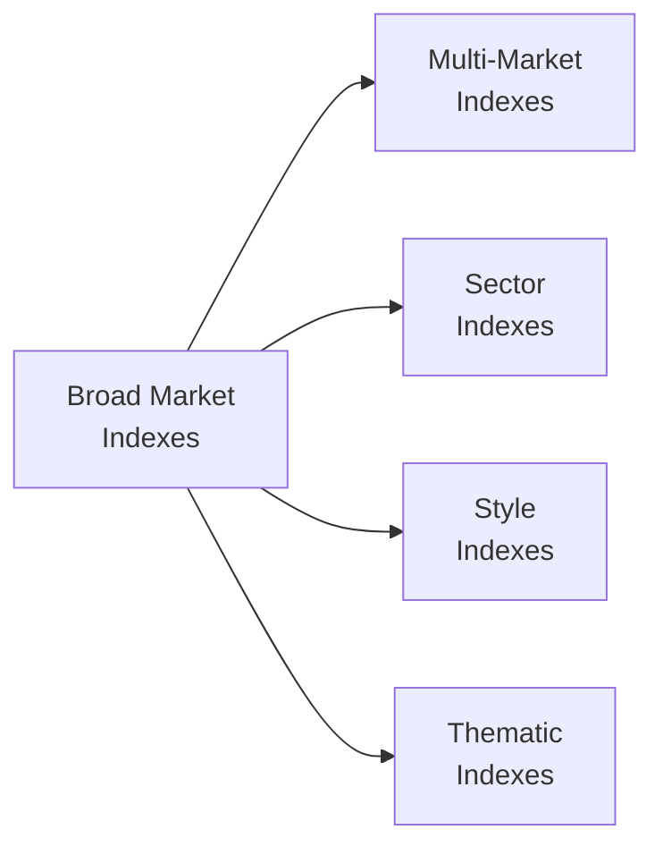

## Introduction

So, you’ve probably heard of the S&P 500 or the FTSE All-World Index. They’re just two examples—pretty famous ones—of equity indexes. But honestly, the index landscape is huge and can feel a bit overwhelming at first. When I first tried replicating a broad market index in my own portfolio (yeah, that was years ago!), I realized I had no clue how many different types of indexes existed. Maybe you’ve felt the same. 

In this section, we’ll dig into several major categories of equity indexes so you can see exactly how each type differs from the others—and, more importantly, how they can be used in real-world portfolio construction. These discussions connect directly to the broader theme of Security Market Indexes that help investors, analysts, and regulators keep tabs on market movements and gauge performance. Let’s jump right in.

## Broad Market Indexes

Broad market indexes aim to measure the performance of an entire equity market. Often, they include the most liquid and widely held stocks across multiple sectors. These indexes are like giant umbrellas, covering companies of various sizes, from the biggest household names to those mid-tier players you might overlook otherwise. 

• Examples:
  – S&P 500 (United States): Composed of 500 leading U.S. companies and tends to be viewed as a gauge of large-cap U.S. equities.  
  – FTSE All-Share (United Kingdom): Combines around 600–700 companies listed on the London Stock Exchange across market-capitalization tiers.  
  – Wilshire 5000 Total Market Index (United States): Attempts to track nearly all U.S. stocks (about 3,500 constituents these days, despite the “5000” in its name).

Broad indexes are often used as performance benchmarks for mutual funds, hedge funds, and individual portfolios that invest widely in a particular market. They’re the “base layer” for many passive and active strategies.

### Key Characteristics  
• Representation: Designed to reflect the entire market; typically includes multiple sectors and a wide range of company sizes.  
• Weighting Method: Frequently market-cap weighted, though other weighting schemes (equal, fundamental, or alternative) exist for certain variants.  
• Use Cases: Often a starting point for asset allocation, portfolio benchmarking, and gaining general insight into market health.  

## Multi-Market Indexes

While a broad market index focuses on a single market (like the United States or the UK), a multi-market index bundles together different countries or regions into one overall measure. This type of index is ideal if you’re looking at how equities across various regions compare or if you want to implement a global or regional asset-allocation strategy.

• Examples:
  – MSCI World Index: Tracks large and mid-cap companies across 23 developed markets.  
  – FTSE All-World Index: Covers both developed and emerging markets but excludes very small companies, providing a broad yet somewhat curated global perspective.  
  – MSCI Emerging Markets Index: Focuses on emerging-market countries, like China, Brazil, and India.

### Key Characteristics  
• Geographic Diversification: Offers exposure to multiple markets, which can be great for reducing home-country bias.  
• Currency Factors: Returns can be influenced by fluctuations in exchange rates, so performance can look different when measured in various base currencies.  
• Use Cases: Often used by multinational asset managers or individuals aiming for diversified global exposure.  

## Sector Indexes

Sector indexes concentrate on specific industries, such as technology, healthcare, financials, or energy. You can think of them as laser-focused lenses: they let you zero in on how a particular segment of the market is performing.

• Examples:
  – S&P 500 Information Technology Index  
  – Dow Jones U.S. Health Care Index  
  – MSCI ACWI Energy Index  

When I was first trying to understand how large-cap tech stocks behaved relative to the broader S&P 500, I followed a tech-specific sector index. It clearly showed whether tech outperformed or underperformed the market, especially during earnings season. If you’re thinking about investing in a specific industry—maybe you believe there’s a strong growth theme—sector indexes can help you see how that industry is moving in real time.

### Key Characteristics  
• Focused Exposure: Great for identifying sector rotation strategies, where investors move capital from one sector to another based on macroeconomic or industry-specific signals.  
• Volatility Differences: Sector indexes can be more volatile than broad market indexes since they’re less diversified.  
• Use Cases: A benchmark for sector-specific funds (e.g., technology ETFs, healthcare mutual funds), or for analyzing if a sector is over- or underperforming.  

## Style Indexes

Style indexes classify stocks based on attributes such as growth or value. Growth stocks—think top-line revenue expansion, higher PE ratios—often focus on fast-growing companies, whereas value stocks typically have lower price multiples and more stable, possibly slower-growing fundamentals.

• Examples:
  – Russell 1000 Growth Index vs. Russell 1000 Value Index: Splits the top 1,000 U.S. stocks by growth metrics (e.g., projected earnings growth) and value metrics (e.g., price-to-book ratios).  
  – S&P 500 Growth and S&P 500 Value: Similar approach within the S&P 500.  

### Classification Criteria
Style indexes often use various fundamental indicators (price-to-earnings, price-to-book, dividend yields) as well as forward-looking estimates (earnings growth forecasts) to split the universe of stocks into different style categories. 

### Use Cases
• Performance Attribution: Helps you figure out if a fund is tilted toward growth or value.  
• Tactical Allocation: You might move between value and growth as part of a sector/style rotation strategy based on market cycles. For instance, you might favor growth stocks during an economic expansion and pivot to value stocks as the cycle matures.

## Thematic Indexes

Alright, let’s move on to something that’s been getting a ton of attention in recent years: thematic indexes. These indexes bundle together companies connected by an overarching trend, like clean energy, artificial intelligence, blockchain, or cybersecurity. It’s not unusual to see them cross traditional sector lines because themes aren’t always limited to a single industry.

• Examples:
  – S&P Global Clean Energy Index  
  – MSCI Robotics and AI Index  
  – Indxx Cybersecurity Index  

### Key Characteristics  
• Trend-Focused: Concentrates on an investment “theme” that might evolve over time.  
• Sector-Agnostic: A single theme—like AI—may include tech hardware, software, automotive (self-driving cars), and healthcare (medical robotics).  
• Potential for Growth (and Risk): Thematic indexes can be volatile because they often home in on emerging industries without well-established track records.  

## Index Coverage

When deciding on an equity index, remember that index coverage can vary in terms of geography and market capitalization.

### Geographic Scope
• Domestic: Focuses on a single country (e.g., Canada, Germany, Japan).  
• Regional: Groups several countries in a geographic region (e.g., Asia-Pacific, Latin America).  
• Global: Provides a worldwide sample (e.g., MSCI World or FTSE All-World).

### Market-Cap Orientation
• Large-Cap: Typically well-established, more mature companies with significant market capitalization.  
• Mid-Cap: Companies somewhat smaller than large-caps but often fast-growing and somewhat riskier.  
• Small-Cap: Generally the smallest listed companies, which may offer higher growth potential but come with greater volatility.

## Usage in Portfolio Construction

The variety of indexes out there isn’t just for show: each type helps you build or measure a different aspect of your portfolio.

• Benchmarking: Compare your portfolio performance to a relevant index. For instance, if you hold mainly large-cap U.S. stocks, using the S&P 500 as a benchmark makes sense.  
• Performance Comparison Across Different Segments: Weighted exposures in sector or style indexes can provide signals about how well your chosen style (growth vs. value) or sector (tech vs. healthcare) is performing relative to the overall market.  
• Sector-Rotation Strategies: Investors might rotate between sectors or styles based on macroeconomic views. For example, if you believe interest rates will remain low, growth-oriented sector indexes (e.g., tech) might be a choice.  
• Tactical Thematic Investing: Thematic indexes provide short-term or medium-term windows into rapidly growing segments, which can be useful if you have a strong conviction about a specific emerging trend.

Below is a simple mermaid diagram that shows how various types of indexes connect under the broader umbrella of equity indexes:

## Practical Examples and Case Studies

1. Comparing an Active Fund to the Right Style Index  
   Suppose you manage a fund that invests primarily in undervalued dividend-paying mid-cap stocks. Instead of comparing performance to the entire S&P 500, you might use a mid-cap value index that better reflects your investment style and size preference.

2. Multi-Market Index for Global Allocation  
   An investor from the U.S. may want international diversification. If you choose the MSCI EAFE Index (tracking Europe, Australasia, and the Far East) or MSCI ACWI (All Country World Index), you can measure performance outside the U.S. or across the world more accurately.  

3. Thematic Tilts for Emerging Trends  
   Say you strongly believe in the future of renewable energy. A “clean energy” thematic index can let you see how that sector is doing, providing a benchmark if you decide to invest in that theme.

## Best Practices and Common Pitfalls

• Align Your Benchmarks: Always choose an index that matches your investment universe. That means sector, style, geography, and market cap should line up. A mismatch can give a distorted view of performance.  
• Understand Methodology: Index providers use different methods for weighting and rebalancing. Make sure you know how constituents get added or removed because that directly impacts index performance.  
• Beware Survivorship Bias: Some indexes remove stocks that get delisted or acquired, which can inflate past returns if you’re not careful.  
• Rebalancing and Turnover Costs: Indexes are rebalanced periodically. If you replicate an index manually in your portfolio, watch out for transaction costs and possible tax implications.  
• Overexposure to Certain Themes: Thematic indexes, while exciting, often concentrate risk in emerging fields. That can be awesome if the theme booms, but it can be brutal if sentiment turns negative.

## Closing Thoughts and Exam Tips

Equity indexes—broad, multi-market, sector, style, or thematic—form the backbone of portfolio management. They’re the go-to tools for benchmarking, performance analysis, and strategic asset allocation decisions. 

What often trips up exam candidates is failing to correctly identify which index is the best benchmark in a given scenario. You may be asked to analyze an active manager’s performance or a specialized thematic fund. The key is always alignment: the portfolio’s strategy should match the type of index used as the reference point.

• Think carefully about how index construction and coverage can create biases and distortions.  
• For essay (constructed-response) questions, expect scenarios where you have to choose an appropriate benchmark or explain how style shifts can affect index comparisons.  
• If you see item set questions on the exam about index rebalancing frequency or weighting schemes, watch for details on how turnover and transaction costs may affect returns.

Above all, remember that analyzing indexes is more than just memorizing a set of acronyms. You want to understand the underlying methodology, usage, and possible limitations—these are what the CFA exams love to test.

## References and Further Reading

- Markowitz, H. (1952). “Portfolio Selection.” The Journal of Finance.  
- MSCI (n.d.). “Index Methodology.” Available at: https://www.msci.com/index-methodology  
- Reilly, F. K., & Brown, K. C. (2011). “Investment Analysis & Portfolio Management.” Cengage Learning.  
- CFA Institute (2024). “CFA® Program Curriculum, Level I.” CFA Institute.

## Test Your Knowledge: Equity Index Varieties and Applications



### Which of the following best characterizes a broad market index?

- [x] It aims to reflect the performance of a large portion of the equity universe within a single market.
- [ ] It focuses on specific industries or sectors within a market.
- [ ] It tracks equities from multiple countries across different regions.
- [ ] It exclusively includes stocks identified as undervalued based on price-to-book ratios.

> **Explanation:** A broad market index, such as the S&P 500, attempts to represent a wide cross-section—often large and mid-cap—of the overall market within a single country or region.

### An investor wants to gain exposure to emerging markets but also track performance internationally. Which type of index might they choose?

- [ ] A domestic sector index.
- [ ] A purely thematic index focused on green energy.
- [x] A multi-market index like MSCI Emerging Markets.
- [ ] A style index that segments stocks by growth vs. value in one market.

> **Explanation:** Multi-market indexes (e.g., MSCI Emerging Markets) encompass multiple countries or regions, offering broader exposure than single-country indexes.

### A technology-focused ETF manager wants a relevant benchmark. Which type of index is most appropriate?

- [ ] A broad market index like the FTSE All-Share.
- [x] A sector index that tracks technology firms.
- [ ] A style index focused on value stocks.
- [ ] A multi-market index that includes both developed and emerging markets.

> **Explanation:** If the manager invests solely in technology stocks, a tech sector index is a more aligned benchmark than a broad or style-based index.

### Value indexes often include stocks that have:

- [x] Low price-to-earnings or price-to-book ratios relative to peers.
- [ ] High expected revenue growth rates and low PE multiples.
- [ ] Extreme price volatility due to thematic exposures.
- [ ] No dividend payouts.

> **Explanation:** Value indexes are typically constructed using criteria such as low P/E or low P/B ratios, capturing companies viewed as undervalued by the market.

### An index that focuses on AI, renewable energy, or blockchain would typically be considered:

- [ ] A broad market index.
- [x] A thematic index.
- [ ] A sector index.
- [ ] A multi-market index.

> **Explanation:** Thematic indexes are built around a specific trend or theme, which can cut across multiple sectors or regions.

### In constructing a global portfolio, which statement about multi-market indexes is most accurate?

- [x] They can help overcome home-country bias by including stocks from various regions.
- [ ] They do not include industries outside the investor’s home country.
- [ ] They typically exclude emerging markets.
- [ ] They focus only on mid-cap equities in developed markets.

> **Explanation:** Multi-market indexes span different countries and can reduce the tendency of investors to overweight their home markets.

### Which of the following is a major pitfall when using sector indexes for benchmarking?

- [x] Sector indexes can be more volatile and less diversified than broad market indexes.
- [ ] Sector indexes rarely include companies relevant to that industry.
- [ ] Sector indexes always outperform broad market indexes in recessions.
- [ ] Sector indexes cannot be used for performance evaluation.

> **Explanation:** Because they focus on a single industry, sector indexes generally have higher concentration risk and volatility compared to broad indexes.

### An investor wants to compare the performance of a small-cap technology portfolio against a relevant benchmark. Which is the best benchmark?

- [ ] The S&P 500 Index.
- [ ] MSCI ACWI Index (All Country World).
- [x] A small-cap technology sector index.
- [ ] A large-cap value index.

> **Explanation:** The best benchmark aligns in market cap (small-cap) and sector (technology) to reflect the portfolio’s actual holdings and strategy.

### Which is a common feature of style indexes?

- [ ] They only include utility stocks in developed countries.
- [ ] They arrange stocks randomly based on past volatility.
- [ ] They exclude growth stocks entirely.
- [x] They classify stocks by metrics like value or growth orientation.

> **Explanation:** Style indexes split the equity universe into segments—e.g., “value” and “growth”—based on price multiples, dividend yields, and other fundamental metrics.

### Thematic indexes generally have:

- [x] Greater risk due to concentrated exposure in emerging themes.
- [ ] Less volatility than broad market indexes.
- [ ] Strict boundaries limiting them to one country.
- [ ] No overlap with sector indexes.

> **Explanation:** Thematic indexes often involve cutting-edge or emerging industries that may exhibit more volatile performance. They can span multiple countries and can overlap with multiple sectors.


