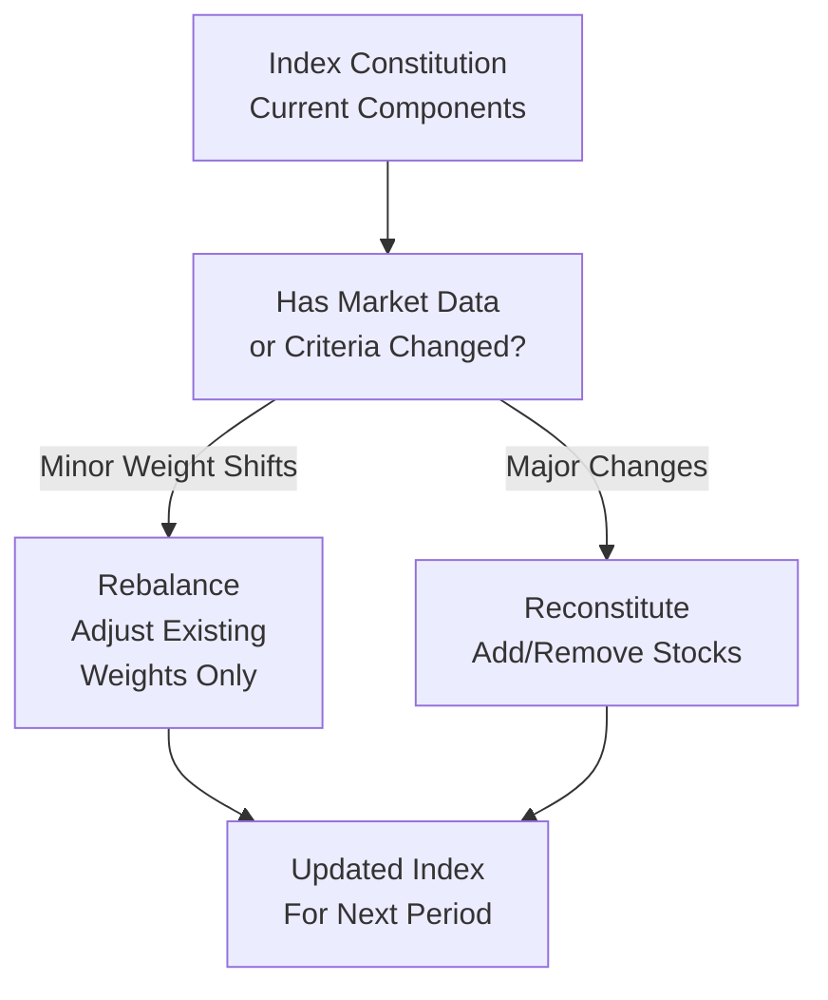

## Overview

Equity indexes are living organisms—well, not literally, but you know what I mean: they need constant monitoring and intermittent adjustments to stay accurate and relevant. If you think about it, an index that never got updated would soon become obsolete, drifting away from its intended focus. Two of the most important processes that keep indexes in line are rebalancing (adjusting weights) and reconstitution (adding/removing constituents). Toss in other index changes triggered by unexpected corporate actions, and you have a pretty robust set of maintenance tasks that ensure an index remains representative of a market or strategy.  

In this section, we’ll go step-by-step through rebalancing, reconstitution, and the rationale behind index changes. We’ll also see how these adjustments can sometimes throw a curveball at investors who replicate or benchmark to the index—particularly those who might suffer from large trading costs around these events. By the end, you’ll not only know the technical details but also grasp how portfolio managers position themselves around these changes to potentially gain an investment edge.  

## Rebalancing Essentials

Rebalancing is exactly what it sounds like: bringing an index’s allocation back to its target proportions. Some indexes want each constituent to carry the same weight (e.g., 1% in each stock for an equal-weighted index). Others want a weighting based on market capitalization, factors, or fundamentals. Even if an index is market-cap weighted, it could still end up slightly off-target because corporate actions, price changes, or the introduction of new shares can shift the relative weights.

### Frequency and Methodologies

• Quarterly, Semi-Annual, or Annual: Many major equity indexes choose quarterly or semi-annual rebalancing. In highly specialized or more actively managed indexes, rebalancing might be done more frequently. But watch out: overbaked frequency can jack up transaction costs for those who track the index.  

• Proportional vs. Full Reset: Some indexes do a “full reset,” returning every constituent to the exact weighting scheme. Others only do partial or proportional rebalancing, meaning they make small weight adjustments so the index doesn’t deviate too far from its benchmark weighting.  

• Passive vs. Factor Indexes: Factor-based indexes (e.g., low-volatility or momentum) might need more frequent rebalancing because the factor exposures can change quickly. If a stock’s volatility goes through the roof, it might no longer fit a “low-vol” index unless it’s dropped or significantly lowered in weight.  

#### A Quick Example

Let’s say an equal-weighted index starts with 10 stocks, each at 10%. Over time, one stock doubles in price while another drops by half. Soon enough, we’re no longer looking at an equal-weighted structure. By the time rebalancing day arrives, the index sponsor sells a portion of the top performer and adds to the laggard, bringing both back to the 10% target. That’s basically rebalancing in a nutshell, but imagine it happening with hundreds of stocks, plus real-world corporate actions, potential delistings, plus changes to the number of shares. It gets complicated—hence the need for set rules.

## Reconstitution: Keeping the Index Fresh

Reconstitution is the process of adding or removing securities so the index remains “representative.” If the index is supposed to track, say, the 500 largest US companies, it must keep pace with changing market capitalizations, spinoffs, mergers, and so on.  

### When Does Reconstitution Occur?

• Scheduled Reviews: Many indexes have specified intervals (quarterly, semi-annually, or annually) to see if existing members still meet the criteria. A requirement could be a market cap threshold, a liquidity constraint, or a sector classification.  

• Ongoing or Ad Hoc: Some indexes do real-time or ad hoc reconstitution when a big event occurs. For instance, if a constituent files for bankruptcy, it may exit the index immediately.  

• Mergers and Acquisitions: When two companies combine, the new entity might not meet the index’s guidelines. Or, if a large constituent acquires a smaller one, the smaller disappears, and the index might add a new name to replace it.  

### Practical Implications

Reconstitution leads to forced trading for both the index sponsor (which redefines index membership) and index replicators (like index funds and portfolio managers who track that index). Often, the market front-runs these changes—meaning certain traders try to buy a soon-to-be-added stock early, anticipating that all index funds will have to buy it. This can cause the price of that stock to spike right before official inclusion. On the flip side, a soon-to-be-removed stock might face a selling wave.

We see these market microstructure dynamics all the time in large benchmarks such as the S&P 500 or major international indexes. And if you’re an active manager, you might want to keep an eye on reconstitution announcements to see if you can take advantage of price pressures.

## Index Changes: Corporate Actions and Beyond

So what exactly classifies as an “index change” if it’s not just rebalancing or reconstitution? Generally, we’re talking about events that significantly affect a company’s equity or listing status:

• Bankruptcy and Delisting: If a constituent goes bust or moves off the public market, there’s no reason for it to stay in the index.  
• Spin-Offs: A parent entity might spin off a business unit as a separately listed company. The newly spun-off shares might enter the index if they meet eligibility requirements, or track a separate index altogether.  
• Changes in Country Classification: Imagine a company moves its primary listing to another country exchange. That might push its removal from a local index and potential inclusion in a global or regional index.  
• Changes in Sector Classification: A firm that shifts from “Technology” to “Telecommunications” after a major operational pivot could spark an index shuffle if the index is sector-based.

### Impacts on Portfolio Turnover

For passive investors who simply replicate an index, these changes can cause significant portfolio turnover—and possibly not at the most favorable prices. Because everyone is trying to buy or sell the same security simultaneously, the market impact costs can be huge. It’s like thousands of people trying to get off the same elevator at once.  

If you’re an active manager, you might try to gain by doing your trades earlier or later than the crowd. One might say, “Hey, there’s a big index inclusion in two weeks. Let’s buy that stock now before the price jumps.” That could work—but watch out for risk if the index sponsor changes its mind or the corporate action gets delayed.  

## Visualizing the Process

Below is a simple Mermaid diagram to illustrate the workflow of deciding whether to rebalance or reconstitute an index:

In simpler terms: If the index sponsor sees only small weighting drifts, they might do a rebalance. If a big event occurs or companies no longer meet criteria, they’ll proceed with reconstitution.

## Real-World Case Study

Think back to 2009 during the height of the financial crisis. Several major banks faced takeover or bankruptcy concerns, leading to abrupt index removals. New constituents were added, especially in technology or consumer staples, which showed more resilience. Passive funds holding these troubled banks had to sell positions quickly—often at a poor price—while also buying newly added members at elevated prices.  

And let’s not forget big mergers: in mid-2018, a high-profile media merger meant the acquiring firm became large enough to jump into a large-cap index, while the acquired firm was removed. The impact on daily trading volume around the reconstitution event was enormous.

## Investor Impact and Market Opportunities

• Index Funds: By design, index-tracking funds follow rebalancing and reconstitution rules. They risk higher transaction costs around these events. Many funds try to execute trades slowly (a technique sometimes called “patient trading”) or use advanced tactics like algorithmic trading to reduce costs.  

• Active Managers: Some see ample opportunities. They might “front-run” the index changes or look for dislocations as the index sells/overbuys certain stocks. However, trying to outsmart the entire market can be tough—especially when so many participants and algorithms are doing the same.  

• Arbitrage and Price Pressure: Especially with smaller or less liquid stocks, an index inclusion can create a big one-time surge in demand. Conversely, removal might depress the stock price. If timed right, an investor could exploit the ephemeral (sometimes very brief) mispricing.  

## Connecting to the CFA® Program

When you see a concept like “rebalancing” or “index changes,” it’s not merely an academic footnote. It affects trading strategies, cost management, and even performance attribution. For exam purposes, keep in mind how fees, tracking error, and turnover are all closely linked. If the exam scenario involves an index changing constituents, you should be ready to:

• Analyze the potential market impact costs.  
• Recognize how an index sponsor’s methodology might cause frequent or infrequent changes.  
• Identify opportunities or risks for active management or arbitrage.  

## Exam Tips and Best Practices

• Remember the conceptual differences: A “rebalance” adjusts weights, a “reconstitution” modifies which stocks are in the index.  
• Keep in mind the frequency trade-off: More frequent rebalancing keeps an index in line with its intended weights but can drive up transaction costs (for investors).  
• Be aware of forward-looking tactics: On exam questions, they might test how you’d exploit or defend against the pricing pressure of index changes.  
• Don’t forget about liquidity: Stocks with low liquidity can suffer large price swings when included or removed from an index.  

## References

- Maginn, J. T., Tuttle, L. E., Pinto, J. E., & McLeavey, D. W. (2007). Managing Investment Portfolios: A Dynamic Process. CFA Institute.  
- Blume, M. E., & Edelen, R. M. (2004). S&P 500 Index Changes and Investor Awareness. The Journal of Portfolio Management.

---

## Test Your Knowledge: Index Maintenance and Impact



### Which of the following best describes rebalancing in an equity market index?

- [ ] Adding new constituents that meet certain market-cap criteria
- [x] Adjusting constituent weights to maintain the target allocation
- [ ] Making mid-year modifications to the index’s methodology
- [ ] Changing the country classification of a stock in the index

> **Explanation:** Rebalancing involves adjusting the existing constituents’ weights so the index remains aligned with its intended weighting scheme.

### Which event is most likely to prompt a reconstitution of an equity index?

- [x] A constituent’s market capitalization drops below the index’s minimum threshold
- [ ] A slight fluctuation in a constituent’s stock price
- [ ] A fundamental factor scoring model adjustment for a single constituent
- [ ] A cyclical shift in the entire market’s valuation

> **Explanation:** Reconstitution occurs when a constituent no longer meets the predetermined criteria (e.g., market cap, liquidity). Minor price fluctuations are usually handled by rebalancing rather than dropping the stock from the index entirely.

### Why might frequent rebalancing be less desirable for some index investors?

- [x] It increases transaction costs for funds trying to replicate the index
- [ ] It ensures that the index stays more reflective of the market
- [ ] It enables arbitrage opportunities for active managers
- [ ] It reduces portfolio turnover for passive strategies

> **Explanation:** Frequent rebalancing can generate higher transaction costs. On the other hand, less frequent rebalancing might lead to a bigger drift from target weights but lower trading costs.

### Which of the following is an example of an index change due to a corporate action?

- [x] Removing a constituent that is acquired and ceases to exist as a separate entity
- [ ] Shifting an equal-weighted index to a cap-weighted scheme
- [ ] Adjusting a stock’s weight from 3% to 2.5% due to minor price moves
- [ ] Reclassifying a stock from growth to value style

> **Explanation:** A merger or acquisition often removes the target company from the index, since it no longer exists as an independent listing.

### What is a common impact on a stock that has just been announced for addition to a major index?

- [ ] A decline in its share price due to dilution
- [x] A spike in demand from index-tracking funds looking to purchase the stock
- [ ] Complete immunity from price volatility
- [ ] Immediate delisting from the exchange

> **Explanation:** New index constituents often see short-term price increases as index funds and other investors buy the stock to match the index composition.

### Which of the following best describes the link between rebalancing frequency and transaction costs?

- [x] More frequent rebalancing can increase transaction costs for passive investors
- [ ] More frequent rebalancing always lowers costs from active trading
- [ ] Infrequent rebalancing is typically more expensive than frequent rebalancing
- [ ] Transaction costs are not influenced by rebalancing at all

> **Explanation:** Each rebalancing event involves buying or selling securities, and higher frequency increases the number of trades, leading to greater cumulative costs.

### From a portfolio manager’s perspective, which strategy could potentially exploit index reconstitution?

- [x] Buying a stock in anticipation of its inclusion before index funds purchase it
- [ ] Waiting until after the index reconstitution to make all trades
- [ ] Only investing in risk-free assets
- [ ] Avoiding any market research or analysis

> **Explanation:** By preemptively buying a stock expected to join an index, a manager may benefit from the subsequent buying pressure when index-tracking funds enter the trade.

### What is an example of a forced trade during reconstitution?

- [x] Index funds selling a security that is being removed from the index
- [ ] An active manager choosing whether to keep the stock or not
- [ ] A company offering a share repurchase program
- [ ] A bond issuer defaulting on its coupon payment

> **Explanation:** Funds that replicate an index are compelled to remove securities no longer in the index, irrespective of their individual assessment of the stock’s valuation.

### Why can adding or removing stocks based on experience “frontrunning” be risky for investors?

- [x] The index sponsor could revise its decision, causing unexpected price reversals
- [ ] No investor can modify trades prior to the official reconstitution date
- [ ] This approach never results in additional profit
- [ ] It is illegal under all market regulations

> **Explanation:** Although frontrunning index changes can be lucrative, there’s a risk the anticipated change might not occur as announced, or the event timeline can shift.

### Rebalancing is focused on adjusting weights, while reconstitution is focused on adding or removing constituents.

- [x] True
- [ ] False

> **Explanation:** Rebalancing fine-tunes the proportions of existing constituents, whereas reconstitution changes who is actually in (or out of) the index.


