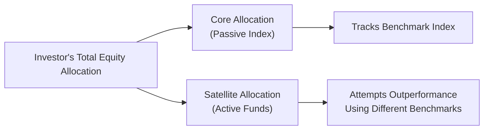

## Introduction

You know, when I first dipped my toes into investing—I’m talking years ago, back when I was still trying to figure out if an ETF was something you ate or something you traded—I remember seeing all these ads for funds that tracked a big-name index, like the S&P 500. Then, on the other side, I found managers claiming they could beat that same index through some brilliant stock-picking prowess or market-timing wizardry. Over time, it became clear that market indexes are not just an investment scoreboard but also powerful tools underlying two major approaches to portfolio management: passive and active investing.

Indexes serve a broad range of purposes: they measure performance, provide benchmarks for active managers, and form the core building blocks of passive investment products like index mutual funds and exchange-traded funds (ETFs). The interplay between passive and active investing—often simplified as a battle between systematic replication and skill-based outperformance—shapes how investors allocate their capital. This section explores how market indexes fit into both passive and active strategies, what factors go into choosing a suitable index, and how such benchmarks help with risk management and performance evaluation.

## Passive Investing

Passive investing is all about matching, not beating, a chosen market index. The hallmark of this style is simplicity and efficiency. If you, as an investor, believe that markets are fairly efficient—so that the prices of stocks and other assets reflect all available information—then attempting to outperform the market might be more trouble (and cost) than it’s worth. Instead, passive investors are content to replicate the returns of a broad market or specific segment.

### Benefits of Passive Funds

• Lower Costs: Passive funds typically have lower management fees because they require less research and fewer trading activities. The manager’s job is mainly to replicate the index composition, meaning not a ton of day-to-day decision-making about which stocks stay in or out. Less turnover also generally translates into lower transaction costs.

• Tax Efficiency: Thanks to low turnover, passively managed portfolios often realize fewer capital gains distributions, resulting in a more tax-efficient structure. This can be particularly helpful in taxable accounts.

• Transparency: Many index funds fully disclose their holdings daily. You always know how your funds are allocated because an index’s constituent securities typically change infrequently and in a predictable fashion (e.g., when an index sponsor reconstitutes or rebalances).

### Typical Structures

Passive strategies are implemented through vehicles such as index mutual funds or ETFs. Both aim to track an index as closely as possible, and both allow investors to gain exposure to an entire market in a single product.

Remember, though, that even “passive” products have some tracking error. Tracking error is the standard deviation of the difference between the portfolio’s returns and the benchmark’s returns. Minimizing this gap is a key performance metric for any passive strategy.

## Active Investing

In contrast, active investing attempts to outperform a benchmark index through stock selection, sector rotation, market timing, or other discretionary decisions. Here, I’ll be honest—sometimes you hear success stories about managers who spotted that “next big thing” early. But consistent outperformance is challenging. Many studies—like the seminal works of Sharpe (1966) and later Fama and French (2010)—have shown that, net of fees, a majority of active managers underperform their benchmarks over the long run.

### When Active Managers May Add Value

• Market Inefficiencies: In less efficient markets—think smaller-cap emerging market stocks—good active managers might exploit pricing anomalies or information asymmetries to generate higher returns.

• Thematic / Sector Expertise: Managers specializing in narrow thematic or sector-based strategies (e.g., renewable energy, biotech) may have advantages in uncovering hidden gems or avoiding pitfalls.

• Tactical Asset Allocation: Some active approaches shift exposure among asset classes based on macroeconomic views. These managers use an index for comparison but dynamically move away from it to manage risk and chase extra return.

### Costs and Considerations

Active management entails higher fees and transaction costs. Research teams need compensation, trading strategies demand frequent portfolio rebalancing, and the managers must keep an eye on the market daily (if not by the minute). An active manager’s success is typically evaluated by comparing net-of-fee returns to a relevant market index or peer group. Risk management is crucial here; if you’re paying more, you want to ensure your manager is taking prudent risks and generating value in excess of those costs.

## Index Selection

Whether you choose a passive or active strategy, index selection is crucial. For a passive investor, the whole point is replicating a specific market. You don’t want an index that behaves drastically differently from your intended exposures. For instance, if you aim to capture the U.S. large-cap equity market, the S&P 500 or Russell 1000 might be a better fit than a narrow sector index.

For active managers, the natural question is: “Against which index should my performance be measured?” The benchmark must align with the investment style—value funds typically benchmark against a value-oriented index, and small-cap managers measure themselves against a small-cap index. A mismatch leads to confusion: you might be blaming (or praising) the manager for underperformance (or outperformance) that occurred merely because the chosen index was the wrong yardstick.

### Key Factors in Index Selection

• Sector Focus: Does the index represent large-cap, mid-cap, small-cap, or a particular industry?  
• Geographic Role: Domestic vs. international coverage.  
• Style: Value, growth, or blended.  
• Liquidity Profile: Investors want to ensure the index can be replicated easily with minimal friction.  
• Market Bias: Some indexes weigh constituents differently (market-cap weighting vs. equal weighting vs. factor weighting). The choice can significantly affect risk and return characteristics.

## Benchmarking

Once you’ve identified the right index, it also becomes the yardstick for performance measurement and risk monitoring. In a formal performance-attribution analysis, a manager might ask, “What portion of my return is due to market exposure (beta), and how much is due to security selection or timing (alpha)?” The selected index helps separate the manager’s skill from broader market movements.

### Manager Performance Evaluation

On the active side, success is typically judged by comparing risk-adjusted returns against a benchmark or a peer group. Specific metrics include the Information Ratio (excess return over the benchmark divided by tracking error) and the Sharpe Ratio (excess return over the risk-free rate per unit of total volatility). Other performance measures, such as Jensen’s alpha, also rely heavily on the choice of reference index to specify the market risk factor.

### Managing Factor Exposures

Indexes also help manage factor exposures (e.g., size, value, momentum). An active manager might target an index but deliberately deviate in certain factors to generate outperformance. Or an investor might compare factor loadings of an active portfolio to the benchmark, assessing how the manager’s style might differ from a broad market approach.

## Practical Example: Balancing a Core and Satellite Portfolio

Consider an investor who sets up a “core and satellite” approach. The core—a large portion of the portfolio—is invested in a broad, passively managed index (like an ETF tracking the MSCI World Index). Then, for satellites, they allocate smaller tranches to various actively managed funds, aiming to outperform their portion’s relevant benchmarks. The passive core ensures cost efficiency and stable alignment with the global equity market, while the active satellites, if managed well, can potentially add alpha. By combining both strategies, the investor can keep overall costs lower and still pursue enhanced returns from active management.

Below is a simplified diagram illustrating how an index can serve both the passive core and active satellites:

In this diagram, the core allocation tracks a broad index with minimal tracking error, while each satellite fund compares its performance to a more specialized benchmark.  

## Glossary

• Passive Investing: Strategy of tracking a market index rather than attempting to outperform it.  
• Active Investing: Strategy using security selection and/or market timing to surpass a benchmark.  
• Benchmark: An index against which investment performance is measured.  
• Tracking Error: The standard deviation of the difference between a portfolio’s returns and the benchmark’s returns.

## Best Practices, Challenges, and Pitfalls

• Best Practices:  
  • Ensure the index aligns precisely with your investment mandate and style.  
  • Monitor tracking error (for passive) or alpha (for active) regularly.  
  • Keep costs in check, bearing in mind that higher costs demand higher outperformance to be acceptable.  

• Challenges:  
  • Market Complexity: Global markets are diverse, so even broad indexes might miss certain sectors or factor exposures.  
  • Benchmark Drift: Indexes are not static. Periodic rebalancing changes constituents and sometimes sector weights, altering portfolio exposures.  
  • Overconfidence in Active Skills: Many managers (and individuals) believe they can beat the market, but evidence suggests it’s far harder than it looks.

• Common Pitfalls:  
  • Benchmark Mismatch: Using a small-cap benchmark for a large-cap portfolio can misrepresent performance.  
  • Chasing Performance: Switching between active strategies or indexes based on recent outperformance usually leads to disappointment once the trend reverses.  
  • Overtrading in Active: High trading costs can erode alpha quickly.

## Conclusion and Final Exam Tips

Indexes play a vital role in shaping both passive and active investing strategies. Passive investors rely on indexes for straightforward, cost-effective market exposure, while active managers use them as a baseline against which to measure their skill. Choosing the right index is paramount: one that best aligns with investment style, geographic focus, and liquidity constraints. In an exam setting, be prepared to analyze whether a manager’s returns are a reflection of smart allocation (alpha) or the broader market’s performance (beta). Look for the right index selection in hypothetical scenarios, and remember that tracking error (for passive) and risk-adjusted alpha metrics (for active) are central to evaluating success.

On the CFA exam, you could encounter item set questions asking you to determine if an index is appropriate for a given strategy, or whether an active manager truly outperformed once fees, taxes, and risk are accounted for. In essay questions, you might be asked to discuss how to select or construct a benchmark that reflects a manager’s investment style. 

Stay keen on how different weighting methods (market cap vs. equal weighting, etc.) can impact both performance measurement and portfolio strategy. And keep in mind that many real-world pitfalls, like high fees or mismatch between strategy and benchmark, can appear in case study–style exam questions.

## References and Further Reading

- Sharpe, W. F. (1966). “Mutual Fund Performance.” The Journal of Business.  
- Fama, E. F., & French, K. R. (2010). “Luck vs. Skill in the Cross-Section of Mutual Fund Returns.” The Journal of Finance.  
- CFA Institute (n.d.). “Measures of Active Performance.”  

For those wanting to learn more about how indexes are constructed and used, the CFA Institute’s official materials, plus academic articles on benchmarking, are your go-to resources. You might also look into specialized texts covering factor investing, advanced index-construction methodologies, and the empirical evidence around whether active managers beat their benchmarks net of fees.

---

## Practice Questions: Passive vs. Active Indexing



### Which of the following is a characteristic most closely associated with passive investing?

- [ ] High turnover and frequent trading
- [x] Lower management fees
- [ ] Attempting to outperform an index via security selection
- [ ] Heavily concentrated, sector-specific exposures

> **Explanation:** Passive investing’s goal is to replicate an index, leading to lower fees, less turnover, and straightforward management.

### An investor seeking to monitor whether a passive fund is successfully tracking its benchmark over time would focus on:

- [x] Tracking Error
- [ ] Sharpe Ratio
- [ ] Jensen’s Alpha
- [ ] Information Ratio

> **Explanation:** Tracking error measures how closely a portfolio follows its benchmark. Sharpe Ratio, Jensen’s Alpha, and Information Ratio are more widely used by active strategies.

### Which of the following statements best describes one reason why active managers might approve of using a large-cap equity index as a benchmark?

- [ ] Large-cap equity indexes are easy to beat because large companies tend to be undervalued.
- [x] The benchmark aligns with their universe of possible investments.
- [ ] Large-cap stocks are inherently more volatile.
- [ ] Active managers do not need benchmarks to measure performance.

> **Explanation:** A benchmark should align with what a manager can realistically buy and sell. If the manager focuses on large-cap securities, then a large-cap index is appropriate.

### If an active manager posts a higher return than the benchmark but does so with significantly greater volatility, the best practice is to evaluate that manager using:

- [ ] The Security Market Line
- [x] A risk-adjusted measure such as the Sharpe or Information Ratio
- [ ] Dividend Discount Models
- [ ] Price-to-Book Ratios only

> **Explanation:** Adjusting for risk is essential in measuring performance. A higher return with significantly more volatility may yield a lower risk-adjusted measure.  

### A fund that passively replicates a tech-heavy index with almost no turnover is most likely to be:

- [x] Tax-efficient
- [ ] Diversified across all market sectors
- [x] Low cost
- [ ] Actively managed

> **Explanation:** The fund is not actively managed, so it primarily replicates the index. This approach involves little trading and thus tends to be low cost and tax-efficient.

### Which best explains why a small-cap value manager would choose a small-cap value index as a benchmark?

- [x] It properly reflects the manager’s universe of stocks.
- [ ] The manager wants to reduce alpha.
- [ ] The manager tries to track the index passively.
- [ ] The manager invests randomly.

> **Explanation:** Proper alignment between investment universe (small-cap value) and the benchmark ensures that performance comparisons and risk measures are meaningful.

### When a portfolio’s returns deviate significantly from its benchmark, but the deviation is not consistent over time, the portfolio manager is likely experiencing:

- [x] High tracking error
- [ ] High alpha
- [x] Potential style drift
- [ ] High correlation with the benchmark

> **Explanation:** Large deviations from the benchmark indicate tracking error. If style or factor exposures shift unpredictably, one might also see style drift.  

### How might an active manager use an index for risk management?

- [x] Compare portfolio factor exposures to the index and adjust positions to manage risk
- [ ] Replace all portfolio holdings with the index holdings
- [ ] Avoid measuring performance until the end of the year
- [ ] Use the index only for marketing materials

> **Explanation:** Active managers often break down an index by sector, factor, or other risk characteristics to gauge where their portfolio differs, thereby guiding risk-management decisions.

### In a core-satellite approach, the “core” component is usually:

- [x] A passive holding designed to replicate a broad index
- [ ] A highly concentrated active fund
- [ ] A single stock representing the entire market
- [ ] A private equity stake

> **Explanation:** The core allocation typically uses a passive broad index strategy for broad market representation and cost efficiency, while satellites are actively managed.

### True or False: An active strategy is guaranteed to deliver alpha if it overweighted winning stocks in a given period.

- [x] True
- [ ] False

> **Explanation:** Overweighting winning stocks could result in outperformance; however, whether that outperformance is statistically significant and repeatable over the long term is a separate question. In a given period, though, positive alpha can arise from that strategy.


