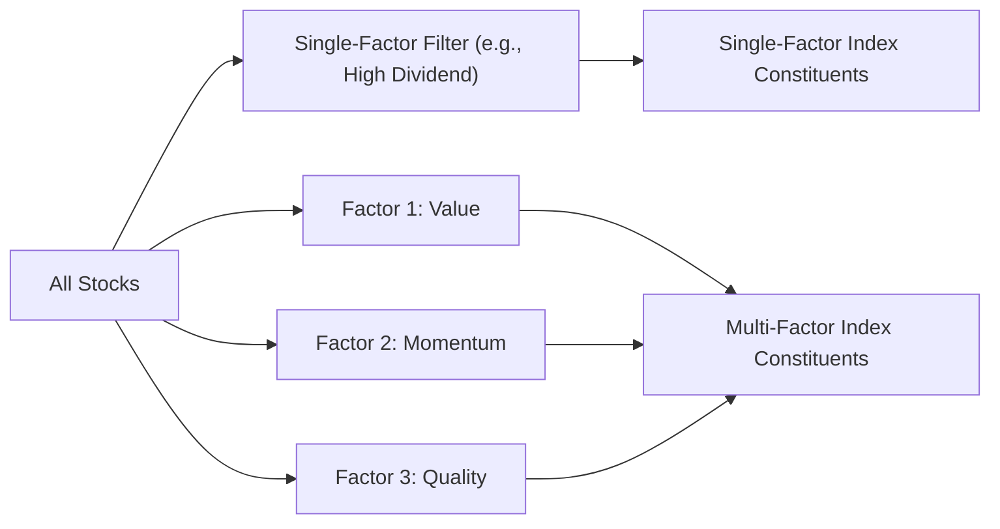
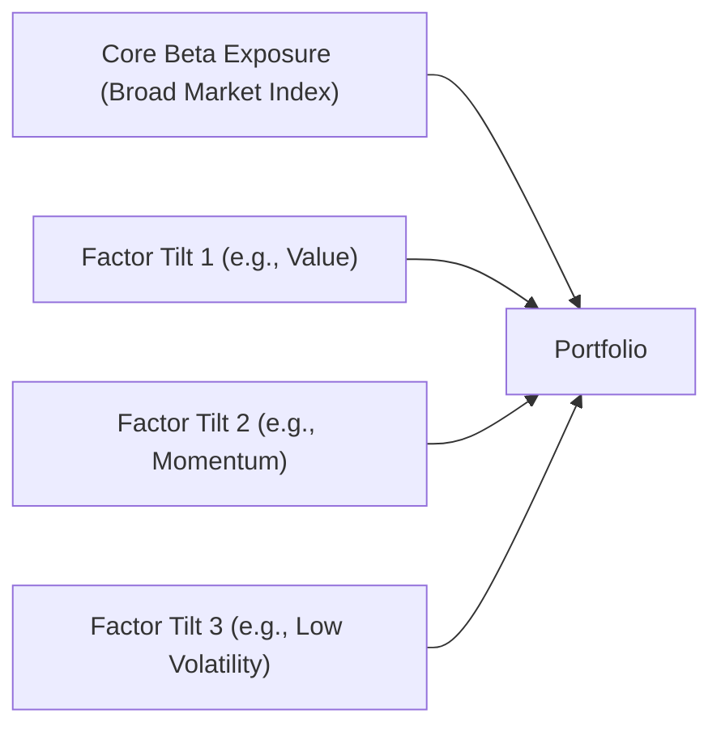

## Understanding Factor-Based Equity Indexes

Imagine you’re browsing the equity market, and—um—everywhere you look, you see talk about “smart beta,” “strategic beta,” or “factor investing.” All those fancy terms basically converge on a single big idea: Factor-based equity indexes. In a nutshell, factor indexes are customized benchmarks that tilt your portfolio toward certain attributes—like value or momentum—that theoretically earn a higher risk-adjusted return over the long run. While the concept might sound daunting, these strategies actually come from decades of academic research looking to identify what “factors” drive equity prices. Let’s dive into the nuts and bolts of factor-based equity indexes, see how they’re constructed, and think about pitfalls you might face along the way.

## Core Concepts of Factor Investing

Everyone in finance eventually bumps into factor-investing ideas—like the famous Fama-French three-factor model or its modern expansions. The essential premise is that stocks sharing certain fundamental or market characteristics often generate excess return premia over time, beyond what broad-market indexes might achieve. For instance, take “value” stocks—companies trading at low multiples (like price-to-book or price-to-earnings). They might appear cheap, and thus theoretically offer higher expected returns. Factors such as size (small-cap vs. large-cap), momentum (recently outperformed peers), quality (high profitability, stable earnings), and low volatility (more stable price movements) also come into play.

Why does factor investing exist in the first place? The grand story is that asset-pricing models—initially, the Capital Asset Pricing Model (CAPM)—couldn’t fully explain stock returns with just “beta.” Researchers noticed systematic return differentials associated with characteristics like size and value. Fast-forward to more recent times, and you see a variety of factor-based approaches that target these systematic “anomalies.” And if you’re preparing for the CFA® exam—definitely keep track of how these factors are identified, measured, and evaluated, because they do show up in item sets and essays.

## Rationale for Factor-Based Indexing

The big selling point of factor-based equity indexes is generating potential outperformance relative to a plain-vanilla benchmark, like the S&P 500. Many index providers (think MSCI, FTSE Russell) create specialized indexes that overweight stocks exhibiting certain factor traits. The overarching goal is to capture the factor premium systematically rather than trying to pick stocks individually. By replicating (or investing in) these factor indexes, investors hope to earn returns in excess of a market-cap–weighted index, on a risk-adjusted basis.

But, hey, wait—there’s a flipside: factor-based indexes can underperform for long stretches. Factors tend to be cyclical. When the market is favoring growth-oriented technology names, a value-oriented factor index might lag significantly. Plus, different index providers define and measure factors in slightly different ways, which can lead to performance variance even among indexes that nominally target the same factor.

## Single-Factor vs. Multi-Factor Index Construction

One quick way to visualize the construction differences between single- and multi-factor indexes is to imagine two separate funnels. In single-factor strategies, all the stocks pass through a single “sieve,” retaining only those with the desired attribute. In multi-factor approaches, you line up multiple sieves—value, momentum, quality, etc.—to simultaneously screen stocks. Let’s illustrate this with a Mermaid diagram:

• Single-Factor Index: You zoom in on just one attribute, like high dividend yield, low price-to-book ratio, or consistent momentum. This approach tends to be more volatile because you’re fully exposed to that one factor’s ups and downs.

• Multi-Factor Index: You combine multiple factors. The idea is that while one factor might face a downturn, another (like momentum or low volatility) could offset some of that risk, creating a more stable return profile. Sure, it might dampen periods of huge outperformance, but it can also help avoid deep troughs.

## Factor Definitions and Variations

It’s very possible that the same factor notion can be measured differently by two providers. “Value,” for example, might be measured by one index using price-to-book ratio alone, while another index uses a composite of price-to-earnings, price-to-sales, and dividend yield. That’s what we call “definition risk,” and it can create some confusion. The best practice is to clarify how an index is defining its factor tilt back to official methodology documents from a known provider (e.g., MSCI Factor Index methodology).

### Common Factors

• Value Factor: Targets stocks trading at cheaper valuations, such as low price-to-book or price-to-earnings.  
• Size Factor: Zooms in on smaller-capitalization companies.  
• Momentum Factor: Focuses on recent winners that continue to trend upward.  
• Quality Factor: Emphasizes high return-on-equity, low debt, stable earnings growth.  
• Low-Volatility Factor: Tilts toward stocks with lower price fluctuations.

## Potential Benefits

• Diversification of Return Drivers: By targeting specific factors, you diversify away from a single market risk.  
• Systematic Outperformance: Historically, certain factors (like value) have outperformed broad indexes over long horizons. Though results can vary, factor-based approaches aim to harness persistent, academically researched premiums.  
• Transparent Rules-Based Approach: Factor indexes follow clear, rules-based rebalancing processes, making them more transparent and easier to replicate.

## Risks and Challenges

Now, I gotta be honest—factor indexes aren’t some foolproof route to infinite alpha:

• Cyclicality: Factors can underperform for years. You might recall extended periods where value investing lagged growth. That’s normal.  
• Definition Inconsistency: Each index provider’s methodology can differ, so “momentum” from one provider might not replicate results from another.  
• Overcrowding Risk: As more investors pile into the same factor, the advantage may diminish (though there’s debate over whether markets can fully arbitrage away these premia).  
• Transaction Costs: Factor indexes typically rebalance more frequently than market-cap–weighted benchmarks. This can create higher turnover and associated costs.

## Practical Examples and Case Studies

Let’s consider a global portfolio manager facing client demands for extra yield in an environment of near-zero interest rates. She might adopt a high-dividend factor index. This product systematically screens for companies with yield above a certain threshold, possibly weeding out stocks with unsustainably high payout ratios. The short-term effect could appear juicy—higher yields for the client. However, if the market environment shifts, and high-dividend stocks fall out of favor, the factor-based index may underperform a standard broad-market benchmark.

Meanwhile, an alternative multi-factor approach might blend dividend, value, and low volatility all at once, with the manager hoping to reduce drawdowns if one factor collapses. In real-world terms, you see many asset managers offering “multi-factor” ETFs, each with its own proprietary weighting scheme. In practice, these can be effective if you hold them for the long haul, but you still need to manage client expectations around cyclical factor underperformance.

## Integrating Factor Indexes into a Portfolio

Factor-based indexes aren’t simply “plug-and-play.” In advanced portfolio management, you might choose factor exposures to complement existing holdings, fill style gaps, or express tactical views. Typically, you’d include some combination of broad-market exposure plus factor tilts:

Managers often keep a chunk of the portfolio in a standard market-cap–weighted benchmark for stability and add or remove factor exposures to align with market outlooks or strategic asset allocation. If you anticipate an upcoming risk-off environment, you might tilt more toward low-volatility or quality factors. But get ready, because if the market rallies strongly, a low-volatility tilt might underperform growthier segments.

## Best Practices, Pitfalls, and Strategies

• Long-Term Horizon: Factor underperformance can last for substantial periods, so patience is essential.  
• Align with Objectives: Some factors might not match a client’s risk tolerance or investment goals. For instance, a high-dividend factor might be favored by income-oriented investors, but a momentum factor might be favored by more growth-oriented portfolios.  
• Monitor Turnover: Traditional market-cap–weighted indexes rebalance less frequently; factor-based approaches can require higher turnover. Keep an eye on transaction fees and potential tax implications.  
• Evaluate Overlaps: Multi-factor indexes can inadvertently concentrate on certain sectors or industries. Always check that your factor definitions don’t cause unintended exposures versus a neutral benchmark.

## Factor Indexing in the Context of the CFA® Program

From the CFA® perspective, factor-based investing is heavily studied in advanced portfolio construction and performance evaluation. You might encounter exam questions testing your knowledge of how factors are measured, how returns decompose into factor exposures, and how cyclical patterns or governance structures can influence factor performance. In scenario-based or constructed-response questions, you might be asked to:

• Recommend an appropriate factor-based index in an asset allocation.  
• Evaluate the pros and cons of single-factor vs. multi-factor approaches.  
• Estimate how adding a factor tilt could affect both returns and volatility.

These are typically integrated into broader portfolio management decisions, so keep in mind that factor indexes can be used in combination with fundamental active management, derivatives overlays, or tactical asset allocation shifts.

## Exam Tips for CFA® Candidates

• Understanding Factor Definitions: You should be fluent in key factor measures (like the difference between price-to-book vs. price-to-earnings for value).  
• Calculating Factor Exposures: Expect to see how factor loadings are derived and tested. You might see numerical item sets requiring you to identify which stocks best fit a desired factor profile.  
• Linking to Portfolio Context: The exam might ask how factor index strategies align with an investor’s IPS (Investment Policy Statement), especially regarding risk tolerance and time horizon.  
• Behavioral Pitfalls: Factor investing, ironically, can be susceptible to behavioral biases. For instance, chasing hot momentum strategies invites potential reversal risk. The exam might test your ability to weigh these considerations ethically and professionally.

## References and Further Exploration

• Fama, E. F., & French, K. R. (1992). “The Cross-Section of Expected Stock Returns.” The Journal of Finance.  
• Asness, C. S., Frazzini, A., & Pedersen, L. H. (2019). “Quality Minus Junk.” Review of Accounting Studies.  
• MSCI Factor Indexes: https://www.msci.com/factor-indexes  
• CFA Institute Code and Standards: https://www.cfainstitute.org/en/ethics-standards

If you’d like a deeper dive, you might explore research articles on factor timing, or official guides from index providers that detail how they screen and weight stocks. It’s also helpful to compare real-world performance data across different factor indexes over multiple business cycles.

## Test Your Knowledge: Factor-Based Equity Indexes Fundamentals



### Which of the following describes a primary goal of factor-based equity indexes?

- [ ] To eliminate market risk entirely
- [ ] To bypass all transaction costs associated with index rebalancing
- [x] To capture systematic return premia linked to specific equity characteristics
- [ ] To concentrate on a single stock with high momentum

> **Explanation:** Factor-based equity indexes seek to systematically capture return premia (e.g., value, momentum) that have been shown, in various academic studies, to offer excess returns over time.

### When constructing a single-factor index focused on the value factor, which metric is most commonly used?

- [x] Price-to-book ratio
- [ ] Return on equity
- [ ] Earnings growth rate
- [ ] Beta

> **Explanation:** The value factor is often measured using valuation metrics like price-to-book ratio. Different providers might also add metrics like price-to-earnings or price-to-sales, but price-to-book is a classic choice.

### In a multi-factor index combining value and momentum, which of the following is a potential advantage?

- [x] Reduced cyclical underperformance due to diversification across multiple factors
- [ ] Zero possibility of drawdowns
- [ ] Better liquidity than a broad-market index in all market environments
- [ ] Elimination of all factor exposures in recessionary periods

> **Explanation:** Multi-factor indexes help diversify the factor exposure (value, momentum, and so on), potentially smoothing out cyclical downturns. There’s no guarantee of zero drawdowns, and liquidity advantages can vary.

### Which factor typically focuses on companies with stable earnings, strong balance sheets, and low leverage?

- [ ] Momentum factor
- [ ] Size factor
- [x] Quality factor
- [ ] Value factor

> **Explanation:** The quality factor targets sound companies with strong fundamentals, measured by profitability, stable earnings, and manageable debt levels.

### Which of the following is a key criticism regarding factor-based indexing?

- [x] Factor definitions can differ across index providers, causing inconsistency
- [ ] It guarantees outperformance every year
- [ ] It lowers portfolio turnover to zero
- [ ] It removes the need to rebalance at all

> **Explanation:** Factor-based indexing relies on specific definitions of each factor, which can differ across providers and lead to varying performance. No factor strategy can guarantee annual outperformance or reduce turnover to zero.

### A portfolio manager decides to overweight a low-volatility factor index. What is the primary rationale for this allocation?

- [ ] To maximize short-term capital gains
- [x] To cushion the portfolio against sharp market downturns
- [ ] To replicate the market’s overall beta exposure precisely
- [ ] To ensure higher dividend yields regardless of price movement

> **Explanation:** Low-volatility strategies aim to reduce the impact of market drawdowns and smooth out returns. This factor historically stabilizes returns, though it may lag high-growth rallies.

### During a technology-driven bull market, a single-factor “value” index may underperform significantly. Which reason best explains this phenomenon?

- [x] The factor is cyclical and may lag when growth stocks are in favor
- [ ] The factor becomes more popular, driving prices up
- [ ] The factor invests exclusively in the technology sector
- [ ] The factor stops rebalancing after a period of underperformance

> **Explanation:** Value is subject to cyclical performance. When growth-oriented tech stocks rally, low-valuation stocks can underperform for extended stretches.

### Which of the following statements best describes the rationale for a multi-factor approach?

- [ ] It invests only in startup companies
- [ ] It excludes correlation analysis across factors
- [ ] It attempts to avoid shares with stable earnings and strong fundamentals
- [x] It seeks to balance exposure to various factors to mitigate single-factor drawdowns

> **Explanation:** A multi-factor strategy blends multiple factors (e.g., value, momentum, quality) aiming to diversify away from the risks of having any single, concentrated factor tilt.

### Which consideration should investors keep in mind when adopting multiple factor-based indexes within the same portfolio?

- [ ] They typically have zero overlap in holdings
- [ ] They cannot be rebalanced due to transaction cost constraints
- [ ] They are guaranteed to deliver uncorrelated returns
- [x] They can cause unintended sector or stock concentration if measurements overlap

> **Explanation:** Multi-factor indexes can have overlapping holdings, especially if multiple factors select the same stocks, which can raise concentration risk.

### Regarding factor-based equity indexes, which statement is true?

- [x] True
- [ ] False

> **Explanation:** Factor-based equity indexes systematically tilt toward defined sets of characteristics, such as value or momentum, with the aim of capturing return premia that deviate from the broad-market benchmark.


