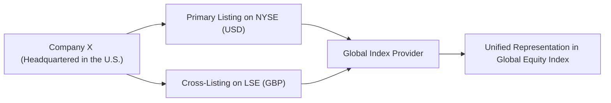

## Introduction

Cross-listing—that is, when a company lists its shares on multiple stock exchanges in different countries—has become more common in an increasingly globalized world. Think of a popular tech company based in the United States deciding to cross-list on the London Stock Exchange. This move may help the firm tap a new pool of investors, expand its brand, and potentially reduce its cost of capital. But cross-listing also introduces complexities from the perspective of global equity indexes. And by complexities, I’m talking about possible double counting, currency conversions, different listing regulations, and how these factors shape the performance of the global indexes themselves.

In this section, we’ll break down the meaning of cross-listing, highlight the potential challenges it creates for index providers, and discuss the implications for both companies and investors. I remember the first time I encountered this issue in practice: my team was analyzing a global equity index and realized that one major multinational conglomerate was included twice—once from its domestic listing and once from its foreign listing. That overlap, while small, distorted our total weighting and skewed risk measurements. Since then, I always keep a close eye on how cross-listed shares are accounted for.

## Defining Cross-Listing

Cross-listing happens when a company that’s already listed on one exchange chooses to be listed on one or more additional exchanges in different markets. Historically, major international firms, such as Toyota, IBM, or Nestlé, have employed cross-listing as a strategic tool to:

• Diversify their investor base and gain visibility.  
• Increase market liquidity of their shares.  
• Potentially lower the cost of capital by attracting a global pool of investors.  

To facilitate cross-listings, firms often must comply with rules from multiple regulatory bodies. A U.S. firm listing in London, for instance, might have to issue depositary receipts, comply with UK disclosure standards, and keep track of exchange rate fluctuations.

## Impact on Global Equity Indexes

### 1. Index Calculation Challenges

From a global equity index perspective, cross-listing creates unique hurdles. If a U.S.-based multinational is listed in New York and London, and both those listings feed data into a broad global index, there’s a risk of double counting. This can artificially inflate the overall market capitalization contribution of that single issuer in the index.

#### Double Counting and Overlap

Picture an index provider that aggregates data from numerous local or regional indexes to compile a “global” index. That provider must ensure that General Electric’s New York listing (for example) and its London cross-listing aren’t both included in the final weighting. If they are, the index effectively double counts the company’s size, making it look bigger or more influential than it is. That might distort index-based analysis, especially for portfolio managers who rely on these indexes as benchmarks for performance or asset allocation.

#### Currency Conversion

Then there’s the currency conversion issue. Global equity indexes aren’t just about collecting the local currency share prices and tossing them into a big basket. Each listing is in the local currency of the given exchange. So, if a U.S. firm’s shares trade in British pounds for the London listing, the index provider needs to convert that pound-based price into a base currency—often U.S. dollars—to calculate the index level consistently. Frequent exchange rate fluctuations complicate the daily revaluation picture.

#### Local Listing Rules

Indices also need to consider local listing restrictions. Some exchanges might have stricter disclosure standards than others, or some might allow certain share classes but not others. This can lead to slight differences in share price or even share structure (like different voting rights). All these nuances potentially affect how the index is weighted.

Below is a simple chart that shows how a single issuer might be represented across different stock exchanges and how an index provider might want to unify that representation:

In this simplified diagram, you see how the same company’s shares feed from multiple listings into a single global index. The challenge is to ensure that the shares aren’t double counted, are converted into the correct reference currency, and comply with local listing nuances.

### 2. Benefits for Companies

Cross-listing isn’t just a messy complication for index providers—there are plenty of upsides for companies that choose to do it. In my opinion, it can be a strategic tool for brand recognition and global footprint expansion.

• Greater Visibility and Investor Base  
  A European investor who typically invests through the London Stock Exchange might not have easy or direct access to a U.S.-only listing. By cross-listing, the company opens its doors to a new group of investors. Moreover, the firm gains media coverage and analyst followings in multiple markets.

• Improved Liquidity  
  Listing in different time zones can smooth out trading volumes over a longer portion of the 24-hour cycle, potentially lowering bid-ask spreads and volatility. Not to mention, many big institutional investors prefer or require investing in securities that trade in their local markets.

• Lower Cost of Capital  
  With a more diverse investor base, the required return on equity might decline, reflecting a broader set of investors, different risk appetites, and potentially less country-specific risk.

### 3. Considerations for Investors

If you’re an investor building a globally diversified portfolio, cross-listings matter because they can affect both your portfolio composition and your exposure to currency risk.

#### Tracking Inclusion in Global Indexes

You’ll need to discern how each index deals with cross-listed shares. Do they include both listings, or just one? Are depositary receipts (ADRs, GDRs) also included, or are they excluded? Be aware that your global equity ETF or mutual fund might similarly handle cross-listings in different ways, which could lead to unintended overexposure to a single company.

#### Managing Currency Risk

It’s not just about whether the index double counts. You, as an investor, might hold the shares in local currency form. So, you have to watch out for currency fluctuations. Even if the underlying company is fundamentally sound, changes in the USD/GBP rate, for instance, could swing your returns.

#### Variation in Share Performance

Occasionally, you will see the same company trading at slightly different prices across two or more exchanges. This might reveal short-term arbitrage opportunities, but it can also reflect differences in trading hours, local tax treatments, or investor sentiment in that region. It may be tempting to exploit these mismatches, but execution costs and timing issues often mean the advantage is smaller than you’d think.

### Common Pitfalls in Index Construction with Cross-Listings

• Failing to conduct thorough screening for duplicate listings.  
• Not applying consistent currency conversion rates in real time.  
• Overlooking distinct share classes when the firm lists separate share categories on different exchanges.  
• Ignoring local tax treatments on dividends or capital gains that might cause price discrepancies.  

### Real-World Example

One notable historical case: In the early 2000s, a large global telecommunications provider cross-listed its shares on the NYSE while maintaining its primary listing in Europe. Several global indexes at the time used different data sources, and some ended up including both the American Depositary Receipts (ADRs) on the NYSE and the ordinary shares from the primary European listing. For months, the weight of this firm in certain “global” indexes was overstated. As a result, index-tracking mutual funds were inadvertently overweight in that telecom, which introduced more country-specific and sector-specific risk than intended.

This fiasco led many index providers to refine their rules. Now, standard practice is to treat ADRs or cross-listings as the same economic asset, using the issuer’s global market cap (considering all listings) to determine a single weighting. That was a tough lesson learned but an effective catalyst for improved index methodologies.

### Best Practices for Cross-Listing in Indexes

• Consolidate Market Caps: Index providers typically sum up the market caps of all cross-listings but then use only one consolidated figure for weighting.  
• Track One “Home” Listing: Some indexes designate a “primary” market for each company’s listing to avoid duplication.  
• Transparent Currency Conversions: Index methodology documents usually specify the exchange rate data source and time of day used for conversions.  
• Periodic Audits: Conduct routine checks for double counting or for changes in share structures, especially in reconstitution periods.

### Conclusion

Cross-listings can help companies broaden their investor base, boost liquidity, and lower their cost of capital, but they also create unique challenges for global equity indexes and for investors who track those indexes. Whether you’re an index provider, a portfolio manager, or an individual investor, it’s crucial to understand the intricacies of cross-listing and to keep a watchful eye on how these listings are captured—especially in a world where capital moves swiftly across borders and currencies can fluctuate by the minute.

In the end, cross-listing can be a tremendous strategic benefit for companies and a valuable trading avenue for investors, provided everyone is aware of the complexities lurking behind. And yes, those complexities might mean a bit of extra homework for all of us, but as with most things in finance, better knowledge leads to better decisions.

## Glossary

• Cross-Listing: Listing a company’s stock on multiple stock exchanges across different countries.  
• Currency Conversion: Exchange-rate adjustments needed to translate one currency into another for index calculation or return measurement.  
• Overlap/Double Counting: Occurs when the same company is included multiple times in an index due to multiple listings.  

## References and Further Reading

• Karolyi, G. A. (2006). “The World of Cross-Listings and Cross-Listings of the World: Challenging Conventional Wisdom.” Review of Finance.  
• Coffee, J. C. (2002). “Racing Towards the Top? The Impact of Cross-Listings.” Columbia Law Review.

• For additional context on global listing standards:  
  – CFA Institute, “Equity Investments,” 2023 Curriculum, for discussions on market structures and cross-border listings.  
  – International Organization of Securities Commissions (IOSCO) guidelines on cross-border regulation: www.iosco.org

----------------------------------------

## Exam Tips for CFA Candidates

1. Know how index providers account for cross-listings—especially in weighting and rebalancing.  
2. Be prepared to see scenario-based questions about double counting, currency risk, or how to handle ADRs in a global equity portfolio.  
3. Familiarize yourself with key differences in listing requirements between major exchanges (e.g., NYSE vs. LSE vs. Tokyo Stock Exchange).  
4. Practice calculating the impact of currency conversions on index values, particularly if the base currency for the global index is different from the local listing currency.  
5. Understand how to evaluate liquidity changes and cost of capital benefits for a cross-listed firm—this knowledge can pop up in a broader equity valuation question.

----------------------------------------

## Test Your Knowledge: Cross-Listings and Global Equity Indexes



### How can cross-listing affect the calculation of a global equity index?  
- [ ] It has no impact on calculations, as each market price is treated independently.  
- [ ] It always increases volatility.  
- [x] There is a potential risk of double counting the same issuer if index providers do not consolidate market caps.  
- [ ] It simplifies currency conversions across markets.  

> **Explanation:** Cross-listing can result in duplicate representation of the same firm’s shares if the index provider fails to consolidate data for that issuer.  

### Which of the following is a primary benefit of cross-listing for a company?  
- [ ] Reduced exposure to currency risk.  
- [x] Access to a broader investor base.  
- [ ] Elimination of regulatory requirements.  
- [ ] Guaranteed higher valuation.  

> **Explanation:** By cross-listing, a company can appeal to international investors who may not invest directly in the primary exchange.  

### In a global equity index, currency conversion is relevant because:  
- [x] Share prices across different exchanges may be denominated in different currencies.  
- [ ] All share prices are reported in the same currency automatically.  
- [ ] Volatility is only measured in local currency terms.  
- [ ] The base currency is determined by the company’s headquarters.  

> **Explanation:** Index providers must convert local currencies to a common base currency (often USD) to calculate and compare values consistently.  

### A key risk for investors who track global indexes with cross-listed securities is:  
- [ ] Having to pay double taxes on the same security.  
- [x] Unintentionally holding a larger-than-intended exposure to a single company if double counting occurs.  
- [ ] Not being allowed to hold shares in multiple countries.  
- [ ] Higher fees for index-based funds.  

> **Explanation:** If an index double counts an issuer, investors following that index may exceed their desired concentration risk.  

### An advantage to investors when a stock is cross-listed includes:  
- [x] Potentially improved liquidity and wider hours for trading.  
- [ ] Guaranteed arbitrage profits between different markets.  
- [x] Easier access to a company’s shares if one market is more familiar.  
- [ ] Elimination of currency risk on foreign holdings.  

> **Explanation:** Investors benefit from higher liquidity and the convenience of buying shares in their local market or currency; however, there is no guarantee of arbitrage profits or elimination of currency risk.  

### When a cross-listed firm’s weight in a global equity index is inflated, it is most likely due to:  
- [ ] Overstatement of the firm’s earnings.  
- [x] Double counting its total market capitalization across multiple exchanges.  
- [ ] Regulatory penalties imposed on the firm.  
- [ ] Inaccurate accounting of dividends.  

> **Explanation:** Double counting occurs when the identical economic asset is counted from multiple listings in calculation of the overall index weight.  

### Why might different prices emerge for the same firm’s cross-listed shares on two exchanges?  
- [x] Differences in local demand and supply, trading hours, or tax regimes.  
- [ ] Temporary mismatch in the technology employed by the exchanges.  
- [x] Delays in arbitrage due to transaction costs or market inefficiencies.  
- [ ] Global indexes force a single uniform price.  

> **Explanation:** Multiple local factors, including trading friction, tax rules, and separate investor bases, can result in price discrepancies across exchanges.  

### One common practice to prevent double counting in a global equity index is to:  
- [x] Consolidate shares into a single weighting using the firm’s total global market capitalization.  
- [ ] Track every share class independently.  
- [ ] Omit shares of cross-listed firms altogether.  
- [ ] Convert all foreign listings to ADRs.  

> **Explanation:** Modern index providers typically create a unified weighting for each issuer that accounts for all outstanding shares, ensuring that the total weight in the index is correct.  

### How does currency risk factor into holding cross-listed shares?  
- [x] Each share trades in a local currency, so an investor may face exchange rate fluctuations.  
- [ ] Currency risk is irrelevant once the shares are purchased.  
- [ ] Cross-listing stabilizes the company’s exchange rate.  
- [ ] Exchange rates are only a concern in fixed-income markets.  

> **Explanation:** Even though it’s the same company, investors buying the cross-listed share in London, for instance, face currency risk if their functional currency is something other than GBP.  

### True or False:  
Including both the primary listing and a cross-listing of the same firm in an index is generally considered best practice because it provides more data points for analysis.  

- [ ] True  
- [x] False  

> **Explanation:** Best practice is to avoid inflating the firm’s nominal weight. Index rules typically consolidate the cross-listed shares to prevent double counting.  


