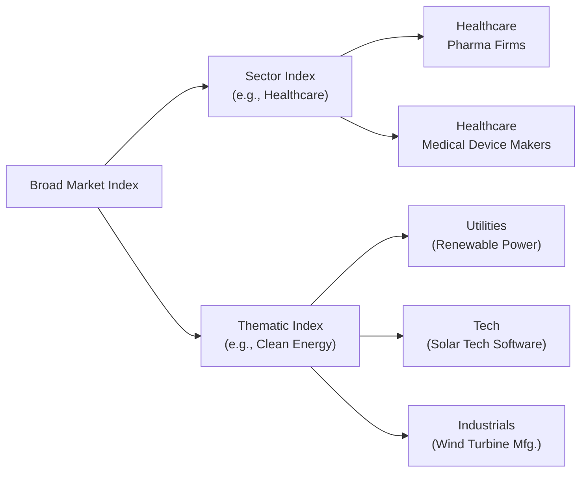

## Introduction and Overview

So, have you ever had that moment when you’re absolutely convinced a certain trend is going to revolutionize the world—like clean energy, artificial intelligence, or maybe even 3D printing? The feeling is pretty exciting, and sure, you might want to invest in that theme. But you might be unsure how to build a balanced approach. Instead of hunting down individual stocks, one way to crystallize your conviction is through a thematic index. Thematic indexes bundle together firms that share a common “big idea,” such as renewable energy or robotics, even if they don’t all belong to the same industry classification. Meanwhile, sector-focused indexes allow you to concentrate your exposure on one defined area like financials, tech, or healthcare. These specialized indexes can play powerful roles in modern portfolio management—but they also come with unique risks.

Below, we’ll explore how thematic and sector-focused indexes are built, why investors use them, and how they fit into broader equity strategies. We’ll highlight some personal insights (and even a few small missteps) to remind you that this is a continuously evolving field. The best approach uses both the art and science of investing.

## Defining Thematic and Sector-Focused Indexes

### Thematic Indexes
A thematic index focuses on a unifying concept rather than a strict industry classification. It brings together companies that are linked by broader trends or technologies—like cloud computing, electric vehicles, or blockchain. While these companies might operate in different sectors (think tech, industrials, and even consumer discretionary), they share a common thread that supports the overall theme.

• Example: Thematic Clean Energy Index  
  This might include wind turbine manufacturers, solar panel producers, battery storage specialists, and even industrial conglomerates venturing into renewable power. Sure, these companies span multiple traditional sectors, but collectively they benefit from the ongoing shift toward low-carbon energy.

### Sector-Focused Indexes
A sector-focused index, on the other hand, tracks firms that operate in the same GICS (Global Industry Classification Standard) or major industry grouping. For instance, a healthcare sector index would include pharmaceuticals, biotech firms, medical equipment manufacturers, and healthcare service providers, all neatly tied to a single sector classification.

• Example: A Healthcare Sector Index  
  This index typically includes large pharma companies, biotech upstarts, hospital systems, and medical device innovators. Despite the range of activities, they’re all squarely in healthcare.

## Purpose and Value

### Targeted Exposure to Growth or Cyclical Opportunities
Investors often turn to thematic or sector indexes to express macroeconomic or strategic views. For instance, if you believe demand for electric vehicles is poised to boom, a robust electric-vehicle-themed index might allow you to tap that growth across the entire supply chain—battery production, specialized software, automotive manufacturing, etc. Alternatively, if you suspect a rising interest-rate environment will benefit financial institutions, you might tilt your portfolio with a financial sector index.

### Diversification of Specific Risk
When you buy a single stock, you face the idiosyncratic risk that particular company might fail to thrive, even if the underlying theme or sector is on the rise. Themed or sector-based indexes distribute that firm-specific risk across multiple constituent companies. It’s not as diversified as a broad-market index (like the S&P 500), but it helps mitigate risk better than a single-company bet.

### Lower Transaction Costs and Simplicity
Purchasing an exchange-traded fund (ETF) that tracks a thematic or sector-focused index can often be a cost-effective way to gain instantaneous exposure. This can spare you from transacting in many individual stocks, not to mention the complexity of rebalancing them. If you’re bullish on a sector, you might prefer a sector ETF instead of juggling multiple single-company positions.

## Construction and Index Methodologies

As introduced in Section 3.1 (Index Construction and Weighting Methods), indexes can be built with different weighting schemes. This is especially relevant for thematic and sector-focused indexes:

• Market-Cap Weighting: Companies are weighted according to their size in the market. Large players dominate the index.  
• Equal Weighting: Every constituent gets the same weight, capturing smaller firms that might grow quickly.  
• Factor-Based Weights: Some thematic indexes tilt toward companies with higher R&D intensity, stronger revenue growth, or other relevant metrics.

Consider, for example, a robotics-themed index that chooses constituents based on a combination of market cap, revenue allocation to robotics, and a “technological leadership” score. Such an index might be rebalanced periodically—say, quarterly—to ensure its holdings are actively reflecting the technology’s adoption trajectory.

## Risks and Constraints

### High Concentration and Volatility
Sector-centric or theme-centric investments inherently concentrate your portfolio in a narrower slice of the equity market. This can be a good thing if your thesis proves correct, but it also amplifies market exposure to that specific idea. If the theme or sector temporarily falls out of favor, you might experience painful drawdowns.

### Shifting Popularity of Themes
The success of a particular theme often depends on the sentiment and long-term viability of the trend. Suppose robotics or AI is “the next big thing,” but then unexpectedly strong regulation or changing market conditions dampens near-term enthusiasm. Thematic indexes can experience higher volatility if hype dissipates. While some remain relevant for decades, others can lose momentum after initial excitement.

### Illiquidity and Tracking Error
Some niche thematic indexes track companies that aren’t especially large or liquid. Investors might therefore face wider bid-ask spreads on the associated ETF. Additionally, if the index has specialized constituents, the tracking error between the index and the actual investment product could become elevated during volatile periods.

## Portfolio Applications

### Tactical Positioning
Sector-focused or thematic indexes can be used tactically to adjust your portfolio based on prevailing economic or market views. For instance, if you believe energy prices are set to jump in the short term due to supply constraints, you might overweight an index tied to the energy sector for a quarter or two.

### Complementary Satellites Around a Core
A well-established approach is the “core-satellite” portfolio structure. Your core might be a broad global equity index covering all industries. Then, you can add thematic or sector indexes as satellites to boost exposure to specific trends or to tilt your equity allocation. Perhaps you maintain a stable international equity core but overlay a healthcare sector ETF if you expect breakthroughs in biotech.

### Defensive or Cyclical Tilts
Sectors can be grouped into cyclical and defensive buckets, as covered in Section 3.2 (Types of Equity Indexes) and Chapter 7 (Industry and Competitive Analysis). In an economic expansion, cyclical sectors (industrials, consumer discretionary) may outperform, while in a recession, defensive sectors (utilities, consumer staples) might provide a cushion. Investors can pivot among sector-focused indexes to align with these macro shifts.

## Real-World Anecdote: 
I remember a friend who, with unwavering optimism, backed the solar power theme back in the early 2010s. Instead of picking a single solar firm, which can be risky if the technology or management falters, he invested in a broad clean energy ETF tracking a specialized index. Sure, it was bumpy—clean energy was quite volatile then—but he stuck with it. Eventually, when renewable energy picked up mainstream support, his thematic exposure offered significant outperformance compared to broader markets, though not every year was a win. The moral? Thematic indexes can be rewarding but expect to ride out some storms.

## Diagram: Thematic vs. Sector Index Exposure

Below is a simplified Mermaid diagram illustrating how a thematic index might span companies across multiple sectors while a sector index confines itself to a single classification.



Notice how the thematic index (Clean Energy) can cross different traditional sector boundaries (utilities, tech, industrials), while the healthcare sector index stays within its single vertical.

## Practical Example: Tracking A Solar-Themed Investment

Imagine you run a simple Python script to look at historical returns of a hypothetical “Global Solar Innovators Index” over the past five years. You compare it to a broad-world equity benchmark:

```python
import pandas as pd
import matplotlib.pyplot as plt

dates = pd.date_range(start='2018-01-01', end='2023-01-01', freq='M')
broad_world = [100 * (1 + 0.005)**i for i in range(len(dates))]
solar_index = [100 * (1 + 0.008)**i for i in range(len(dates))]

df = pd.DataFrame({
    'Date': dates,
    'BroadWorldIndex': broad_world,
    'SolarIndex': solar_index
})
df.set_index('Date', inplace=True)

df.plot(title='Hypothetical Solar Index vs. Broad Market', figsize=(10,6))
plt.show()
```

Had you personally invested in this solar-themed index, you might have seen sharper fluctuations but also higher growth if the solar theme remained strong. (This is just a stylized illustration.)

## Best Practices and Strategies

1. Perform Thorough Due Diligence  
   Delve into the index methodology. Ask: Which stocks are included? How often is the index reconstituted? Does it screen for revenue purity (percentage of sales tied to the theme)?

2. Align With Investment Horizon  
   If you’re adopting a short-term stance (e.g., six to 12 months) on a particular sector, sector indexes can be helpful. But if you believe in the transformative potential of a theme over the next decade, a thematic index with a longer runway might make sense.

3. Manage Concentrated Risks  
   Because thematic and sector indexes can be more volatile, make sure you size these positions appropriately in your overall equity portfolio. You might want a smaller allocation to these specialized indexes compared to your broad equity exposure.

4. Monitor Macro Factors  
   Keep an eye on macroeconomic trends, regulatory shifts, and global sentiment. Thematic investments may hinge on supportive policy environments (e.g., subsidies for renewable energy).

## Common Pitfalls

- “Hot Theme” FOMO (Fear of Missing Out): Chasing the latest buzz without understanding the fundamentals can lead to investing at skewed valuations.  
- Over-Diversification Across Themes: Stacking multiple thematic ETFs can result in an unintended overlap if the same companies qualify for multiple indexes.  
- Underappreciating Liquidity Risks: Small or emerging-themed indexes might contain illiquid constituents, creating issues around high transaction costs.

## Ethical and Governance Considerations

Some thematic indexes revolve around social or environmental ideals—like ESG or sustainability themes. Make sure you confirm that the index’s methodology truly aligns with your values. Greenwashing can be a concern if index providers define “clean” or “sustainable” in superficial ways. Over in Chapter 10 (ESG Considerations in Equity Investments), we delve deeper into best practices for evaluating such claims.

## Exam Relevance and Time Management

• Constructed-Response Questions: On the CFA exam, you might be given a scenario that requires you to discuss how a thematic or sector-focused index can enhance or derail a portfolio’s risk/return profile. Focus on how each index’s composition addresses the investor’s goals and constraints.  
• Item Set Questions: Expect questions testing your understanding of how these specialized indexes are built or used tactically. You should be comfortable distinguishing between the narrower industry approach and a broad conceptual theme.  
• Calculation Tips: You might be asked to compare performance metrics (e.g., Sharpe ratio or tracking error) for a thematic vs. a sector index.

When tackling these exam questions, remember to watch the clock. Emphasize the “why” behind each investment choice: Why a specific access vehicle? Why this weighting scheme? In essay-type responses, clarity on fundamentals can be as important as the final numeric answer.

## References and Further Reading

• Global Industry Classification Standard (GICS):  
  https://www.msci.com/gics

• Morningstar Thematic Investing Research:  
  https://www.morningstar.com/topics/thematic-funds

• Handley, S. (2020). “The Rise of Thematic Investing,” The Journal of Index Investing.

• For additional insights on sector analysis, see Chapter 7: “Industry and Competitive Analysis” in this volume.

• For more on how indexes are constructed, revisit Section 3.1: “Index Construction and Weighting Methods.”

• For an understanding of cyclical vs. defensive sectors, see Section 3.2: “Types of Equity Indexes” and Chapter 7.  

-----

## Test Your Knowledge: Thematic and Sector-Focused Index Strategies



### Which of the following best describes a thematic index?

- [x] An index focused on companies linked by a common investment concept rather than a strict industry classification.
- [ ] An index of large-cap companies from a single country.
- [ ] An index of high-dividend-yielding utilities only.
- [ ] An index tracking the largest companies by market capitalization within one sector.

> **Explanation:** A thematic index targets a broader idea or concept that may span multiple industries (e.g., renewable energy or robotics).  

### When would an investor most likely use a sector-focused index?

- [ ] When seeking immediate exposure to multiple unrelated trends.  
- [x] When expressing a macroeconomic view on a specific industry, such as healthcare or energy.  
- [ ] When trying to invest passively in a broad-based global equity market.  
- [ ] When mitigating market-wide systemic risks.

> **Explanation:** Sector-focused indexes concentrate on a single sector and are often used to implement a view on that specific industry’s performance.

### Which of the following is a key risk when investing in thematic indexes?

- [ ] They have lower volatility than broad indexes.  
- [x] They can become obsolete if the theme falls out of favor or fails to materialize as expected.  
- [ ] They are insulated from macroeconomic headwinds.  
- [ ] They typically contain all the same constituents as a broad equity index.

> **Explanation:** The viability of a thematic index depends heavily on the theme. If market sentiment shifts or the theme turns out to be less transformational, performance can suffer.

### In a core-satellite approach, how are thematic or sector-focused indexes typically used?

- [ ] They replace the broad equity core entirely.  
- [ ] They form the majority of the portfolio to reduce concentration.  
- [x] They complement a broad equity core to capture specific growth or strategic opportunities.  
- [ ] They serve solely as shorting vehicles for portfolio hedges.

> **Explanation:** Investors may use a broad-based equity index as the portfolio’s core holding and add smaller thematic or sector indexes to gain exposure to specific trends.

### Which construction methodology could help reduce concentration risk in a thematic index?

- [x] Equal weighting of constituents.  
- [ ] Market-cap weighting that favors the largest companies.  
- [x] Factor-based weighting with strict inclusion criteria.  
- [ ] Market weighting based on historical dividend yield only.

> **Explanation:** Equal weighting prevents the largest firms from dominating the index, and factor-based weighting can spread exposure across companies that meet multiple criteria (e.g., high R&D intensity, pure thematic revenue).

### Which of the following is a potential advantage of using a sector ETF rather than individual stocks?

- [x] Reduced idiosyncratic risk by diversifying across multiple companies in the same sector.  
- [ ] Lower correlation to broader market trends.  
- [ ] Elimination of any sector-specific risk.  
- [ ] Guaranteed outperformance of active managers.

> **Explanation:** A sector ETF spreads your risk across the entire sector and typically has lower transaction costs than building a basket of single stocks, but it won’t eliminate sector-specific risk.

### If an investor believes that the economy is about to enter a slowdown, and they want a more defensive stance, which index would they potentially emphasize?

- [x] A consumer staples sector index.  
- [ ] A discretionary consumer products index.  
- [x] A utilities-focused index.  
- [ ] A technology growth index.

> **Explanation:** Defensive industries such as consumer staples and utilities often hold up better in economic downturns due to consistent demand.

### How might liquidity be a concern in thematic index investing?

- [x] Some thematic indexes focus on smaller or niche companies with less actively traded shares.  
- [ ] Thematic index constituents always have higher trading volume than blue-chip stocks.  
- [ ] Thematic ETFs are always extremely liquid, regardless of market conditions.  
- [ ] Indexes have no influence on trading costs.

> **Explanation:** Niche companies may have lower liquidity, causing wider bid-ask spreads or higher transaction costs.

### Which statement about sector-focused indexes is correct?

- [x] They offer targeted exposure to a single industry, such as financials, healthcare, or technology.  
- [ ] They track companies globally across many diverse industries that share a common theme.  
- [ ] They typically span multiple economic sectors with minimal overlap.  
- [ ] They provide exposure to a range of emerging-market debt securities.

> **Explanation:** Sector-focused indexes concentrate on firms in the same sector, enabling investors to make targeted decisions based on their sector outlook.

### True or False: Thematic indexes are less volatile than broad-market indexes because they include fewer stocks.

- [x] False  
- [ ] True

> **Explanation:** Thematic indexes are often more concentrated, which can increase, not decrease, their volatility relative to broad-market indexes.


