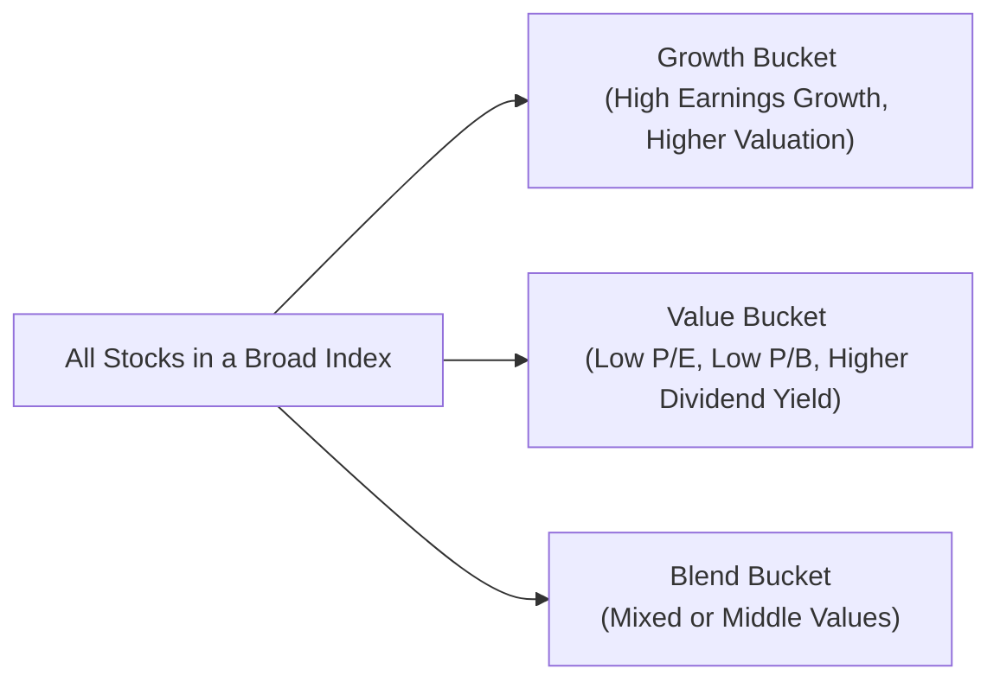
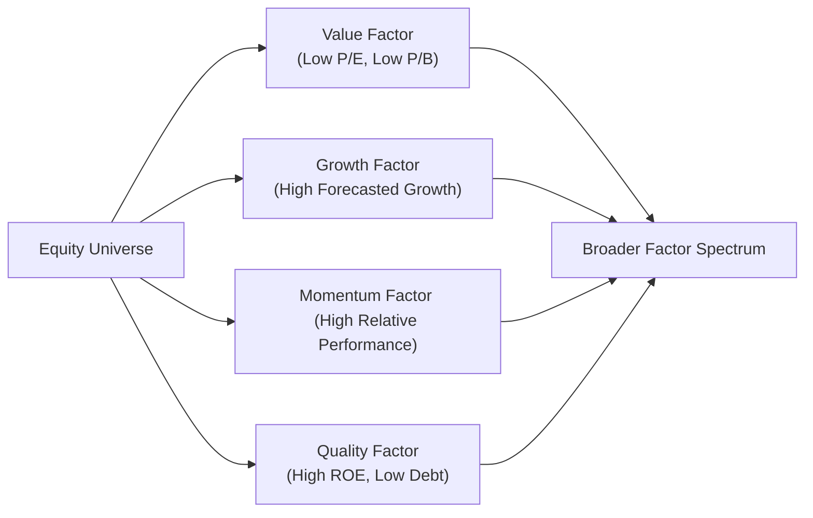

## Introduction

Sometimes I think back to my early days in investing—just me, a stack of stock tables, and a half-dozen dog-eared finance books. You know, I'd flip through these books trying to figure out why some stocks were considered “cheap” and others were called “overpriced,” yet seemed to skyrocket in value. Little did I know, I was stepping into the world of style and factor investing: a domain where we categorize stocks (and sometimes broader sets of assets) according to shared characteristics, such as growth potential or valuation metrics.  

In this section, we build on the foundational concepts introduced in prior sections of this chapter (see 3.1 Index Construction and Weighting Methods) and expand the discussion to more specific “style” and “factor” approaches. While market indexes are often considered broad benchmarks, style indexes slice and dice that market based on certain attributes—like value or growth—that reflect different risk-return profiles. Factor investing, a related but more granular concept, zooms in on the underlying drivers of returns (think size, momentum, quality, and so on). Understanding these approaches is a huge step toward building well-rounded equity portfolios and controlling for unintended bets in active management.

## Growth vs. Value

A big chunk of style investing can be boiled down to one fundamental question: Are we looking for high-growth stocks or undervalued (potentially mispriced) stocks? Let’s break it down:

### Growth Investing

Growth investing targets firms with higher-than-average future growth potential—measured by revenue expansion, earnings growth, or even user-base growth for certain new tech or biotech names. These companies often trade at higher P/E (price-to-earnings) and P/B (price-to-book) ratios, reflecting the market’s optimism about their future.  

• Example: Suppose a tech startup has a current earnings per share (EPS) of US$1, but analysts forecast it to grow by 25% per year over the next five years. If investors value that trajectory highly, the stock might trade at lofty multiples far above legacy industrial firms.  
• Main Rationale: Growth investors accept paying more now in hopes that current metrics will look cheap later when the firm’s revenue or earnings expand substantially.  
• Potential Risks: Everything is great until growth fails to materialize. If a once-hot business stumbles, that high valuation can collapse quickly—leading to substantial downside.  

### Value Investing

Value investing is all about buying what appear to be undervalued stocks (low P/E, low P/B). In other words, you’re bargain hunting—often focusing on companies that have strong fundamentals but might be out of favor.  

• Example: A steel manufacturer trades at a P/E of 8, below its industry average of 12, due to recent declines in commodity demand. Value investors investigate whether the firm’s fundamental strength is still intact. If so, they might see an opportunity.  
• Main Rationale: If the stock is truly mispriced and eventually recovers, investors may lock in both capital appreciation and a potential margin of safety.  
• Potential Risks: Not all cheap stocks are hidden gems—some are genuinely flawed. “Value traps” can ensnare investors if the firm’s problems are deeper than expected or if markets are rationally discounting a deteriorating outlook.

## Factor Overlaps

Style indexes such as “growth” or “value” often capture certain factor exposures. A single factor, like “value,” might be measured by P/B or P/E. But there can be overlaps or subtle differences that creep into these strategies:

• Overlapping Factors: A stock that ranks high on value metrics might also pick up a small-cap factor tilt (size factor) or a quality factor tilt (if it has strong balance sheet metrics), which can unintentionally magnify the investor’s risk in a certain direction.  
• Avoiding Double-Counting: Suppose you allocate to a “value index ETF” and also add a “quality factor” portfolio. If the components overlap significantly, your total portfolio can become overly exposed to large-cap cyclical stocks that happen to have good fundamentals and low P/B ratios. Understanding factor overlaps helps align your overall exposure.  

The idea is to treat style or factor exposures in a holistic way—much like an orchestra conductor ensuring that all instruments blend well. If you load up on too many “value-tilt” strategies, part of your portfolio’s performance might hinge on the same signals being repeated, making returns more volatile and less diversified than you hoped.

## Style Index Construction

In prior sections (3.1, “Index Construction and Weighting Methods”), we explored how indexes can be weighted by market cap, price, or more advanced methods. Style indexes go one step further by classifying stocks into growth, value, or blend categories. Then, each subgroup can be separately tracked.

• Growth vs. Value Segmentation: Index providers typically look at a range of metrics (e.g., P/B, forward earnings growth, or dividend yields). They assign each stock a “score” based on how “value” or how “growth” it is.  
• The Blend Zone: Inevitably, some stocks do not cleanly fit into pure growth or pure value. These land in the “blend” category, which is exactly what it sounds like—a middle ground with features of both.  
• Reconstitution: Because corporate fundamentals change over time—maybe a “value” stock transforms into a high-growth success story—index providers must rebalance or reconstitute their style indexes periodically, often annually or semiannually. This ensures the index remains in line with its stated methodology.  

In practice, the Russell 1000 Growth Index and Russell 1000 Value Index are prime examples. The Russell 1000 Growth might rely on forecasted earnings growth, historical sales growth, and price momentum. Meanwhile, the Russell 1000 Value emphasizes lower valuation metrics—like P/B or dividend yield. These indexes are reconfigured regularly, so membership can change.  

Below is a mermaid diagram illustrating how an index might be segmented into growth and value:

## Implementation

### Style-Based ETFs and Mutual Funds

Institutions and retail investors alike often use ETFs (Exchange-Traded Funds) or mutual funds that track style indexes to implement a growth or value tilt. These vehicles replicate the constituents of benchmarks like the Russell 1000 Growth or MSCI Value by holding each underlying stock in proportion to its index weight.  

• Advantages:  
  – Diversification: You capture a broad swath of either growth-y or value-oriented companies.  
  – Low Cost: Often more cost-effective than traditional active managers.  
  – Transparency: Daily holdings and minimal turnover surprises.  

• Disadvantages:  
  – Limited Flexibility: You’re locked into the index’s methodology.  
  – Rigid Strategy: If the style falls out of favor, you have little recourse unless you exit or rebalance.  

### Factor-Tilted Strategies

Factor investing can be viewed as an advanced form of style investing. Instead of just “value” or “growth,” factor strategies target exposures like size, momentum, quality, low-volatility, or profitability. For instance:  

• Low Volatility Factor: Focuses on stocks with historically lower price volatility.  
• Momentum Factor: Emphasizes stocks with strong relative performance over a certain period.  
• Quality Factor: Targets stocks with robust return on equity (ROE), stable earnings, low debt, etc.

Many investors combine multiple factors for a diversified factor portfolio. For instance, you can be “value + momentum.” Of course, watch out for correlation among factors.  

### Combining Style and Factor Strategies

In practical portfolio management (see also 9.3 Price Multiples and Relative Valuation), you might incorporate style-based indexes while also layering on factor tilts. Perhaps you buy a “value ETF” to anchor your equity exposure, then use an “overlay” or “smart beta” strategy that complements it with a momentum tilt. The intention is to shape your overall factor profile to match your desired risk-return appetite.

## Best Practices and Common Pitfalls

1. Over-Concentration in One Factor:  
   – If you pile on multiple “value” strategies, your portfolio risk might converge around macroeconomic conditions that favor cheap cyclical stocks (including credit-sensitive or commodity-driven names).  

2. Chasing Performance:  
   – Sometimes growth outperforms for years at a stretch, luring investors to abandon a balanced approach. Then a market rotation hits, and those purely growth-oriented portfolios suddenly lag.  

3. Infrequent Rebalancing:  
   – If style indexes or factor portfolios fail to rebalance in line with fundamental changes, they can drift far from the intended factor exposures.  

4. Factor Timing:  
   – Attempting to time when each factor will outperform can be tricky. For instance, momentum strategies might flounder in volatile, flip-flopping markets. Meanwhile, a prolonged bull market sometimes penalizes defensive or value strategies.  

5. Liquidity Constraints:  
   – Some tilt or factor strategies delve into thinly traded small-cap stocks or emerging markets, which can create liquidity challenges and high trading costs.

## Real-World Example: Growth vs. Value Rotation

Let’s say you’re managing a pension fund. Over three years, growth stocks absolutely trounce value stocks, and you notice your large-cap growth exposure is generating big gains. You might be inclined to go all-in on growth. But you recall what you read in The Intelligent Investor (Graham, 2009)—the market can swing. Sure enough, macroeconomic shifts drive interest rates up, making future earnings of growth companies less appealing in discounted cash flow models. Suddenly, value-oriented and dividend-paying stocks surge. By maintaining balanced exposures, your portfolio avoids the whiplash.  

This scenario underscores the cyclical nature of style investing: Growth can dominate for extended periods. Then, when fundamentals or investor sentiment changes, value can roar back.  

## Additional Diagram: Factor Interactions

The above diagram tries to show how different factors can intersect in a single stock. A growth-oriented stock might also have strong momentum or quality. This interplay creates complex risk exposures—one reason portfolio managers pay close attention to factor overlaps.

## Exam Relevance and Tips

• **Scenario-Based Questions**: On the CFA exam, you might see a scenario presenting a portfolio that has drifted into a large “value” tilt. You would be asked to discuss the potential risks or how to rebalance using factor-based strategies.  
• **Quantitative Examples**: You could be asked to calculate how shifting a portfolio’s allocation from a broad cap-weight index to a growth-tilted index impacts expected return or tracking error.  
• **Behavioral Finance Links**: Overconfidence (explored in Chapter 4) might cause investors to hold onto growth winners too long, or the disposition effect might push them away from cheap value plays at precisely the wrong time.  
• **Regulatory Context**: While style/factor investing frameworks aren’t heavily regulated as products, the CFA Code of Ethics demands proper disclosure of strategy, fees, and risks, especially in areas where “smart beta” marketing might be misconstrued.

In the exam’s constructed-response and item-set questions, be prepared to demonstrate both conceptual understanding (e.g., how style indexes are formed) and the ability to interpret charts or factor exposure data. You might need to articulate how certain factor tilts can help or hurt a portfolio in specific market conditions.

## Glossary

• Growth Investing: A strategy targeting companies with above-average growth potential in revenue, earnings, or both. Often associated with higher valuation ratios.  
• Value Investing: A strategy focusing on undervalued companies relative to their fundamentals, often measured by ratios like P/E or P/B.  
• Blend: A style category capturing stocks that fall between strict growth and value classifications.  
• Factor Overlaps: The unintentional overlap of multiple factor exposures that can lead to concentrated risk.  
• Reconstitution: The periodic rebalancing of an index to maintain its factor or style classifications.

## References and Further Reading

• Barra (n.d.). “Equity Factor Models.” https://www.msci.com/our-solutions/factor-investing  
• Graham, B. (2009). “The Intelligent Investor.” HarperCollins.  
• Jegadeesh, N., & Titman, S. (1993). “Returns to Buying Winners and Selling Losers: Implications for Stock Market Efficiency.” The Journal of Finance.  

Additionally, for a deeper dive into factor investing processes, the official CFA Institute curriculum includes extensive resources on performance attribution and factor modeling, particularly in advanced portfolio management contexts.

## Final Exam Tips

• Time Management: If a question mentions style or factor classification, quickly recall the main differentiators—growth vs. value metrics, factor definitions, reconstitution frequency. Provide concise, targeted answers.  
• Linking Concepts: Show the graders you can connect style investing to broader topics like market efficiency (Chapter 4), security valuation (Chapter 9), or industry analysis (Chapter 7).  
• Clear Explanations: Indicate where style or factor bets might enhance or undermine diversification, detailing both theoretical and practical implications.

All told, style and factor investing frameworks give us powerful ways to dissect and shape equity exposures. By paying attention to factor overlaps, reconstitution processes, and common pitfalls, you’ll keep your portfolio from unexpectedly drifting into unintended risk territory—and, hopefully, pick up some alpha along the way.

---

## Test Your Knowledge: Style and Factor Investing Approaches



### Which of the following best characterizes "growth" stocks?
- [ ] Stocks with low valuations relative to fundamentals.
- [ ] Stocks with high dividend yields.
- [x] Stocks with high projected earnings or revenue growth, often trading at higher valuations.
- [ ] Stocks that have lagged the broader market.

> **Explanation:** Growth stocks are those anticipated to grow faster than average, which typically comes with higher P/E or P/B ratios due to market optimism about future earnings.

### Which statement about value investing is most accurate?
- [x] It focuses on stocks trading below their intrinsic value based on fundamental indicators.
- [ ] It relies exclusively on stock momentum.
- [x] It sometimes results in “value traps” if the stock’s problems are more severe than expected.
- [ ] It requires strictly investing in high-tech companies promising fast gains.

> **Explanation:** Value strategies look for fundamentally strong, undervalued companies. However, apparent mispricing may stem from real issues, creating possible “value traps.”

### In style index construction, how are “blend” stocks typically classified?
- [x] They occupy the middle range between pure growth and pure value classifications.
- [ ] They are exclusively high-dividend stocks.
- [ ] They have demonstrated high volatility.
- [ ] They are limited to small-cap companies.

> **Explanation:** “Blend” stocks share characteristics of both growth and value or simply do not fit neatly into either category.

### A key concern when combining multiple factor-based portfolios is:
- [x] Overlapping exposures that could lead to sizable unintended risk concentrations.
- [ ] The inability to hold large-cap stocks.
- [ ] The requirement for frequent margin calls.
- [ ] The guaranteed diversification across markets.

> **Explanation:** When multiple factor strategies overlap, they amplify certain risk exposures instead of diversifying them, requiring careful monitoring.

### Growth investing strategies typically perform best in:
- [x] Periods of low interest rates and robust economic expansion.
- [ ] Periods of high interest rates and contracting economic environments.
- [x] Markets favoring future earnings potential over current valuation multiples.
- [ ] Prolonged bear markets with high volatility in commodities.

> **Explanation:** Growth stocks profit from supportive environments where investors prize future earnings and are not overly penalizing them with high discount rates.

### Which of the following can be a disadvantage of style-based ETFs?
- [x] Lack of flexibility if the style underperforms for a considerable period.
- [ ] Extremely high management fees compared to active funds.
- [ ] Inability to track index holdings or understand methodology.
- [ ] Guaranteed underperformance relative to the underlying style index.

> **Explanation:** Style-based ETFs are transparent and low-cost, but when a style falls out of favor, you have limited leeway other than rebalancing or selling the ETF entirely.

### Factor overlaps might cause:
- [x] A portfolio to double down on similar risk exposures unintentionally.
- [ ] A portfolio to automatically hedge all interest rate risk.
- [x] Automatic rebalancing to new factors every quarter without cost.
- [ ] No material impact on a fund’s performance or volatility.

> **Explanation:** Overlapping factor strategies introduce unintended concentration risks, potentially amplifying performance volatility if those factors shift.

### One function of index reconstitution in style/factor indexes is to:
- [x] Ensure each stock still fits the style or factor criteria as fundamentals evolve.
- [ ] Permanently remove any stock that has increased its dividend.
- [ ] Freeze the sector composition to avoid changes in factor exposures.
- [ ] Reduce index turnover to zero.

> **Explanation:** Reconstitution ensures the index accurately reflects the style or factor definitions by adding or removing stocks as their metrics change.

### A blend category in an equity style index primarily helps:
- [x] Classify stocks that do not squarely fit in pure growth or pure value.
- [ ] Identify highly leveraged companies.
- [ ] Separate small-cap from large-cap stocks.
- [ ] Screen stocks for ethical investing criteria.

> **Explanation:** “Blend” is simply the middle ground for stocks that exhibit characteristics of both growth and value or for which the metrics are inconclusive.

### The statement "Some cheap companies are cheap for a reason" refers to:
- [x] Value Trap
- [ ] Margin of Safety
- [ ] Efficient Market Hypothesis
- [ ] Growth Premium

> **Explanation:** A “value trap” occurs when a stock appears undervalued but is, in reality, justifiably cheap due to deeper structural or competitive issues.


