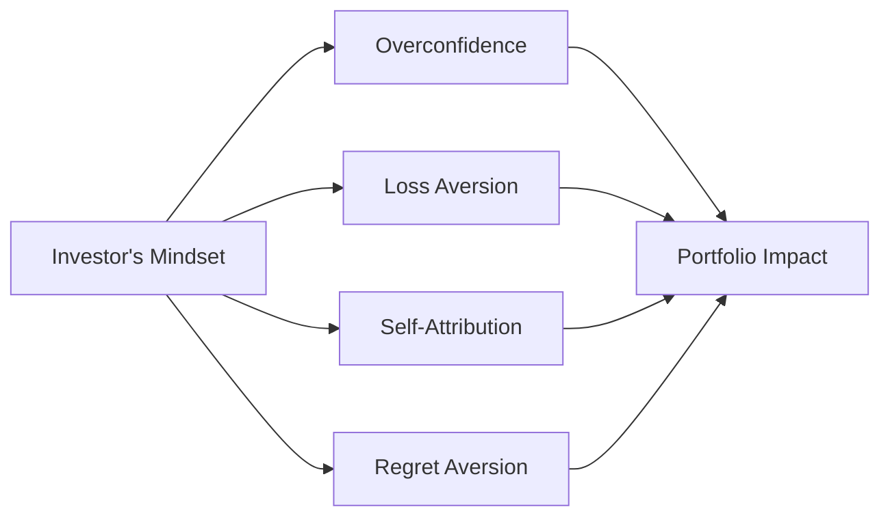

It’s easy to imagine yourself as a rational being—someone who always weighs costs and benefits accurately and makes logical choices. But, let’s be honest, we all have moments when our emotions or mental shortcuts cloud our decisions. In finance, such moments can have big consequences for portfolio performance. This section dives deep into four common behavioral traps—overconfidence, loss aversion, self-attribution bias, and regret aversion—and examines how these can manifest in real-world equity investing. We’ll also discuss strategies to mitigate these pitfalls and highlight what role institutional frameworks and behavioral coaching play in keeping investors on track.

## Overconfidence

Overconfidence might sound like something only super-arrogant people would have, but believe me, it sneaks up on everyone, including highly experienced analysts and portfolio managers. In fact, sometimes the more experience we have, the more susceptible we become to believing that our understanding of the market is faultless. Overconfidence in an equity context typically shows up as:

• Overestimating one’s forecasting skills or knowledge about a particular stock or industry.  
• Underestimating the possibility of negative outcomes.  
• Excessive trading frequency, because the investor believes they can consistently “time” trades or pick the next market winner.

You’ll often see overconfidence lead to concentrated positions in a favorite growth story. We might have an internal monologue like, “Oh, I’ve analyzed next year’s revenue growth in excruciating detail—this stock will definitely double.” Then we go all-in, ignoring signals that might point to an alternative outcome. In real life, I once had a friend (let’s call her Sam) who was certain a certain tech stock was going straight to the moon. She poured most of her portfolio into it. The stock soared, sure, but then a new regulation hammered the entire sector, and Sam realized she’d never even considered that regulatory risk. That’s overconfidence in a nutshell.

### How Overconfidence Forms

There’s a blend of psychological and environmental factors:

• Self-attribution: Whenever a trade goes well, we congratulate ourselves for being so astute; but if it fails, we blame the market or “bad timing.”  
• Confirmation bias: We hunt for data that supports our investing thesis and ignore data that conflicts with it.  
• Illusion of control: We think that through research, networking, or technical analysis, we can systematically outsmart market randomness.

### Effects on Trading Frequency

Research by Barber and Odean famously showed that individual investors (particularly those who are more overconfident) tend to trade more often—yet, their net returns typically underperform those who trade less. The culprit? Transaction costs, taxes, and sometimes missing bigger-picture moves because they focus too much on short-term trading signals. Overconfidence can wind up slicing into the portfolio’s long-term value.

## Loss Aversion

We all hate losing money—maybe more than we love gaining money. The “loss aversion” concept, championed by behavioral economists Daniel Kahneman and Amos Tversky, highlights that the psychological pain of a loss is significantly more powerful than the pleasure of an equivalent gain. So we do irrational things to avoid realizing a loss, which can potentially worsen our overall financial state.

### Holding onto Losing Positions

Ever held onto a stock for way too long, secretly hoping it would bounce back? We’ve all been there. Loss aversion can make you cling to losing stocks, even if the rational decision—as part of your broader portfolio strategy—would be to sell and deploy capital elsewhere. The desire to avoid “locking in” the loss leads investors to postpone the sale, often at the cost of incurring even bigger losses if the asset continues its downward spiral.

Consider a scenario: you buy a stock at $50, it drops to $40, and you refuse to sell. You think, “It’s not a loss until I sell.” But what if there’s new information predicting further declines? Failing to act can be costly. Many regrets revolve around “if only I had sold earlier…” but at the time, the pain or the fear of regret is so big that we ignore prudent rebalancing or any consistent sell-rule methodology.

### Loss Aversion vs. Risk Tolerance

Outside of the purely mathematical risk–return framework, loss-averse investors might appear highly tolerant of risk if it helps them avoid realizing a loss. They may take on even more risk (say, short-term margin loans or doubling down on a losing trade to “average down”) rather than booking a sure loss. Over the long haul, these decisions can hamper portfolio performance and intensify drawdowns.

## Self-Attribution Bias

Self-attribution bias is closely intertwined with overconfidence, but it’s slightly different. The core idea: you interpret successes as purely the result of your skill, and failures as the result of luck or unfortunate circumstances beyond your control. Picture a manager who invests in a certain biotech firm: if it shoots up, the manager congratulates themselves on great stock-picking technique; if it tanks, they quickly say, “Well, the FDA’s decision was simply unpredictable.” While some external factors are indeed unpredictable, repeated reliance on external blame fosters a blindness to one’s own mistakes, which in turn inflates overconfidence and can lead to repeating avoidable errors.

## Regret Aversion

Regret aversion is that uncomfortable feeling that we might make a choice and end up feeling sorry about it later. So guess what we do? Sometimes, we freeze up. We avoid making any decision at all or pick the “safe” choice simply to reduce the potential for regret. In investing, regret aversion can manifest as:

• Sticking to index-like portfolios rather than stepping out of line to buy undervalued or “strange” stocks, just in case we’re proven wrong.  
• Delaying necessary portfolio rebalancing because we fear soon after we sell, “that stock might rally, and I’ll regret missing out.”  
• Following the crowd (herding behavior) to limit personal regret if something goes wrong. At least we weren’t alone.

It’s a bias that can work against alpha generation and, ironically, might result in a portfolio mismatch with the investor’s real objectives and constraints.

## Portfolio Consequences of Behavioral Traps

We’ve got a bunch of biases swirling around—overconfidence, loss aversion, self-attribution, regret aversion—and they rarely come in isolation. Usually, these biases gang up on us. The results can be especially problematic for equity investors:

• Overtrading leads to higher transaction costs, short-term capital gains taxes, and missed compounding opportunities.  
• Holding onto losers drags portfolio returns and ties up capital that might be better deployed in more promising opportunities.  
• Lack of a consistent sell rule fosters complacency and fosters big drawdowns if you never want to realize a paper loss.  
• Excessive concentration leads to volatility spikes in your portfolio.  
• “Fear of regret” prompts suboptimal asset-allocation decisions—often a mismatch with one’s stated risk and return objectives.

Observe the following flowchart illustrating how these biases can flow into portfolio consequences:

Each arrow represents how these biases feed into real portfolio outcomes (like overtrading or not rebalancing). Pretty easy to see how a single investor’s mindset influences big decisions across the board.

## Mitigation Techniques

So, how do we stand guard against our own mental quirks? The key is to establish a disciplined and structured approach. That might sound a tad dull, but trust me—it’s essential for preserving long-term returns and emotional sanity.

• Pre-Defined Trading Rules: For instance, you can set a max drawdown threshold of 15% for any position before forcing a re-evaluation or sale. Having a mechanical approach reduces the meddling of emotions.  
• Performance Reviews and Devoted Reflection: Instead of only examining trades that worked out, keep a journal of every trading decision (including the rationale). Then review it with someone (or by yourself) a few months later to see if the logic was sound.  
• Checklists: Actually writing down reasons for entering and exiting positions can reduce knee-jerk decisions. For example, “I’m buying X stock. Thesis: cost leadership, rising demand in the e-commerce sector, strong brand. Risks: new entrants, raw material price spikes. Contingency plan: if X stock’s P/E surpasses 40 or margins degrade, we’ll reconsider.”  
• Rational Decision Frameworks: Tools like scenario analyses and Monte Carlo simulations can force you to systematically consider what might go wrong in a trade. They also give you a sense of distribution around potential outcomes, opening your eyes to uncertainty.  
• Diversification: As a broad rule, avoiding overconcentration through thoughtful allocation limits the damage from poor decisions in any single stock or sector.

## Behavioral Coaching

You might think, “I get it, so I can just fix this myself.” But it’s not that easy. Ask any sports champion: even they need a coach. Financial advisors or mentors can serve as “behavioral coaches,” helping you become aware of hidden biases and nudge you to follow your own rules.

• Repeatedly discussing goals, risk tolerance, and biases fosters an environment where investors are more conscious of emotional pitfalls.
• Advisors can also implement “nudges”—like auto-rebalancing or structured reviews—creating a consistent oversight mechanism.

The technique can be as simple as a monthly check-in call. “Hey, let’s see if your portfolio is still aligned with your financial plan. Your large-cap position just soared; should we scale down that position to maintain our target weighting?” By systematically revisiting these moments, the emotional storm that typically accompanies decisions is somewhat neutralized.

## Institutional Perspective

You may wonder: “Alright, but major institutions—like pension funds or large asset managers—surely have it all figured out, right?” Actually, behavioral biases are universal. Institutional investors are just as prone to overconfidence, misattribution, or regret aversion. Consider a fund manager who invests heavily in a trendy sector, only to watch it crash. The manager might rationalize it by saying, “Everyone else in the sector also got hit, so it wasn’t my fault.” This thinking can hamper the subsequent corrections needed to restructure the portfolio.

To mitigate these issues at the institutional level, large firms typically have risk committees, compliance oversight, and accountability processes that require managers to justify trades based on a well-documented methodology. They’ll use independent risk teams to question assumptions or run stress tests on proposed portfolio changes. While these processes are not foolproof, they create checks and balances—some level of friction that is healthy in ensuring decisions are not purely driven by intuition or emotion.

## Glossary

Overconfidence Bias: An inflated belief in one’s abilities or judgment accuracy.  
Loss Aversion: The tendency to experience the pain of losses more intensively than the pleasure of equivalent gains.  
Self-Attribution Bias: The tendency to credit successes to skill while blaming failures on luck or external factors.  
Regret Aversion: A hesitation to make decisions for fear of future regret, often leading to inaction or overly cautious choices.  
Trading Frequency: How often an investor buys or sells securities. High turnover can mean more transaction costs and potential tax implications.  
Structured Process: A deliberate, repeatable methodology for executing investment decisions—often involving checklists or specific rules.  
Behavioral Coaching: Guiding investors to recognize and mitigate emotional and cognitive pitfalls, commonly practiced by financial advisors.  
Risk Management Processes: Institutional or individual mechanisms for identifying, measuring, and controlling financial exposure. These can include stress testing, compliance audits, and oversight committees.

## References and Suggested Reading

• Barber, B. M., & Odean, T. (2001). “Boys Will Be Boys: Gender, Overconfidence, and Common Stock Investment.” The Quarterly Journal of Economics.  
• Shefrin, H. (2002). “Beyond Greed and Fear: Understanding Behavioral Finance and the Psychology of Investing.” Oxford University Press.  
• CFA Institute: [Investor Psychology Resources](https://www.cfainstitute.org/learning)

## Final Exam Tips

• Be prepared to recognize these biases from a short scenario description—on the exam, you might see a portfolio manager or investor’s approach and have to identify if overconfidence or loss aversion is at play.  
• When analyzing someone’s or your own portfolio decisions, keep an eye on telltale signs like reluctance to sell losers or repeated “lucky escapes” that you claim as skill.  
• In item-set or essay questions, demonstrate how structured trading rules and risk controls can mitigate these biases.  
• If you encounter a question on performance attribution, watch out for self-attribution bias. The exam might ask how to best address it—explain that consistent performance review processes or managerial oversight can curb it.  
• Practice identifying intangible (behavioral) risk factors. Points are often gained by linking the behavioral attribute to how it would specifically undermine rational portfolio management.

## Test Your Knowledge: Overconfidence, Loss Aversion, and Behavioral Traps



### Which of the following best describes a potential outcome of overconfidence in equity investing?

- [ ] Investors are likely to hold onto losing positions for too long.
- [ ] Investors typically become risk-averse when making new trades.
- [x] Investors may trade more frequently but often generate lower net returns.
- [ ] Investors lose the desire to research individual securities.

> **Explanation:** Overconfident investors may overtrade, believing in their ability to consistently identify winning trades. This results in higher transaction costs and the potential for lower net returns.

### An investor refuses to sell a stock because it has fallen below their purchase price, even though new information suggests it may drop further. Which bias is most evident?

- [x] Loss aversion
- [ ] Overconfidence
- [ ] Self-attribution bias
- [ ] Regret aversion

> **Explanation:** Loss aversion is reflected here. The investor is unwilling to accept the pain of booking a loss and thus clings to the position.

### A portfolio manager claims their recent winning trades are due to skill, but dismisses losing trades as “out of my control.” Which bias does this illustrate?

- [ ] Regret aversion
- [ ] Loss aversion
- [x] Self-attribution bias
- [ ] Fear of missing out (FOMO)

> **Explanation:** The manager is attributing successes to personal skill while blaming external factors for the failures—classic self-attribution bias.

### Which best describes regret aversion?

- [ ] Investors overestimate their analysis skills.
- [x] Investors avoid making decisions that might lead to negative outcomes, even if the probability is favorable.
- [ ] Investors focus only on short-term price movements.
- [ ] Investors never adjust their portfolios once they’ve allocated assets.

> **Explanation:** Regret aversion concerns the fear of making a decision that could later lead to remorse, so individuals may avoid or delay decisions despite favorable odds.

### What is a frequent consequence of behavioral biases not being managed or mitigated?

- [x] Suboptimal returns resulting from excessive fees or poor timing.
- [ ] Guaranteed short-term outperformance over passive indexes.
- [x] Overly concentrated positions and lack of diversification.
- [ ] Zero correlation between investor behavior and portfolio outcomes.

> **Explanation:** Behavioral biases, left unchecked, can lead to overtrading, paying more fees or taxes, missing rebalancing windows, and overconcentration in a few stocks.

### Which of the following steps can effectively mitigate emotional trading decisions?

- [x] Adopting pre-defined trading rules and checklists
- [ ] Ignoring all market data inputs
- [ ] Constantly revising investment theses based on rumors
- [ ] Outcome-based self-attribution to justify losses

> **Explanation:** Pre-defined rules and formal checklists reduce the influence of emotion-driven biases on trading decisions.

### How might a financial advisor help a client struggling with overconfidence?

- [ ] Telling the client to “trust their instincts” and buy aggressively
- [ ] Encouraging the client to stop reading financial news
- [x] Providing periodic performance analyses and challenging the client’s assumptions in a structured way
- [ ] Eliminating all risk from the portfolio

> **Explanation:** Behavioral coaching, which includes structured feedback and performance reviews, can curb overconfidence by forcing the client to confront unbiased performance metrics.

### Which statement about institutional investors and behavioral biases is correct?

- [ ] Institutional investors are immune to biases due to sophisticated models.
- [ ] Biases are more severe among individual retail traders only.
- [x] Even large institutions can fall victim to biases; risk committees and compliance oversight help mitigate them.
- [ ] Institutions ignore systematic reviews of portfolio performance.

> **Explanation:** Large institutions establish oversight mechanisms to reduce biases, yet they are still susceptible to them. They’re not automatically immune.

### What is the primary advantage of a structured decision framework in equity investing?

- [x] It provides a repeatable methodology that helps identify and counteract emotional biases.
- [ ] It guarantees beating market benchmarks.
- [ ] It eliminates volatility from the equity markets.
- [ ] It doubles trading opportunities in emerging markets.

> **Explanation:** A structured framework forces a systematic approach, reducing the influence of common behavioral biases.

### True or False: Regret aversion can cause an investor to choose a well-diversified, index-like strategy simply to avoid the potential regret of a concentrated bet that goes sour.

- [x] True
- [ ] False

> **Explanation:** When investors fear the regret of a big loss, they may opt for a “safer,” more conventional strategy, such as indexing, even if a more concentrated or active approach could be more optimal given their risk–return profile.


