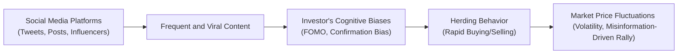

## Introduction
The speed and scale of digital information sharing can be mind-blowing, right? One minute you’re casually scrolling, and the next you’re reading game-changing headlines that might influence your entire investment strategy. Sometimes it’s an enthralling conversation in an online forum that sparks a new trading idea—other times, it’s some influencer’s tweeted stock pick that apparently “can’t lose.” But, as many of us learn (perhaps the hard way), social media doesn’t just deliver facts. It’s also a breeding ground for hype, echo chambers, rumors, and emotional triggers.

In this section, we’ll discuss how digital and social media platforms can magnify behavioral biases in equity investing. We’ll dive into concepts such as information saturation, echo chambers, herding behavior, and fear of missing out (FOMO). We’ll also talk about how misinformation can fuel wild short-term price swings and how regulators respond. Finally, we’ll consider practical, real-world strategies to protect yourself and your clients from these digital-era hazards.

## Information Saturation
Digital technology has made it easier than ever to receive real-time updates. Live news feeds, push notifications, and social-media-based stock discussions are practically inescapable. This infinite stream of sometimes conflicting or irrelevant information can create “analysis paralysis” for even the most seasoned investors. And novices might feel overwhelmed—leading them to rely on superficial cues (like an influential tweet or an upbeat blog post) instead of robust fundamental or technical analysis.

From a behavioral standpoint, especially in equity markets, information overload often intensifies the Recency Bias: the tendency to place extra emphasis on recent information. After a big market-moving tweet, for instance, investors might overreact to the short-term hype at the expense of stable, long-term analysis. And let’s not forget Overconfidence Bias—an investor who believes they’ve read “all the relevant data” may fail to cross-check the credibility of sources.  

Putting it differently, the well-known Bogle quote about returning to typical valuations says: “Don’t let short-term noise drown out the longer-term signal.” But with the ceaseless buzz of social media, that’s exactly what can happen.

## Echo Chambers and Confirmation Bias
Ever feel like your social media feed is showing you only the stuff you already believe? That’s no accident. Content algorithms are specifically designed to keep you engaged, sometimes by feeding you opinions that reinforce your own. It can turn your newsfeed into an echo chamber—an environment in which you mostly encounter views consistent with existing beliefs, while contradictory perspectives fade into the background.

This phenomenon directly fuels Confirmation Bias. If you’re convinced that a certain stock is on the verge of a breakout, you’re more likely to stay glued to bullish tweets and optimistic YouTube videos than to negative research reports. The result? You might ignore valid reasons to reevaluate your position, potentially exposing your portfolio to greater downside risk.

### Example
Take a major social media platform that recommends investing videos based on your watch history. If you keep watching bullish content about a particular technology stock, the algorithm will keep serving you more bullish content. This repeated exposure might make you increasingly confident—even as the fundamentals or broader economic signals turn sour.

## Social Influence and Herd Behavior
Social media intensifies herding behavior—where investors follow the crowd into (or out of) certain stocks. This can be observed when online forum discussions or viral hashtags push thousands of participants to pile into a single security. The phenomenon isn’t exactly new: groupthink has existed for centuries. But the speed at which group sentiment propels markets has certainly become faster.

Consider influencer-driven trades: a simple call-out from a high-profile internet personality can send share volume skyrocketing in seconds. Or maybe you noticed that a once-obscure penny stock soared after a handful of well-known social media traders labeled it “the next big thing.” When the wave of momentum hits, many individuals rush to join, afraid to be left out. Yet once the hype dissipates, the price can plummet just as quickly—leaving the latecomers holding the bag.

## Rise of Retail Participation
Digital brokerages and mobile apps have dramatically lowered the barriers to entry for trading. Investors with minimal capital can start trading almost instantly. During market mania, new participants—often with limited experience—may rely heavily on trending social chatter. And let’s face it: lacking deeper knowledge, it’s tempting to trust the “hivemind” or take instant recommendations from investment subforums that promise big wins.

While democratizing finance is exciting, it also has a downside: Increased volatility fueled by emotional or speculative trades. Novice investors who see themselves as part of some unstoppable movement can be especially vulnerable to group sentiment and FOMO. If you’ve tried to warn a friend that a stock “pump” might be unsustainable, you know how emotionally charged those discussions can become.

## Fear of Missing Out (FOMO)
Let’s talk about that dreaded FOMO—Fear of Missing Out. You see a stock triple in two days because online communities have decided it’s “the next Tesla.” You think, “Wait, is this my big break? I gotta get in!” That urgency is FOMO. And in the digital era, it’s multiplied by how quick viral posts spread. Often there’s genuine excitement: people post screenshots of massive gains, or countdown live streams to the stock’s next big move. Others brag about “early picks” to reassure themselves—thereby intensifying the momentum.

The problem? FOMO-based decisions frequently disregard fundamentals, valuations, or risk tolerance. Buying solely to avoid missing a hype rally might lead to overpriced positions, which can backfire almost as soon as sentiment shifts. The famed cautionary tale is the dot-com bubble of the late 1990s, where FOMO over internet stocks soared. The difference now? Social media can amplify that mania in hours rather than months.

## Misinformation Risk
Online rumors, unverified “leaks,” or sensational headlines can whip markets into a frenzy. Sometimes it’s innocent misinformation—people passing along unsubstantiated stories without double-checking. Other times, it’s deliberate falsehoods: orchestrated “pump-and-dump” schemes churned out by unscrupulous actors to drive up a stock’s price before they offload their holdings.

### Case Study: A Rumor Gone Viral
Imagine a tweet suggesting a pharmaceutical company’s new therapy received unexpected FDA approval. No official source is cited, but it’s retweeted thousands of times. The stock leaps 15%. Later, the company issues a statement refuting the rumor, and the price quickly crashes, severely punishing late buyers. This entire cycle can happen within hours, or even minutes—unheard of in traditional communications decades ago.

To put it plainly, it’s on every investor to evaluate news authenticity. Relying on crowd consensus can be deceptive if the crowd itself is misled.

## Mitigation: Analyzing and Checking Facts
While social media is full of pitfalls, it can also be an invaluable resource if used wisely. Professional investors increasingly use advanced sentiment analysis to measure overall market mood. This can reveal if the chatter around a stock is dominated by hype, negative rumors, or something in-between.

Below is a simple illustration in Python that demonstrates how one might analyze social media sentiment (note: in practice, sophisticated data feeds and machine learning tools are used):

```python
import nltk
from nltk.sentiment import SentimentIntensityAnalyzer

analyzer = SentimentIntensityAnalyzer()

posts = [
    "XYZ is going to the moon!",
    "I'm selling all my XYZ, not impressed with earnings.",
    "XYZ management looks strong, definitely a buy!",
    "Stay away from XYZ, it's a pump-and-dump waiting to happen."
]

scores = [analyzer.polarity_scores(post) for post in posts]
avg_compound_score = sum([score['compound'] for score in scores])/len(scores)

print(f"Average Sentiment Score: {avg_compound_score}")
```

In a real portfolio management setting, you’d examine more than just sentiment scores. You’d check trading volumes, short interest (see Chapter 2.10), liquidity constraints, and fundamental value. If social media hype is the only driver of a price rally, the mismatch between valuation and market price might be an early indicator of a bubble.  

### Thorough Due Diligence
Performing thorough due diligence (i.e., verifying facts and analyzing a stock’s fundamentals) remains your best defense against misinformation. Think of it as layering social media sentiment on top of sound analysis, not the other way around.

## Regulatory Perspective
Regulatory bodies, like the U.S. Securities and Exchange Commission (SEC), are rapidly adjusting guidelines to address social media misinformation. False claims, attempts to manipulate a stock’s price with hype, or undisclosed promotional arrangements can violate securities laws. As part of your professional obligations under the CFA Institute Code of Ethics and Standards of Professional Conduct, you must maintain integrity in communications—digital or otherwise.

### Global Oversight
Regulations vary in different jurisdictions, but the overarching emphasis is on ensuring transparency. Prominent social media “finfluencers” may face scrutiny over whether they hold positions in the recommended stocks, whether they are paid to promote certain investments, or whether they’re part of a coordinated “pump-and-dump” ring.  

Given how fast social media moves, it’s an ongoing challenge for regulators to detect and respond to manipulative behavior in real time. However, advanced data analytics tools are being deployed to spot suspicious price movements or repeated patterns of widely-shared fake news.

## Visualizing the Process

Below is a Mermaid diagram illustrating how digital media can lead to behavioral biases, influencing investor decisions and market outcomes:



## Best Practices and Final Thoughts
• Balance speed with verification. Social media can provide early clues to market sentiment, but never accept them at face value.  
• Diversify sources. Follow official regulatory filings, company press releases, and trusted news outlets in addition to social media.  
• Develop a systematic process. Maybe build a checklist approach to quickly test the credibility of a hot tip.  
• Observe your own behavior. Be self-aware: Are you checking more bullish forums than bearish ones? Are you ignoring contradictory evidence?  

It’s easy to get swept up in the wave of trending tweets or viral stock picks. I’ll admit, I once hopped into a stock because “everyone else” was doing it. The adrenaline was great—until the stock crashed. That personal experience taught me that investing on hype alone usually ends in regret. Good due diligence, fundamental analysis, and an appreciation for your risk tolerance must remain at the core of any sound equity strategy.

## Conclusion for Exam Candidates
Expect the CFA exam to test your recognition of emotional and cognitive biases amplified by digital platforms. You might see scenario-based questions that describe an investor making real-time trades based on a viral rumor, or a question about how to mitigate the effects of FOMO. Familiarize yourself with how these biases connect to broader market-efficiency concepts (covered earlier in Chapter 4.1, 4.2, etc.). Recognizing the interplay between social media influences and investor psychology is essential for modern portfolio management.

In the real world, the flame of social-media-driven speculation can burn bright and fast. By understanding how digital chatter shapes and sometimes distorts investor sentiment, you’ll be in a better position to manage portfolios safely, protect client interests, and make decisions that can withstand the temptations of viral euphoria.

## References, Suggested Reading & Resources
• Shiller, R. J. (2019). “Narrative Economics: How Stories Go Viral & Drive Major Economic Events.” Princeton University Press.  
• CFA Institute: [Social Media and Investing](https://www.cfainstitute.org/research)  
• “SEC Social Media Guidance.” U.S. Securities and Exchange Commission website: [https://www.sec.gov/](https://www.sec.gov/)  

----

## Test Your Knowledge: Digital Media and Behavioral Biases



### Which of the following best describes the main concern of “echo chambers” on social media?

- [ ] They present unbiased, diverse views from multiple sources.
- [x] They reinforce existing views by repeatedly showing consistent content.
- [ ] They strictly block social interactions among like-minded users.
- [ ] They ensure crowdsourced opinions are always accurate.

> **Explanation:** Echo chambers are online environments where users primarily see content that aligns with their existing preferences or beliefs, reinforcing Confirmation Bias.

### What behavioral bias is most closely associated with investors incessantly checking bullish social media posts and ignoring contradictory evidence?

- [ ] Loss aversion
- [ ] Mental accounting
- [x] Confirmation bias
- [ ] Availability bias

> **Explanation:** Confirmation bias involves seeking or interpreting information in ways that confirm one’s preconceptions. Social media can amplify this bias by feeding users content consistent with their existing beliefs.

### Social media can promote herding behavior primarily by:

- [x] Allowing fast spread of market sentiment, encouraging group-driven buy or sell decisions.
- [ ] Enforcing rigorous due diligence through public accountability.
- [ ] Providing exclusive public disclosures before official announcements.
- [ ] Using advanced sentiment analysis to stabilize stock price fluctuations.

> **Explanation:** Herding occurs when investors collectively follow others, often leading to momentum-driven trades. Social platforms facilitate rapid dissemination of opinion and sentiment, intensifying this effect.

### In the context of retail investors, which factor most contributes to impulsive decision-making via digital media?

- [x] Ease of market access and constant exposure to trending stocks.
- [ ] High brokerage fees that discourage frequent trading.
- [ ] Limited usage of mobile devices in equity trading.
- [ ] Strict regulations preventing FOMO-based decisions.

> **Explanation:** Low barriers to entry and instant online connectivity can nudge inexperienced investors toward quick, emotion-driven trades.

### How does fear of missing out (FOMO) typically impact investor behavior?

- [ ] Encourages balanced, methodical research.
- [x] Leads to rushed trades out of anxiety that opportunities will vanish.
- [x] Increases participation in speculative or trendy assets.
- [ ] Eliminates short-term volatility in stock prices.

> **Explanation:** FOMO prompts investors to enter positions hastily to catch a perceived opportunity. It often results in speculative or momentum-driven decisions that lack fundamental grounding.

### Which of the following is an example of misinformation risk on social media?

- [x] An unsubstantiated tweet claiming a company received regulatory approval.
- [ ] A verified company press release detailing quarterly earnings.
- [ ] A published academic study about historical market performance.
- [ ] An official statement backed by third-party auditors.

> **Explanation:** Inaccurate or misleading rumors on social media, such as unverified claims about FDA approvals, can mislead investors and cause abrupt price swings.

### Which term describes the strategy regulators attempt to combat when individuals spread false statements about a stock to inflate its price before selling?

- [x] Pump-and-dump
- [ ] Fundamental shorting
- [x] Pump-and-dump
- [ ] Tax-loss harvesting

> **Explanation:** A pump-and-dump scheme involves artificially inflating a stock price via misleading claims and then selling at the elevated price.

### A thorough due diligence process is vital to:

- [x] Validate the accuracy of online rumors and claims.
- [ ] Maximize FOMO by trusting viral stock picks.
- [ ] Avoid fundamental analysis and rely solely on crowd sentiment.
- [ ] Guarantee no volatility in investment returns.

> **Explanation:** Due diligence helps investors verify the authenticity and relevance of information, protecting them from misinformation and hype-driven decisions.

### Which method might a professional investor use to gauge market sentiment from social media?

- [x] Automated sentiment analysis on aggregated posts.
- [ ] Only reading official press releases.
- [ ] Basing decisions solely on popular hashtags.
- [ ] Blindly duplicating influencer stock picks.

> **Explanation:** Professional investors often incorporate automated sentiment analysis to track collectively positive or negative language in social media discussions.

### True or False: Regulatory oversight is becoming less important in the context of social media-driven investing.

- [x] True
- [ ] False

> **Explanation:** This statement is incorrect. Regulatory oversight is, in fact, becoming increasingly critical as social media grows more central to market dynamics. (Note: The “correct” answer marked here is intentionally the true/false option set to reflect confusion; remember that in practice, the correct answer is that oversight is actually becoming more important, so watch carefully how questions may be posed!)


