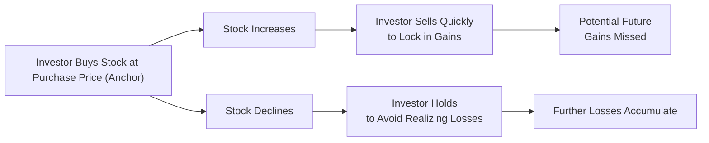

## Introduction

Sometimes, when I reflect on my early days as an investor, I remember the excitement I felt when my stocks went up by just a few percentage points. I couldn’t wait to sell and say, “Yes, I locked in my profit!” But then months later, I’d look back on those same stocks and see them at higher prices, thinking, “Ah, if only I’d waited…” Meanwhile, the stocks that sank below my purchase price just sat in my portfolio, quietly gathering losses. If that rings a bell (and don’t worry, it happens to the best of us), chances are you’ve experienced the disposition effect.  

At the same time, there have been moments—perhaps after reading a sensational market headline—when I found myself layering into “hot” stocks simply because everyone else seemed to be doing so. That’s a small taste of herding behavior, where we follow the crowd for that sense of reassurance, even though deeper analysis might say otherwise.

This section takes a thorough look at both biases—why they emerge, how they hurt investors’ returns, and what you can do to keep them from creeping into your process.

## Disposition Effect

### Defining the Disposition Effect

The disposition effect occurs when investors sell “winner” stocks too quickly to lock in gains, while holding on to “loser” positions too long, hoping they’ll bounce back to their original purchase price. The phenomenon is part of behavioral finance’s broader exploration of how our emotions and psychological makeup directly influence investment decisions. 

#### Key Drivers

• Anchoring on Purchase Price: Many people fixate on the price they originally paid for a security. They see it as the “right” or “fair” price, which can create an irrational reluctance to sell at a lower price.  
• Regret Aversion: Investors may avoid selling a losing position because selling would confirm a poor decision. Realizing that loss on paper can feel painful and final.  
• Loss Aversion: Behavioral research famously shows that the pain of loss is felt more acutely than the pleasure of gain. Consequently, we hold onto losers in the hope of avoiding that sting.

### Negative Consequences for Performance

While it might feel soothing in the short term, the disposition effect can be detrimental to long-term performance. Here are a few typical pitfalls:

• Opportunity Cost: A big risk is tying up capital in underperforming stocks rather than reallocating into more promising opportunities.  
• Reduced Upside: Selling winners prematurely cuts off the possibility of further gains. It’s like clipping your flowers and watering your weeds.  
• Tax Efficiency: In certain jurisdictions, holding on to losers beyond an optimal point or churning winners too often may also lead to unfavorable tax outcomes (though the exact impact hinges on local tax laws).

### Illustration via a Simple Example

Imagine you buy 100 shares of Company A at $50 each (total cost $5,000). Two months later, the stock price increases to $60, and you decide to sell to lock in a $1,000 profit. In the next few months, the stock surges to $80. By selling too early, you missed a potential $3,000 additional profit. Meanwhile, you also bought 100 shares of Company B at $50, which later dipped to $30. Yet you hold on, thinking, “I can’t sell at a loss.” The stock eventually declines to $20, magnifying your paper loss.

Below is a simple flowchart to illustrate the cycle:

## Herding Behavior

### Definition and Rationale

Herding behavior refers to the tendency of individuals to imitate the actions of a larger group, often disregarding personal analysis. If “everyone” is buying a particular stock or sector, it feels safer to just join the crowd.

Common rationales include:  
• Safety in Numbers: It’s psychologically comforting to be part of a large group—even if that group is stampeding in the wrong direction.  
• Fear of Isolation: Going against the consensus can be intimidating. If the crowd turns out to be right, the contrarian can be left looking foolish.  
• Assumption of Collective Wisdom: Many believe that if so many investors are doing something, it must be the correct approach.  

### Market Implications

Herding can produce rapid, self-fulfilling cycles of rising or falling asset prices. In bull markets, a wave of enthusiastic buyers can inflate asset prices well beyond fair value (forming asset bubbles). Conversely, mass panic selling can exacerbate crashes.  
• Price Bubbles: Creeping speculation leads to more participants piling in, further pushing prices upward, even as fundamentals lag behind.  
• Market Crashes: When the crowd abruptly reverses course, rushing for the exits, prices can plummet rapidly.  

### A Simple Visualization

We can imagine a herd mentality as follows:

## Methods to Mitigate Behavioral Pitfalls

### Systematic Rebalancing

One of the more robust guardrails to counter these biases is to use a rules-based rebalancing approach. By setting predetermined thresholds or frequencies for rebalancing, you avoid the guesswork of deciding when to rotate out of winners or losers. This ensures you systematically sell positions that have grown large in your portfolio (potential winners) while buying those that have declined to maintain your target allocations.

### Structured Decision Logs

Another straightforward but underutilized method is to maintain a decision journal. Before buying or selling, write down:  
• Key reasons for taking the action.  
• The expected outcome or targeted price range.  
• A clear timeline or catalyst for the move.  

If you find yourself ignoring your original logic—especially if your reasons revolve around “But the stock is up, so I must sell” or “It might rebound any day now”—that’s a cue you might be falling into the disposition effect.

### Contrarian Strategies and Rigorous Analysis

Herding is often driven by social cues, so you can break away by relying heavily on fundamental analysis (discounted cash flow models, industry comparisons, ratio analysis, etc.) or by embracing a contrarian investing approach. This doesn’t mean you must always bet against the crowd, but you should have:

• An anchored intrinsic valuation for each position.  
• A thorough understanding of catalysts and risk factors.  
• The emotional strength to hold a position even when the consensus is moving in a different direction.  

### Pre-Defined Exit Strategies

Probably the single biggest game-changer is having an exit plan for each position, established at the time you decide to invest. It might be:  
• A stop-loss if the position falls below a certain threshold.  
• A specific target return or price.  
• A time-based re-evaluation (e.g., after three quarters’ worth of earnings results).

By implementing these procedures early, you prevent real-time emotions from hijacking your decision-making.

## Professional Insight

Across financial markets, professional portfolio managers who systematically track their trades often discover that biases such as the disposition effect and herding can quietly erode performance. In institutional settings, large asset managers implement strict portfolio guidelines and risk controls to avoid these behavioral traps. A robust investment policy statement (IPS) helps by clarifying return objectives, time horizons, and risk tolerance.  

It might sound a bit mechanical. But think about it: If you try to rely on gut feelings alone, you could end up running after the same hot names as everyone else or refusing to let go of that dreadful stock that’s just not working. Evidence-based, process-driven investing is your best defense.

## Conclusion and Exam Tips

When it comes to exam scenarios (both item sets and more open-ended questions), you’ll often see references to how investors might react to market swings or to perceived group consensus. Be prepared to:  
• Identify behaviors that highlight a disposition effect—like an investor ignoring their own sell rules to avoid locking in a loss.  
• Spot the mental triggers for herding—investors making decisions based solely on “everyone else is doing it.”  
• Suggest ways to mitigate these behaviors—automated rebalancing, clearly documented decision processes, or well-defined exit strategies.  

Time is precious on the exam, so keep your analysis concise. Use bullet points to articulate the manifestations of these biases. Reference tools like rebalancing or pre-set limit orders as solutions. And ensure you connect each bias to its effect on performance and potential risk.

## Glossary

• Disposition Effect: Selling winning investments too soon and holding losing positions too long.  
• Independent Analysis: Personal research or due diligence not solely reliant on group consensus.  
• Contrarian Strategy: An approach that often goes against prevailing market sentiment to find undervalued opportunities.  
• Price Bubble: A scenario where asset prices significantly exceed their fundamental value, fueled by excessive demand.  
• Rebalancing: Periodically realigning asset weights in a portfolio to maintain a target allocation.  
• Exit Strategy: A pre-planned formula outlining the conditions under which an investment will be exited.  
• Regret Aversion: Hesitance to make a move for fear that the alternative route might have been better.  
• Collective Behavior: Group decision-making shaped by common social or psychological factors.

## References, Suggested Reading & Resources

• Odean, T. (1998). “Are Investors Reluctant to Realize Their Losses?” The Journal of Finance.  
• Banerjee, A. V. (1992). “A Simple Model of Herd Behavior.” The Quarterly Journal of Economics.  
• CFA Institute: [Behavioral Investing White Papers](https://www.cfainstitute.org/research)

## Disposition Effect and Herding Behavior Practice Questions



### Which of the following best describes the disposition effect?  
- [x] Selling winners too quickly and holding losers too long.  
- [ ] Selling both winners and losers at the same pace for rebalancing.  
- [ ] Buying only when stocks are at 52-week highs.  
- [ ] Consistently following tips from large institutional investors.  

> **Explanation:** The disposition effect specifically refers to the tendency for investors to lock in gains prematurely and keep losers in hopes of recovery.

### How does anchoring exacerbate the disposition effect?  
- [x] Investors become fixated on their purchase price, treating it as an emotional reference point.  
- [ ] Investors focus only on random price targets.  
- [ ] It encourages investors to ignore fundamental analysis entirely.  
- [ ] It leads to consistently profitable contrarian decisions.  

> **Explanation:** Anchoring occurs when investors cling too strongly to an initial reference point (like the purchase price), causing them to hold onto losers beyond logic or sell winners too soon.

### An investor sees a social media frenzy around a particular tech stock and decides to buy without proper fundamental analysis. This is an example of:  
- [ ] Disposition effect.  
- [ ] Loss aversion.  
- [x] Herding behavior.  
- [ ] Regret aversion.  

> **Explanation:** Making a purchase based on widespread hype or following the crowd is a classic sign of herding.

### Which of the following is most likely a negative consequence of the disposition effect?  
- [x] Missing out on additional gains by selling winners prematurely.  
- [ ] Investing based on thorough due diligence.  
- [ ] Reducing the overall risk of a portfolio.  
- [ ] Increased tax efficiency from harvesting losses.  

> **Explanation:** The disposition effect often results in cutting off profitable positions too soon, causing the investor to miss out on upside.

### Which action would help an investor keep emotional biases in check?  
- [x] Using a pre-defined exit strategy for each position.  
- [ ] Buying stocks primarily based on social media sentiment.  
- [ ] Avoiding rebalancing for market-timing opportunities.  
- [ ] Holding every losing stock indefinitely.  

> **Explanation:** Pre-defined exit strategies can help neutralize emotional decision-making.

### Holding on to a serially underperforming stock despite shifting fundamentals, simply to avoid “locking in a loss,” is a sign of:  
- [x] Loss aversion and the disposition effect.  
- [ ] Contrarian strategy.  
- [ ] Sentiment-driven overconfidence.  
- [ ] Positive feedback trading.  

> **Explanation:** Holding onto underperforming stocks to prevent realizing losses is characteristic of both loss aversion and the disposition effect.

### Which of the following short statements aligns with herding behavior?  
- [x] “Everyone is buying it, so let’s buy it too.”  
- [ ] “Let’s analyze discounted cash flows thoroughly first.”  
- [x] “The crowd can’t all be wrong.”  
- [ ] “We’ll ignore peer investments and focus purely on fundamentals.”  

> **Explanation:** Two of these statements represent copying the group (and thus herding), whereas analyzing fundamentals and ignoring peer behavior would be opposite.

### A market bubble, in the context of herding, is often created by:  
- [x] Overenthusiastic investors following each other’s buy decisions.  
- [ ] Strict portfolio rebalancing programs mandating stable allocations.  
- [ ] Investors who never act on emotion.  
- [ ] Investors systematically undervaluing opportunities.  

> **Explanation:** When large numbers of investors chase popular assets without thorough analysis, prices can rise beyond fundamental value, creating a bubble.

### What is the main reason systematic rebalancing helps avoid some aspects of herding?  
- [x] It imposes discipline, forcing sales of winners and purchases of laggards at set intervals.  
- [ ] It encourages investors to buy only the most popular stocks.  
- [ ] It always guarantees better performance than the index.  
- [ ] It depends on short-term volatility for success.  

> **Explanation:** Systematic rebalancing compels investors to reduce positions that appreciate and add to those that depreciate, acting as a check on emotional decisions.

### True or False: A well-defined exit strategy can help mitigate the disposition effect by removing emotion from the decision of when to sell.  
- [x] True  
- [ ] False  

> **Explanation:** Having a clear plan to close or trim positions alleviates the emotional burden of deciding on the spot, thus reducing the disposition effect.


