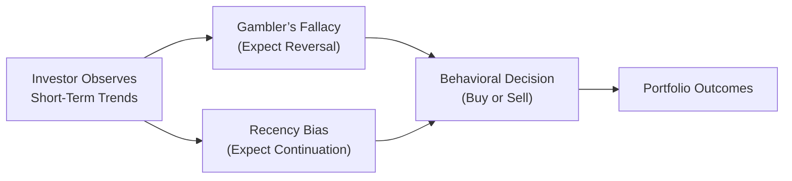

## Understanding the Gambler’s Fallacy

Have you ever been in a casino—or maybe just standing around a friendly poker table—watching someone flip a coin repeatedly and thinking, “Wow, it’s landed on heads six times in a row, so tails must be coming up next!”? That’s the classic Gambler’s Fallacy. It’s the deeply ingrained but mistaken belief that recent events influence the probabilities of future independent events. 

In equity markets, this same mindset often occurs when investors see consecutive declines (or gains) in a stock or market index. They might think that because the price has dropped several days in a row, it’s “due” for a rebound. And if it’s soared for a few sessions, they fear that a big correction is inevitable tomorrow. The trouble is that each day’s price movements are driven by new information, changing market dynamics, and the perpetual interplay of buyers and sellers set against the backdrop of macroeconomic data. The prior streak—like those coin flips—doesn’t necessarily dictate what must happen next.

### Investment Context and Example
Let’s imagine you’re analyzing a tech stock that’s experienced five consecutive down days. You might catch yourself saying, “Surely, it can’t fall for a sixth day—it has to bounce.” But from a rigorous probability standpoint, the price’s direction on the next trading day is influenced by a mix of fundamentals (like new earnings guidance), market sentiment, and economic elements—while the prior sequence alone isn’t a force that guarantees or even strongly suggests an imminent rise. If an investor executes a buy trade primarily because “it’s due,” they’re basing a decision on the Gambler’s Fallacy.

### When Mean Reversion Matters—And When It Doesn’t
Now, is this the same as mean reversion? Not quite. Mean reversion is a statistically supported phenomenon in which certain variables (e.g., profit margins or price-to-earnings ratios) tend to revert closer to long-term historical averages over time. Mean reversion in corporate profitability may be supported by competition or cyclical forces. But the Gambler’s Fallacy incorrectly assumes that a short-term series of losses or gains will abruptly reverse, even when events are statistically independent (like a series of coin tosses or daily stock price fluctuations without a fundamental shift).

In short, the Gambler’s Fallacy is an error in understanding independence of events, while true mean reversion typically involves cyclical or structural processes that logically push a variable back to its baseline over a longer horizon.

## Recency Bias in Equity Markets

Ever notice how people often form strong opinions based on the most recent news or the most recent quarter's performance? Recency Bias is that gravitational pull we all feel: we overweight recent data or experiences, sometimes forgetting how broader history can paint a different picture.

### Short-Term Performance Chasing
A typical manifestation appears in the form of performance chasing. Funds or sectors that have shown eye-popping returns in the last month or quarter become very tempting. Investors pile in, partly because “look at the performance chart!” and partly because it’s just psychologically tough to ignore what is fresh in our minds. Then, if the trend reverses—and it often does—latecomers suffer losses after buying into an overheated run.

Occasional short-term tilts can be justified if we have robust fundamental or macroeconomic catalysts to support the move. But many times, Recency Bias leads to ignoring deeper valuation metrics, cyclical transitions, or historical return patterns, which collectively guide better-informed decisions.

### Divergence from Fundamentals
Imagine a scenario in which the overall market has soared 15% in a few weeks on positive earnings momentum and strong investor sentiment. The gains feel unstoppable because, well, that’s what you’ve seen recently. In reality, if valuations are stretched beyond historically sustainable levels, a correction or reversion to typical valuation multiples might be more likely than an endless climb. Recency Bias can blind you to this possibility.

## Distinguishing These Biases from Legitimate Market Dynamics

While it’s wise to remember that many financial variables can exhibit some predictable cyclical or mean-reverting tendencies, confusion arises when we treat purely random short-term fluctuations as if they must correct themselves under some universal law. 

• The Gambler’s Fallacy: “We are ‘due’ for a reversal after a short streak.”  
• Recency Bias: “Recent patterns will keep going indefinitely.”  

In a single word, these are overreactions to recent outcomes. They differ significantly from reasoned mean reversion, which typically relies on structural or cyclical arguments (e.g., commodity prices often revert due to supply-demand adjustments over time).

Below is a simple diagram that illustrates how an investor observing short-term trends might be influenced by either the Gambler’s Fallacy or Recency Bias before making a flawed trade decision:

## Risk Implications for Equity Portfolios

Both the Gambler’s Fallacy and Recency Bias can severely impact portfolio discipline:

• Overconcentration: Investors might overallocate to sectors or funds based on recent outperformance or because they assume a downturn is over and expect a quick bounce.  
• Poor Timing: Frequent short-term trades driven by recent streaks can increase transaction costs, trigger capital gains taxes, and disrupt a long-term investment strategy.  
• Emotional Stress: Riding on the highs and lows of short-term price moves can lead to panic selling or impulsive buying, culminating in an overall detrimental effect on returns.

### Example of Portfolio Misalignment
Suppose you manage a broad equity portfolio with a target strategic asset allocation. The portfolio has a well-researched goal: 60% large-cap equities, 20% mid-cap, 10% small-cap, 10% in emerging markets. You see that large-cap tech stocks have outperformed for three quarters in a row and recency bias tempts you to push large-cap tech to 80% of your equity mix because “that’s just where the winners are!” Before you know it, you’ve abandoned your carefully crafted strategy, exposing yourself to a narrower slice of the market. And if large-cap tech stocks suddenly correct, your portfolio is hammered more severely than if you had stuck with your systematic approach.

## Behavioral Solutions and Structured Approaches

How do we deal with these biases without giving in to their subtle emotional tug? The key is awareness and discipline. It sounds obvious—of course, we should do our best to remain rational—but wow, does our brain have a knack for latching onto recent events, especially under stress or excitement. Here are some strategies:

• Predefined Rebalancing Intervals: Whether you rebalance quarterly or yearly, sticking to a set rebalancing schedule can help offset recency-driven decisions.  
• Fundamental Thresholds: Consider establishing rules like “I should rebalance if any asset class deviates more than ±5% from the target weighting, unless there is a fundamental justification for maintaining the new weights.”  
• Long-Term Performance Reviews: Keep a historical perspective. Look at multi-year performance, not just the last quarter. Compare current multiples (P/E, P/B, etc.) to your long-run averages or to industry peers, rather than fixating on the most explosive or dire short-term metric.  
• Pre-Trade Checklists: Especially for professional managers, checklists can guide you to confirm that your trade rationale is based on fundamental or technical signals consistent with your investment policy or alpha thesis—and not just a reaction to the latest string of price moves.

### Enhancing Portfolio Management Processes
It’s useful for investment committees to adopt rigorous processes. For instance, each proposal to change allocations might require a discussion of both short-term market dynamics and long-term valuation frameworks. Encourage every member to question whether a proposed allocation shift arises from systematic research or from recency-driven enthusiasm. This approach, while somewhat bureaucratic, injects checks and balances that help avoid emotive trading.

## Practical Illustration

Let’s say your investment committee meets every quarter to discuss any potential changes to the portfolio strategy. A few consecutive bad quarters for the consumer discretionary sector might tempt participants to say, “Consumer discretionary is bound to bounce back—let’s add more.” Well, maybe it will if spending recovers, but that’s not a guarantee. Consider broader fundamentals: interest rates, consumer confidence indices, wage growth, personal savings rates, and corporate resiliency of key players in the sector. If those fundamentals haven’t improved, it’s potentially just the Gambler’s Fallacy to think a rebound is imminent based on a short string of declines.

Conversely, if a certain sub-sector (e.g., e-commerce) has soared 25% in one month, Recency Bias might whisper, “This is the new normal—let’s push more capital in now,” without giving due diligence to valuations. By reviewing more extensive data—say, the e-commerce company’s earning trends over the past multiple years, competitive pressures, or new threats from bigger market entrants—your committee can keep a more balanced perspective.

## Ethical and Professional Considerations

The CFA Institute Code of Ethics and Standards of Professional Conduct underlines the importance of loyalty to clients, placing client interests above personal biases, and maintaining independence and objectivity in investment analyses. Behavioral biases like Gambler’s Fallacy and Recency Bias can threaten objectivity if they distract from diligent research and thorough risk assessment. 

Professional investors are encouraged to document investment decisions systematically, referencing fundamental or quantitative signals supported by data. This record-keeping can also provide protection should clients or regulators question the rationale behind trades made during periods of heightened volatility.

## Exam Relevance and How to Tackle Related Questions

In the CFA exam context, you may encounter scenario-based questions that show an investor or portfolio manager succumbing to Gambler’s Fallacy or Recency Bias. For instance, a question might describe consecutive bullish days leading a manager to expect a bullish outcome on the next trading session simply because “we’ve been on a roll.” Or maybe the question highlights Recency Bias when a manager invests heavily in a fund just because of an impressive quarter. 

• Identify the Bias: Look for keywords like “due for a change” (Gambler’s Fallacy) or “we should keep doubling down because short-term returns are great” (Recency Bias).  
• Recognize the Corrective Measures: The exam might ask how to counter these biases. Common solutions include rebalancing strategies, systematic investment plans, establishing abiding rules for buy or sell, referencing long-term averages, and so on.  
• Provide a Balanced Rationale: Especially in essay-based questions, explaining the difference between statistically supported mean reversion and mere assumption of reversal is key. 

## Conclusion

It’s all too easy to get swept up in the swirl of short-term price moves and dramatic headlines. Whether you find yourself expecting a “guaranteed reversal” after a streak of losses (Gambler’s Fallacy) or extrapolating the latest upward surge indefinitely (Recency Bias), the biggest challenge is catching yourself before you lock in a trade purely on these shaky foundations. Maintaining a long-term view, adhering to structured processes, and challenging emotionally charged assumptions can help you stay on the path of sound portfolio management.

For a well-disciplined investor—whether an individual saving for retirement or a professional entrusted with client assets—the goal is to navigate the shifting tides of the market without letting illusions of short-term inevitabilities upend a carefully structured investment strategy.

## References

• Tversky, A., & Kahneman, D. (1971). “Belief in the Law of Small Numbers.” Psychological Bulletin.  
• Lo, A. W. (2005). “Reconciling Efficient Markets with Behavioral Finance: The Adaptive Markets Hypothesis.” Journal of Investment Consulting.  
• CFA Institute: Market Psychology Articles (https://www.cfainstitute.org/en/research)

## Final Tips for the Exam

• Watch for subtle language in case studies indicating that a portfolio manager or investor is relying solely on recent events.  
• On constructed-response questions, emphasize how to maintain objectivity through systematic processes and reference fundamental data or broader trend analyses.  
• Be ready to differentiate between a legitimate cyclical or mean-reversion argument and an irrational assumption of reversal when events are truly independent.  
• Practice scenario-based questions where the correct choice often involves maintaining discipline, rebalancing, or analyzing multi-year performance rather than focusing just on the last few data points.

## Test Your Knowledge on Behavioral Biases in Equity Investments



### Which statement best describes the Gambler’s Fallacy?

- [ ] It is the belief that recent wins will continue indefinitely because of strong fundamentals.
- [x] It is the belief that an outcome is “due” to reverse after a streak of similar results.
- [ ] It is a thorough analysis based on historical mean reversion.
- [ ] It is the overemphasis of long-term returns for an immediate trading decision.

> **Explanation:** The Gambler’s Fallacy involves assuming a short-term reversal is bound to happen after a series of similar outcomes, misleading investors when events are largely independent.

### How does Recency Bias typically affect investors’ decisions?

- [x] It causes investors to overweight recent performance and trends without adequately considering long-term data.
- [ ] It discourages fundamental analysis and technical analysis alike.
- [ ] It systematically improves short-term rebalancing decisions.
- [ ] It ensures fair value pricing in capital markets.

> **Explanation:** Recency Bias leads investors to focus on recent data to the detriment of a more balanced, long-term perspective, often resulting in performance chasing.

### A portfolio manager observes that a particular stock has dropped for five consecutive days and concludes it must rise on the sixth day. Which bias is the manager most likely exhibiting?

- [x] Gambler’s Fallacy
- [ ] Recency Bias
- [ ] Anchoring Bias
- [ ] Overconfidence

> **Explanation:** Expecting a reversal simply because a streak has occurred aligns with the Gambler’s Fallacy.

### A technology-focused ETF has been the best-performing ETF for the past 12 months, and an investor immediately reallocates a large portion of capital into the same ETF based on its recent success. Which bias could be influencing the investor?

- [ ] Gambler’s Fallacy
- [x] Recency Bias
- [ ] Confirmation Bias
- [ ] Availability Heuristic

> **Explanation:** The investor is emphasizing recent outperformance and extrapolating it into the future, characteristic of Recency Bias.

### Which of the following is a key difference between the Gambler’s Fallacy and mean reversion in investing?

- [ ] The Gambler’s Fallacy applies only to equities, whereas mean reversion applies to bonds.
- [x] The Gambler’s Fallacy assumes random events will reverse soon, while mean reversion is driven by fundamental or cyclical factors.
- [ ] The Gambler’s Fallacy is long-term, whereas mean reversion is short-term.
- [ ] There is no difference; they are essentially the same concept.

> **Explanation:** Mean reversion in investing is often based on structural or cyclical mechanisms that push variables toward historic norms, while the Gambler’s Fallacy assumes a pattern reversal simply due to a short streak.

### How can an investor mitigate Recency Bias?

- [x] By evaluating a broad set of historical data and maintaining systematic rebalancing.
- [ ] By focusing exclusively on the last quarter’s performance.
- [ ] By trading on instinct rather than research.
- [ ] By copying the portfolio strategy of high-profile investors.

> **Explanation:** A structured process, including thorough historical analysis and scheduled rebalancing, dilutes the sway of Recency Bias.

### Which scenario best represents performance chasing linked to Recency Bias?

- [x] An investor rapidly increases allocation to a fund solely because its past quarter returned 25%.
- [ ] An investor reduces equity exposure after analyzing macroeconomic leading indicators.
- [x] An investment committee applies a rebalancing strategy after a stellar run in high-growth stocks.
- [ ] An investor reviews multi-year data before adding to a position.

> **Explanation:** Selecting an investment simply because of recent outperformance is performance chasing, a hallmark of Recency Bias. (Note the second checked option is a distractor to emphasize reviewing the question carefully.)

### Why might a formal investment policy statement help combat the Gambler’s Fallacy?

- [x] It provides predefined guidelines that prevent impulsive decisions based on short-term streaks.
- [ ] It allows unlimited freedom to time the market based on hunches.
- [ ] It encourages immediate reaction to frequent market movements.
- [ ] It relies on real-time day trading activity.

> **Explanation:** Having a policy that sets boundaries for asset allocations and rebalancing intervals helps avoid erroneous decisions triggered by short-term losing or winning streaks.

### In the context of behavioral biases, what is a good reason to track multi-year performance of a portfolio?

- [x] It keeps recent performance in perspective and reduces the effects of Recency Bias.
- [ ] It guarantees higher returns in the next quarter.
- [ ] It prevents all risk in equity investing.
- [ ] It eliminates the need for rebalancing.

> **Explanation:** Examining multi-year results helps investors appreciate how short-term performance fits into broader trends, creating a buffer against Recency Bias.

### True or False: The Gambler’s Fallacy is often an issue when investors assume that a particular sector is “due for a comeback” merely because it has lagged for a few quarters, despite no strong evidence of fundamental improvement.

- [x] True
- [ ] False

> **Explanation:** This is a textbook example of the Gambler’s Fallacy, where poor performance in the recent past is taken to imply an imminent rebound without a fundamental basis.


