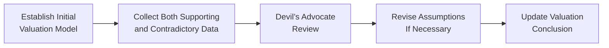

## Introduction

Sometimes, we get stuck—really stuck—on a number that first pops into our heads. It might be a stock’s initial price or last quarter’s impressive earnings figure. And then, well, we ignore a whole bunch of new data that should be nudging us to revise our perspective. This little mental glitch is known as anchoring. It’s one of the more familiar psychosocial biases that can trade objectivity for stubbornness. Closely tied to it is confirmation bias, where we actively hunt for data that supports our preconceived outlook (like rummaging through a messy closet for the one shirt we want to wear) and dismiss evidence that would point to a different conclusion.

Even on the CFA® exam, these biases can shape how you interpret case vignettes, financial statements, or problem data. Understanding anchoring and confirmation bias is paramount both for real-world portfolio decisions and for excelling in scenario-based test questions. Let’s explore how these biases emerge in equity analysis, how they reinforce each other, and—most importantly—how to mitigate them.

## The Concept of Anchoring

Anchoring refers to our tendency to latch onto a reference point—often the first piece of information we receive—and then to adjust insufficiently from that anchor. In equity investments, the anchor might be:

• The stock’s initial purchase price.  
• A benchmark index level at a specific date.  
• A “fair value” estimate from an analyst’s first impression.

The trouble is, once we set this anchor, we’re often reluctant to move away from it, even if subsequent data screams otherwise. For instance, if you initially valued a company’s intrinsic worth at USD 50 per share and later found out that the company’s earnings are deteriorating, you may still belabor the USD 50 anchor. You’ll do some mental gymnastics to rationalize minimal adjustments—maybe from USD 50 down to USD 49—even though the fundamentals suggest it should be USD 40.

### Quick Anecdote

Years ago, I recall analyzing a consumer electronics firm. Its share price had been USD 30 for a while—like a well-worn anchor. When sales declined, some folks on the team just couldn’t bring themselves to slash the valuation to reflect the new landscape. They kept pivoting their analysis around that original USD 30 reference, ignoring fairly obvious red flags in consumer spending.

## Confirmation Bias

Confirmation bias is our knack for seeking out, interpreting, or recalling information in a way that confirms our preexisting beliefs or hypotheses. In other words, once you’ve bought into a certain position (or anchored your thinking to a number), you intentionally or subconsciously home in on all the “evidence” that says you were right. Meanwhile, evidence that indicates a potential error gets shoved under the proverbial rug.

If you’re convinced that a particular stock is poised for a rebound, you might scan message boards, earnings releases, and research reports for signs that the turnaround is on track. Negative earnings revisions or increased competition might not get the same level of weight—even though that negative data might be precisely what you need to reconsider your thesis.

## Impact on Valuations

When these two biases intersect, valuations can become dangerously skewed:

• Analysts anchor on a preliminary assumption, such as a past average price multiple, or a “fair value” from an early discounted cash flow (DCF) model.  
• Confirmation bias then fuels the hunt for data that backs up this anchor. If the anchor is USD 50, an analyst might highlight product launches, cost savings, or bullish news from management. Meanwhile, a drop in segment revenue or rising competition in a crucial market might be brushed aside as a “temporary setback.”

This bias interplay can produce valuations that fail to reflect real-time changes in a firm’s prospects. As a result, prices can deviate—sometimes substantially—from fair market value.

## Reinforcing Each Other

Anchoring sets the initial “target.” Confirmation bias helps keep that target locked in place. When everyone in an investment team—especially in environments prone to groupthink—begins to treat the anchor as sacred, there’s little impetus to look at contradictory data. As a result:

• Group discussions revolve around rationalizations that fit the anchor.  
• Team members refrain from challenging the anchor for fear of generating conflict, a classic sign of groupthink.  
• Potential “devil’s advocates” get drowned out, leaving the problematic anchor intact and unchallenged.

## Examples in Practice

Let’s consider a few scenarios:

1. A tech stock that soared from USD 10 to USD 45 in a short span. The anchor in many investors’ minds becomes the new high of USD 45. When subsequent earnings disappoint, some investors refuse to lower their price targets. “It’ll bounce back,” they argue. They selectively note the CEO’s upbeat statements but ignore the CFO’s caution about supply chain disruptions.

2. An investor who’s extremely bullish on the electric vehicle sector might read countless bullish analyst reports but skip over that worrisome short-seller analysis. Even if they see mention of potential battery shortages, they rationalize it away: “That’s just short-term noise.”

3. A financial institution with a longstanding house view that a stock is undervalued might rely on an outdated discounted cash flow model. When revenues decline in essential geographies, the team still clings to its initial target price. They might discount negative signals as “transitory” and double down on inconsequential positives as “evidence” supporting the anchor.

## Mitigating Strategies

It isn’t all doom and gloom. There are practical, structured approaches analysts and portfolio managers can adopt to tackle these biases:

• Conduct devil’s-advocate sessions on a regular schedule. Assign someone to present a contrarian view deliberately, forcing the group to confront contradictory data.  
• Use a structured valuation model (for instance, a multi-stage DCF or a residual income model). Revisit and update each critical variable—revenue growth, margins, cost of capital—so that the “anchor” is forced to incorporate new data.  
• Predefine thresholds for when assumptions or price targets require revision. For example, if the next quarter’s earnings deviate from your forecast by more than 10%, re-run your entire fundamental model.  
• Encourage an organizational culture where challenging the status quo is praised, not penalized.  
• Employ checklists that must be completed before finalizing a valuation. These checklists should include both supporting and opposing factors.  
• Keep a research journal. Document your initial anchor and note each new piece of evidence—both confirming and disconfirming. This self-audit helps reveal how confirmation bias may creep into your process.

Below is a simple diagram illustrating a structured process to mitigate anchoring and confirmation bias:

## Adaptive Learning

Anchoring and confirmation bias often reappear in cyclical patterns. The best remedy is ongoing self-awareness and structured feedback loops:

• Compare your forecasts with actual outcomes. If your initial anchor was consistently off by 20%, be honest about why you kept ignoring contradictory signals.  
• Track your decision history, focusing on whether you actively rejected negative (or positive) data that would have shifted your anchor.  
• Periodically review your portfolio’s performance to see which holdings reflect outsize affirmations of prior beliefs. Maybe that “turnaround story” never turned around.  

Over time, these reflective practices will sharpen your ability to catch cognitive slip-ups early, keeping your decisions more objective.

## Role in Market Mispricing

From a market-efficiency standpoint, anchoring and confirmation bias can delay the market’s ability to incorporate new information rapidly into security prices. Here’s how:

• If most investors anchor to old data, the new “bad news” is underweighted, and the stock remains overpriced until the weight of evidence becomes overwhelming.  
• Conversely, if the initial anchor was too pessimistic, improvement in fundamentals may be missed, leading to underpricing.  

Savvy investors who do not succumb to these biases—or who purposely look for counterarguments—have an opportunity to identify mispriced securities before the market corrects itself. They might short a stock that remains anchored to an outdated high, or go long in a situation where negative sentiment is anchored in the past but fundamentals have turned significantly more positive.

## Best Practices and Common Pitfalls

It’s easy to say, “Don’t anchor, keep an open mind,” but in practice, anchoring and confirmation bias can be sneaky. Watch out for these pitfalls:

• Over-reliance on “expert opinions” that might be anchored themselves. Validate these insights with independent research.  
• Failing to re-run sensitivity tests after major news or macroeconomic changes.  
• Falling into “herding” mentality, especially if the broader market sets an anchor (e.g., a heavily broadcast target price).

And adopt these best practices:

• Evaluate your valuation methods quarterly, ensuring that no single piece of data is overemphasized.  
• Embrace forum discussions or committees where each member is encouraged to represent a different viewpoint.  
• Pay equal attention to the “bear case” in your research. Summarize the top opposing arguments clearly.

## Regulatory and Professional Standards

Although biases themselves aren’t directly regulated, they can lead to lapses in professional conduct:

- Under the CFA Institute Code of Ethics and Standards of Professional Conduct, particularly Standard I(C) – Misrepresentation and Standard V(A) – Diligence and Reasonable Basis, members are expected to base investment analyses on a thorough, objective review of relevant information. Anchoring and confirmation bias can inadvertently compromise this objectivity.  
- In certain jurisdictions, regulators (like the SEC in the United States) look for evidence of thorough due diligence and unbiased research. If an analyst’s reports consistently fail to incorporate new, material information, it could raise compliance concerns.

## Final Exam Tips

For the CFA exam, particularly at advanced levels, you’re expected to assess behavioral biases not just as definitions but also in how they affect portfolio decisions:

• In essay or constructed-response questions, you might be asked to identify which bias is affecting a fictional analyst’s assumptions. Clearly articulate how anchoring or confirmation bias appears and propose ways to mitigate it.  
• In item sets, you may see performance attribution or valuation outcomes that reflect outdated assumptions. Identify the correct bias and then select the best remedy.  
• Practice writing short, structured answers. If a scenario says, “Portfolio Manager X refuses to change the target price despite new data,” you’d quickly identify anchoring. Then detail a solution: “Include a structured revaluation approach, invite a devil’s advocate, etc.”

## References, Suggested Reading & Resources

- Edwards, W. (1982). “Conservatism in Human Information Processing.” In Kahneman, Slovic, & Tversky (Eds.), Judgment Under Uncertainty: Heuristics and Biases.  
- Montier, J. (2007). Behavioral Investing: A Practitioner’s Guide to Applying Behavioral Finance. Wiley.  
- CFA Institute: [Anchoring & Bias Research](https://www.cfainstitute.org/research)

## Glossary

• Anchoring: Relying excessively on the first piece of information received when making decisions.  
• Confirmation Bias: Interpreting new data so that it complements existing beliefs, while ignoring or downplaying contradictory information.  
• Reference Point: The initial figure against which new data is compared.  
• Contrary Indicators: Data suggesting an alternative outcome to current consensus or personal beliefs.  
• Devil’s Advocate: A role within the team for methodically challenging the dominant proposition.  
• Structured Valuation Model: A formal approach (e.g., DCF) demanding systematic updates to assumptions.  
• Objective Analysis: Designed to remain unbiased by personal or group beliefs.  
• Groupthink: A phenomenon where the desire for conformity leads to irrational or dysfunctional decision-making.

---

## Test Your Knowledge: Anchoring and Confirmation Bias in Equity Analysis



### Which best describes anchoring in an equity analysis context?

- [ ] Continuously revising all previous price targets in line with the latest market data.
- [x] Relying strongly on a first-reference share price and making insufficient adjustments later.
- [ ] Using only past financial statements and ignoring forward-looking guidance.
- [ ] Refusing to conduct sensitivity analyses when company fundamentals change.

> **Explanation:** Anchoring involves clinging to an initial piece of information (e.g., a price), and failing to adjust significantly when presented with new facts.

### Which of the following is a hallmark of confirmation bias?

- [x] Selectively reading or interpreting news to validate your preexisting investment thesis.
- [ ] Consistently changing your mind whenever news flow changes.
- [ ] Recruiting a devil’s advocate to ensure balanced analysis.
- [ ] Factoring negative news into your model before positive news.

> **Explanation:** Confirmation bias entails actively seeking evidence that supports your viewpoint while disregarding contradictory evidence.

### How do anchoring and confirmation bias reinforce each other?

- [ ] They operate on entirely distinct mental processes and rarely overlap.
- [ ] Anchoring eliminates the need for confirmation bias by establishing a fixed price.
- [ ] Confirmation bias constantly updates the anchoring reference point.
- [x] Anchoring fixes a reference point, and confirmation bias filters incoming data to support that anchor.

> **Explanation:** Once anchored, confirmation bias helps preserve that anchor by emphasizing supporting evidence and minimizing contradictory information.

### Suppose an investor remains fixated on last year’s price target for an airline stock, despite rising fuel costs and increased competition. She also emphasizes any trivial positive news. Which biases are present?

- [ ] Hindsight bias and overconfidence bias.
- [x] Anchoring and confirmation bias.
- [ ] Mental accounting and regret aversion.
- [ ] Endowment effect and framing bias.

> **Explanation:** The investor is anchored on last year’s price target and selectively highlighting minor positives, indicating anchoring and confirmation bias, respectively.

### Which is the most direct mitigation strategy for preventing anchoring?

- [x] Predefine strict thresholds for re-estimating valuations based on new data.
- [ ] Increase reliance on momentum trading.
- [x] Schedule devil’s advocate sessions every quarter.
- [ ] Rely solely on management forecasts for updated assumptions.

> **Explanation:** Predefining thresholds triggers a forced revaluation, and devil’s advocate sessions challenge existing assumptions—both directly counter anchoring.

### In which of the following ways can anchoring and confirmation bias lead to market mispricing?

- [x] They delay the market’s incorporation of new information, causing security prices to remain at outdated levels.
- [ ] They force irrationally quick market revaluation that overshoots fundamental value.
- [ ] They have no impact, since rational investors can always arbitrage any bias away.
- [ ] They only work in small-cap equity markets, not large-cap markets.

> **Explanation:** Anchoring and confirmation bias can impede the timely adoption of new information, leading to short-term mispricing until overwhelming evidence surfaces.

### Which tool specifically challenges confirmation bias by deliberately presenting an opposing viewpoint?

- [ ] Monte Carlo simulation.
- [x] Devil’s advocate review.
- [ ] Stop-loss order.
- [x] Strict reliance on a single valuation model.

> **Explanation:** Devil’s advocate reviews are designed to challenge the dominant narrative and expose overlooked counterarguments.

### An analyst anchored on a price of USD 100 for a stock is ignoring falling gross margins and focusing on a small new product launch. She's likely exhibiting:

- [ ] Representativeness bias.
- [x] Anchoring and confirmation bias.
- [ ] Gambler’s fallacy.
- [ ] Loss aversion.

> **Explanation:** She is anchored on the USD 100 price and is selectively noticing supporting news, classic anchoring plus confirmation bias behavior.

### According to CFA Institute code and standards, which standard is most at risk if an analyst systematically ignores new, material information due to anchoring?

- [ ] Standard III(D): Performance Presentation.
- [ ] Standard IV(B): Additional Compensation Arrangements.
- [x] Standard V(A): Diligence and Reasonable Basis.
- [ ] Standard I(B): Independence and Objectivity.

> **Explanation:** Persistently ignoring material information undermines diligence and reasonable basis for investment recommendations.

### True or False: In confirmation bias, analysts frequently ignore negative data that conflicts with their existing viewpoints.

- [x] True
- [ ] False

> **Explanation:** By definition, confirmation bias involves giving excessive weight to supportive data while neglecting or de-emphasizing evidence against one’s existing beliefs.


