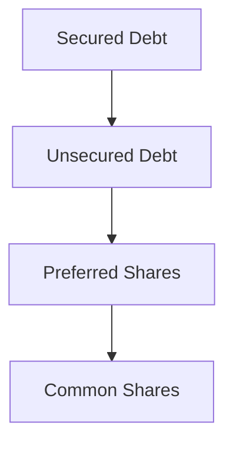
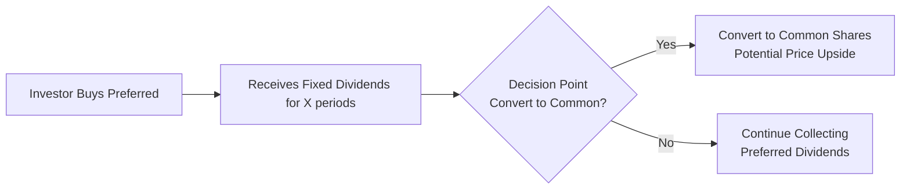

## Introduction and Basic Concepts

It seems like every time someone gets excited about owning stock in a company, they’re typically talking about common shares. But, you know, there’s often this other type of share lurking in the corporate capital structure called preferred shares. Why do they exist? And does one type outrank the other in certain scenarios? Let’s explore.

In this section, we focus on how common and preferred shares differ from one another in terms of voting rights, dividend payment priority, upside potential, and risk. For many of us, the first time we came across preferred shares, we thought, “Wait a second—if they’re called ‘preferred,’ aren’t they always better?” The short answer: it depends on what you need as an investor or what the company needs as an issuer. Both share types have unique features and roles.

## Core Features of Common (Ordinary) Shares

Common shares represent direct ownership in a corporation. If you’re buying stock on an exchange—think big household names like Apple, Toyota, or Nestlé—those are almost always common shares.

• Voting Rights  
Common shareholders typically enjoy voting rights, especially when it comes to electing the board of directors or deciding on major corporate actions like mergers. A big part of the “common” experience is the ability to vote your shares (though the actual influence of each shareholder depends on how many shares they own).  
   
• Potential for High Capital Appreciation  
Common shares have no predefined dividend (though they may pay one). Their main draw, over the long haul, is capital gain potential if the company’s value grows. So if the company thrives and the stock price soars, common shareholders get to enjoy (or suffer) the ride.  

• Higher Risk, Residual Claim  
If a company struggles, common shareholders are last in line if the company liquidates. That means the bondholders, banks, and even preferred shareholders stand ahead in the queue. Yes, you might be left holding the short end of the stick, but that’s the price of the upside potential that comes with equity ownership.

## Core Features of Preferred Shares

Preferred shares, on the other hand, are a hybrid form of equity. They sit nicely between common equity and debt in the capital structure. This means they typically feature:

• Priority in Dividend Payments  
When a firm declares dividends, preferred shareholders get their payouts before any common shareholder sees a cent. Because of this priority, preferred shares often offer a more stable or predictable income stream.

• Limited Voting Rights  
Here’s an important factor: most preferred shares do not come with voting rights. So if you love the excitement of activism—lobbying to change the board’s composition or influencing strategic directions—preferred shares might feel a bit, well, dull. In some rare cases, certain preferred shares might gain voting rights if a company stops paying dividends for a while, but that’s an exception rather than the rule.

• Dividend Structures (Cumulative vs. Non-Cumulative)  
  – Cumulative Preferred: If the issuer misses a dividend, it accumulates. These accumulated dividends must be paid in full before common shareholders can receive dividends.  
  – Non-Cumulative Preferred: If a dividend is missed, it’s gone forever, and the shareholder can’t demand it retroactively.

• Callable and/or Convertible Features  
  – Callable: The issuing company has the option to repurchase or “call” these shares at a predetermined price after a certain date. This can lead to reinvestment risk for investors if the company calls the shares when interest rates have fallen.  
  – Convertible: These shares can be converted into a specified number of common shares, typically at the holder’s discretion under certain conditions. Convertibles can offer a sweet blend of predictable income and the potential for equity upside.

From a financing standpoint, many corporations use preferred shares as a way to raise capital without diluting common shareholders too much in terms of voting power. Plus, the firm can attract investors who crave more reliable dividend streams.

## Comparison of Common and Preferred Shares

One way to see the relationship is to think about the payoff profile. Common shares promise unlimited upside (theoretically, the share price can climb to very high levels if the business grows). But they’re riskier because the payout (dividends) is not guaranteed and the liquidation claim is last. Preferred shares typically have a limited upside because they usually have a fixed or formula-based dividend, yet they provide some cushion by being ahead of common shareholders for dividend distribution and liquidation claims.

Below is a simplified diagram illustrating where common and preferred shareholders stand in a company’s capital structure relative to other claimants:



Preferred shareholders are above common shareholders in terms of claim priority but still subordinate to any bondholders in the event of liquidation.

## Market Perspectives: Volatility and Return

• Common Shares  
  – Typically more volatile.  
  – Greater opportunity for capital appreciation.  
  – Dividends can be irregular or even nonexistent if the company decides to reinvest profits or if it’s going through tough times.  

• Preferred Shares  
  – Less volatile price movements compared to common shares (though still subject to interest-rate risk and the issuer’s credit risk).  
  – Structured yield that’s somewhat comparable to a bond coupon.  
  – Generally limited to no voting rights.

For instance, if a company’s share price skyrockets, that benefit is felt most strongly by common shareholders. Preferred shareholders might see some price appreciation, especially if they hold convertible preferred shares, but the fixed dividend typically caps the upside relative to the ripple effects common shares experience.

## Investment Suitability and Portfolio Objectives

Common shares fit well for investors with a growth-oriented outlook. If you’re building a portfolio that aims to maximize long-term capital appreciation, you might favor companies whose fundamentals suggest earnings growth, reinvestment potential, and the prospect for share price appreciation over time.

Preferred shares are generally more suited to investors who want steady income but are willing to accept limited capital appreciation—a scenario often found in the portfolios of certain institutional players, retirees, or anyone who wants an income-centric approach. The stability of the dividend can be appealing, though it’s not as ironclad as bond coupon payments.

That said, big disclaimers apply. Preferred dividends can be halted. And while missed dividends on cumulative preferred shares must eventually be paid (if the company ever resumes distributions), there’s still an element of risk if the issuer’s financial health deteriorates.

## Real-World Example

Imagine a mid-sized utility company trying to fund an expansion into a neighboring region. Because it’s a utility, stable dividends are a hallmark of its business. It might issue preferred shares with a cumulative dividend feature to attract investors who love the predictability of that steady income stream. Meanwhile, the same company continues to have common shares trading, which might be more sensitive to changes in regulations, natural disasters impacting the infrastructure, or shifts in energy prices. The common shares could experience price swings (perhaps big gains if the expansion is successful), while the preferred holders rest easier at night knowing their dividends have priority.

I remember sitting down with a friend who just couldn’t wrap their head around why someone would buy a preferred share instead of common if the common had, in theory, more upside. The truth is, if you’re at a stage (or have a preference) in your investment journey where a reliable dividend is more compelling than a big chance for large capital gains, then preferred might be your best bet.

## Best Practices and Common Pitfalls

• Understand Voting Limitations for Preferred Shares  
It can be a rude awakening if you buy a security assuming you can influence corporate actions, only to find out your preferred shares don’t have voting rights. Carefully read the prospectus or offering documents.

• Watch Out for Callable Features  
If you buy a preferred share primarily for its attractive dividend yield, the company might call these shares away when interest rates drop. That leaves you having to reinvest your cash at lower prevailing rates.

• Confirm Dividend Features  
Cumulative vs. non-cumulative is a very big deal. Missing dividends on a non-cumulative preferred share are lost forever. Meanwhile, cumulative preferred shares give you some extra protection on the dividend front.

• Monitor Credit Risk and Capital Structure  
Just because it’s a “safer” slice of the capital structure compared to common stock doesn’t mean it’s risk-free. You still rely on the issuer’s solvency and willingness to pay dividends. In a liquidation scenario, preferred shareholders may still recover very little if the firm’s obligations to debt holders exceed the firm’s assets.

## Small Python Example for Dividend Comparison

Here’s a tiny snippet illustrating how one might compare cumulative and non-cumulative dividends over a series of quarters. Let’s say we have a record of declared dividends, including some quarters with zero declarations.

```python
import pandas as pd

data = {
    'Quarter': ['Q1', 'Q2', 'Q3', 'Q4'],
    'DeclaredDividend': [1.00, 0.00, 1.00, 1.25]  # per share
}

df = pd.DataFrame(data)

cumulative_dividends = []
non_cumulative_dividends = []
missed_dividends = 0.0

for d in df['DeclaredDividend']:
    # Non-cumulative gets only what is declared
    non_cumulative_dividends.append(d)

    # For cumulative
    if d == 0:
        # Dividend missed, accumulate
        missed_dividends += 1.00  # hypothetical missed rate
        cumulative_dividends.append(0.0)
    else:
        # If any missed dividends exist, pay them now
        if missed_dividends > 0:
            pay = d + missed_dividends
            cumulative_dividends.append(pay)
            missed_dividends = 0.0
        else:
            cumulative_dividends.append(d)

df['NonCumulativePaid'] = non_cumulative_dividends
df['CumulativePaid'] = cumulative_dividends

print(df)
```

This very simplified illustration demonstrates how a missed dividend in Q2 gets “accumulated,” so when a payment is finally declared, the cumulative share eventually captures the previously missed distribution. On the other hand, the non-cumulative share never sees that missed quarter’s payment.

## Company Financing Choices

Deciding whether to issue common or preferred shares (or some combination of both) depends on a firm’s objectives:

• Maintaining Control: Issuing lots of preferred shares enables the firm to raise equity capital without diluting the voting power of existing common shareholders.  
• Cost of Capital Strategy: A firm might find it cheaper to issue preferred shares with a fixed dividend than to issue new common shares (especially if the common share price is considered undervalued). The trade-off is that these dividends are legally considered equity distributions, and they typically come with certain restrictions or obligations the company must be prepared to respect.  
• Target Investor Base: Some companies prefer to attract investors who see them as stable and reliable dividend payers (e.g., utilities, REITs, certain financial institutions). Preferred shares can be popular in these contexts.

## Additional Diagram: Lifecycle of a Convertible Preferred Share

Below is a simplified sequence showing how a typical convertible preferred share might evolve:



Some convertible preferred shares include a “forced conversion” if the common share price exceeds a certain threshold, while others leave the conversion choice entirely up to the holder.

## Exam Tips and Takeaways

• Always confirm how a preferred share’s dividend is structured. Cumulative vs. non-cumulative can be tested on the CFA exam in both conceptual and scenario-based questions.  
• Look out for any mention of call features or conversion terms—they fundamentally alter the risk/return profile.  
• Compare the position of common and preferred shares in the capital structure. If the question revolves around liquidation scenarios, remember that preferred shareholders outrank common shareholders.  
• Understand the rationale behind each share type: common shares = potential capital growth + voting rights; preferred shares = stable income + priority over common.  
• Don’t forget that from a portfolio perspective, each share type caters to different investor objectives.  

## References and Further Reading

• Graham, B. & Dodd, D. (2009). “Security Analysis.” McGraw-Hill.  
• Pinto, J., Henry, E., Robinson, T.R., & Stowe, J.D. (2015). “Equity Asset Valuation.” CFA Institute Investment Series.  
• Damodaran, A. (2012). “Investment Valuation: Tools and Techniques for Determining the Value of Any Asset.” Wiley.  
• For deeper insights into corporate financing strategies and the choice between common and preferred equity, consult:  
  [Harvard Business Review on Corporate Finance](https://hbr.org/topic/corporate-finance)  

---

## Final Exam Tips

• Addressing Constructed-Response Questions: When discussing capital structure in an essay question, clearly identify the position of each type of security (senior, subordinated, preferred, common).  
• Balancing Return and Risk: If the exam asks about designing a portfolio for an income-oriented investor, highlight how preferred shares provide a predictable income stream, albeit with certain risks (default, interest-rate sensitivity, or call risk).  
• Scenario Analysis: For item set questions featuring special conditions (missed dividends, conversion triggers, etc.), carefully evaluate how those conditions alter the cost of capital and shareholder returns.  
• Use Bullet Points Efficiently: On the exam, bullet points or short paragraphs can help you structure your arguments clearly when time is tight.  
• Double-Check Payout Provisions: The exam frequently tests whether you can distinguish cumulative from non-cumulative and how that affects what the investor eventually receives.  

---

## Test Your Knowledge: Common and Preferred Shares Essentials



### Which group of shareholders typically has voting rights on corporate matters?

- [ ] Preferred shareholders
- [x] Common shareholders
- [ ] Convertible bondholders
- [ ] All investors in a company

> **Explanation:** Common shareholders, also known as ordinary shareholders, usually have voting rights. Preferred shareholders often have none or very limited voting influence.

### A preferred share that accumulates missed dividends and pays them in future periods is known as:

- [ ] Non-cumulative preferred
- [x] Cumulative preferred
- [ ] Callable preferred
- [ ] Convertible preferred

> **Explanation:** Cumulative preferred shares require the company to pay missed dividends to preferred shareholders before paying out any dividends to common shareholders.

### In the event of liquidation, the priority of claims is typically:

- [x] Bondholders → Preferred Shareholders → Common Shareholders
- [ ] Preferred Shareholders → Bondholders → Common Shareholders
- [ ] Common Shareholders → Preferred Shareholders → Bondholders
- [ ] They all rank equally

> **Explanation:** Bondholders (both secured and unsecured) rank ahead of all equity holders in claims on a company's assets, followed by preferred, then common shareholders.

### Which properly describes a “callable” preferred share?

- [ ] Investors can demand the company repurchase shares at any time
- [x] The issuer can redeem the shares at a predetermined price after a set date
- [ ] The shares automatically convert into bonds at maturity
- [ ] The issuer is obligated to pay all missed dividends at a premium

> **Explanation:** Callable preferred shares can be repurchased by the issuer at a stipulated call price, often after a certain date.

### What is the main benefit of convertible preferred shares from an investor’s perspective?

- [x] Access to a fixed or stable dividend while retaining potential equity upside
- [ ] Guaranteed shareholder voting rights
- [ ] No risk of ever missing a dividend
- [x] Can convert back to debt whenever beneficial

> **Explanation:** Convertible preferred shares provide stable dividends (like standard preferred) plus the possibility to convert into common shares, capturing share price appreciation.

### An investor seeking maximum capital appreciation potential will most likely prefer:

- [x] Common shares
- [ ] Non-cumulative preferred shares
- [ ] Callable preferred shares
- [ ] Mortgage-backed securities

> **Explanation:** Common shares offer the highest potential for long-term capital appreciation among typical equity instruments, albeit with higher risk.

### A key difference between preferred shares and long-term bonds is:

- [x] Preferred shares do not have a fixed maturity date unless they are explicitly redeemable
- [ ] Preferred shares have a higher priority of claim than bonds
- [x] Bondholders usually have voting rights in corporate decisions
- [ ] Interest rates have no impact on the price of bonds

> **Explanation:** A typical preferred share, unlike a bond, does not have a maturity date (unless it’s specifically issued as a term preferred with a redemption date). Bonds mature, and bondholders generally do not have voting rights.

### Which type of preferred stock does NOT entitle shareholders to missed dividends at a later date?

- [ ] Cumulative
- [x] Non-cumulative
- [ ] Participating
- [ ] Convertible

> **Explanation:** With non-cumulative preferred shares, if the issuer omits or postpones dividends, those payments are simply forfeited.

### From a firm’s perspective, a reason to issue preferred shares rather than common shares could be:

- [x] Avoid dilution of common shareholders’ voting power
- [ ] Provide double voting rights to all new shareholders
- [ ] Guaranteed minimum share price increase
- [ ] Obligation to repay principal at maturity

> **Explanation:** A key corporate advantage of preferred shares is raising equity capital without substantially affecting common shareholders’ voting power (most preferred shares come with no or limited votes).

### Preferred shares generally have limited or no voting rights. True or False?

- [x] True
- [ ] False

> **Explanation:** Preferred shareholders usually do not vote on regular corporate matters unless specified under extraordinary circumstances, such as missed dividends on cumulative preferred shares.


