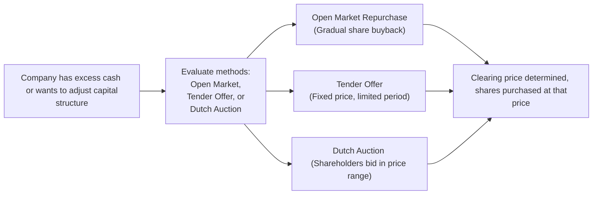

## Overview

Share repurchases, also known as buybacks, are transactions in which a company repurchases its outstanding shares from the marketplace. You might be wondering: Why do companies do that? Well, there can be multiple motivators. Sometimes, a firm feels it has surplus cash. Other times, it wants to increase specific financial metrics—like earnings per share (EPS)—or send a message that management believes the stock is undervalued. From an investor’s point of view, share buybacks can signal management confidence in the future and can also affect personal tax situations (capital gains may be taxed differently than dividends).

But of course, not all share repurchases look the same. In practice, three methods dominate:

• Open Market Repurchases  
• Tender Offers  
• Dutch Auctions  

Each approach carries its own quirks, market impacts, and regulatory considerations. Below, we explore the mechanics of each method and how they usually show up in real-world scenarios and on the CFA exam. 

## Key Concepts in Share Repurchases

Before diving into the methods themselves, let’s highlight some core themes:

• Earnings per Share (EPS) Boost: When a company buys back its shares, total shares outstanding decline. Consequently, if net income remains unchanged, EPS tends to rise.  
• Free Cash Flow and Excess Capital: Firms with healthy free cash flow often view buybacks as a mechanism to return capital to shareholders (as opposed to dividends).  
• Signaling Effect: Investors frequently interpret repurchases as a sign of confidence—management presumably thinks the shares are a good deal.  
• Tax Efficiency: In some jurisdictions, capital gains may be taxed less than dividend income, making share repurchases more attractive for certain shareholder profiles.  
• Market Manipulation Concerns: Regulators watch buybacks closely to prevent artificially boosting share price or volumes in a deceptive way.  

It’s worth noting that under US GAAP, repurchased shares typically become “Treasury Stock” and reduce total shareholders’ equity. Under IFRS, firms accomplish a similar adjustment through an equity transaction. Either way, the accounting sets the stage for how financial statements change after a buyback.

## Open Market Repurchases

An open market repurchase is, in a sense, the most straightforward way for a firm to buy back its own shares: it simply goes onto the secondary market—like an ordinary investor—and repurchases shares over time.

### Process and Features

• The company’s board authorizes a maximum number of shares (and, sometimes, a maximum dollar amount) to be repurchased.  
• There’s typically no obligation to buy all those shares if market conditions deteriorate or strategic directions change.  
• The firm can spread out the purchases, thereby reducing the potential for significant price spikes or large one-day trade volumes.  

One of my former colleagues described open market repurchases as “driving slowly on a scenic route”—you can take your time and adjust pace as the road curves. From the company’s perspective, it’s flexible and can be scaled up or down. Yet for shareholders who prefer prompt buybacks, it might feel a bit slow.  

### Advantages and Disadvantages

• Advantages:  
  – Offers flexibility: The company can halt or accelerate purchases based on market conditions.  
  – Minimizes market disruption (because it’s spread out).  
  – Costs can be managed as the firm times its purchases.  

• Disadvantages:  
  – May not significantly boost share price in the short term because of the gradual pace.  
  – Almost no guarantee that all authorized shares will be repurchased.  
  – Weaker signal of management confidence compared with a direct tender at a premium.  

### Example: Open Market Announcement

Let’s say RedHorse Technologies announces it will repurchase up to $100 million of its shares over the next 12 months. The company’s stock is hovering around $50 per share. Depending on actual market conditions and RedHorse’s financials, the firm may or may not complete the entire repurchase. Meanwhile, investors see it as a soft bullish signal—management presumably believes the stock is fairly or undervalued. Still, RedHorse could change its mind down the road.

## Tender Offers

A tender offer, on the other hand, is more like making a direct request to shareholders to sell their shares back to the company at a specified price.

### Process and Features

• The company publicly announces a share price (often at a premium to the current market price) and a specific period (e.g., 30 days) during which existing shareholders can “tender” or offer their shares.  
• If more shares are tendered than the company wants to buy, the acceptance of shares can happen on a pro-rata basis (i.e., each tendering shareholder gets to sell only a portion of their shares).  
• Once the tender offer closes, there’s a quick, definitive share reduction because the company purchases the shares all at once.  

Imagine you own shares in BlueWater Inc. On a random Tuesday, the company issues a statement saying it’s willing to buy back up to 10% of its outstanding shares at $55 per share—maybe that’s a 10% premium compared to the current market price of $50. You have a decision to make: accept the offer and collect your 10% premium or stay invested in the company.

### Advantages and Disadvantages

• Advantages:  
  – Clear, strong signal of management confidence: offering a premium suggests a real commitment.  
  – Quick, decisive share reduction; well-suited for major capital structure changes.  
  – Possibly better pricing for shareholders hoping to exit quickly.  

• Disadvantages:  
  – Often more expensive for the firm (it pays a premium above market).  
  – May put pressure on shareholders who are unsure if they should tender or hold.  
  – If oversubscribed, not all tendering shareholders can sell.  

### Example: Tender Offer Mechanics

GreenValley Corporation has 100 million shares outstanding, trading at $40 per share. Suppose management believes the stock is undervalued and decides to buy back 10 million shares at $44 (a 10% premium). If shareholders tender more than 10 million shares, each shareholder only sells a proportion of their shares to the company—often described as “subject to proration.”

## Dutch Auctions

Dutch auctions are a variation of the tender offer that allows shareholders to indicate their willingness to sell at different price points within a specified range.

### Process and Features

• The company announces a price range (for instance, $50–$55).  
• Shareholders submit bids: “I’m willing to tender X shares at $52,” or “I’ll sell Y shares at $54,” and so on.  
• After the bidding period, the shares are purchased at the lowest “clearing price” that enables the firm to buy its targeted quantity of shares.  
• All accepted shareholders receive that same “clearing price,” even if they were willing to sell at a lower price.

This structure can be a bit confusing at first—kind of like an auction in reverse. In a standard auction, the price generally goes up as bidders try to outdo each other. But in a Dutch auction for share repurchases, the company sets a range and waits for shareholders to come forward with their offers. The final purchase price is the “lowest” price that will scoop up all the shares the firm wants.

### Advantages and Disadvantages

• Advantages:  
  – Potentially lower cost to the company compared to a fixed premium tender (because the firm only pays what’s required to meet the target share quantity).  
  – Shareholders have more flexibility in deciding the minimum price at which they’re willing to sell.  
  – Provides a more market-driven result that might feel fairer.  

• Disadvantages:  
  – Logistics and administrative complexity: collecting bids can be time-consuming.  
  – Shareholders can misjudge market sentiment and miss out if the clearing price happens below their threshold.  
  – Timing and communication are critical to avoid confusion or mistrust.  

### Example: Dutch Auction Mechanics

GoldenPeak Inc. announces it will buy back up to 5 million shares in a price range of $60–$65 over a 30-day period. Various shareholders submit tender forms, each specifying the price and the number of shares they’re willing to sell. Let’s say, by the end of the period, the company determines it can buy 5 million shares in total at $62. That becomes the clearing price, and all shareholders whose bids are at $62 or below sell their shares at $62. 

## Diagram: Share Repurchase Decision Flow

Below is a simple Mermaid flowchart illustrating a company’s decision path when choosing among repurchase methods:

## Impact of Share Repurchases on EPS and Capital Structure

One of the core reasons many companies engage in share repurchases is the effect on EPS. Let’s do a quick check with a simplified scenario:

• Original net income = \$100 million  
• Original shares outstanding = 50 million shares  
• Original EPS = \$100 million ÷ 50 million = \$2.00 per share  

Now imagine the company buys back 5 million shares (10% of the shares outstanding). If net income remains \$100 million, the new EPS is:


\text{EPS}_{\text{new}} = \frac{\text{Net income}}{\text{(Original shares) } - \text{(Repurchased shares)}} = \frac{100 \text{ million}}{(50 \text{ million}) - (5 \text{ million})} = \frac{100 \text{ million}}{45 \text{ million}} = \$2.22


That’s a noticeable jump from \$2.00 to \$2.22—just from reducing shares outstanding. However, if the firm financed the buyback with debt, interest expense might reduce net income, partially offsetting the EPS benefit. From a capital structure lens, share repurchases can tighten the equity base and potentially increase financial leverage if the buyback is debt-funded.

## Regulatory Concerns and Market Impact

Regulators, such as the U.S. Securities and Exchange Commission (SEC), impose rules about when and how companies can implement buybacks, in part to prevent market manipulation. Companies typically need to observe:

• Restrictions on the daily volume of shares they repurchase (e.g., not exceeding a certain percentage of average daily trading volume).  
• Limitations on the time of day trades can be executed (e.g., not too close to market close).  
• Requirements for timely disclosures to ensure transparency.  

A formal tender offer or Dutch auction usually includes additional documentation filed with regulators, detailing the terms and the rationale so that shareholders can make informed decisions.

## International Variations

Although the fundamental logic of share repurchases is consistent worldwide, local regulations can vary. Some jurisdictions place caps on how much a company can buy back in a given period—others require prior shareholder approval. Under IFRS, shares repurchased reduce share capital, whereas in US GAAP, the typical approach is to record treasury stock as a contra-equity account. Either way, in both systems, share buybacks effectively reduce shareholders’ equity. 

## Potential Pitfalls

Of course, share repurchases can backfire under certain circumstances:

• Overvalued Share Repurchases: If management repurchases shares when the stock is expensive, it potentially destroys shareholder value.  
• Excessive Leverage: Financing buybacks with too much debt can raise the firm’s risk profile.  
• Artificial EPS Boost: Sometimes, buybacks mask deteriorating fundamentals by simply reducing the share count. Analysts need to keep an eye on net income growth as well.  
• Opportunity Cost: Funds spent on share repurchases could have been invested in growth projects, R&D, or new acquisitions.  

One CFO I know joked that choosing share buybacks over R&D feels like skipping out on the future—but that might be too extreme. Usually, it’s about balance. If the firm has exhausted all positive NPV projects, returning capital to shareholders can be a wise move.

## Exam Relevance and Tips

Share repurchases appear frequently in both item set and essay-style (constructed response) questions. You might be asked to:

• Calculate the EPS impact of a proposed share repurchase.  
• Compare the pros and cons of open market vs. tender offer vs. Dutch auction from the firm’s perspective.  
• Evaluate the signaling effect or the implications for valuation.  
• Interpret the balance sheet adjustments (treasury stock, equity changes, etc.).  

In constructed-response questions, be prepared to justify why a specific buyback method is more appropriate given a firm’s situation: Do they need speed and clear signals (tender offer)? Or do they want a flexible approach that won’t spook the market if external conditions change (open market)?

## Best Practices

1. Assess Valuation: If management strongly believes the shares are undervalued, repurchases can be beneficial.  
2. Maintain Balance Sheet Discipline: Avoid over-leveraging.  
3. Communicate Clearly: Particularly for tender offers or Dutch auctions, clarity helps reduce confusion.  
4. Observe Regulatory Limits: Stay within daily volume constraints and other legal requirements.  
5. Monitor Market Reactions: Post-announcement, watch how the market interprets the buyback.  

## References and Further Reading

- Ikenberry, D., Lakonishok, J., & Vermaelen, T. (1995). “Market Underreaction to Open Market Share Repurchases.” Journal of Financial Economics.  
- Baker, H.K., & Powell, G.E. (2005). “Understanding Financial Management: A Practical Guide.” Blackwell Publishing.  
- CFA Institute. (2020). “Corporate Finance: Share Repurchase Methods.” Level II Curriculum Readings.

--------------------------------------------------------------------------------

## Check Your Knowledge: Share Repurchase Methods and Implications



### Which of the following is the most flexible share repurchase method for a company?

- [x] Open market repurchase
- [ ] Fixed-price tender offer
- [ ] Dutch auction tender
- [ ] None of the above

> **Explanation:** An open market repurchase allows a company to buy back shares gradually over time and adjust to prevailing market conditions, making it the most flexible approach.  

### In a tender offer, what typically happens if the number of tendered shares exceeds the amount the company is willing to buy?

- [ ] The company raises its price in proportion to the oversubscription.
- [ ] The entire tender is automatically canceled.
- [x] Shares are purchased on a pro-rata basis.
- [ ] The company must purchase all shares tendered.

> **Explanation:** When a tender offer is oversubscribed, the company usually accepts shares on a pro-rata basis, ensuring fair allocation across tendering shareholders.  

### In a Dutch auction share repurchase, which of the following statements is true?

- [ ] The highest price at which shareholders are willing to sell becomes the purchase price.
- [x] The lowest price that enables the firm to buy its target shares becomes the purchase price.
- [ ] Each shareholder receives a unique price based on their individual bid.
- [ ] It does not require any regulatory disclosures.

> **Explanation:** In a Dutch auction, the “clearing price” is the lowest price at which the firm can buy the desired number of shares. All accepted shares are purchased at this single clearing price.  

### Which of the following is a key advantage of a fixed-price tender offer over an open market repurchase?

- [ ] It spans a longer time horizon.
- [x] It provides a quick and definitive share reduction.
- [ ] It’s the least costly method.
- [ ] It’s exempt from regulatory oversight.

> **Explanation:** A tender offer uses a fixed premium and a set timeframe, leading to a quick, decisive reduction in shares once the offer period closes.  

### If a company wants shareholders to indicate the price they are willing to accept within a price range, which method would they most likely choose?

- [ ] Open market repurchase
- [ ] Fixed-price tender offer
- [x] Dutch auction
- [ ] Stock dividend distribution

> **Explanation:** A Dutch auction approach requires shareholders to specify their desired selling price within the stated range. The final clearing price is determined by aggregating bids.  

### One common goal of share repurchase programs is to:

- [ ] Decrease EPS.
- [x] Increase financial leverage (if debt is used) and potentially boost EPS.
- [ ] Force shareholders to hold onto their shares longer.
- [ ] Expand the total number of shares outstanding.

> **Explanation:** Reducing the total number of shares can boost EPS, especially if the firm finances the buyback with debt (increasing its leverage).  

### True or False: In a Dutch auction, shareholders whose bid prices are below the clearing price lose out and cannot sell their shares.

- [ ] True
- [x] False

> **Explanation:** Actually, bidders at or below the clearing price do get to sell. It’s the shareholders who bid above the final clearing price who do not sell.  

### Which of the following is a potential disadvantage of an open market repurchase?

- [x] The company has limited control over the final repurchase volume if market conditions shift.
- [ ] It must purchase the entire amount of shares it initially targeted.
- [ ] It typically involves paying a premium above the market price.
- [ ] All who submit bids are guaranteed to sell their shares.

> **Explanation:** In an open market repurchase, a company can set a maximum authorized buyback amount but often retains flexibility and may not repurchase the full amount if market conditions become unfavorable.  

### A key regulatory concern related to share repurchases is:

- [ ] Over-reporting the number of shares outstanding.
- [ ] Announcing a repurchase with no intention to buy.
- [ ] Not being able to finance the repurchase at all.
- [x] Potential market manipulation if the company repurchases shares at sensitive times or volumes.

> **Explanation:** Regulators like the SEC closely monitor buyback activities to ensure companies don’t manipulate the market by creating artificial demand that boosts share prices.  

### Share repurchases can be more tax-efficient for some shareholders compared to dividends because:

- [x] Capital gains on repurchases may be taxed differently than dividend income.
- [ ] They always guarantee a better post-tax yield.
- [ ] The repurchase price is always higher than the market price.
- [ ] Dividends are tax-exempt in most jurisdictions.

> **Explanation:** In many jurisdictions, capital gains tax rates can be lower than dividend tax rates, making share buybacks more appealing from a tax standpoint for certain shareholders.  


