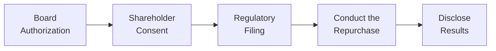

## Introduction

When companies decide to repurchase their own shares, they enter a realm of rules, governance guidelines, and regulatory scrutiny—really, it’s like treading on carefully demarcated ground. Whether you’re an investor, a member of corporate management, or an equity analyst, you want to grasp these core governance and regulatory considerations because, you know, no one wants to get on the wrong side of a securities regulator. 

Anyway, in this section, we'll walk through how corporate governance frameworks shape share repurchase programs, how boards of directors and shareholders interact to ensure fair treatment for everyone, and what constraints (like volume caps or blackout periods) might be put in place by regulators. I’ll also share a couple of anecdotes from practice: I once saw a mid-sized company sprint into a share repurchase plan without carefully thinking it through. Let’s just say they ended up with some colorful letters from regulators. Let’s avoid that outcome by going nice and systematic here.

## Transparency in Share Repurchases

Strong corporate governance starts with **transparency**, which is the clear, frequent, and accurate disclosure of corporate actions and intentions. In the context of buybacks, transparency is usually spelled out through:

• Public announcements about the launch of a repurchase program.  
• Disclosure of the maximum number of shares (or total funds) dedicated to the buyback.  
• Periodic updates on shares repurchased to date.

From a compliance standpoint, these disclosures reduce the likelihood of market manipulation. Regulators generally love it because it gives the broader public a heads-up on the magnitude and timeline of the program. This is especially relevant when a company tries to buy back a large volume of shares, because that activity can influence stock prices. 

And let’s keep it real: if you avoid transparency, you’re basically inviting suspicious minds to assume insiders are trying to push the price higher or glean private benefits. Not a good look.

## Board Approvals and Shareholder Rights

In many jurisdictions, the **board of directors** must formally sign off on share repurchases. Sometimes, an even stricter requirement is that shareholders must give their blessing, especially if the repurchase is large. These approvals are intended to prevent insider abuse, ensuring you don’t have a few controlling shareholders pushing through a buyback simply to consolidate their stake or exit on favorable terms at the expense of minority shareholders.

• **Board Approval**: The board needs to confirm that the repurchase is in the best interest of the company and doesn’t jeopardize its liquidity or strategic priorities. Legally, boards often fulfill a fiduciary duty to ensure the buyback is fair to all shareholders.  
• **Shareholder Approval**: In certain jurisdictions, if the repurchase crosses a set threshold (e.g., 10% of outstanding shares), the company might need a simple majority—or sometimes a supermajority—of votes at a general meeting. That ensures major corporate actions aren’t taken without broader support.

Remember that typical board processes involve an assessment of how the repurchase might affect **minority shareholders**, especially if the buyback is done via a tender offer or **Dutch auction**. A fair price must be offered, and the tender process must be equitable to all.

## Regulatory Limits and Requirements

Regulators often step in to prevent share repurchases from becoming a sly way to manipulate prices or create illusions of demand. Let’s see how:

• **Daily Volume Caps**: Securities regulators may restrict an issuer from repurchasing more than, say, 25% of the average daily trading volume (ADTV) in a single day. This is how the U.S. SEC’s Rule 10b-18 works, for instance. If you cross that limit, you potentially forfeit safe-harbor protection and open yourself to allegations of manipulation.  
• **Price Restrictions**: Companies can be required to buy shares only within a certain price range (e.g., no more than the prevailing market price or a small premium above it). Regulators worry that if a company pays excessively above the market price, it could inflate the stock artificially.  
• **Disclosure Requirements**: Most markets want real-time or near real-time updates on the number of shares bought back and the prices. This helps investors factor that info into their decisions, especially if the repurchase might reduce the float or send signals about management’s confidence in the firm.

All these rules are designed to level the playing field. The short version is that companies can’t barge in and scoop up shares however they want. 

## Insider Trading Laws and Blackout Periods

So here’s another big one: insider trading constraints. If a company or its executives know something that’s not available to the public (like amazing quarterly results or a new product that’s about to explode in popularity), they can’t buy back stock until that info has been released. 

• **Blackout Period**: This refers to a **restricted time**, typically right before earnings announcements or major corporate actions, when insiders and often the company itself cannot execute trades or share repurchases. These policies aim to ensure that no party buys shares while in possession of **material nonpublic information**.  
• **Regulatory Enforcement**: Violating these restrictions can lead to huge fines, forced buyback cancellations, or personal liability for board members and executives.

Personally, I’ve seen companies that got hammered for purchasing shares just a few days before releasing major news. The CEO might say, “We were planning this for weeks,” but that typically doesn’t cut it with regulators. It’s best to time the repurchase well away from hush-hush corporate events.

## Solvency and Capital Adequacy: The Company’s Financial Health

A share repurchase is basically a distribution of cash (or sometimes debt-financed capital) back to shareholders, so you have to ensure it doesn’t hamper solvency. By solvency, we mean the ability to meet current and future obligations without going belly-up.

Key frameworks often require a **solvency test**. The solvency test verifies that after the buyback, the company still has enough liquidity and net assets to remain operationally sound. In highly regulated industries—let’s say banks or insurance firms—there might also be **regulatory capital requirements**. You can’t just buy back shares if it dips your capital below certain thresholds. 

And by the way, boards also look at **debt covenants**—the conditions placed by lenders. A typical covenant might say: “You can’t distribute more than X% of your retained earnings in any single quarter unless your debt-to-equity ratio is below a certain level.” If you ignore that, you risk defaulting on your loan. So, always a good idea to read the fine print in the lending agreements.

## Governance Mechanisms for Proper Monitoring

Often, external auditors and legal counsel are tasked with reviewing the company’s repurchase plans. They look for compliance with governance rules, ensuring that minority shareholders aren’t left in the dark or unfairly diluted. They’ll check if the Board Approval guidelines have been followed, confirm that the **transparency** standard is met, ensure the **solvency test** is performed, and watch out for any potential insider trading issues.

It’s common to form a specialized committee—like a **buyback oversight committee**—that meets periodically to confirm the repurchase is proceeding according to the plan. This committee:

• Monitors the share repurchase pace to ensure the company stays within daily volume limits.  
• Checks if the purchased price is consistent with regulatory guidelines.  
• Ensures compliance with any ongoing or upcoming **blackout period** restrictions.  
• Evaluates how the repurchase is affecting liquidity and the company’s overall capital structure.

## Enforcement and Potential Penalties

If a company flouts these governance and regulatory considerations, it’s playing with fire. Browsing headlines from time to time, you’ll see enforcement actions by securities regulators or minority shareholder lawsuits. Penalties can include:

• **Fines**: Monetary penalties can be hefty, and repeated violations can double or triple the cost.  
• **Enforcement Actions/Settlements**: The regulator may force the company to cease further repurchases, or in extreme cases, disgorge ill-gotten gains.  
• **Reputational Damage**: Nobody wants to be in the spotlight for governance failures. A damaged reputation can spill over into everything from bond ratings to relationships with key suppliers.  
• **Minority Shareholder Lawsuits**: If smaller investors believe their interests have been trampled (maybe they weren’t given fair terms in a Dutch auction, or the repurchase was timed suspiciously), legal actions can follow. These suits often claim that the board or controlling shareholders breached fiduciary duty.

Let me emphasize: boards and investors typically strive to avoid these scenarios. Not only does litigation drain resources, but it also strains management’s time and focus.

## Practical Insights and Case Examples

Consider a scenario where a publicly listed manufacturing firm declares a buyback of up to 5% of its outstanding shares. The board has approved it, and the plan is that they’ll do daily open-market transactions. Sounds simple, right?

But they quickly realize the company is close to tripping a debt covenant ratio if they spend too much. So they tweak the plan. They reduce the maximum daily buyback volume, keep the purchase price within 105% of the prior day’s close, and start the program after their quarterly earnings. This approach ensures they don’t buy during a **blackout period**, comply with volume/price constraints, and maintain healthy liquidity.

In real life, you’d see bigger multi-national corporations engage external brokers to handle the repurchase through automatic trading systems that abide by preset volume and price parameters. The advantage is that it’s more formulaic and transparent, thoroughly documented, and less prone to insider allegations.

## Visualizing the Governance Process

Below is a simple Mermaid flowchart showing a typical share repurchase governance process. I know it might seem a tad abstract, but it helps some folks visualize the sequence:

Usually, “Board Authorization” comes first, potentially followed by “Shareholder Consent” (in jurisdictions mandating it). Then the repurchase details get filed with the relevant regulators, and the company conducts the actual repurchases. Finally, the results must be disclosed to the market.

## Best Practices for Examination and Real-World Application

1. Align Share Repurchases with Corporate Strategy: Repurchases shouldn’t be a random event whenever the CFO sees extra cash. They should align with capital allocation decisions, growth plans, and the firm’s overall risk appetite.  
2. Preserve Solvency: Always run the numbers on liquidity and capital requirements, especially if you’re analyzing a company with cyclical revenue streams or heavy debt loads.  
3. Watch the Timing: Plan repurchases around known **blackout periods** and be sure the board is comfortable that no **material nonpublic information** lurks on the horizon.  
4. Document Thoroughly: Keep a paper trail of board approvals, analyses, fairness opinions, and any external legal or auditor reviews. This is your best defense if regulators come knocking.  
5. Overcommunicate with Shareholders: Provide timely updates. If you pivot from an open-market approach to a tender offer, explain why.  
6. Seek Legal and Regulatory Advice: Given the complexity of different jurisdictions, don’t just read the “summary of the rules.” Engage experts—no one wants to realize too late they missed an intricate local regulation.

## Conclusion: Key Exam Takeaways

• Be aware that share repurchases, while beneficial to shareholders in many respects (e.g., potential price increase, improved financial ratios), can be subject to strict governance rules and regulatory constraints.  
• Understand that boards must often secure shareholder approval and weigh potential impacts on minority shareholders.  
• Know that regulators typically control daily volume limits, price constraints, and blackouts to prevent abuse or insider trading.  
• Recognize the significance of solvency tests—particularly relevant if the company is in a regulated industry like banking or insurance.  
• Expect real-world scenarios in which complexities around debt covenants, liquidity, and strategic timing come up.  

In the CFA Level III exam, you might see a scenario-based question testing your understanding of these governance issues, requiring you to spot potential violations (like a repurchase too close to earnings release) or incomplete disclosures. Don’t be surprised if an item set or essay question asks you to recommend best practices or identify pitfalls in a share repurchase plan. Stay watchful for details on timing, volume, and the firm’s financial condition—these are common angles for exam traps.

## References

• OECD (2015). “G20/OECD Principles of Corporate Governance.”  
• Securities and Exchange Commission (SEC). Rule 10b-18.  
• Clarke, T. (2007). “International Corporate Governance.” Routledge.  

Also consider reviewing the CFA Institute Standards of Professional Conduct, especially those that deal with insider trading and misrepresentation, to see how they apply in share repurchase contexts.

---------------------

## Test Your Knowledge: Governance and Regulatory Considerations in Share Repurchases



### Under which circumstance would a board normally seek explicit shareholder approval before executing a share repurchase?

- [x] When the repurchase program exceeds a specified legal threshold of total outstanding shares
- [ ] When an external auditor advises against it
- [ ] During a blackout period right before an earnings release
- [ ] When the repurchase is conducted in multiple tranches over a year

> **Explanation:** In many jurisdictions, companies exceeding a certain threshold (e.g., 10%) of total shares for repurchase often must seek shareholder approval to ensure broader support and avoid potential misuse of corporate funds.

### A company repurchasing shares must comply with daily volume restrictions primarily to:

- [x] Reduce the potential for price manipulation
- [ ] Keep short sellers from covering their positions
- [ ] Guarantee a minimum preference dividend
- [ ] Avoid paying high brokerage commissions

> **Explanation:** Regulators set volume limits to curb market manipulation. Excessive purchases could artificially inflate the price or create misleading trading signals.

### Which of the following best describes a blackout period?

- [x] A specified window before corporate disclosures during which insiders and the company cannot buy or sell shares
- [ ] A grace period for short sellers to settle trades
- [ ] A timeframe in which employees can purchase stock options at reduced prices
- [ ] A legal freeze on dividend payments

> **Explanation:** Blackout periods are enforced to ensure trading does not take place when insiders may have material nonpublic information, such as quarterly earnings announcements.

### One key reason to verify solvency before a share repurchase is to:

- [x] Confirm the company can continue to meet its financial obligations post-buyback
- [ ] Ensure existing shareholders are not taxed at a higher rate
- [ ] Avoid decreasing the stock’s public float
- [ ] Prevent dilution of convertible bonds

> **Explanation:** Solvency tests determine if a firm remains financially stable post-repurchase, which is crucial for meeting current and future obligations.

### A buyback oversight committee would typically do all of the following EXCEPT:

- [x] Decide whether the CEO can use personal funds to buy the stock at a discount
- [ ] Monitor compliance with volume limits and blackout restrictions
- [ ] Review the price parameters for repurchase
- [ ] Evaluate how the repurchase affects liquidity and leverage

> **Explanation:** The oversight committee monitors the repurchase’s adherence to regulations and internal policies. It would not be involved in personal share purchase deals beneficial to the CEO.

### Which of the following forms of repurchase involves offering shareholders the opportunity to tender their shares at a premium price?

- [x] Tender offer
- [ ] Open-market purchase
- [ ] Accelerated share repurchase
- [ ] Employee Stock Ownership Plan

> **Explanation:** In a tender offer, companies invite existing shareholders to sell shares at a stated cash price, which is often at a premium to the current market price.

### What is the primary rationale behind price restrictions in share repurchase programs?

- [x] Prevent gains from possible stock price manipulation
- [ ] Boost short-selling interest in the stock
- [ ] Facilitate employee stock options
- [ ] Guarantee an equal dividend payout

> **Explanation:** By restricting share repurchases to a certain range around market prices, regulators prevent companies from manipulating share prices or artificially inflating the market.

### A board’s fiduciary duty in a share repurchase typically includes:

- [x] Ensuring the buyback is fair to all shareholders and aligns with the company’s long-term interests
- [ ] Guaranteeing that share prices will rise after the repurchase
- [ ] Reducing the company’s debt ratio below the industry average
- [ ] Maximizing personal compensation for directors

> **Explanation:** The board has a fiduciary responsibility to act in the best interest of the company and all its shareholders, ensuring fairness and strategic alignment in major corporate actions like share repurchases.

### If a firm conducts a share repurchase without proper disclosure or board approval, minority shareholders might:

- [x] File a lawsuit alleging breach of fiduciary duty
- [ ] Automatically receive a special dividend
- [ ] Gain immediate control of the board
- [ ] Receive preferential shares in the next offering

> **Explanation:** Minority shareholders can initiate legal action if they believe they’ve been treated unfairly, such as by an undisclosed or improperly approved repurchase.

### True or False: Regulators generally encourage companies to purchase shares during blackout periods according to specific safe-harbor rules.

- [x] False
- [ ] True

> **Explanation:** It’s typically prohibited to repurchase stock during blackout periods to avoid insider trading risks. Safe-harbor provisions usually exclude periods when material nonpublic information might exist.


