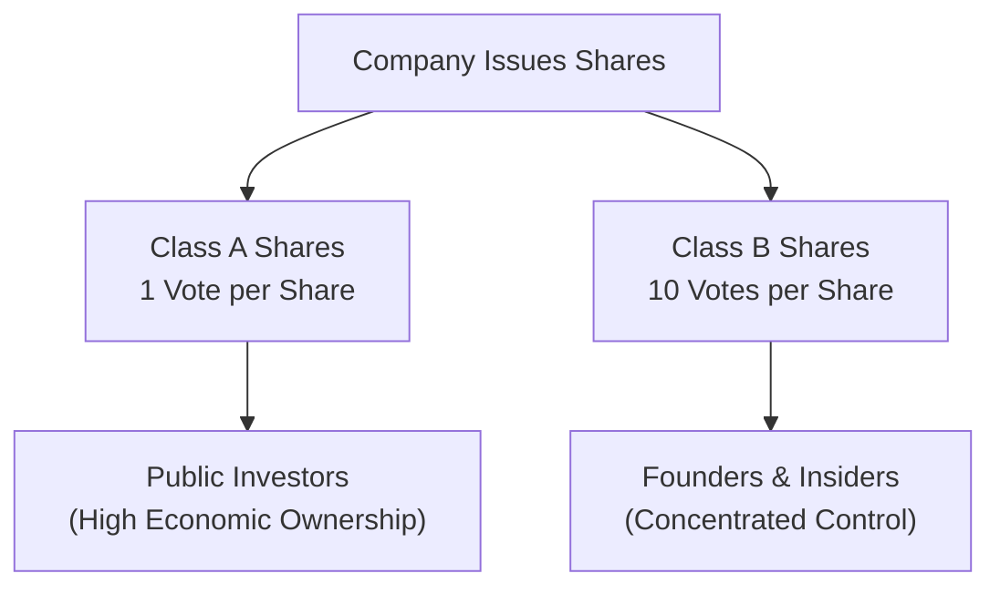
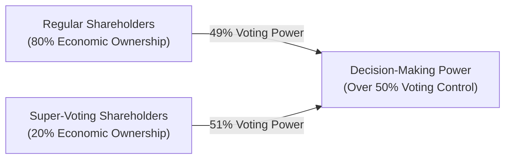

## Introduction

Have you ever wondered why some shareholders seem to hold sway over a company’s direction, while others just quietly tag along? Well, a lot of that has to do with voting rights and share classes. Sure, it’s easy to assume that all shares are the same—after all, a share is a share, right? But in reality, not all shares come with identical privileges. Voting power, dividend entitlements, and control of the firm can vary significantly based on how a company structures its share classes.  

This section explores key distinctions among common share classes, the role of voting power in corporate governance, and why these structures matter so much, especially when you’re managing equity investments or analyzing a company’s risk profile. We’ll walk you through real-world examples and best practices to help you navigate corporate bylaws, protective covenants, and complicated voting dynamics. By the end, you'll (hopefully!) feel more equipped to examine a company’s share structure before committing your investment dollars or making that final recommendation.

## Understanding Voting Rights

Voting rights are essentially your voice in the company. In most jurisdictions, shareholders who hold common stock get to vote on important corporate matters such as electing board members, approving mergers and acquisitions, and amending the charter or bylaws.

• Statutory Voting: Under statutory voting (sometimes called “straight voting”), each share you own gives you one vote per director seat. So, if you own 100 shares and there are five director seats, you cast 100 votes for each seat. While simple, this system can disadvantage minority shareholders who find it hard to concentrate their voting power on a particular candidate or agenda.

• Cumulative Voting: This is where you can pool all your votes. If you own 100 shares and there are five directors up for election, you have 500 votes total. You can then put all 500 votes behind one candidate or distribute them however you choose. Cumulative voting grants minority shareholders a better shot at electing at least one representative to the board—helping them voice distinct concerns that may not align with majority perspectives.

### Practical Example:  
Imagine you own 1,000 shares, and there are four board seats up for election. In a statutory voting system, you get 1,000 votes for each of the four seats, so 4,000 votes total. You must place exactly 1,000 votes per seat. In cumulative voting, you can aim all 4,000 votes at one single seat, boosting the chances of electing your preferred candidate.

## Multiple Share Classes

Companies don’t always stop at one type of common share. Sometimes, they create multiple classes, each with distinct privileges:

• Class A Shares: Often the “ordinary” shares, with standard voting rights (e.g., one vote per share).  
• Class B (or C) Shares: Might come with limited or no voting rights, or sometimes “super-voting” rights that can be 10 votes (or more) per share. Publishers, media, and technology start-ups frequently use these structures to keep a founder-friendly governance model.

### Case in Point  
Let’s say a founder wants to go public but still maintain strategic control—say they have a grand vision or worry about short-term market pressures. One way is to create Class B shares with 10 votes each. Founders keep these super-voting shares while selling Class A shares to the public, typically with just one vote each. Economically, each share class might carry similar (or identical) dividend entitlements, but the difference in voting power can be dramatic. This approach is quite common in the tech industry.

### Real-World Anecdote (A Slightly Personal One)  
A few years ago, I analyzed a dual-class share structure at a well-known social media company prepping for an IPO. To my surprise (and frustration, to be honest), the founders retained shares that locked in about 60% of the total voting power—despite representing less than 20% of the economic ownership. They effectively controlled the company’s future direction even though a big chunk of the money was coming from new public shareholders. That’s typical in many high-growth tech ventures, but it’s always eye-opening for prospective investors to see how widely ownership and voting power can diverge.

## The Impact of Voting Structures on Corporate Governance

When we talk about “corporate governance,” we’re referring to the system of rules, processes, and practices by which companies are directed and controlled. Voting structures can either reinforce or undermine good governance:

• Concentrated Control: Super-voting shares often grant a small group of insiders a locking grip on corporate decisions. This can promote continuity and a stable long-term vision—but it may also limit accountability and reduce the influence of other investors.  
• Minority Interests: Traditional one-share-one-vote structures, especially if combined with cumulative voting, can offer more balanced representation for minority shareholders.  
• Transparency and Accountability: Multiple share classes can make analyzing a company more complex. Investors need to read the fine print of corporate bylaws to see how votes are distributed among classes.  

### Potential Consequences for Investors
1. Control Risk: A handful of individuals can sway decisions that affect all shareholders. This is especially relevant in takeover scenarios, where super-voting shareholders might thwart attempts that regular shareholders would otherwise favor.  
2. Protective Covenants: Certain share classes come with protective covenants embedded in the bylaws. For instance, a share class might have a built-in right to veto significant new borrowing or major asset sales.  
3. Board Composition and Strategy: Insiders who hold high-vote shares can populate the board with individuals who share their perspective, influencing everything from corporate investments to dividend policy.

## Illustrating Share Class Structures

The following Mermaid diagram offers a high-level view of how different share classes structure their voting rights and ownership.

In this simplified flowchart, the key takeaway is that Class B shares—often held by insiders—may hold outsized voting power relative to their economic ownership, resulting in control risk for outside investors.

## Minority Shareholders and Cumulative Voting

Minority shareholders frequently have limited means to influence corporate policy, especially if an alternative share class wields majority votes. Cumulative voting can mitigate that limitation, offering minority shareholders a shot at securing board representation. However, laws about cumulative voting differ across jurisdictions. Some jurisdictions require it, some allow it, and others prohibit or do not address it.  

### Quick Reminder  
• Cumulative voting is always “use it or lose it.” If you’re not carefully organizing your votes around particular candidates, you might inadvertently split votes and weaken your overall influence.  
• A small investor group could coordinate to pool votes behind a specific board candidate, increasing the odds of getting a seat at the table.

## Super-Voting Shares and Control Risk

Super-voting shares, which could be 5x, 10x, or even 20x the voting power of a regular share, effectively function as an entrenchment mechanism for founders and early backers. If used responsibly, these shares protect long-term visionary projects from radical short-term changes in the firm’s mission. If misused, they can frustrate other shareholders or stifle activism that might be beneficial to the company’s overall wealth generation.

### Example: Founder Retention of Strategic Control  
Say an entrepreneur wants to expand globally. The market is cautious about capital outlays, but the founder sees a once-in-a-lifetime opportunity for competitive advantage. If the founder holds super-voting shares, they can push through the expansion even if many shareholders worry about near-term earnings hits. This could pay off big in the long run—or become a cautionary tale for excessive control if the expansion fails.

## Best Practices and Pitfalls

1. Due Diligence on Share Classes: Always start by reading the company’s Articles of Incorporation and bylaws. Identify how many share classes exist, their voting rates, and any protective or restrictive covenants.  
2. Evaluate Corporate Governance Statements: Many companies will detail how voting structures are intended to “preserve founder vision” or “streamline decision-making.” Interpret these carefully and watch for the potential negative impact on minority rights.  
3. Watch for Time-Based Sunset Provisions: Some dual-class shares automatically convert into single-vote shares after a specified period or when an ownership threshold is reached. This might reduce the founder’s control over time, aligning voting power more closely with economic ownership.  
4. Assess Liquidity: Different share classes sometimes have different degrees of liquidity. Publicly traded Class A shares might be highly liquid, while Class B shares remain privately held or trade with restrictions. Liquidity constraints can significantly affect your exit strategy.  
5. Monitor Protective Covenants: Some share classes carry the right to veto any new class of shares, large asset sales, aggressive expansions, or changes to dividend policy. Understand these rights to avoid surprises in corporate actions.

## Practical Insights for Exam and Professional Application

• When analyzing equity investments, you must note the distribution of voting rights. Holding a majority of a company’s economic interest without corresponding voting control can seriously limit your ability to influence management decisions.  
• If you’re a portfolio manager, consider the sensitivity of the portfolio to control risks. For instance, in activism strategies, you might favor single-class shares or companies where cumulative voting is mandated—this fosters easier board entry.  
• In passive index funds, share classes with restricted voting rights may still be included in the index. However, certain indexes have begun excluding or penalizing companies with excessive control structures. Keep an eye on index guidelines.  
• For valuation: stake control risk into your analysis of a company’s cost of equity. Companies with entrenched management and limited shareholder recourse might carry a higher risk premium.

## A Quick Mermaid Diagram on Voting Influence

Below is another diagram that summarizes how a small group with super-voting shares might outweigh the voting power of a broader base of regular shareholders:

Though the super-voting group holds only 20% of the total economic interest, they accumulate over 50% of total votes, thus controlling major corporate decisions.

## Exam Tips: Navigating Voting Rights and Share Classes

• Focus on comparing statutory vs. cumulative voting systems in item sets or essay questions.  
• Clarify how different multiple-share-class structures can entrench or dilute management control.  
• Be prepared to evaluate scenarios where a proposed takeover might fail due to the presence of a small group holding super-voting shares—even if the bid appears favorable for regular shareholders.  
• Understand how to factor control or minority risk premium adjustments into valuation.  
• Practice writing succinct, scenario-based responses: e.g., “Discuss how the existence of super-voting shares might impact the outcome of a proxy contest.”  

## References for Further Exploration

- CFA Institute. (2020). “Corporate Governance of Listed Companies: A Manual for Investors.”  
- Gompers, P., Ishii, J., & Metrick, A. (2010). “Extreme Governance: An Analysis of Dual-Class Firms in the United States.” Review of Financial Studies.  
- International Corporate Governance Network:  
  https://www.icgn.org/  
- Review the official CFA Program Curriculum for additional practice problems on corporate governance and share structure complexities.  

## Test Your Knowledge: Voting Rights and Share Classes



### Which voting system allows shareholders to allocate all their votes to a single director candidate?

- [ ] Statutory voting
- [x] Cumulative voting
- [ ] Non-voting shares
- [ ] Proxy voting

> **Explanation:** Cumulative voting allows shareholders to pool all their votes and allocate them as they see fit—even all to one candidate—improving minority representation on the board.

### What is a key reason some companies create multiple share classes?

- [ ] To inflate their share price via artificial demand
- [x] To grant founders or insiders greater control over corporate decisions
- [ ] To simplify the dividend payment process
- [ ] To reduce liquidity in the public market

> **Explanation:** Multiple share classes are commonly created so insiders can retain strategic control, often through super-voting shares.

### Which of the following best describes “Control Risk” in the context of share classes?

- [x] The possibility that a small group of insiders influences firm decisions, despite holding a minority of the economic interest
- [ ] The risk that shareholders will be forced to sell their shares at a discount
- [ ] The chance that board members will veto all proposed acquisitions
- [ ] The uncertainty of share price declines due to short selling

> **Explanation:** Control risk arises when insiders hold super-voting shares or a high percentage of votes, potentially overriding the preferences of other shareholders.

### In a dual-class structure, if Class B shareholders hold 20% of the economic ownership but 60% of total voting power, how does this impact minority shareholders?

- [ ] Minority shareholders can easily outvote Class B holders
- [ ] The board of directors is forced to represent both classes equally
- [x] Class B holders can dominate major corporate decisions regardless of the economic ownership held by others
- [ ] Minority shareholders automatically receive cumulative voting rights

> **Explanation:** When super-voting shareholders hold a disproportionate share of the voting power, they can effectively veto or control major decisions, undermining the influence of shareholders with a higher economic stake but lower vote count.

### Which statement about cumulative voting vs. statutory (straight) voting is correct?

- [x] Cumulative voting improves minority shareholders’ chances of electing a director
- [ ] Statutory voting allows unlimited votes to be distributed among one or more candidates
- [ ] Cumulative voting is prohibited in all jurisdictions
- [x] Cumulative voting always benefits majority shareholders

> **Explanation:** Cumulative voting notably helps minority shareholders by allowing them to concentrate their votes, making it more feasible to secure representation on the board.

### What might indicate an insider-friendly governance structure?

- [x] The presence of super-voting shares primarily held by founders
- [ ] Mandatory cumulative voting for board elections
- [ ] Low institutional ownership
- [ ] High float percentage of single-class shares

> **Explanation:** An insider-friendly governance structure is often revealed by super-voting shares that grant founders or insiders the ability to wield disproportionate control.

### Which mechanism ensures shareholders can collectively focus their votes for director elections in the manner they prefer?

- [x] Cumulative voting
- [ ] High-frequency trading
- [x] Statutory voting
- [ ] Preferred dividend plan

> **Explanation:** Under cumulative voting, shareholders can focus all votes on a single candidate or distribute them. Statutory voting, by contrast, limits shareholders to casting at most one vote per share per candidate without the flexibility of pooling.

### Why might a minority shareholder prefer cumulative voting?

- [x] It provides a realistic chance to elect at least one favored board member
- [ ] It restricts the total number of shares a company can issue
- [ ] It guarantees equal voting power with super-voting shareholders
- [ ] It eliminates the need for proxy votes

> **Explanation:** By pooling votes, a minority shareholder can concentrate them on a specific candidate, increasing the likelihood of that candidate’s election.

### Which of the following could be a risk of multiple share classes with super-voting rights?

- [x] Insiders might resist beneficial acquisitions that align with the interests of regular shareholders
- [ ] Shareholders receive more dividends than the board can afford
- [ ] Share class structures always default back to single-class after an IPO
- [ ] Equity valuations are unaffected by multiple share classes

> **Explanation:** If insiders have super-voting power, they can effectively veto or push through decisions that might not match the broader shareholder base’s preferences.

### Super-voting shares often exist to ensure founders or early backers maintain strategic control. True or False?

- [x] True
- [ ] False

> **Explanation:** Super-voting shares are a common way for founders to retain control despite having limited economic ownership—especially in industries like tech or media where the founder’s vision is considered central to the company’s brand or growth strategy.


