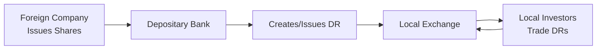

## Introduction and Context

Let me share a quick story that still makes my eyes sparkle a bit: A colleague named Carlos—originally from Brazil—once told me how he longed to invest in U.S. technology firms. He was impressed with their rapid growth and cutting-edge innovation, and he wanted a slice of that potential upside. Yet, he was hesitant to open a direct U.S. brokerage account, worried about exchange rates, tax filings, and all that. Eventually, he discovered that many of those same beloved tech companies were available to him through depositary receipts traded on his local stock exchange. Turns out, depositary receipts can simplify cross-border investing in a way that’s almost magical.

But let’s not just rely on a feel-good anecdote. Depositary receipts (DRs) are serious financial instruments. They provide a way for local investors to purchase shares of foreign corporations without having to jump through hoops involving multiple regulatory frameworks, foreign currency complexities, and wide time-zone differences. This concept has greatly expanded the notion of a “global portfolio.” If you’re thinking about exam relevance, there’s quite a bit: DRs touch on equity market structure, diversification benefits, foreign exchange (FX) considerations, and even potential regulatory intricacies. And that’s precisely what we’ll dig into here.

## Defining Depositary Receipts

A depositary receipt (DR) is essentially a certificate that represents ownership in the shares of a foreign company, but the DR itself trades locally—on a domestic stock exchange in the investor’s own market. Think of it like a “bridge” between a company in one country and investors in another. A specialized institution, called a depositary bank, handles all the nitty-gritty: it “holds” the underlying foreign shares in custody and issues corresponding DRs in the home market.

### How DRs Facilitate Global Equity Access

DRs expand an investor’s reach without requiring them to open accounts or interface directly with foreign brokers. For instance, an investor in the United States can buy an American Depositary Receipt (ADR) representing shares of a French luxury brand, just as if she were buying any U.S.-based stock through her regular broker. Meanwhile, the depositary bank is the entity ensuring that, behind the scenes, each ADR is backed by actual shares of the French company.

This approach leads to a simpler investment process for individuals, but it also has implications for corporations. For many foreign businesses, issuing DRs becomes a strategic move—one that can increase their visibility, diversify their investor base, raise capital at potentially lower costs, and even enhance brand recognition on the global stage.

## Structure and Participants

To visualize the mechanics, here’s a simplified Mermaid diagram that captures the main players and steps:



1. The foreign company issues its shares in its home market.
2. A depositary bank—typically an international financial institution—purchases or otherwise holds these foreign shares.
3. The depositary bank creates the depositary receipt, packaging the foreign shares into a tradable instrument.
4. These DRs are then listed and traded on the local exchange for investors in that market.
5. Local investors can buy or sell the DR just like any domestic share.

## Types of Depositary Receipts

### American Depositary Receipts (ADRs)

ADRs are denominated in U.S. dollars and trade on U.S. exchanges (e.g., NYSE or NASDAQ). They simplify cross-border investing for U.S. investors who want exposure to foreign companies but prefer the convenience of domestic trading hours, statements in English, and prices in U.S. dollars. For many foreign companies, ADRs present an avenue to tap into the U.S. capital markets without having to comply with every single regulatory requirement for a U.S.-domiciled firm—although, as we’ll see later, certain transparency and disclosure requirements still apply.

ADRs are subclassified by “levels,” which determine the extent of listing requirements and regulatory obligations:

• Level I ADRs: Often traded over-the-counter (OTC), with more limited disclosure requirements.  
• Level II ADRs: Listed on national exchanges (like the NYSE), requiring adherence to SEC reporting standards.  
• Level III ADRs: Used when a foreign company actually raises capital in the U.S. domestic markets, involving SEC registration and ongoing reporting.

### Global Depositary Receipts (GDRs)

Unlike ADRs, which focus on the U.S. market, Global Depositary Receipts (GDRs) can be offered in multiple international markets—commonly in Europe, often listed on stock exchanges such as the London Stock Exchange (LSE) or Luxembourg Stock Exchange. This approach is especially attractive to issuers who want to tap investor bases beyond just the U.S. for capital. GDRs can be denominated in U.S. dollars, euros, or even other currencies. For instance, an Indian company might issue GDRs on the LSE to attract a global pool of investors.

### Sponsored vs. Unsponsored DRs

• Sponsored DRs are created in collaboration with the foreign company. The foreign company “sponsors” the program by entering a formal agreement with the depositary bank. Typically, you get better corporate governance, more reliable financial reporting, and a consistent flow of information for sponsored DRs.

• Unsponsored DRs are set up by a depositary bank on its own initiative, without direct involvement from the foreign firm. Perhaps the bank sees investor demand for that company’s shares. While this can still facilitate cross-border trading, unsponsored DRs often come with fewer shareholder rights and less direct information access. If you’re the type of investor who wants to pepper the company with questions during an annual meeting, unsponsored DRs might feel a bit limiting.

## Motivations for Issuing DRs

### Expanding the Investor Base

From the issuer’s viewpoint, establishing a DR program expands the firm’s potential pool of investors. A French biotech, for example, might see far greater demand for its shares if it can introduce them to U.S. traders via ADRs or to global investors through a GDR. More demand (at least theoretically) could lead to higher valuations and improved liquidity—both of which are darling outcomes for any corporate management team.

### Access to More Liquid Capital Markets

Some emerging market firms choose DRs to access deeper, more established capital markets—like those in the U.S. or Western Europe. This expanded visibility can lower the cost of raising capital. In short, if you’re a company in a developing economy, listing through DRs might bolster your reputation and reduce investor concerns that can arise from limited home-country transparency.

### Enhanced Brand Recognition and Prestige

This might sound intangible, but brand enhancement can play a big role. Listing in a premier financial center signals to the world that a company meets certain governance and disclosure standards. Perception matters. When foreign firms choose to sponsor DRs in a heavily regulated environment, it often encourages stronger corporate governance practices overall.

## Investor Considerations

### Portfolio Diversification

From a global asset allocation perspective, DRs are a convenient vehicle for gaining exposure to foreign markets. They can help you diversify away from purely domestic economic cycles, interest-rate conditions, and political fluctuations. While many advanced strategies rely on building multi-asset portfolios across a range of geographies, DRs can be a quick fix to achieve international diversification for smaller or individual investors.

### Foreign Exchange (FX) Risk

Although ADRs trade in U.S. dollars—or GDRs might trade in euros—the underlying security is priced in the issuer’s home currency. If that home currency weakens significantly against your domestic currency, it can put downward pressure on the depositary receipt price, all else being equal. So while DRs do simplify the process, they don’t eliminate the currency risk. Sometimes, the depositary bank helps manage the conversion of dividends from the issuer’s currency into U.S. dollars or euros, but that doesn’t insulate you from underlying FX fluctuations.

### Differential Regulatory and Accounting Standards

DR programs must adhere to local market regulations where the DRs are listed. For example, a sponsored ADR in the U.S. might need to comply with certain U.S. GAAP or IFRS disclosure standards and potentially the Sarbanes-Oxley Act. However, the foreign issuer’s home market might have different rules on what is considered “material” or how certain line items are reported in financial statements. This dual layering of regulation can complicate things for analysts, so it’s important to read the fine print. In some cases, depositary banks or the issuers produce reconciled financial statements to align with the local GAAP or IFRS.

### Political and Governance Risks

Any cross-border investment entails some level of political and governance risk. Even if you’re purchasing an ADR from the comfort of your regular U.S. brokerage account, the underlying foreign company is subject to its home-country political climate, taxation, and other regulatory edicts. Changes in capital controls, repatriation laws, or property rights can affect shareholder value. Make sure you do your due diligence, just as you would if you were investing directly in that foreign market.

### Ratio of Shares to DR

One detail that sometimes surprises new DR investors: a single DR might represent multiple underlying shares, or even a fraction of one share. For instance, an ADR might be structured so that 1 ADR = 5 ordinary shares. Alternatively, 1 ADR could represent 0.5 of an ordinary share. This ratio influences the trading price of the DR, as well as your dividend payments, which—once again—reflect the underlying share’s distribution, net of fees and currency exchange adjustments.

Below is a sample Python snippet illustrating how you might convert a foreign share price to the implied DR price. Assume:

• 1 ADR = 2 shares of the foreign stock.  
• Foreign share price = 50 (in local currency).  
• Exchange rate = 1.2 local units per USD.  

```python
foreign_share_price = 50.0      # in local currency
exchange_rate = 1.2            # local currency per USD
adr_ratio = 2.0                # 1 ADR = 2 local shares

adr_price_in_usd = (foreign_share_price * adr_ratio) / exchange_rate
print("Implied ADR Price in USD:", adr_price_in_usd)
```

The snippet highlights how a depositary receipt’s U.S.-dollar price is basically a function of the underlying share price, the ratio, and the FX rate—minus additional fees or rounding differences in the real world, of course.

## Best Practices and Common Pitfalls

• Carefully examine whether a DR is sponsored or unsponsored. Sponsored DRs generally mean higher-quality information and corporate governance.  
• Investigate fees, since depositary banks often charge DR holders administrative fees that can nibble into your returns over time.  
• Remember that currency risk is still very real, even if your DR trades in a “comfort currency.”  
• Understand the legal protections (or lack thereof) in the underlying issuer’s home market.  
• Keep an eye on liquidity. Some DRs trade as frequently as large domestic stocks, while others are relatively illiquid, leading to large bid-ask spreads.

## Regulatory Differences and Compliance

When foreign companies list on U.S. exchanges, they may need to file periodic reports with the SEC. Similarly, for GDRs listed in London, some elements of U.K. financial conduct regulations will kick in. These intercultural, multi-jurisdictional compliance requirements can lead to:

• More robust disclosure: Additional costs for the issuer, but more transparency for investors.  
• Potential differences in accounting recognition: For instance, IFRS vs. U.S. GAAP treatments of revenue or intangible assets.  
• Variation in corporate governance rules: Board structure, shareholder voting rights, and the rights of minority shareholders can vary significantly from one jurisdiction to another.

From a Level I/Level III exam standpoint, appreciate that depositary receipts require due diligence into both sets of regulations, not just those of your home market. This complexity can be a question area or can appear in scenario-based vignettes testing your understanding of global capital issuance and cross-border risk.

## Significance for Portfolio Management

You might recall from earlier discussion in Chapter 1 and Chapter 2 that equities often form a critical component of diversified portfolios. Depositary receipts bring the option to invest in foreign issuers, thus broadening your equity reach. Even at advanced levels of portfolio management (as covered in higher segments of the CFA curriculum), DRs remain relevant for:

• Tactical Allocation: If a portfolio manager sees skyrocketing demand for emerging-market consumer goods, well-researched GDRs might provide a more straightforward approach than setting up multiple local brokerage relationships or complex derivative structures.  
• Risk Management: By combining DRs with other instruments, managers can offset currency or political risks. For instance, they might use currency forwards or options to hedge the currency exposure that inherently comes with DRs.  
• Performance Attribution: In multi-asset, international portfolios, analyzing performance through DR holdings can reveal how much of the return came from local share price changes versus currency moves.

## Practical Exam Tips

• Expect questions about how exchange rates interact with DR pricing and dividend payments.  
• Be ready to discuss the difference between sponsored and unsponsored DRs in terms of shareholder rights, corporate governance, and the reliability of information.  
• Remember that DRs do not eliminate currency or political risks—even though they provide a more user-friendly interface for cross-border investing.  
• Understand that different levels of ADR programs have different listing and disclosure requirements.  
• In a scenario-based question, watch for details about DR ratios that can impact the final price and dividend calculations.

## References

- Karolyi, G.A. (1998). “Why Do Companies List Shares Abroad?: A Survey of the Evidence and Its Managerial Implications.” Financial Markets, Institutions & Instruments.  
- “American Depositary Receipts.” U.S. Securities and Exchange Commission. https://www.sec.gov/reportspubs/investor-publications/investorpubsadrhtml.html  
- Bekaert, G., & Hodrick, R.J. (2017). International Financial Management. Cambridge University Press.  

## Test Your Knowledge on Depositary Receipts and Global Equity Access



### Which of the following is true about depositary receipts (DRs)?

- [ ] They eliminate foreign exchange risk for investors.  
- [ ] They cannot trade on major international exchanges.  
- [x] They represent shares of a foreign company, but trade in the investor’s domestic market.  
- [ ] They replace underlying shares with new equity issuance.  

> **Explanation:** DRs are certificates representing foreign shares, trading on domestic exchanges, but they do not eliminate FX risk.  

### In which scenario would an investor likely prefer a sponsored ADR program over an unsponsored one?

- [x] When the investor wants better corporate governance and reliable financial reporting.  
- [ ] When the investor expects minimal regulatory compliance from the issuer.  
- [ ] When the investor wants secret, exclusive access to the company's financial data.  
- [ ] When the investor wants extremely high leverage at lower cost.  

> **Explanation:** Sponsored ADRs offer more robust governance and better transparency because they involve a formal agreement with the foreign company.  

### Which of the following statements about GDRs is most accurate?

- [ ] GDRs only trade in emerging markets.  
- [ ] GDRs must be denominated in a single currency.  
- [ ] GDRs are limited to the London Stock Exchange.  
- [x] GDRs can be listed and traded in multiple global markets, often denominated in USD or EUR.  

> **Explanation:** GDRs are more flexible and can be placed across different global markets and may be denominated in dollars, euros, or other major currencies.  

### A depositary receipt is issued such that 1 DR = 5 ordinary shares in a foreign firm. If each foreign share is priced at the equivalent of USD 10, ignoring fees, what is the implied DR price in USD?

- [ ] USD 2  
- [ ] USD 5  
- [x] USD 50  
- [ ] USD 500  

> **Explanation:** If 1 DR corresponds to 5 shares, each share at USD 10, then 1 DR = 5 × 10 = USD 50.  

### When comparing Level I ADRs to Level III ADRs, which point is correct?

- [x] Level III ADRs allow the foreign firm to raise capital in the U.S., requiring stricter SEC compliance.  
- [ ] Level III ADRs don’t need any SEC registration.  
- [ ] Level I and Level III ADRs have no difference in reporting standards.  
- [x] Level I ADRs generally trade over-the-counter, while Level III ADRs may list on major U.S. exchanges.  

> **Explanation:** Level I ADRs typically trade OTC with lighter disclosure rules. Level III ADRs allow capital-raising on U.S. markets and are subject to stricter regulations.  

### Which of the following is a key role of the depositary bank in a DR arrangement?

- [x] Handling issuance, cancellation, and corporate action distributions for DR holders.  
- [ ] Setting the currency exchange rate for foreign transactions.  
- [ ] Monitoring insider trading in the foreign country.  
- [ ] Acting as the securities regulator of the home country.  

> **Explanation:** The depositary bank coordinates share custody, corporate actions (like dividend payments), and DR issuance or cancellation.  

### In a scenario where a foreign company has a sponsored ADR in the U.S., what typically improves for investors compared to an unsponsored arrangement?

- [x] Access to annual general meetings and more voting rights.  
- [x] More consistent and standardized financial disclosures under SEC rules.  
- [ ] Guaranteed hedging services against all FX risk.  
- [ ] Zero withholding tax on dividends.  

> **Explanation:** Sponsored ADRs usually confer more rights (including voting) and better financial disclosure. They do not necessarily offer currency hedging nor eliminate withholding taxes.  

### Which statement accurately captures the role of foreign exchange risk in DRs?

- [x] DRs expose investors to currency fluctuations of the issuer’s home country, even if transactions occur in the local currency.  
- [ ] DRs completely hedge FX risk for the investor by design.  
- [ ] FX movements have no impact on DR dividend repatriation.  
- [ ] All depositary banks guarantee a fixed exchange rate for the life of the DR.  

> **Explanation:** DRs do not eliminate currency exposure, and dividends or share prices remain sensitive to exchange rate movements.  

### Why might a foreign company choose a GDR issuance in London over an ADR in the U.S.?

- [ ] Because U.S. regulations are simpler and less demanding.  
- [x] To reach broader European or international investors rather than only focusing on U.S. markets.  
- [ ] Because GDRs eliminate corporate governance and disclosure requirements.  
- [ ] Because GDRs are the only legally recognized global instrument.  

> **Explanation:** GDRs facilitate access to broader investor bases, especially in Europe and other markets, whereas ADRs specifically target U.S. investors.  

### Are depositary receipts useful for portfolio diversification?

- [x] True  
- [ ] False  

> **Explanation:** DRs provide investors with exposure to foreign firms in their domestic currency environment, offering a means of international diversification within an equity portfolio.  


