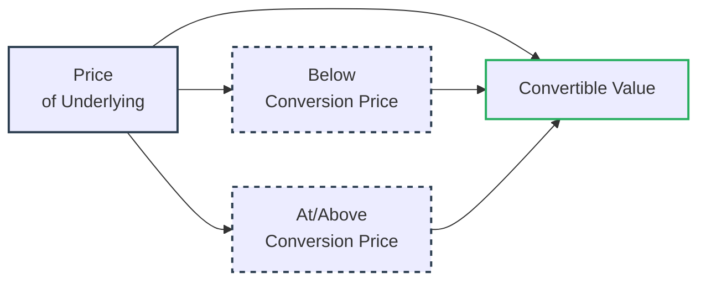

## Introduction

I remember sitting in a finance seminar years ago thinking, “Wait, so a convertible preference share is kind of like having the best of both worlds—near-fixed dividend payments plus a chance to jump in on common-stock price gains?” I was taken by the notion that, whether markets soared or sank, investors holding these hybrids had a built-in option. It felt like a financial Swiss Army knife. 

In this section, we’ll see how that kind of excitement stems from the hybrid nature of convertible preference shares and other similar instruments. You’ll encounter the dear old conversion ratio, unravel the relevant pricing models, and appreciate how these unique securities slip into corporate capital structures. Let’s dig in.

## Key Features of Convertible Preference Shares

Convertible preference shares (often called “convertible preferreds”) bring together features from both common shares and preferred shares:

• Preferred Dividend Priority: These shares typically pay a dividend that ranks ahead of common share dividends (subject to board approval and company profitability), which can be attractive if you’re seeking somewhat more predictable income.  
• Conversion Option: They include an embedded option that allows the holder to convert to a specific number of common shares based on a predetermined conversion ratio (e.g., each preferred share can convert into, say, 2.5 common shares). This feature means you participate in the upside if the underlying common shares’ price rallies.  
• Hybrid Profile: Because you have both the stability of a preferred share (regular dividends, albeit not guaranteed in the strict sense) and the potential equity upswing, convertible preferreds are typically considered a hybrid security.

Let’s acknowledge something right away—folks love convertibles for that sweet cushion on the downside along with the possibility of some upside participation. It’s almost like traveling on a plane in premium economy: you have a bit more comfort than economy but not quite the full luxuries of first class.

## Conversion Mechanics

One of the first things you’ll notice in all the marketing materials (or in the prospectus) is something called a “conversion ratio.” This ratio is the number of common shares into which each preference share can be converted. If, for example, your conversion ratio is 3:1, you can swap each convertible preference share for three common shares. 

Companies may specify a “conversion price”—the effective price at which you’d be buying the common shares if you convert. Typically:

• Conversion Price = Par Value of Preference Share ÷ Conversion Ratio  

If you have a par value of USD 60 and a conversion ratio of 3, the conversion price is USD 20. If the market price of the underlying common shares later goes above USD 20, that embedded option to convert can become pretty valuable.

### Mandatory vs. Voluntary Conversion

Some convertible preferreds allow you to convert any time you want, but others include provisions that force conversion under certain conditions—like if the common share price closes above a certain threshold for a defined number of days. Mandatory conversions can be a nifty way for the issuer to clean up its balance sheet by removing the need to pay those preferred dividends.

## Dividend Rates and the Embedded Option

Convertible preference shares often pay a slightly lower dividend than standard (non-convertible) preferred shares. Why? Because you, as the investor, are getting an added perk in the form of that conversion feature. Essentially, the “option value” that sweetens your potential returns allows the issuer to pay a little less in current dividends.

For the issuer, the presence of the conversion feature can reduce initial financing costs. But if the conversion eventually occurs, the existing shareholders will see their stakes diluted. It’s a trade-off: easier financing now, possible dilution later.

## Valuation and Option Pricing

At some point, you might ask, “How do we price these things?” Analysts typically break the convertible preference share into two components:

1. Preferred Share Value: This is akin to the present value of the expected future dividends, discounted at an appropriate rate that reflects the security’s risk level and the seniority of the claim.  
2. Option Value: This is the value of the embedded call option to convert into common shares. You might end up using option pricing techniques, such as the binomial tree or Black-Scholes, to estimate just how much more the convertible preference is worth compared with a plain-vanilla preferred.

Remember, the total value of the convertible preference share can’t be lower than its value if it were never converted (its pure preferred value), and it obviously can’t exceed the immediate payoff if you exercised your conversion right now. Analysts like to calculate:

• Conversion Value: The current market price of the common stock multiplied by the conversion ratio.  
• Market Price of the Convertible: Usually trades at or above the higher of (1) the straight preferred stock value or (2) the conversion value.

Sometimes you’ll see a “conversion premium,” which is the difference between the market price of the convertible and the conversion value. That difference is how much above the direct conversion scenario investors are willing to pay, often reflecting volatility, time value, and other intangible factors.

## Real-World Case: A Tech Company Example

Let’s say Skyline Innovations issues convertible preference shares with a USD 100 par value. Each share pays a 4% annual dividend (USD 4 per share). The shares are convertible into five common shares. The result is a conversion price of USD 20 per common share (100 ÷ 5).

• If the stock price is languishing at USD 15, you wouldn’t convert. You’d remain satisfied collecting that 4% dividend, which is higher than the 2% dividend rate of Skyline’s common shares.  
• If Skyline Innovations’ share price leaps to USD 30, well, you’d likely consider converting because your five common shares would be worth USD 150 total, exceeding the USD 100 par value plus any incremental dividend advantage.  
• If you were to convert, though, your share of Skyline’s total outstanding equity increases. However, so does the total number of Skyline’s shares, which can bring some dilution to existing common shareholders.

That’s the beauty and trade-off in one neat example: a nice yield while waiting, plus the opportunity to jump on an upward trajectory.

## Other Hybrid Securities

You’ll also hear about convertible bonds, which embody similar mechanics but from a debt standpoint. Instead of a dividend, you have interest. You also have exchangeable bonds, which are convertible into shares of a company that might be a subsidiary. That’s slightly more exotic but follows a similar logic: the investor has the option to become an equity holder of some other entity, which might be beneficial if that subsidiary or separate entity does well.

### Similarities and Differences with Convertible Bonds

• Both have an embedded conversion feature and initially tend to offer lower yield (interest or dividend) than non-convertibles.  
• The main difference: convertible bonds are part of the issuer’s debt structure, whereas convertible preferreds are part of the issuer’s equity structure. This can matter a lot if the company faces bankruptcy; debt claims rank above preferred equity claims, which rank above common shares.

## Performance and Risk Considerations

Convertible preference shares can offer downside protection relative to common shares because of that stable(ish) dividend. That said, in a severe market downturn, even these securities can lose significant value (particularly if the issuer’s credit standing weakens or the broader capital market experiences turbulence).

On the upside, convertibles do participate if the stock price rises above the conversion price. This is why, in uncertain or volatile markets, convertibles often exhibit a risk profile somewhere between that of a pure bond (or pure preferred) and a pure common share.

### Volatility and Sensitivity

When the underlying stock trades far below the conversion price, the convertible behaves more like a plain-vanilla preferred (distance from being “in the money”). When the stock sits far above the conversion price, the convertible trades more like the common. Somewhere in between, it’s a delightful hybrid.

For valuation, many analysts rely on a hedge-based or option-based approach. Option Greeks—like Delta and Gamma—can come into play, measuring how the convertible’s price changes with small changes in the underlying stock.

## Diagram: Investment Profile of Convertibles

Consider a simplified illustration of the payoff and risk profile for a convertible preference share compared to common shares and standard preferred shares. Here’s a mermaid diagram that captures the rough shape of the potential payoff:

• When the market price of the underlying is low (node C region), the convertible’s value is mostly driven by its dividend and “bond-like” or “preferred-like” floor.  
• Once the market price rises (node D region), the convertible’s payoff can track closer to common equity if conversion is in the money.

## Exam Tips and Best Practices

When you’re taking the exam—especially if it’s a scenario-based question involving convertible securities—always keep these practices in mind:

• Distinguish the Straight Value: Identify the “plain preferred” value if no conversion option were present.  
• Conversion Value Calculation: Check the current hypothetical share price, multiply by the conversion ratio, and compare it to the convertible’s market price.  
• Be Aware of Dilution: If conversion occurs, how many new shares are created, and what’s the impact on existing shareholders?  
• Evaluate Embedded Option Pricing: Many exam-style problems ask you to factor in volatility or reversion assumptions.  
• Pay Attention to Mandatory Conversion: If there’s a forced or contingent conversion clause, read carefully for triggers like share price thresholds or time-based events.

## Regulatory and Standards Integration

Under both IFRS and US GAAP, convertible preference shares can appear in equity or be classified as a liability depending on specific features such as mandatory redemption. From a compliance standpoint, it’s crucial to know the local regulatory rules about convertible issuance and taxes on dividends.  

Ethically, disclosing the potential dilution effect to existing common shareholders is essential. The CFA Institute Code and Standards encourages full transparency around how convertible equity affects the firm’s overall capital structure.

## Conclusion

So that is the essence of convertible preference shares: a financial cocktail that stirs in the flavor of stable dividends with a dash of equity upside. Personally, I view them as a strategic tool. If you’re an issuer, they give you a way to raise capital at a cheaper rate while dangling the carrot of equity conversion. If you’re an investor, you’re living in that sweet middle ground: you can enjoy a priority dividend if times are rough, yet if the stars align with a soaring stock price, you hop onto the rocket to realize capital gains.

As the marketplace evolves, other hybrids—convertible bonds and exchangeable bonds—only reinforce the creativity behind modern corporate finance. Ultimately, analyzing these convertibles requires you to carefully decompose them into their “plain-vanilla” and “option” components. And, hey, if you keep your wits about you, they can be a rewarding addition to a well-managed portfolio.

## References and Further Reading

• Chance, D.M. (1998). “An Introduction to Derivatives and Risk Management.” Harcourt Brace.  
• Fabozzi, F. (2010). “Bond Markets, Analysis, and Strategies.” Pearson.  
• Hull, J. (2017). “Options, Futures, and Other Derivatives.” Pearson.  

## Practice Questions: Convertible Preference Shares and Hybrid Securities



### An analyst wants to evaluate the value of a convertible preference share. Which of the following components is generally combined to determine the security’s total value?

- [x] Value of the underlying preference share plus the value of the embedded option
- [ ] Value of the underlying preference share less the credit spread
- [ ] Value of the common stock less the accrued interest
- [ ] Value of the embedded bond plus the risk-free rate

> **Explanation:** Convertible preference shares are often analyzed by decomposing their value into the traditional (or “straight”) preference share component plus the embedded option to convert.

### A convertible preference share has a par value of USD 100, a 4% annual dividend, and a conversion ratio of 5. If the current share price of the underlying common is USD 30, what is the conversion value per preference share?

- [ ] USD 100
- [ ] USD 105
- [x] USD 150
- [ ] USD 30

> **Explanation:** The conversion value is 5 × 30 = USD 150.

### Which of the following statements best describes the trade-off for companies issuing convertible preference shares?

- [ ] There are higher dividends but minimal dilution.
- [x] They can lower dividend costs initially but face dilution risk upon conversion.
- [ ] They completely eliminate dividend payments but must provide large capital gains.
- [ ] They offer lower yields for investors and reduce volatility for the issuer.

> **Explanation:** Issuers can often pay lower dividends on convertibles because of the attractive conversion option, but conversion will dilute existing shareholders when triggered.

### A convertible preference share has a mandatory conversion feature tied to the issuer’s stock price. This most likely means:

- [ ] The investor can convert any time, but the issuer cannot force it.
- [x] If the stock price trades above a specified threshold for a certain period, the issuer can require conversion.
- [ ] The investor retains the option to purchase additional preference shares at a discount.
- [ ] The issuer can postpone paying dividends until conversion occurs.

> **Explanation:** Mandatory conversion typically lets the issuer force conversion under specified conditions, usually a sustained higher stock price.

### Which statement is true about the role of volatility in pricing a convertible preference share?

- [x] Higher volatility in the underlying common shares increases the value of the embedded option.
- [ ] Higher volatility only affects the dividend rate required on the preference shares.
- [x] Higher volatility decreases the attractiveness of the convertible security to investors.
- [ ] Higher volatility has no impact on the conversion ratio.

> **Explanation:** Volatility generally increases option values. Since convertible preference shares incorporate a call option on the underlying equity, higher expected volatility raises that option’s value.

### A convertible preference share is trading at USD 120, while the conversion value stands at USD 110. How do analysts typically interpret the difference (USD 10) between these two amounts?

- [ ] As interest expense
- [ ] As a dividend allowance
- [ ] As a penalty
- [x] As the conversion premium

> **Explanation:** The difference between the market price of a convertible and its conversion value is often labeled the “conversion premium,” reflecting time value, volatility, and other embedded option factors.

### If a company’s convertible preference shares are currently out-of-the-money, they will most likely behave similarly to:

- [x] Straight preferred stock
- [ ] Deep in-the-money call options
- [x] Common shares
- [ ] Zero-coupon bonds

> **Explanation:** When the conversion ratio yields a conversion price that is well above the current common stock price (i.e., out-of-the-money), the convertible’s market behavior is more akin to a standard preferred share than to common equity.

### Why might a convertible preference share offer a lower dividend rate compared to a plain non-convertible preference share?

- [ ] Because the issuer has significantly higher default risk
- [ ] Because the convertible preference has a higher ranking in the company’s capital structure
- [x] Because the embedded conversion option provides additional value to the holder
- [ ] Because the holder is obligated to convert at maturity

> **Explanation:** The embedded option offers potential upside, so it compensates the investor, allowing the issuer to pay a lower dividend.

### Which factor is likely to reduce the value of a convertible preference share’s embedded conversion option?

- [ ] Increased stock price volatility
- [x] A decline in the issuer’s common stock price far below the conversion price
- [ ] A decline in the issuer’s default risk
- [ ] An improvement in the bond rating of the issuer’s senior debt

> **Explanation:** If the underlying stock price is well below the conversion price, the conversion option is less valuable because it’s out-of-the-money.

### True or False: Exchangeable bonds can be converted into shares of a company other than the one issuing the bond.

- [x] True
- [ ] False

> **Explanation:** By design, exchangeable bonds are convertible into the stock of a third-party or a subsidiary.


