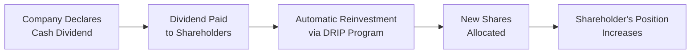
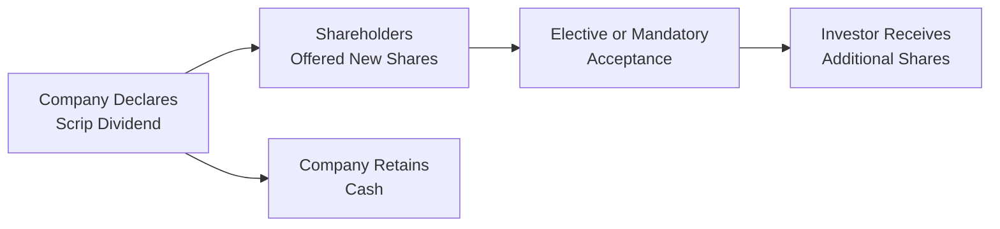

## Overview and Context

Sometimes, when people hear “dividends,” they get excited about extra cash hitting their brokerage accounts. Then, they realize there’s an option to skip that cash payment entirely and use it to buy more shares. Wait—why would anyone do that? That’s where Dividend Reinvestment Plans (DRIPs) and scrip dividends step into the spotlight. They both offer a way to “recycle” your dividend into additional shares, potentially boosting your holdings and compounding returns over time.

In this section, we’ll explore:  
• How DRIPs can help investors build equity positions automatically.  
• How scrip dividends function as share-based payouts instead of cash.  
• Why companies might encourage shareholders to opt in (and how it affects dilution).  
• Tax, regulatory, and portfolio implications.  

We’ll also include some personal anecdotes, theoretical perspectives, and advanced applications, so you’ll grasp both the conceptual underpinnings and the functional day-to-day usage of these dividend alternatives. After all, the goal here is to equip you with the know-how to evaluate when and why these approaches make sense in portfolio management.

---

## Dividend Reinvestment Plans (DRIPs)

### Key Concepts and Features

A Dividend Reinvestment Plan (DRIP) is a corporate-sponsored program (or sometimes broker-sponsored) that automatically reinvests shareholders’ cash dividends into additional shares of the issuing company. This can happen at prevailing market prices, or sometimes—lucky for you—at a discount. DRIPs generally reduce (or even eliminate) brokerage commissions and fees, making them an attractive vehicle for long-term investors wishing to grow their share position without incurring extra costs each quarter.

• Automatic Reinvestment: Dividends that would otherwise be paid out in cash go directly toward buying more shares.  
• Discounted Share Price: Some companies offer shares in the DRIP at, say, a 2–5% discount to the current market price to encourage participation.  
• Low or No Brokerage Fees: Most DRIPs waive brokerage commissions—important for cost-conscious, long-term investors.  
• Fractional Shares: Many DRIPs let you purchase fractional shares, ensuring every penny of your dividend is reinvested.  

#### Why Companies Offer DRIPs

From a corporate perspective, DRIPs are a way to continually raise equity in small increments, because the company effectively re-issues those shares back into the market—albeit to existing shareholders. This approach typically results in a modest (and somewhat predictable) stream of equity financing. For the company, it’s an easy way to bolster shareholder loyalty. For investors, it fosters a “set-it-and-forget-it” approach to share accumulation.

#### Compounding and Long-Term Growth

Let’s be real: the power of compounding is a huge deal for equity investors, especially those with a multi-decade horizon. The idea is simple: each dividend reinvested today contributes to a bigger share base that, in turn, pays out more dividends in the future. Over time, that snowball effect can really add up.

One quick formula you may recall for compounding is:


\displaystyle A = P \times (1 + r)^n


Where:  
A = the amount after n compounding periods  
P = the initial principal (or value)  
r = the periodic rate of return  
n = number of compounding periods  

In the context of DRIPs, each dividend essentially adds to P at consistent intervals. Although your actual formula can get a bit more complex—especially as dividends fluctuate or share prices change—the bottom line is that reinvested dividends can add substantially to long-term returns.

### Example: Utility Stock DRIP

Imagine you own 100 shares of a utility company that pays a quarterly dividend of $0.50 per share. Over the quarter, you earn $50 (i.e., $0.50 × 100 shares = $50). With a DRIP, that $50 is automatically used to purchase additional shares. If the company’s stock trades at $50 per share, your $50 dividend buys exactly one more share. If the DRIP offers a 3% discount, you snag a share at $48.50, making your $50 dividend enough to buy approximately 1.03 shares.

Over time, as your share count edges up, you’ll receive bigger dividends, which reinvest in turn. Though it might not feel like much in the first few quarters, after years of compounding, the total position can grow significantly.

### Potential Complexity and Considerations

1. Tax Implications  
   In many jurisdictions, the DRIP is not necessarily tax-free. You may still owe taxes on dividends even if you never actually receive that money in cash.  

2. Portfolio Concentration  
   Consistently reinvesting dividends into the same stock might cause your portfolio to become overweight in that single company—potentially increasing portfolio risk.

3. Recordkeeping  
   Purchasing fractional shares each quarter can create a recordkeeping challenge for capital gains. If you decide to sell later, you’ll need to track your cost basis carefully for each fractional share purchased over time.

4. Liquidity and Market Price Movements  
   The price at which shares are purchased via DRIP is often determined at a specific date (like the payment date). If market volatility is high, you may see some swings in the cost basis.

### Small Personal Anecdote

I remember the first time I enrolled in a DRIP was for a consumer staples company. Back then, I was excited to see that I didn’t have to pay any trading commissions. Over the years, those extra shares quietly stacked up. The entire process felt effortless—like finding spare change in the couch that actually added up to something meaningful.

---

## Scrip Dividends

### Concept Overview

Scrip dividends are a different spin on a similar idea: rather than paying out your dividend in cash, the company pays (or partially pays) it in additional shares. From the investor’s perspective, you end up with more shares (and possibly fractional shares, too). Scrip dividends can be:

• Elective (the shareholder chooses cash or shares), or  
• Mandatory (the shareholder gets shares automatically).  

#### Why Scrip Dividends?

1. **Cash Conservation for the Issuer**: If the company wants to reward shareholders but also preserve cash for investments, it might offer scrip dividends.  
2. **Dilution Concerns**: Issuing new shares can lead to earnings dilution if many shareholders opt to receive shares.  
3. **Signaling Mechanism**: Sometimes, continuing to pay or “issue” dividends indicates management’s confidence in long-term growth.  

### Elective vs. Mandatory Scrip

• **Elective**: You choose whether you want new shares or cash. This is beneficial if you want more shares without paying brokerage fees; if you’d prefer cash for personal or portfolio reasons, you simply opt for cash.  
• **Mandatory**: You do not have a choice; the company pays all or part of the dividend in shares regardless of your preference.

#### Scrip Dividend Example

Let’s suppose a technology firm decides to distribute $0.25 per share in dividends. They want to maintain their R&D budget without a major cash outlay, so they announce an elective scrip dividend. The current market price is $25 per share, so each investor is entitled to a 1/100 fraction of a new share (since $0.25 / $25 = 0.01). If an investor holds 1,000 shares, the scrip dividend entitles them to about 10 new shares (plus possibly some fractional share, depending on the exact arrangement).

If the investor chooses shares, their cost basis might still reflect a dividend distribution for tax purposes—although local tax laws vary. If they choose cash, well, they give up the extra shares but have the liquidity.

---

## Comparison: DRIPs vs. Scrip Dividends

| Feature                      | DRIP                                      | Scrip Dividend                            |
|-----------------------------|-------------------------------------------|-------------------------------------------|
| Structure                   | Dividend paid in cash, reinvested         | Dividend paid fully/partly in shares      |
| Share Purchase              | Often at a discount; no brokerage fees    | Typically no brokerage fees; can be discount or parity to market |
| Voluntary vs. Mandatory     | Generally voluntary to enroll or not      | Can be voluntary (elective) or mandatory  |
| Corporate Cash Outflow      | Company still pays dividends in cash, which then gets reinvested (though it might issue new shares directly) | Company preserves cash by issuing new shares |
| Dilution Effect             | Usually minimal but can accumulate over time if many shareholders are on the DRIP | Can be more pronounced, especially if a majority opts for scrip dividends |

Interestingly, a scrip dividend may or may not offer a discount to the market price. A DRIP often includes a discount, but not always. In both cases, shareholders need to keep track of potential dilution and properly record the tax basis.

---

## Practical Application in Portfolio Management

### Integrating DRIPs and Scrip Dividends into Strategic Asset Allocation

In a multi-asset portfolio context, repeatedly plowing dividends back into the same equity could tilt your equity weighting or your industry/sector exposure over time. For a well-balanced, diversified portfolio, you may decide to re-allocate that dividend to other asset classes if your equity target is already reached.

That said, if you have a high conviction in the company’s prospects, DRIPs or scrip dividends can streamline your reinvestment strategy and enable cost-efficient share accumulation. A stable or growing dividend policy (especially in utility-type sectors, real estate investment trusts, or strong dividend-paying consumer staples) can significantly boost total returns.

### Corporate Life-Cycle Implications

• **Early-Stage/High-Growth Firms**: Might not pay dividends at all—hence less likely to offer DRIPs or scrip dividends.  
• **Mature Companies**: More consistent dividends, and DRIPs or scrip dividends are more common.  
• **Cash Flow Management**: Companies strapped for cash (maybe facing heavy capital expenditures or expansions) may lean toward scrip dividends or an elective scrip approach to preserve liquidity.

### Case Study: Large European Bank

Many large banks, particularly in Europe, have historically offered scrip dividends—especially during periods when regulators encouraged higher capital retention. Shareholders could choose between a small cash dividend or new shares. This arrangement let the bank shore up its capital buffers without halting dividends altogether, which might have signaled distress to the market.

Over time, however, persistent scrip dividends can lead to a growing share count and possible dilution, so existing shareholders should weigh the trade-off between short-term cash needs and potential long-term share price implications.

---

## Tax and Regulatory Considerations

### Tax Similarities

In many jurisdictions, dividends—whether reinvested or paid in shares—are taxed similarly to cash dividends. For instance, an investor might still owe taxes based on the fair market value of those shares received or reinvested. If you fail to account for these distributions on your tax return—well, you could be in for a rude awakening.

### Potential Tax Advantages

Some regions might offer partial deferral or different rules for scrip dividends or DRIPs. For instance, if local regulations treat stock dividends differently than cash dividends, you might benefit from a deferral of tax until the shares are sold. However, these treatments vary widely—always consult local tax guidelines or a professional tax advisor.

### Recordkeeping Obligations

One practical note: be meticulous. You’ll want detailed records of every share increment you receive, the date, and the fair market value at that time. This ensures you accurately calculate your capital gains if or when you eventually sell those shares.

---

## Risks, Common Pitfalls, and Mitigations

### Overconcentration

One key pitfall is inadvertently ending up with too much exposure to a single company over time. This becomes a real risk if you keep reinvesting dividends in the same stock—especially if the rest of your portfolio remains static.

• **Mitigation**: Periodically review asset allocations to avoid letting a single position overshadow the entire portfolio.

### Dilution

If many shareholders opt for scrip dividends or DRIPs, the growing share count dilutes earnings per share. That might pressure the stock price or alter your share in the company’s overall ownership.

• **Mitigation**: Keep an eye on the company’s share issuance strategy. If the total share count is ballooning, factor that into your valuation analysis.

### Dividend Stability

DRIPs and scrip dividends hinge on the company’s ability to maintain dividends. If the dividend is cut, the compounding engine falters.

• **Mitigation**: Assess the sustainability of dividend payout ratios, the firm’s balance sheet strength, and earnings prospects.  

### Tax Surprises

Many investors overlook the tax obligations, thinking that if they’re not receiving cash, they won’t owe anything. That’s not always the case!

• **Mitigation**: Understand the local tax laws, keep thorough records, and set aside funds to cover tax liabilities if needed.

---

## Diagram: Flow of a DRIP

Below is a simple Mermaid diagram illustrating the flow of dividends in a DRIP scenario:

Each arrow basically represents a stage in which the cash might otherwise have gone directly to the investor, but instead is redirected to purchase new shares automatically.

---

## Diagram: Scrip Dividend Mechanics

Let’s illustrate how scrip dividends work:

In the elective scenario, you might have a choice between additional shares or cash. In the mandatory scenario, you don’t.

---

## Final Exam Tips (CFA Level III Focus)

1. Integration with Portfolio Management:  
   • Expect CFA Level III exam questions that ask you to evaluate the impact of DRIPs or scrip dividends on a portfolio’s strategic asset allocation. Practice scenario-based questions where a client’s liquidity needs or risk tolerance might lean for or against DRIP participation.

2. Behavioral Considerations:  
   • The exam might test your understanding of investor psychology: some prefer the “forced savings” approach of DRIPs, while others prefer cash to maintain flexibility. Understand how these preferences can shape an investor’s approach.

3. Tax Ramifications:  
   • Be prepared to demonstrate how DRIP-related investment decisions should be adjusted for local tax environments. The exam algorithms often incorporate after-tax returns in portfolio management contexts.

4. Progressive Dilution:  
   • You might see a question about how repeated scrip dividends could affect earnings per share. Multi-part item sets can examine your ability to connect issuance strategy, cost of capital, and overall valuation.

5. Constructed-Response Practice:  
   • Practice clearly structuring your essay-style answers, particularly on how to measure the cost basis and how to handle recordkeeping. The exam often focuses on your ability to articulate these processes in short-answer or essay format.

6. Time Management:  
   • DRIPs or scrip dividend scenarios might appear in item sets that blend multiple topics: discount models, share buybacks vs. scrip issue discussion, or combined cost-of-equity problems. Watch the clock during practice to ensure you can tackle each part methodically without running out of time.

---

## References and Further Reading

• Fabozzi, F.J., & Peterson Drake, P. (2009). “Finance: Capital Markets, Financial Management, and Investment Management.” Wiley.  
• [Dividend Reinvestment Plans (DRIPs)](https://www.investor.gov/introduction-investing) by the U.S. Securities and Exchange Commission.  
• “Scrip Dividends: An International View” in [International Tax Review](https://www.internationaltaxreview.com/).  

---

## Test Your Knowledge of Dividend Reinvestment Plans and Scrip Dividends



### Which of the following is a primary benefit of a Dividend Reinvestment Plan (DRIP) for shareholders?

- [ ] It guarantees a higher dividend yield.  
- [x] It allows automatic reinvestment of dividends into additional shares at reduced or no brokerage cost.  
- [ ] It provides immediate tax exemptions on all dividends received.  
- [ ] It sets a maximum share price for new purchases in perpetuity.  

> **Explanation:** The main benefit of a DRIP is that it allows shareholders to reinvest dividends automatically at low or no cost. There is no inherent guarantee of higher yield or immediate tax exemption.

### When a company issues a mandatory scrip dividend, it means:

- [ ] Shareholders can choose to receive cash or shares.  
- [ ] Shareholders opt in only if they pay a fee.  
- [x] Shareholders have to accept additional shares instead of cash.  
- [ ] Shareholders must sell their existing shares.  

> **Explanation:** A mandatory scrip dividend compels all shareholders to receive stock in lieu of cash payments.

### Which statement best describes the dilution effect associated with scrip dividends?

- [ ] There is no dilution effect because scrip dividends replace cash dividends.  
- [x] Earnings per share can decrease over time as the share count rises.  
- [ ] Scrip dividends reduce the total number of shares outstanding.  
- [ ] Only new shareholders experience dilution.  

> **Explanation:** Scrip dividends increase the total share count, potentially reducing earnings per share and diluting each shareholder’s ownership stake over time.

### Why might a company offer a share discount within a DRIP?

- [x] To incentivize shareholders to enroll, reducing cash outflow needed for dividend payments.  
- [ ] To inflate the company’s capital expenditures artificially.  
- [ ] To comply with regulatory minimum dividend mandates.  
- [ ] To penalize short-term traders.  

> **Explanation:** Companies commonly offer a minor discount to encourage DRIP participation, thereby retaining cash that would otherwise be distributed as dividend and potentially fostering shareholder loyalty.

### What is a key risk of consistently using a DRIP if it’s the same stock each time?

- [x] Overconcentration in one particular company.  
- [ ] Mandatory share repurchases from other shareholders.  
- [ ] Lower dividend payout ratios in the future.  
- [x] Reduced compounding effect on returns.  

> **Explanation:** Automatic reinvestment in the same company can lead to a large, focused position. While it potentially fuels compounding returns, it may also increase company-specific risk.

### In which scenario might a scrip dividend be especially appealing to a firm?

- [x] When the company needs to conserve cash to fund investment projects.  
- [ ] When the firm wants to reduce the number of outstanding shares.  
- [ ] When shareholders are predominantly tax-exempt.  
- [ ] When share buybacks are mandatory under local regulation.  

> **Explanation:** Scrip dividends let the firm keep more cash on hand, which can be crucial for large capital expenditure or growth projects.

### If a shareholder chooses not to participate in an elective scrip dividend:

- [x] They will receive the entire dividend in cash.  
- [ ] They forfeit all dividends for that period.  
- [x] They must buy shares on the open market at higher fees.  
- [ ] They lose existing shares.  

> **Explanation:** In elective scrip dividends, investors who decline the share option receive their entire dividend in cash. Buying shares separately is an independent decision (which may or may not come with higher fees).

### Under many tax jurisdictions, how are shares received through a DRIP or scrip dividend taxed?

- [x] The fair market value of the shares is taxed in the same way as if the investor had received a cash dividend.  
- [ ] They are always exempt from taxes until sold, under all conditions.  
- [ ] They are treated as capital gains immediately upon receipt.  
- [ ] They cannot be sold for at least one year based on tax laws.  

> **Explanation:** Generally, the investor will incur tax liability based on the fair market value of the shares, just as if they received a cash dividend—though specific rules vary by region.

### One common recordkeeping challenge with DRIPs is:

- [ ] Tracking how many dividends are tax deductible.  
- [x] Monitoring the cost basis of each fractional share purchased over time.  
- [ ] Determining whether to pay an annual DRIP licensing fee.  
- [ ] Cancelling the scrip dividend program mid-year if needed.  

> **Explanation:** With DRIPs, investors buy new shares (often fractional) each time a dividend is paid. This can create a complex set of cost bases for tax calculation upon a future sale.

### True or False: Elective scrip dividends offer investors the choice to receive either cash or additional shares.

- [x] True  
- [ ] False  

> **Explanation:** Elective scrip dividends allow shareholders to choose between receiving dividends in the form of additional shares or cash.


