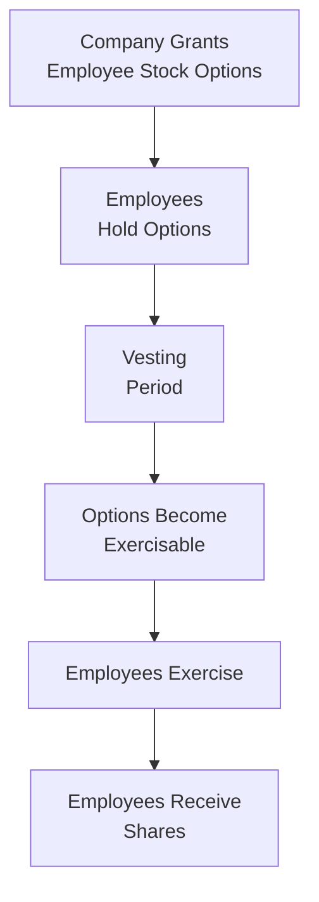

## Introduction

“Let me tell you about a time when I was first introduced to ESOPs (Employee Stock Option Plans) while working at a small tech startup. I remember how excited people got whenever someone talked about their ‘option package’—it felt like we were all rooting for the same team. Some folks were so pumped that they would stay at the office until midnight. The mere thought of the share price going ‘to the moon’ kept everyone fired up.”

Anyway, that was my introduction to the power of share-based corporate incentives: they can really connect employee success with shareholder success. But they also come with a complex set of regulations, accounting requirements, and, of course, potential pitfalls. This article digs into ESOP mechanics, vesting schedules, restricted stock, performance shares, and the overall impact on financial reporting and valuation. We’ll also explore some best practices and exam-focused insights so that you feel fully equipped to handle typical CFA® exam questions (and real-world scenarios too).

## Purpose and Key Components of ESOPs

Employee Stock Option Plans (ESOPs) are designed to give employees the right—but not the obligation—to purchase company shares at a predetermined price, known as the exercise or strike price. By granting these options, companies aim to:

• Align the interests of employees with those of shareholders.  
• Encourage longer-term thinking and loyalty among team members.  
• Reward strong performance by linking compensation to share price appreciation.  

### Vesting Schedules

A vesting schedule sets out time-based or performance-based criteria for when employees can exercise their options. Many plans stipulate:

• A “cliff period,” say one or two years, during which no options are exercisable.  
• Gradual vesting, such as 25% per year.  
• Accelerated vesting if certain performance metrics or corporate events (e.g., mergers) occur.  

This ensures employees stay invested in the company’s well-being and stick around for the requisite period. However, if an employee leaves before the options vest, those unvested options typically expire worthless.

### Exercise Price

The exercise (strike) price is often set at or near the market price of the company’s stock on the grant date. In a growing firm, if the share price rises above the exercise price, employees can buy the shares at the lower, predetermined price, realizing an immediate paper gain. If, however, the market price stays below the exercise price, the options remain “out of the money,” and employees have little incentive to exercise.

## Restricted Stock Units (RSUs) and Performance Shares

ESOPs aren’t the only vehicles for share-based compensation. Companies frequently grant RSUs (Restricted Stock Units) and performance shares. These differ from traditional stock options:

• RSUs: Shares (or the promise of shares) are granted upfront but are subject to vesting requirements—no exercise needed. Upon vesting, employees get the shares, typically with no money out of pocket.  
• Performance Shares: These vest only if certain goals are met—like hitting return on equity (ROE) targets or delivering a specific level of earnings growth over a defined period.

From a motivational standpoint, RSUs and performance shares can be powerful because they generally retain some value even if the share price doesn’t skyrocket, whereas a stock option can expire worthless if the exercise price is never surpassed.

## Share-Based Compensation and Dilution Concerns

### Potential Dilution

While granting stock options or share-based awards ticks a lot of boxes in terms of incentive alignment, it can also dilute existing shareholders if too many shares are issued once the employees exercise their options. Dilution typically reduces earnings per share (EPS) and the percentage ownership of existing shareholders.

Below is a simplified illustration:

• Suppose a firm currently has 1,000,000 shares outstanding.  
• If employees hold vested options that allow for an additional 100,000 shares upon exercise, that could raise total shares outstanding to 1,100,000.  
• The basic EPS measure and ownership percentage each existing shareholder previously enjoyed will be spread over more shares.

While no one wants indefinite dilution, many companies use stock buybacks to offset the extra share issuance. Of course, repurchasing shares costs money and affects the firm’s cash flows (and potentially its cost of capital). We’ll see how that can enter the analysis of the “net benefit” of stock or option compensation.

### Early Exercise and Liquidity

Some ESOPs allow for early exercise (i.e., employees can exercise before the vesting is fully complete), although the resulting shares might remain subject to restrictions or repurchase provisions if an employee leaves. Early exercise provides partial liquidity for employees who, for instance, might need cash for personal reasons. It can also be important for employees wanting to lock in a specific holding period for tax considerations, depending on the regulatory environment.

## Accounting for ESOPs and Share-Based Compensation

Accounting for share-based compensation is governed by IFRS 2 (Share-Based Payment) and its US GAAP counterpart, ASC 718. In short, companies are required to:

• Recognize an expense equal to the fair value of the share-based awards at the grant date.  
• Amortize this expense over the vesting period (straight-line or accelerated, depending on the plan’s vesting terms).  

This fair value approach can involve option-pricing models like Black–Scholes or binomial models, especially for stock options. Estimating inputs (e.g., volatility, expected time to exercise, dividend yield, and risk-free rate) can be fairly technical. From an analyst’s perspective, large changes in a company’s stock option valuation assumptions can affect the perceived profitability, so be sure to spot check the footnotes.

### Expense Recognition and Financial Statements

• On the Income Statement, the cost of share-based incentives is included in operating expenses (e.g., SG&A) gradually across the vesting period.  
• On the Balance Sheet, the company typically shows an increase in shareholders’ equity (paid-in capital) as employees earn the stock compensation.  
• Diluted EPS calculations incorporate all potentially dilutive securities, including the in-the-money portions of ESOPs, RSUs, and convertible instruments.

## Practical Example

Let’s say Company ABC grants 10,000 employee stock options on January 1 when its shares trade at $50. The exercise price is also $50, vesting 25% per year over four years. Suppose the fair value of each option at grant date is $8 (using an option valuation model). The total fair value is:


\text{Total Fair Value} = 10{,}000 \times \$8 = \$80{,}000


In accounting terms, IFRS 2 / ASC 718 requires ABC to recognize \$80,000 as an expense, allocated across the four-year vesting period (assuming straight-line). So, each year, ABC will recognize \$20,000 (=\$80,000 / 4) as a share-based compensation expense. By the end of year four, all \$80,000 of compensation cost will have been recognized in the financial statements.

## Impact on Valuation

From a valuation standpoint, the presence of ESOPs and other share-based incentives affects:

• Diluted Earnings Per Share (EPS).  
• The firm’s potential future cash flows if it decides to repurchase shares to offset dilution.  
• The overall cost of capital, given that share-based compensation can be viewed as part of the firm’s total compensation expense.  
• The intangible yet critical effect on corporate culture and employee engagement.

Investors performing equity research must be wary of how generous a company’s share-based compensation policies are. If an organization issues stock options “like candy,” per-share metrics can suffer, and existing shareholders can endure meaningful dilution. On the other hand, well-structured plans can spur innovation and growth.

## ESOPs, Corporate Culture, and Employee Retention

One time I chatted with a friend who works at a well-known global tech giant. She said the “golden handcuffs” of her firm’s share-based compensation kept her from jumping ship. As each new wave of RSUs and performance shares vests, it creates a sunk cost effect—why leave now if the next stock grant is right around the corner?

### Pros of Employee Ownership

• Encourages alignment of employee behavior with long-term firm objectives.  
• Enhances a sense of ownership that can foster a more performance-driven culture.  
• Boosts retention and can reduce turnover costs.

### Risks of Share Price Declines

• If the share price stagnates or declines significantly, employees might lose morale, feeling their sweat equity is not yielding tangible rewards.  
• Some employees may feel locked in to the firm if their only chance to recover lost value is to hang on until share prices recover.

## Diagram: Flow of an ESOP Grant

Below is a simplified Mermaid diagram that shows a possible life cycle of an ESOP from the company’s perspective—granting options, having them vest, and culminating in share ownership.

This chart is simplistic, of course. In reality, you might have partial or staggered vesting or performance-based triggers. Also, some employees might forgo exercising if the options are underwater.

## Evaluating Share-Based Incentives from an Investor’s Perspective

When analyzing a firm, pay special attention to:

• **Option Overhang**: How many options are outstanding relative to total shares? A high overhang can imply future dilution.  
• **Share Repurchase History**: Is the firm repurchasing shares purely to neutralize the dilution from exercised options? That tactic can mask the full effect on share count.  
• **Compensation Philosophy**: Some boards hand out options widely; others selectively grant them to top performers or executives only.  
• **Disclosure Quality**: Check footnotes for explicit explanations of vesting conditions, fair value assumptions, and expected future expenses.

## Reporting Standards and Ethical Implications

Under IFRS 2 or ASC 718, the guiding principle is that share-based compensation should be recognized as a real expense at fair value. This aims to ensure that financial statements reflect the economic cost of granting equity to employees. Attempting to defer or disguise these costs might violate IFRS, US GAAP, or even the CFA Institute Code of Ethics and Standards of Professional Conduct concerning Fair Dealing and Full Disclosure.

In practice, companies sometimes alter assumptions (like expected volatility) to manage the recognized expense. As a CFA® Level III candidate (or a professional in the field), you should be prepared to identify any unusual changes in assumptions from year to year that could be a red flag for aggressive accounting.

## Strategies to Manage Dilution

Some organizations maintain a policy of offsetting share-based compensation by repurchasing shares in the market. While this practice can limit dilution’s direct effect on EPS, it can use up valuable corporate cash or increase financial leverage if the repurchases are funded by debt. Especially if a company is in growth mode, using cash for buybacks might limit investment in new projects. Investors should consider whether offsetting dilution in this manner is truly beneficial or simply a cosmetic measure.

## Tax Considerations

Various jurisdictions offer different treatments of share-based compensation. Depending on local regulations, employees may prefer stock options for favorable tax deferrals or lower capital gains rates. However, from the firm’s standpoint, share-based compensation can be tax-deductible in some regimes once the options are exercised (or the shares vest).

Although the specifics vary widely, be mindful that tax treatments can influence:

• The structure of new compensation plans.  
• The decision to allow early exercise, for employees wanting to start the capital gains holding period earlier.  

In the CFA Level III exam, you may see scenario-based questions requiring you to weigh corporate finance decisions alongside tax consequences.

## Best Practices and Pitfalls

### Best Practices

• **Clear Disclosure**: Provide transparent breakdowns of share-based compensation in financial statements and footnotes.  
• **Fair Valuation**: Use robust option-pricing methods and consistent assumptions from period to period, absent changes in the underlying reality.  
• **Employee Communication**: Educate employees on the potential risks and rewards of equity ownership (e.g., concentration risk if they invest too heavily in their employer’s stock).  
• **Performance Alignments**: Offer a mix of RSUs, performance shares, and options so that employees at different career stages and risk tolerances remain motivated.

### Common Pitfalls

• **Excessive Issuance**: Handing out too many options can lead to severe dilution and hamper existing shareholders.  
• **Inaccurate Fair Value Estimate**: Understating share-based compensation expense distorts earnings and key financial metrics like ROA and ROE.  
• **Poor Vesting Structure**: If vesting is too short, employees might capitalize on short-term price pops but not stick around for the long haul. If it’s too long, employees might grow frustrated or see little immediate benefit.  

## Exam Tips for CFA® Candidates

1. **Distinguish Between Basic and Diluted EPS**: Expect possible item sets or essay questions asking you to compute EPS after factoring in the exercise of stock options.  
2. **Identify Key Assumptions**: Look out for vignettes that detail shifting assumptions about volatility or expected term. Evaluate how changes might alter the fair value of options.  
3. **Integration with Other Topics**: ESOPs can pop up in combination with corporate governance, financial reporting, and even ethics questions.  
4. **Time Management**: For short-answer or constructed-response questions, practice writing concise answers on share-based compensation accounting. Show relevant formulas and break down steps logically.  

## References and Further Reading

• IFRS 2 / ASC 718 (FASB) for the official standards on share-based compensation.  
• Murphy, K.J. (2013). “Executive Compensation: Where We Are, and How We Got There.” In Handbook of the Economics of Finance.  
• National Center for Employee Ownership (https://www.nceo.org) – Resource for detailed analysis on employee ownership.  
• CFA Institute. “Code of Ethics and Standards of Professional Conduct” – Key reading on ethical treatment of financial disclosures.

---

## Test Your Knowledge: ESOPs, RSUs, and Share-Based Compensation



### Under IFRS 2 and US GAAP (ASC 718), what determines the expense recognized for stock options in the financial statements?

- [ ] The stock’s price when employees exercise the options.  
- [x] The fair value of the options at grant date.  
- [ ] The book value of the company’s equity at year-end.  
- [ ] The lower of grant date market price or exercise price.  

> **Explanation:** Both IFRS 2 and ASC 718 mandate recognizing the fair value of stock options as of the grant date, amortized over the vesting period.

### Which of the following is the most direct mechanism by which companies offset the dilutive effects of employee stock option exercises?

- [ ] Granting additional options below the market price.  
- [ ] Reducing salaries and wages.  
- [x] Implementing share repurchase programs.  
- [ ] Issuing new debt.  

> **Explanation:** Companies frequently buy back shares in the open market to reduce the net increase in outstanding shares.

### A company with a four-year vesting schedule for employee stock options will likely do which of the following?

- [ ] Recognize the entire share-based compensation expense in year one.  
- [ ] Wait until year four to recognize all share-based compensation expense.  
- [x] Amortize the share-based compensation expense over four years.  
- [ ] Bypass compensation expense when the options are underwater.  

> **Explanation:** Expense is typically recognized on a straight-line or accelerated basis over the vesting period in accordance with IFRS 2 / ASC 718.

### Comparing RSUs and stock options, which statement is correct?

- [ ] RSUs provide leverage similar to options because employees can buy shares at a discount.  
- [x] RSUs are typically less risky for employees since they do not require paying an exercise price.  
- [ ] RSUs dilute existing shareholders only if the share price goes above the exercise price.  
- [ ] RSUs and stock options are identical for accounting purposes.  

> **Explanation:** RSUs vest into actual shares without a purchase requirement, making them generally less risky compared to options.

### What term describes the reduction in ownership percentage when employees exercise stock options?

- [ ] Leveraging  
- [ ] Par Value Erosion  
- [x] Dilution  
- [ ] Devaluation  

> **Explanation:** When new shares are issued to employees upon option exercise, existing shareholders’ percentage ownership is diluted.

### If the fair value assumptions used in an option-pricing model are overly optimistic, the company might:

- [ ] Overstate its share-based compensation expense.  
- [x] Understate its share-based compensation expense.  
- [ ] Correctly reflect the compensation expense regardless of assumptions.  
- [ ] Show no compensation expense in the income statement.  

> **Explanation:** Underestimating volatility or term can lower the reported fair value, thus understating compensation expense.

### One advantage of performance shares compared to traditional stock options is that:

- [x] They can still deliver value if share price growth is modest but performance targets are achieved.  
- [ ] They do not dilute shareholders at all.  
- [x] They are never taxed.  
- [ ] They always have an exercise price above market value.  

> **Explanation:** Performance shares vest based on specific targets. If metrics are reached, employees gain value even if the stock price has not dramatically increased above a particular exercise price.

### From an investor’s perspective, a high option overhang suggests:

- [ ] The company will have superior earnings growth.  
- [x] Potential future dilution if many options are exercised.  
- [ ] Minimal risk of stock price volatility.  
- [ ] Overpriced shares around the grant date.  

> **Explanation:** A “high overhang” implies a large pool of options outstanding that may convert into shares, diluting existing shareholders if exercised.

### All else equal, a company recognizing higher share-based compensation expense over time would likely show:

- [x] Lower reported net income (assuming no other changes).  
- [ ] Higher reported net income.  
- [ ] Unchanged net income, because share-based compensation is a non-cash expense.  
- [ ] Greater EPS, due to fewer outstanding shares.  

> **Explanation:** Share-based compensation expense is recognized in the income statement. Higher expenses reduce net income.

### An ESOP typically incentivizes employees to:

- [x] Increase the company’s share price over the long term.  
- [ ] Decrease the exercise price below market value.  
- [ ] Purchase shares on the open market at a premium.  
- [ ] Extend vesting schedules indefinitely.  

> **Explanation:** Because stock options become more valuable as the share price rises above the exercise price, employees have a vested interest in seeing the firm’s stock value increase.


