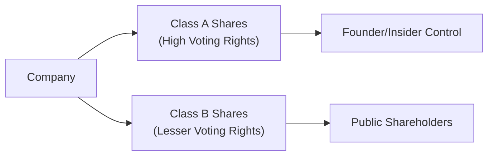

## Introduction and Key Concepts

Dual-class share structures can be somewhat polarizing—and, truth be told, they remind me of when I once co-founded a small startup with my friend. We were so excited that we wanted to retain control over every decision. That’s essentially what a dual-class structure can do for founders: it gives them more votes per share than the general public. While this arrangement can be fantastic for long-term planning, it can also cause tension with outside investors.

In a typical dual-class setup, a company issues at least two classes of shares: one class with high or multiple voting rights (often held by founders and insiders) and another with diminished or even zero voting rights (usually sold to the public). The idea is that founders can maintain control and focus on their strategic vision without worrying about short-term market pressures. But that also means outside investors might have relatively little say in how the company is run, which can invite corporate governance concerns.

Below are some important terms related to dual-class structures:

• Dual-Class Shares: Capital structure with more than one class of shares, differing primarily in voting rights.  
• Founder Control: A situation in which the founder retains majority voting power but might hold a smaller share of the overall economic interest.  
• Governance Risk: The risk that poor decision-making ensues because there are weak checks and balances.

## Rationale and Potential Benefits

Let’s be honest: founders are often the creative force behind a company’s vision. They sometimes feel they need room to keep innovating, even if markets start clamoring for quarter-by-quarter performance. Here’s where dual-class structures offer some goodies:

• Preservation of Vision: Founders can pursue projects with long lead times—think intense R&D—without fretting over activist investors looking to turn a quick profit.  
• Focus on Long-Term Growth: Management might be more inclined to invest in big, strategic endeavors if they’re not worried about being ousted by a simple majority vote.  
• Defense Against Hostile Takeovers: The “entrenched management” concept isn’t always negative. In some cases, it discourages opportunistic predators that might not share the firm’s long-term goals.

Of course, these benefits come with a big if: controlling shareholders must remain aligned with broader shareholder interests. If they diverge, well, that’s when trouble brews.

## Potential Drawbacks and Governance Concerns

The big sticking point for outside investors is that while founders maintain disproportionate voting power, they may not always maintain matching economic risk. In other words, a founder could own 10% of the company but control 50% of the votes (just as an example), which can lead to:

• Entrenched Management: This one is huge. When there’s no easy way to dislodge executives, accountability can slip.  
• Weaker Minority Shareholder Rights: If your votes mean less, you may have fewer avenues to voice dissatisfaction or influence critical decisions like mergers, dividends, or strategic pivots.  
• Potential Valuation Discounts: Some investors shy away from dual-class shares because they dislike the governance risk, reducing overall demand and possibly pressuring valuations.

It’s a delicate balance, right? Companies want to give founders room to run, but they also need to ensure outside investors don’t feel shortchanged.

## Regulatory Landscape and Global Perspectives

Different stock exchanges have different views on dual-class systems. For instance:

• NYSE and NASDAQ allow companies to list with dual-class structures, though they have disclosure and corporate governance requirements.  
• Some European exchanges are stricter. They might limit or disallow these arrangements outright, favoring the “one share, one vote” principle.  
• In certain Asian markets, dual-class structures are evolving but often come with regulatory scrutiny to protect minority shareholders.

Some regulators encourage “sunset provisions,” which automatically convert high-voting shares to standard shares after a set period or a triggering event (like the founder stepping down). These sunset provisions aim to ensure that a once-needed governance structure doesn’t hang around forever.

## Diagram: Dual-Class Voting Structure

Below is a simplified Mermaid diagram illustrating a dual-class structure. “Class A” owners (founders/managers) have more voting power per share than “Class B” owners (public investors).

This structure basically channels stronger voting rights into the hands of founders and executives, while general market participants hold shares with minimized influence.

## Impact on Valuation and Analysis

From a CFA perspective, analyzing a company with dual-class shares means you’ve got to look at qualitative and quantitative angles:

• Qualitative Governance Review: Check the company’s governance policies, protective covenants, and any “sunset provisions.” If the founder has near-absolute power, do they use it responsibly?  
• Potential Discount or Premium: In efficient markets, concerns about weaker minority rights or entrenchment risk could translate into a discount. However, if the founder is known for genius and markets believe in their leadership, you might see a premium.  
• Earnings Power vs. Control: Ultimately, an equity claim is about cash flows. Even if you don’t have much voting power, you still get your share of dividends or leftover value if the firm’s wound up. Some investors weigh those potential returns against the intangible costs of limited governance influence.

Let’s consider a numeric illustration. Suppose a company has 10 million shares outstanding, split evenly into 5 million Class A shares and 5 million Class B shares. Class A shares each carry 10 votes, while Class B shares each carry 1 vote. That means:

• Total Economic Ownership: 50% Class A, 50% Class B.  
• Total Voting Rights: 5 million Class A × 10 votes = 50 million votes vs. 5 million Class B × 1 vote = 5 million votes. Class A controls 91% of the votes (50M / 55M total).

If the founder holds 2 million Class A shares (representing 20% of total shares outstanding), they still control 20 million votes out of 55 million—a 36% voting block—despite only owning 20% in economic terms. That difference can dramatically alter shareholder dynamics.

## Sunset Provisions

Many governance advocates say: “Fine, let them have their dual-class arrangement—but not forever.” That’s where sunset provisions kick in. If a dual-class structure gradually phases out—say, the super-voting shares convert to regular shares in 10 years or upon the founder’s exit—the idea is that companies eventually return to a more traditional governance model.

Why does this matter?

• Accountability Over Time: As the company matures, it may outgrow the founder’s need for total control.  
• Investor Confidence: Knowing there’s a built-in path toward one share, one vote might make potential investors more comfortable.

Of course, some founders are not fans of sunsets (unless it’s on the beach). They argue that a powerful vision might need 20, 30, or even 40 years to mature—especially in industries with lengthy R&D cycles.

## Best Practices for Investors and Analysts

If you’re evaluating a dual-class firm:

• Study the Voting Provisions: Understand precisely how many votes each share carries and any rules about converting shares from one class to another.  
• Review Governance Covenants: Check if the board has sufficient independent directors, or if there are protective clauses for minority shareholders.  
• Monitor Alignment of Interests: Is the controlling shareholder’s personal fortune at stake if the firm fails, or does the founder have ways to offload risk?  
• Assess Potential Catalysts and Risks: Look out for triggers like the founder’s retirement that might cause significant shifts in voting power or share classes.

## Exam Relevance and Practical Tips

For exam day, remember that dual-class structures appear in questions about corporate governance, equity analysis, and likely cost of capital scenarios. Keep these pointers in mind:

• Compare and Contrast: You might get an essay or item set that contrasts dual-class governance with a single-class approach.  
• Risk Identification: Be ready to articulate governance risks and how they might factor into the firm’s cost of equity or Weighted Average Cost of Capital (WACC).  
• Valuation Scenarios: You might see a scenario requiring you to adjust valuations for perceived governance risk premia.  
• Ethical Considerations: The CFA Institute Code of Ethics emphasizes fairness and full disclosure. Expect potential questions on being transparent about voting structures and conflict-of-interest concerns.

Don’t forget to think about how IFRS or US GAAP might not directly govern share classes but will influence the footnote disclosures about them. Pay attention to footnotes in financial statements that detail share classes, voting rights, and any conversion features.

## Quick Case Story

I once analyzed a company where the founder held 10% in economic ownership but more than 50% voting authority. The founder famously vetoed a few proposals from the board—some might say for good reason, others found it heavy-handed. Over time, the founder’s shares converted to normal shares under a sunset clause, and control issues eased. Markets responded positively, with the stock price jumping after the announcement of the impending conversion date. This story always reminds me that, in the end, clarity around governance matters to investors nearly as much as growth prospects.

## References for Further Exploration

• Masulis, R.W., Wang, C., & Xie, F. (2009). “Agency Problems at Dual-Class Companies.” Journal of Finance.  
• CFA Institute. (2018). “Dual-Class Shares: The Good, the Bad, and the Ugly.” Market Integrity Insights.  
• Bebchuk, L.A., & Kastiel, K. (2017). “The Untenable Case for Perpetual Dual-Class Stock.” Virginia Law Review.

## Test Your Knowledge: Dual-Class Share Structures



### Which statement best describes dual-class share structures?

- [ ] They provide all shareholders with equal voting power.  
- [ ] They are commonly restricted to small private companies.  
- [x] They typically give founders or insiders a disproportionate amount of voting power relative to their economic ownership.  
- [ ] They allow no flexibility in converting share classes over time.  

> **Explanation:** In dual-class structures, a group of insiders (often founders) maintains outsized voting rights, which do not always correlate with economic ownership.

### What is one primary reason that founders favor dual-class share structures?

- [ ] To raise the required return on equity  
- [ ] To decrease the company’s transparency  
- [x] To preserve control and implement a long-term strategy  
- [ ] To avoid paying dividends  

> **Explanation:** Founders value the freedom to pursue long-term initiatives without being constrained by short-term shareholder demands.

### Which of the following is a potential downside to dual-class share structures?

- [ ] The presence of independent board members  
- [x] Limited influence for minority shareholders  
- [ ] More robust disclosure requirements under IFRS  
- [ ] The reduced focus on R&D  

> **Explanation:** One drawback is that minority shareholders, who may have invested significant capital, can have little to no voice in critical company decisions.

### How do sunset provisions typically influence dual-class structures over time?

- [x] They require the high-vote shares to convert to low-vote shares at a predetermined future point or event.  
- [ ] They permanently entrench the founder’s voting power.  
- [ ] They increase the number of voting rights for the public investors at issuance.  
- [ ] They eliminate all governance requirements for the firm.  

> **Explanation:** Sunset provisions aim to phase out or convert shares’ multiple voting rights after a certain time or trigger event to restore the “one share, one vote” principle eventually.

### In terms of valuation, dual-class shares may trade at a discount compared to similar companies with a single-class structure. What is one possible reason for this discount?

- [ ] Lower dividend yields  
- [ ] Higher operating costs  
- [x] Elevated governance risk and limited minority shareholder rights  
- [ ] Less brand recognition  

> **Explanation:** Investors may apply a discount to account for governance risks, as their reduced voting power can hinder their ability to influence the company or challenge poor management decisions.

### When analyzing dual-class share structures, which factor should analysts scrutinize closely?

- [x] The alignment of economic incentives between controlling and minority shareholders  
- [ ] The frequency of IFRS changes  
- [ ] The absolute level of interest rates set by the Federal Reserve  
- [ ] The use of intangible assets in the capital structure  

> **Explanation:** Dual-class companies can experience a mismatch between voting power and equity ownership, so analysts should check whether controlling shareholders have enough “skin in the game” economically.

### Which of the following is an example of a “founder control” scenario?

- [x] A founder who owns 15% of the equity but retains over 50% of voting rights  
- [ ] A founder who holds no equity but exerts managerial influence via a board seat  
- [x] A founding team that collectively owns 10% of shares but holds 60% of the votes  
- [ ] A founder who has sold all shares but still advises the CEO  

> **Explanation:** Founder control arrangements typically feature disproportionate voting versus economic ownership.

### What is a common argument in favor of dual-class structures?

- [ ] They guarantee higher dividend payouts for public investors.  
- [ ] They reduce regulatory scrutiny through exemptions.  
- [ ] They immediately convert into single-class structures upon listing.  
- [x] They allow management to focus on long-term strategies without short-term shareholder pressure.  

> **Explanation:** Proponents claim dual-class structures insulate management from quarterly earnings pressures, enabling leaders to make strategic decisions for long-term growth.

### Which regulatory practice can mitigate governance concerns associated with dual-class structures?

- [x] Mandatory sunset provisions  
- [ ] Decreasing the number of board seats for independent directors  
- [ ] Restricting the use of audited financial statements  
- [ ] Eliminating all disclosure requirements  

> **Explanation:** By requiring the conversion of super-voting shares to normal shares after a specified period, regulators can reduce the risk of entrenched control.

### True or False: A company with dual-class shares always maintains a permanent separation of voting control and economic ownership.

- [x] True  
- [ ] False  

> **Explanation:** While not all dual-class structures last forever (some have sunset provisions), dual-class shares by design create a separation between voting control and economic ownership, at least initially.


