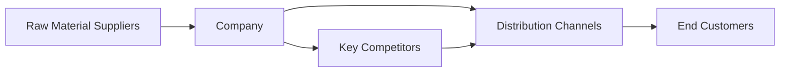
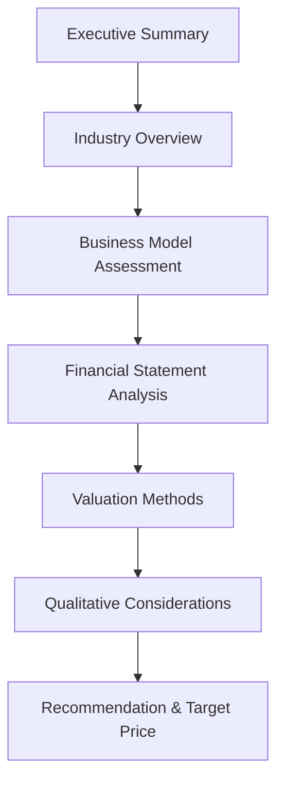

## Introduction

Whether you’re skimming a one-page snapshot or devouring a 30-page deep dive, a well-structured company research report can be the difference between confidently making an investment decision and feeling utterly overwhelmed. I remember once, while I was sipping coffee at a local café, a friend slid over an unfamiliar tech company’s annual report and asked, “So, would you buy their stock?” I mumbled, “Um, let’s see,” and tried piecing together their complicated financials on the back of a napkin. Suffice it to say, I wished I had a formal research report—one that offered a clear, step-by-step narrative of what the company is all about, why it might be appealing, and where the potential pitfalls lurk. The good news is: that’s exactly what a comprehensive research report does.

In this section, we explore the elements of a typical company research report from top to bottom. We’ll see how each piece—from the Executive Summary through the final Recommendation—builds a solid case for or against investing in a particular equity security. While earlier parts of this curriculum (see Chapter 1.1 on “The Role of Equities in an Investment Portfolio” and Chapter 6.2 on “Evaluating Revenue Drivers, Profitability, and Growth Trends”) set the stage with foundational knowledge, here we zoom in with a real-life lens on how we assemble that knowledge into a coherent report. And yes, we’ll keep the conversation a bit friendlier than you might expect from standard finance tomes. So, grab your metaphorical pen and let’s dive in.

## Executive Summary

You know how movie trailers deliver the highlights before you decide to watch the entire film? The Executive Summary does something similar for a company research report. It’s a concise overview that immediately tells the reader what the company does, its primary sources of value, any catalysts for future performance, and the overarching reason a reader might invest or avoid the stock. This top-level snapshot usually includes:

• A brief description of the business model (think: “They produce cutting-edge renewable energy solutions for commercial clients”).  
• A highlight of the recent financial performance, such as “Revenue growth has accelerated 15% year-over-year.”  
• Key catalysts, like “Pending regulatory approvals” or “Expected product launches.”  
• Risks or uncertainties (maybe “High customer concentration” or “Product safety concerns” could hamper growth).  
• A quick statement of the analyst’s recommendation, e.g., “We maintain a Buy rating with a 12-month target price of $50.”

### Crafting a Crisp Investment Thesis

At its core, the Executive Summary should directly state the investment thesis. Imagine you have 30 seconds to convince an acquaintance why stock XYZ is potentially a great (or poor) investment opportunity. That top-level pitch gives the entire report direction and resonates throughout the subsequent sections.

## Industry Overview

A company’s performance is rarely isolated from its environment. In fact, you probably explored some aspects of this back in Chapter 7 on “Industry and Competitive Analysis.” Here, we take a deeper cut into macroeconomic, sector, and competitive forces shaping the company’s prospects. Honestly, there’s an entire science to analyzing industries—Porter’s Five Forces, PESTLE frameworks, you name it—and they each feed directly into how a particular company might sustain (or fail to sustain) healthy returns.

### Market Position and Competition

• Competitive Landscape: Identify key competitors, both direct and indirect. For example, if analyzing a major streaming service, compare it to competing streaming providers, cable TV providers, and perhaps even content creators.  
• Industry Structure: Look at the concentration or fragmentation within the market (see Porter’s Five Forces in Chapter 7.2). How easy is it for new players to enter? Are any existing incumbents at risk of being replaced by disruptive new technologies?  
• Regulatory and Macroeconomic Context: Changes in interest rates, tariffs, consumer spending patterns, or even environmental regulations can either help or hurt the company’s bottom line.  

### Using Diagrams to Visualize Industry Dynamics

To illustrate how the company’s position might evolve in relation to broader market trends, consider the following Mermaid diagram that depicts a simplified supply chain and competition overview:

Here, you can see how a business might interact upstream with raw material suppliers and downstream with distributors and end customers, all while contending with key competitors that target similar distribution networks.

## Business Model Assessment

Let’s shift gears from big-picture, “Is the industry growing?” questions to “How exactly does this company make money?” This part of the research report dissects the organization’s products or services, core competencies, revenue model, and cost structure. As the old saying goes: “Revenue is vanity, profit is sanity.” So we want to know precisely how the firm operates to ensure it can keep spinning that revenue engine into real profits.

### Elements of the Business Model

• Products or Services: Describe the main offerings and their differentiators. For instance, is the company focusing on specialized, high-quality products (leading to potential pricing power) or mass-market, cost-competitive goods?  
• Customer Segments: Analyze whether the firm depends on a few major clients or serves a broad customer base. Sometimes, high reliance on a small cluster of clients can be risky.  
• Channels: Does the firm sell directly to consumers, use wholesale distribution, or rely on e-commerce? Understanding the route to market affects both cost structure and margins.  
• Revenue Streams: Recurring subscription-based revenue is typically more stable than one-off unit sales. Look for clues in the financial statements or management commentary that reveal how consistent or volatile these revenue streams might be.

## Financial Statement Analysis

Now comes the part that so many either love or fear: analyzing a company’s financial statements. We typically focus on the Income Statement, Balance Sheet, and Cash Flow Statement. By diving into them, we can see how effectively the company deploys capital, whether it can meet its obligations, and how efficiently it’s generating profits.

### Income Statement Trends

• Revenue Growth: Examine year-over-year or quarter-over-quarter trends. Steady increases in revenue suggest a robust market position, while erratic or declining revenue calls for deeper scrutiny.  
• Profitability Metrics: Evaluate common margins like Gross Margin, Operating Margin, and Net Profit Margin. (We covered these in Chapter 6.2, “Evaluating Revenue Drivers, Profitability, and Growth Trends.”) A simple example to highlight:


\text{Gross Margin} = \frac{\text{Revenue} - \text{Cost of Goods Sold}}{\text{Revenue}}


Increasing gross margins could mean pricing power or better cost controls, while declining profitability might point to intensifying competition or inefficiencies.

### Balance Sheet Strength

• Liquidity: Assess short-term liquidity ratios, such as the Current Ratio (\\(\frac{\text{Current Assets}}{\text{Current Liabilities}}\\)).  
• Debt Management: Observe the firm’s leverage, captured in metrics like the Debt-to-Equity ratio (\\(\frac{\text{Total Debt}}{\text{Shareholders' Equity}}\\)).  
• Asset Efficiency: Market watchers often check turnover ratios (Receivables Turnover, Inventory Turnover) to see how effectively the firm uses assets.

### Cash Flow and Capital Expenditures

Cash, not net income, is ultimately what pays the bills. In the Cash Flow Statement:  
• Operating Cash Flow: Strong operating cash flow typically indicates healthy core operations.  
• Investing and Financing Activities: High capital expenditures (CapEx) can be a sign of growth investment, or they might indicate a capital-intensive and potentially risky business model.  

### Ratio Analysis and Common-Size Statements

Turning raw financial data into ratios or common-size statements (i.e., everything shown as a percentage of some base like revenue) can make it easier to spot trends and compare across peers. For instance, analyzing a company’s cost structure relative to others in the industry can reveal if it operates at a cost advantage or disadvantage.

## Valuation Methods

Numbers are fun, but at the end of the day, you need a sense of the stock’s fair price. That’s where valuation comes in, often combined with deeper analyses like those from Chapter 9 on “Equity Valuation—Concepts and Basic Tools.” If you’re curious, I once tried three different valuations on a consumer goods firm while on a redeye flight—trust me, you can discover some interesting results when you’re half asleep. But let’s keep it more grounded here.

### Discounted Cash Flow (DCF)

DCF is frequently used for long-term, intrinsic valuation. The idea? Estimate future free cash flows (FCF), then discount them back to the present using a required rate of return. At a high level:


\text{Value of Equity} = \sum_{t=1}^{T} \frac{\text{FCF}_t}{(1+r)^t} + \frac{\text{Terminal Value}}{(1+r)^T}


Where:
• \\( \text{FCF}_t \\) is the Free Cash Flow at time \\( t \\).  
• \\( r \\) is the discount rate (often the cost of equity derived from CAPM or another model).  
• \\( T \\) is the forecast horizon, and Terminal Value captures the value beyond \\( T \\).

### Relative Valuation Multiples

If you recall from Chapter 9.3, these include Price-to-Earnings (P/E), Price-to-Book (P/B), or EV/EBITDA. The logic is to compare the company’s multiples to that of peers or to its own historical valuation. Below are quick examples:

• **P/E**: \\(\frac{\text{Price per Share}}{\text{Earnings per Share}}\\)  
• **EV/EBITDA**: \\(\frac{\text{Enterprise Value}}{\text{Earnings Before Interest, Taxes, Depreciation, and Amortization}}\\)

### Dividend Discount Model (DDM)

For companies that regularly pay dividends, DDMs can be insightful, particularly if the dividend policy is stable and reflective of underlying earnings power. You’d focus on projected dividends and discount them to the present.

## Qualitative Considerations

Numbers don’t tell the whole story. Often, the “soft” or qualitative elements can make or break a firm’s future prospects. Some areas to scrutinize:

• **Management Quality**: Are key leaders experienced, and have they successfully executed strategies before? This also touches on corporate governance, covered in Chapter 5.11 on “Governance and Regulatory Considerations.”  
• **Corporate Culture**: A healthy, innovative culture can lead to better long-run performance, while toxic workplaces can hamper productivity and brand reputation.  
• **Operational or Strategic Initiatives**: Is the company pivoting to a new market or technology? Are they actively cutting costs, or focusing on M&A opportunities?  
• **ESG Factors**: Environmental, Social, and Governance aspects (see Chapter 10.1) can impact public perception and corporate resilience.

## Recommendation, Rating, and Target Price

After gathering all this info—macroeconomic context, business model details, financial analysis, and valuation results—it’s time for the final call:

• **Investment Rating**: Commonly, research reports convey a rating (Buy, Hold, or Sell) or something similar.  
• **Target Price**: The price you estimate the stock could reasonably trade at within a certain time horizon—often 6 to 12 months.  
• **Risk Factors**: Summarize what might derail the valuation. For instance, “If competitor launches a cheaper alternative” or “If the CFO departs suddenly.”  

Make sure you link these risks back to the rest of your report. If you identified high leverage or potential supply chain bottlenecks in your earlier sections, do mention them here.

## Putting It All Together

As a quick recap, a well-constructed research report generally flows in this order:

Everything fits like puzzle pieces. Each section supports the final recommendation, ensuring readers have enough information to gauge the company’s prospects.

## Best Practices and Common Pitfalls

• **Best Practice**: Keep the report logically organized. Begin with a broad overview, then dive deeper into specifics.  
• **Common Pitfall**: Overreliance on a single metric or a single method. Valuation and financial analysis should be approached from multiple angles.  
• **Best Practice**: Update your research regularly. The business environment can change fast, so those valuations from three quarters ago might not hold.  
• **Common Pitfall**: Ignoring intangible factors like corporate governance or brand reputation.  

## Practical Exam Tips

If your CFA Level I exam includes scenario-based questions on constructing research reports, be ready to:  
• Identify the most critical qualitative and quantitative factors for a given company scenario.  
• Evaluate a provided DCF or multiple-based valuation and spot mistakes such as incorrect discount rates or unrealistic growth assumptions.  
• Discuss how major macroeconomic shifts (like changes in interest rates or currency values) can alter the thesis.  

And remember that any constructed-response or item set might reference real-world events, forcing you to draw out the material from sections like 1.7 (“Influence of Macroeconomic Trends”) and 4.3 (“Behavioral Finance Biases”) to assess how you integrate those lessons into practical company analysis.

## References

For further exploration of research report best practices, you may consult:

- “Equity Asset Valuation,” CFA Institute Investment Series  
- “Investment Valuation” by Aswath Damodaran  
- Articles from the CFA Institute website (https://www.cfainstitute.org) on analyst best practices  

Additionally, you can leverage insights from earlier sections of this Volume—particularly Chapter 9 on “Equity Valuation—Concepts and Basic Tools” and Chapter 6.2 on “Evaluating Revenue Drivers, Profitability, and Growth Trends.” These references provide deeper guidance on both the theoretical and hands-on aspects of evaluating a company’s intrinsic worth.

## Test Your Knowledge: Company Research Report Essentials



### Which section of a company research report provides the most concise summary of the overall investment case?

- [ ] Industry Overview  
- [x] Executive Summary  
- [ ] Valuation Methods  
- [ ] Qualitative Considerations  

> **Explanation:** The Executive Summary highlights the main investment thesis, key metrics, and catalysts upfront, making it the most concise summary.

### When analyzing a firm in a new market, which of the following questions would be most relevant for the Industry Overview section?

- [x] What are the regulatory and competitive barriers to entry?  
- [ ] What is the cost of equity for this firm?  
- [ ] How do we compute the dividend payout ratio?  
- [ ] What is the company’s capital structure?  

> **Explanation:** Industry Overview focuses on the external environment, including regulatory conditions and the nature of competition.

### Which financial statement is typically the best starting point for assessing near-term solvency?

- [ ] Income Statement  
- [ ] Cash Flow Statement  
- [x] Balance Sheet  
- [ ] Statement of Changes in Shareholders’ Equity  

> **Explanation:** The Balance Sheet provides insight into current liabilities, liquidity ratios, and short-term solvency, making it the logical place to begin this analysis.

### Which valuation method discounts future cash flows to a present value?

- [ ] Price-to-Book Ratio  
- [ ] EV/EBITDA  
- [x] Discounted Cash Flow (DCF)  
- [ ] Price-to-Earnings (P/E)  

> **Explanation:** DCF explicitly projects future cash flows and discounts them back using a required rate of return.

### A high Debt-to-Equity ratio indicates:

- [x] The company is more levered, potentially increasing financial risk.  
- [ ] The company has strong liquidity.  
- [x] The company may have higher interest obligations.  
- [ ] The company’s share price is likely undervalued.  

> **Explanation:** A high Debt-to-Equity ratio suggests significant leverage, which can boost returns but also heighten risk. Interest costs could weigh on profitability.

### Which statement is most relevant for describing a company’s recurring sources of revenue versus one-time gains or losses?

- [x] Income Statement  
- [ ] Balance Sheet  
- [ ] Statement of Changes in Shareholders’ Equity  
- [ ] None of the above  

> **Explanation:** The Income Statement helps differentiate recurring revenue items from unusual or non-recurring income.

### What type of analysis helps highlight how each line item in the financial statements compares to a key base (e.g., total revenue)?

- [ ] Horizontal Analysis  
- [x] Common-Size Analysis  
- [ ] Standard Deviation Analysis  
- [ ] Trend Analysis  

> **Explanation:** Common-size statements express each line item as a percentage of a base figure, making comparisons more straightforward across periods or with peers.

### Which of the following qualitative factors could most strongly impact a Buy recommendation?

- [x] A new CEO with a proven track record at rival firms  
- [ ] A minor change in accounts receivable policy  
- [ ] Slight variations in daily trading volume  
- [ ] The presence of intangible assets on the balance sheet  

> **Explanation:** Leadership quality and management execution often powerfully influence future performance.

### In constructing the final recommendation, it is crucial to:

- [x] Summarize residual risks.  
- [ ] Only highlight the positives to maintain investor confidence.  
- [ ] Disregard market conditions, focusing only on company fundamentals.  
- [ ] Present only a single valuation approach.  

> **Explanation:** Summarizing risks is vital for a balanced, transparent recommendation. Relying on a single perspective or ignoring market context is a common pitfall.

### True or False: A strong performance in the most recent quarter guarantees continued growth in the future.

- [x] True  
- [ ] False  

> **Explanation:** While strong historical performance is encouraging, it does not guarantee future results. Shifts in market conditions, competitor actions, or internal factors can alter the company’s trajectory.


