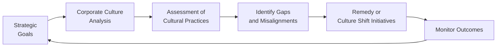

## Introduction

Picture yourself walking into a company’s headquarters. You see open-concept workspaces teeming with energetic employees who actually seem happy to be there. There’s a bright motivational quote on the wall about “delighting the customer,” and you can practically feel the creative buzz in the room. Maybe you can smell freshly brewed coffee, and somehow it all just feels right. Now, here’s the big question: Does that warm and fuzzy vibe map onto the company’s actual strategic goals? Sometimes yes, sometimes no.

Analyzing corporate culture goes beyond catchy slogans or morale-boosting perks. It involves a serious assessment of how shared values, beliefs, and day-to-day practices enhance or hinder strategic objectives. For investors, especially those involved in equity research, understanding culture can unveil hidden catalysts or lurking liabilities that might not show up on a standard financial statement. After all, a gleaming brand reputation or an inspiring mission statement can quickly derail if the organization’s culture doesn’t support its game plan.

This section explores practical ways to evaluate the **alignment of corporate culture with strategic goals**, drawing on insights from academic research, real-world case studies, and the experiences of equity analysts. We’ll talk about red flags (like ethical breaches or high turnover), some telling metrics (like engagement levels and hiring practices), and how to piece it all together to gauge a company’s sustainability and competitive advantage.

## Defining Corporate Culture

Before we dive into alignment, let’s clarify what we mean by “culture.” In many ways, **corporate culture** is “the set of norms, values, and practices guiding employee interactions and decisions.” It reflects everything from how leaders communicate to which behaviors are rewarded or punished—sometimes informally. If you think of strategy as the company’s chosen path, culture is the collective mindset that either pushes the organization along that path or steers it off-track.

Culture might sound intangible, but it influences very tangible metrics, including:

• Product quality and innovation pace.  
• Operational efficiency and risk management.  
• Brand strength, customer loyalty, and **brand reputation**.  
• Ability to attract, retain, and develop **top talent** (a key driver for future performance).

## Connecting Culture to Strategy

Imagine that a company states its strategic goal as “innovation leadership” in a saturated market. The leadership team invests heavily in research and development, files new patents every quarter, and redesigns product lines at a super-fast pace. Yet employees complain of endless bureaucracy and the fear of reprisals if they take creative risks. We have a clear mismatch: the stated strategy calls for innovation, but the culture stifles initiative.

Conversely, a well-aligned culture might reinforce exactly the behaviors required to fulfill strategic aims. If you’re analyzing a business that prides itself on a “customer-first approach,” you want to see evidence of cross-departmental collaboration, training in client relations, and a strong customer feedback loop in product development. These cultural elements deliver real strategic benefits that can translate into improved financial performance.

## Practical Indicators: Gauging the “Real” Culture

Reading corporate mission statements is fun, but that’s never enough. It’s a bit like reading an online dating profile—everyone claims to love the outdoors, but do they really go hiking every weekend? Let’s dig into some ways analysts can identify what’s really going on under the hood:

Hiring Practices  
Look at how new hires are selected and onboarded. Is there a strong emphasis on recruiting diverse skill sets to foster creative solutions? Or do job descriptions demand only rigid technical prerequisites, ignoring soft skills? Hiring patterns reveal the competencies that the organization truly values.

Employee Engagement and Satisfaction  
Employee engagement is “the level of enthusiasm and dedication employees feel toward their job and company.” Low engagement scores, high absenteeism, or poor morale often signal a struggling culture. In contrast, strong engagement can reveal an empathetic leadership style that motivates people to go the extra mile—a positive indicator for strategic execution.

Turnover Rate  
The **turnover rate** is a measure of employees leaving an organization over a specific period. It’s frequently expressed as:


\text{Turnover Rate} = \frac{\text{Number of Employees Who Left}}{\text{Average Number of Employees}} \times 100\%


While turnover can be healthy in moderation, too many departures—especially among high performers—suggest deeper cultural friction. Pay attention to whether the exit interviews or industry chatter point to leadership issues, lack of growth opportunities, or unethical workplace behaviors.

Tone from the Top and Middle Management  
The best corporate culture starts at the top. If the CEO publicly champions collaboration but micromanages every project, employees will quickly see the disconnect. Culture is not just a top-down phenomenon, though. Middle management heavily influences day-to-day experiences—so it’s crucial to examine whether mid-level leaders are reinforcing or undermining the stated values.

Ethical Climate  
Frequent or severe **ethical violations** speak volumes about a culture’s real priorities. If the organization consistently fails to address conflict of interest or compliance lapses, that’s a massive red flag. Investors should look beyond official policies to see if guidelines are genuinely followed and enforced.

## Assessing Cultural Influence on Strategic Execution

Corporate strategy outlines where a company wants to go. The culture determines how smoothly—or clumsily—it gets there. Culture influences several levers critical to putting those grand strategic plans into action:

Risk-Taking Behavior  
An innovative culture encourages carefully managed risk-taking, often necessary for top-line growth or new product development. Conversely, a fear-based culture can stifle experimentation, leading to stagnation and missed market opportunities.

Collaboration and Cross-Functional Synchronicity  
Companies with strong collaboration across departments are typically more agile in responding to market changes. If a company’s **strategic execution** calls for quick pivoting or product iteration, the culture needs to support open communication channels, interdepartmental respect, and knowledge sharing.

Responsiveness to External Pressures  
Organizations that empower employees at all levels to make decisions and voice concerns can respond quickly to competitive threats or shifts in market dynamics. A top-heavy, hierarchical culture might miss these signals until it’s too late.

Employee Retention and Talent Attraction  
If employees feel valued and see opportunities for professional development, they’re more likely to stay. A stable and well-trained workforce is often essential for carrying out complex strategic projects, especially those that require specialized skills or institutional knowledge. By contrast, constant **turnover** can disrupt project timelines and degrade institutional memory.

## Spotting Red Flags of Cultural Misalignment

Culture misalignment can cripple even the most brilliant strategic plan. Here are a few telltale warning signs:

• **High Attrition**: Consistent departures, especially among key talent, raise questions about leadership credibility and the viability of long-term strategies.  
• **Inconsistent Messaging**: Leadership proclaims certain values (e.g., “integrity,” “customer focus”) but then rewards behaviors that contradict them (e.g., cutting corners to cut costs).  
• **Frequent Ethical Breaches**: A spate of corruption cases or legal violations often signals deeper cultural issues.  
• **Siloed Work Environment**: Departments compete for resources instead of collaborating, causing fragmentation that undercuts strategic synergy.  
• **Lack of Role Models**: If managers openly disregard the stated values, employees quickly learn that official “culture” is just lip service.

## Linking Culture to Tangible Outcomes

You might be wondering: “So, how can something as fuzzy as culture truly matter for financial performance?” Let’s do a quick test. Think of any brand you love because it consistently delivers quality and great customer experience. Now, ask yourself how that brand’s employees must be functioning behind the scenes. Likely, they share a collective sense of mission that leads them to care about the final product—this intangible factor becomes a real, measurable **competitive advantage**.

Consider these tangible outcomes often tied to culture:

• **Brand Reputation**: A healthy corporate culture that emphasizes customer service or product quality can elevate brand perception, thus enhancing pricing power and market share.  
• **Attraction and Retention of Top Talent**: A strong culture can function like a magnet, drawing in ambitious employees who will drive growth and innovation.  
• **Strategic Adaptability**: Firms culturalized to embrace learning and constructive criticism adapt faster to disruption, preserving long-term profitability.

When you’re analyzing a company, ask: “Does the culture seem to empower employees to embrace the firm’s goals, or does it create friction?” You’ll often find the answer in everything from Glassdoor reviews to the CEO’s letter in the annual report.

## Personal Anecdotes from the Trenches

Sometimes an anecdote can say more than a year’s worth of staff surveys. I once met a finance team that prided itself on being “innovative”—at least according to their website. So, you’d expect them to be open to new tech tools. But when I asked about adopting a new forecasting software, the directors balked, responding “We’ve always done it this way.” That told me their daily behavior wasn’t in sync with the so-called culture of innovation. Sure enough, a couple of quarters later, they missed their cost-reduction targets because their rigid processes couldn’t adapt quickly enough.

## Using a Structured Framework for Culture Analysis

To systematically evaluate this intangible element, many analysts develop a qualitative or semi-quantitative framework—something that might look like this:

“Cultural Alignment Scorecard,” which includes weighted categories such as:

• Clarity and consistency of core values (20%)  
• Leadership credibility and role modeling (20%)  
• Employee engagement and retention (20%)  
• Cross-functional collaboration (15%)  
• Risk management and policies (15%)  
• Corporate social responsibility and ethical climate (10%)

By observing corporate activities, documented policies, leadership interviews, and workforce data, you can assign a rating for each category. Then you combine them into an overall cultural alignment score. Of course, this is subjective and not a magic bullet, but it’s an organized way to incorporate culture into your company analysis—something many purely numbers-oriented investors might overlook.

## Visualizing Culture and Strategy Alignment

Below is a simple diagram illustrating how strategic goals and cultural elements interact in a cycle. Monitor these relationships regularly to ensure the strategy remains on track.

## Potential Pitfalls and Limitations

Even a well-designed cultural assessment can have blind spots. Culture is dynamic; it can shift with new leadership or major organizational changes like mergers and acquisitions. It’s also possible for subcultures within large corporations to differ significantly from the outward-facing corporate narrative. Knowing these limitations helps you keep a healthy skepticism about official statements and metrics.

And remember: not all cultural aspects are easily measured. You might see contradictory signs, such as high employee satisfaction surveys but low productivity. That’s why a holistic approach—combining quantitative data like turnover with qualitative sources like management interviews and direct observation—works best.

## Culture and Equity Valuation

How might culture factor into your valuation process? Culture can influence:

• **Growth Projections**: A culture that is robust and innovative may warrant higher long-term growth estimates for sales or margins.  
• **Discount Rate Adjustments**: Companies with frequent ethical violations or erratic leadership might carry more reputational and litigation risk—potentially justifying a higher required return in a Discounted Cash Flow (DCF) model.  
• **Scenario Analysis**: If strategy execution hinges on culture (e.g., an acquisition that requires blending two distinct corporate cultures), the probability of success might be lower, forcing more conservative assumptions.

In short, although culture isn’t found on a balance sheet, it can still alter the shape and slope of key valuation drivers—cash flows, growth, and risk.

## Revisiting Other Sections of Company Analysis

Culture ties closely to many other subtopics in company analysis:

• In “Evaluating Revenue Drivers” (Section 6.2), culture influences R&D investment and new product time-to-market.  
• In “Assessing Management Quality” (Section 6.7), you’ll want to see how management fosters trust and accountability—both cornerstones of a healthy culture.  
• In “Activist Shareholders and Proxy Contests” (Section 6.8), cultural conflicts often surface when activists propose major strategic shifts, forcing a clash of values.

When you look at past performance (earnings, brand equity, or acquisitions) and future prospects (R&D pipeline, digital transformation, or global expansion), culture can either be the secret ingredient for success or the hidden factor for failure.

## Exam Relevance

For the CFA Level I exam, culture might appear as a qualitative factor in equity research or corporate governance questions. It could show up in scenario-based questions where you need to identify non-financial but critical risks to an investment thesis. Or you might see a question about how to interpret high turnover in the context of a company’s strategic pivot.

As you advance in the CFA Program, especially at comprehensive levels, culture becomes even more crucial in topics like corporate governance, ethics, and portfolio management. Understanding how intangible, behavioral aspects feed into strategic execution can differentiate good analysts from great ones—since many purely quantitatively focused professionals tend to gloss over culture.

## Tips for Analysis and Common Pitfalls

• **Corroborate Official Narratives**: Don’t just take press releases at face value. Seek external data, employee feedback, and insights from customers or suppliers.  
• **Look for Consistency Over Time**: A single quarter of impressive employee engagement might not reflect a true cultural shift. Track these metrics long-term.  
• **Beware the “Cult of Personality”**: Some charismatic leaders can overshadow a toxic culture that’s brewing underneath. Check multiple levels of the organization.  
• **Balance the Soft and Hard Evidence**: Combine intangible observations (like empowerment and trust) with tangible metrics (like turnover rates, product defects, or time-to-market).  
• **Consider Cultural Fit in M&A**: Acquisitions often fail not because of financial or operational issues, but because of culture clashes.

## Conclusion

Evaluating how a company’s culture aligns with its strategic goals can be a powerful differentiator in equity analysis. It’s an integral piece of the puzzle that helps us understand not just the “what” of a business but the “why” behind its successes or failures. When a clearly articulated culture supports the strategic vision, the organization is set up for more sustainable growth, stronger brand equity, and better integration between teams. Conversely, a culture that contradicts strategic objectives can derail even the most promising plans.

In the end, keep culture as part of your qualitative framework. No matter how intangible, it directly influences key financial outcomes—from turnover costs to innovation pipelines. And let’s be honest: it’s also fascinating to see how real, messy human behavior shapes the bottom line. That blend of finance and organizational psychology is part of what makes equity investing so endlessly interesting.

## References for Further Reading

• Schein, Edgar H. (2019). “The Corporate Culture Survival Guide.” Shows how deeply rooted cultural norms shape organizational behavior.  
• Deloitte Human Capital Research: https://www2.deloitte.com – Contains studies on measuring and transforming corporate cultures.  
• Annual Reports and Shareholders’ Letters – Company-specific discussions of cultural philosophy, strategic goals, and sometimes candid confessions on cultural issues.  

## Culture and Strategy Alignment Knowledge Quiz



### Which of the following best defines corporate culture in the context of equity analysis?

- [ ] A formal code of conduct issued by the company.
- [x] The set of norms, values, and practices guiding daily decisions and relationships.
- [ ] The external consulting framework used for operational benchmarking.
- [ ] A law mandating specific ethical guidelines for listed firms.

> **Explanation:** Corporate culture goes beyond formal policies to encompass actual values and behaviors that shape how the organization functions and makes decisions.

### If a firm’s strategy emphasizes rapid innovation, which cultural trait is most critical to success?

- [ ] Strict hierarchical approval structures.
- [x] Encouragement of responsible risk-taking and experimentation.
- [ ] Punitive measures for project failures.
- [ ] Cost-saving measures in every department.

> **Explanation:** Rapid innovation requires a supportive environment where employees feel comfortable experimenting, failing fast, and learning from mistakes.

### How can a high turnover rate undermine strategic execution?

- [x] It breaks continuity in teams, causing knowledge gaps and project disruptions.
- [ ] It increases employee engagement across business units.
- [ ] It reduces reliance on strong middle management.
- [ ] It automatically increases brand loyalty for the company.

> **Explanation:** High turnover can disrupt project timelines, fragment institutional knowledge, and ultimately derail a company’s strategic goals.

### In evaluating cultural alignment, why might an analyst examine the tone set by middle management?

- [ ] Middle management has minimal influence on the daily experiences of the workforce.
- [ ] Middle management rarely interacts with frontline staff.
- [x] Middle management heavily influences how strategies, values, and tasks are implemented daily.
- [ ] Middle management is solely responsible for macroeconomic policies.

> **Explanation:** Middle managers act as the bridge between executive directives and frontline operations, therefore significantly shaping the day-to-day culture.

### Which of the following is a clear sign of cultural misalignment?

- [x] Senior leaders promote customer-centric values but incentivize staff mainly on cost-cutting.
- [ ] Turnover rates consistently below industry averages.
- [x] Frequent ethics breaches and no disciplinary action from leadership.
- [ ] Transparent collaboration across departments on strategic initiatives.

> **Explanation:** Cultural misalignment emerges when stated values and actual behaviors conflict, such as prioritizing cost-cutting over customer satisfaction or ignoring serious ethical lapses.

### Among the following, which is a potential consequence of a well-aligned corporate culture?

- [x] Enhanced brand reputation and stronger customer loyalty.
- [ ] Increased organizational silos and top-down autocratic leadership.
- [ ] Greater difficulty in recruiting high-caliber employees.
- [ ] Frequent investor lawsuits over administrative inefficiencies.

> **Explanation:** Companies with strong cultural alignment typically enjoy better brand perceptions, higher employee satisfaction, and smoother strategic execution.

### Which statement best describes how ethical violations reflect on a firm’s culture?

- [ ] They have no bearing on corporate culture if they are not repeated.
- [ ] They only matter if they occur in the executive suite.
- [x] They often reveal deeper systemic issues and misalignment between stated values and actual behavior.
- [ ] They usually help in brand differentiation.

> **Explanation:** Ethical violations commonly indicate underlying cultural weaknesses or conflicting incentives that deviate from official policies or values.

### How can analyzing corporate culture improve the valuation process?

- [ ] It replaces the standard Discounted Cash Flow model with a purely qualitative approach.
- [x] It helps refine assumptions about growth potential, risk factors, and sustainability of competitive advantage.
- [ ] It ensures the discount rate remains fixed at a standard market benchmark.
- [ ] It automatically increases the stock's fair value.

> **Explanation:** Culture can inform growth projections, risk considerations, and intangible assets—critical inputs to valuation models.

### What cultural characteristic would most help a strategy aimed at cross-functional collaboration?

- [x] Open communication channels that allow quick information sharing.
- [ ] Strict departmental confines with minimal overlap.
- [ ] Exclusive focus on individual performance metrics.
- [ ] Silos designed to concentrate specialized tasks in each team.

> **Explanation:** A culture that fosters open, transparent communication among departments enhances synergy and strategic outcomes that depend on collaboration.

### A misaligned corporate culture is:

- [x] More likely to result in strategic failures over the long term.
- [ ] Always beneficial for short-term financial performance.
- [ ] Unrelated to employee turnover.
- [ ] Equivalent to compliance with external regulations.

> **Explanation:** When culture contradicts strategic goals, projects and long-term initiatives often suffer, as employees’ daily behaviors do not support the intended direction.


