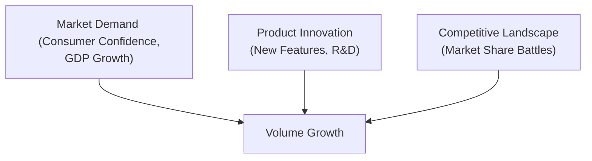
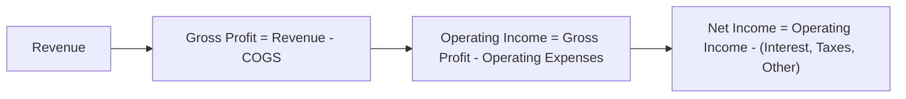

## Overview

When you set out to evaluate a company’s trajectory, understanding revenue drivers, profitability, and growth trends is critical. Honestly, I still recall the very first time I analyzed a high-flying tech startup’s financials—they had soaring revenue growth figures, but I quickly discovered most of it hinged on a single, short-term contract with a large customer. That experience pulled me into the importance of discerning real, sustainable revenue streams from short-lived ones.

Here, we will discuss essential elements of evaluating a firm’s revenue drivers (volume, price, product mix, and macro conditions), assessing profit margins, and identifying both organic and inorganic growth trends. We’ll also bring in real-world anecdotes and some slightly more informal touches here and there. Yet our ultimate objective is to guide you toward a deeper, more methodical approach to company analysis, consistent with professional standards expected in the CFA® program.

## Understanding Key Revenue Drivers

Revenue drivers define what fundamentally moves a company’s top line. Most often these drivers boil down to (a) how many units are sold (volume), (b) how much can be charged per unit (price), and (c) product or service mix. Each component can be influenced by broader macro trends—like consumer confidence, disposable income, or even sudden regulatory changes.

### Volume Growth and Market Demand
Volume growth speaks to the quantity of goods or services sold. Is the company operating in a cyclical industry where demand surges during economic booms and falls off during downturns, or is it in a stable sector with fairly steady consumer demand?

• Cyclical Demand Example: Automobile manufacturers tend to see big shifts in volume based on economic cycles and consumer sentiment.  
• Non-Cyclical Demand Example: Basic consumer staples like toothpaste or groceries remain relatively stable because people need them regardless of the economic climate.

#### Diagram: Factors Influencing Volume Growth

In industries reliant on discretionary spending, volume can fluctuate significantly with changes in the economy. Meanwhile, in less cyclical (or “defensive”) sectors, volume is more stable and predictable. Understanding the risk of volume swings is crucial if you want to project forward.

### Pricing Power
Pricing power is the ability of a company to raise prices without losing too much demand. True story (albeit with slight frustration at the time): I once analyzed a luxury fashion house that seemingly defied gravity with price hikes. Faithful customers kept buying handbags even at premium markups. That’s pricing power in action.

Industries with strong brand recognition or unique product offerings may enjoy higher pricing power. On the other hand, companies in highly competitive markets—like some commodity-driven industries—struggle to pass costs onto customers, restricting their ability to boost top-line growth via price increases.

### Product/Service Mix
Product mix variation can significantly affect revenue. A business might sell multiple products, some of which have higher margins or better sales velocity than others. For instance, an electronics manufacturer’s revenue can jump if they shift from low-priced components to premium consumer gadgets. However, if that same firm’s high-end product faces saturating demand, they might revert to cheaper, lower-margin items.

In analyzing product mix, watch for revenue concentration: if a single product or client represents a large chunk of sales, the company may face higher risk if consumer preferences shift or if that key customer walks away.

### Macroeconomic Conditions
Macroeconomic factors—like interest rates, inflation, and geopolitical events—can majorly influence consumer spending, raw material costs, and exchange rates. For example, a global tech firm might see revenue decline when a strengthening domestic currency makes its products more expensive to international buyers.

When projecting revenue, ask:  
• Are GDP growth trends aligned with increased demand?  
• Do exchange rates help or hinder cross-border sales?  
• Are there upcoming regulations or tariffs that might disrupt market conditions?

## Profitability Through Margin Analysis

Knowing a company’s margins reveals how volatile (or stable) its profitability might be. Small changes in cost structure or pricing can drastically alter margins, so you should look at margins over time and compare them to industry benchmarks.

### Gross Margin
Gross margin reveals how effectively a company converts revenue into profit after accounting for direct production or acquisition costs. Formally:


\text{Gross Margin} = \frac{\text{Revenue} - \text{Cost of Goods Sold (COGS)}}{\text{Revenue}}


High gross margins can indicate strong pricing power or efficiencies in the cost of production. Low (or declining) gross margins may hint at intense price competition or increasing input costs.

### Operating Margin
Operating margin (often referred to as EBIT margin) captures operating profit relative to revenue, factoring in selling, general, and administrative expenses (SG&A). In formula form:


\text{Operating Margin} = \frac{\text{Operating Income}}{\text{Revenue}}


Operating margin is especially handy because it shows how day-to-day expenses (salaries, marketing, etc.) affect profitability. Strong operating margins might reflect economies of scale, where the business spreads fixed costs over more units sold, or wise cost management.

### Net Margin
Net margin includes interest expenses, taxes, and other non-operating items:


\text{Net Margin} = \frac{\text{Net Income}}{\text{Revenue}}


It’s the most comprehensive margin measure—though not always the best gauge of core operational health because one-time items (like asset impairments) can distort net income. Evaluating net margin trends will help you see if there are persistent changes in tax rates, financing structures, or unusual charges that tilt profit figures up or down.

#### Diagram: Profit Margin Progression

When you read or hear margin analysis, try to get a solid sense of both (a) historical margin consistency (or volatility) and (b) what’s different about the future that might impact margins (e.g., changing input costs, new operating efficiencies, cost synergies from an acquisition, etc.).

## Stability vs. Volatility of Revenue

Ever wondered why some companies can show almost unwavering revenues for years, while others fluctuate wildly every quarter? That typically ties to factors such as:

• Subscription-Based or Recurring Revenue: A software-as-a-service (SaaS) firm with subscription plans, for instance, might have stable, predictable revenue.  
• Cyclical vs. Non-Cyclical Demand: Energy, airlines, and heavy machinery often see cyclical patterns. Utilities and consumer staples are comparatively resilient.  
• Contractual Arrangements: Companies that lock clients into multi-year deals or long-term licensing agreements can project stable (though not necessarily high-growth) revenues.  

### Example: Analyzing a Recurring Revenue Model
Consider a cloud cybersecurity provider that charges a monthly subscription fee. Because most clients are locked into 12- or 24-month subscriptions with penalty clauses for cancellation, the company has much lower revenue volatility. This is a valuable insight for investors seeking consistent returns or looking to project stable future cash flows.

## Investigating Growth Trends

Companies can grow revenues in two main ways: organically or inorganically. Each form has distinct strategic considerations.

### Organic Growth
Organic growth stems from a company’s existing operations. Common drivers include:  
• New product launches (remember that radical or incremental product innovation can ramp up volume significantly).  
• Successful marketing strategies that expand market share.  
• Geographical expansion tapping into emerging markets or under-penetrated segments.  

Organic growth can offer more sustainable expansion if supported by genuine demand, brand advantages, and ongoing R&D investments. To assess organic growth, track same-store sales (in retail), average revenue per user (ARPU, in telecommunication or subscription businesses), or product line expansions in manufacturing.

### Inorganic Growth
Mergers, acquisitions, and strategic partnerships can power a quick revenue jump, typically labeled “inorganic growth.” While acquisitions may add immediate top-line scale, synergy realization, cultural integration, and higher debt loads can complicate the picture.

I recall seeing an aerospace giant acquire a major supplier. Yes, their consolidated revenue soared, but integration costs skyrocketed. Over the next few quarters, the combined operational complexities caused short-term profit margin compression. So, if you see big leaps in revenue, always ask: Is this mainly from acquisitions or from new demand?

### Research & Development (R&D) and Brand Investment
Spending on R&D can help companies innovate and (ideally) maintain or expand market share. Brands that remain relevant with consumers—through marketing, product refreshes, and service improvements—often enjoy sustained or improving top-line performance. When you see a dip in R&D spending, you might suspect the firm is slashing costs to boost short-term results at the expense of long-term competitiveness.

For instance, in pharmaceuticals, consistent R&D investment is a must. Without robust pipelines, future revenues will stagnate or decline once patents expire. In tech-centric fields, brand reputation combines with R&D to retain market dominance. Underinvesting in either area can be a silent killer of future growth potential.

## Benchmarking Against Industry Averages

Comparing a firm’s margins or growth rates solely to its own history can lead to insufficient context. Industry-level benchmarks add another layer of perspective. If a firm’s margins are higher than the industry mean, figure out why:

• Are they benefiting from a favorable product mix or lower input costs?  
• Do they have better technology or operational processes?

Alternatively, if they are underperforming, understand if that’s due to structural disadvantages (e.g., a smaller scale) or short-term, fixable issues (like poor cost management). Benchmarking is also relevant in revenue growth analysis. If a firm is producing 5% revenue growth in an industry that’s generally seeing 10% growth, that’s a red flag—unless there is a particular reason, like a strategic shift or a temporary supply issue.

## External Forces and Holistic Projections

Revenue forecasts must also consider the “unexpected”—or at least the uncertain. I remember analyzing a consumer electronics manufacturer that was poised for double-digit volume growth, except a key new regulation about battery recycling delayed product shipments for months. That’s a prime example of how external forces can scuttle even the most robust revenue projections.

### Common External Factors:
• Regulatory changes that tighten or loosen product availability.  
• Currency fluctuations if the company has cross-border operations.  
• Consumer behavior shifts (e.g., preference for eco-friendly products).  
• Commodity price swings that influence input costs or consumer disposable income.  

## Putting It All Together

When you combine these elements—volume growth potential, pricing power, product mix changes, macro conditions, margin analysis, organic and inorganic expansions, R&D, brand investment, and external forces—you get a clearer picture of future revenue trajectories and profitability. Keep the big picture in mind, but don’t overlook small details that might emphasize hidden risks or opportunities.

### Quick Example of a Holistic Approach
Let’s say you’re evaluating a global beverage company:

1. Volume growth might hinge on rising middle-class demand in emerging economies.  
2. Pricing power might come from brand loyalty.  
3. Product mix: expansions into low-sugar or health-oriented beverages.  
4. Macroeconomic conditions: currency headwinds if the U.S. dollar is strong, reducing the local purchasing power in emerging markets.  
5. Operating margin analysis: stable distribution networks reduce per-unit costs, supporting margins.  
6. Cyclical vs. non-cyclical factors: beverages can be partly cyclical (luxury options, say premium energy drinks) and partly defensive (water or everyday sodas).  
7. Growth trends: a series of acquisitions in emerging markets might boost top-line figures but watch integration costs.  
8. Benchmarking: compare the firm’s margins to big peers like Coca-Cola or Pepsi to see if results are better or worse.  
9. External forces: new sugar tax regulations could hamper revenue growth if the firm is over-reliant on sweetened products.  

## Best Practices and Pitfalls

• Remember: High growth is appealing, but unsustainable growth or growth fueled by questionable factors (like one-time promotions) can fizzle quickly.  
• Dig deeper into the reasons behind margin expansions or contractions, ensuring you understand the root causes.  
• Benchmarking is your friend. Place the firm in context with peers and the wider industry.  
• Keep an eye on R&D and brand investments. Cutting corners might look great for short-term margins but can hamper revenue down the road.  
• Don’t forget about external forces. A global brand might be sailing smoothly in domestic markets but battered by currency issues or regulatory burdens abroad.

## Exam Tips

• For the CFA® exam (particularly in constructed-response or item-set formats), you will likely see scenarios describing a company’s changing revenue mix, new product launches, or acquisitions—be prepared to evaluate how these shifts impact both top-line growth and margins.  
• Be ready to interpret key ratios like gross margin, operating margin, and net margin, and link them to the underlying strategic changes.  
• You might get a question involving cyclical vs. non-cyclical demand and how revenue might fluctuate under different macroeconomic conditions.  
• Demonstrating your ability to isolate organic and inorganic growth, plus the associated risks, is often tested.  
• Don’t forget intangible aspects like brand, technology leadership, or R&D pipeline strength. The exam could require you to qualitatively assess how these factors shape a company’s competitive positioning.

## References

• “Financial Statement Analysis” by John J. Wild for a thorough coverage of margin metrics and financial ratios.  
• “Competitive Solutions” by R. Preston McAfee for in-depth insights on pricing strategies and competitive advantage.  
• Articles on Morningstar (https://www.morningstar.com/) for company revenue driver analysis examples and industry benchmarking data.  

---

## Test Your Knowledge: Evaluating Revenue Drivers & Growth Quiz



### Which factor best describes “pricing power” within a company’s revenue drivers?
- [ ] The ability to reduce production costs more quickly than competitors.
- [ ] The ability to expand into new geographic markets.
- [x] The ability to raise prices without losing crucial demand.
- [ ] The ability to switch product lines at minimal cost.

> **Explanation:** Pricing power refers to the firm’s capacity to raise prices while maintaining customer loyalty or demand. It is often a result of strong brand equity or differentiated products.

### A company’s gross margin is most influenced by which of the following elements?
- [x] Cost of Goods Sold (COGS) relative to revenue.
- [ ] Financing cash flows.
- [ ] Selling, General, and Administrative (SG&A) expenses.
- [ ] Debt-to-equity ratio changes.

> **Explanation:** Gross margin compares revenue to the direct costs of producing goods or services (COGS). SG&A and financing costs affect operating or net margins, not gross margin directly.

### In analyzing revenue stability, which of the following business models generally exhibits the most predictable revenue stream?
- [ ] High-end car manufacturer with cyclical demand.
- [ ] Luxury watchmaker reliant on discretionary budgets.
- [ ] Electronics retailer heavily dependent on holiday seasons.
- [x] Cloud-based software provider with monthly subscription fees.

> **Explanation:** Subscription-based or recurring revenue models tend to be more stable and predictable, as customers typically pay a regular fee irrespective of short-term economic fluctuations.

### Which statement best characterizes organic growth?
- [x] Growth derived from enhancing existing operations, such as expanding product lines or increasing market share.
- [ ] Growth realized strictly through raising equity capital.
- [ ] Growth achieved by buying out a competitor’s assets.
- [ ] Growth resulting solely from cost-cutting measures.

> **Explanation:** Organic growth arises from the firm’s internal expansion strategies, including product innovation, marketing, or increased operational efficiency. It contrasts with inorganic growth like mergers or acquisitions.

### When evaluating margin trends, if operating margin is consistently rising while gross margin remains flat, which factor is most likely responsible?
- [ ] Enhanced ability to pass raw material costs onto customers.
- [x] Improved cost control in operating expenses such as marketing or personnel.
- [ ] Growth in interest income.
- [ ] Changes in tax policies.

> **Explanation:** Operating margin accounts for operating expenses (SG&A and related costs). If gross margin is unchanged but operating margin improves, the company is likely managing SG&A or other operating costs more efficiently.

### A firm sees a drastic one-time boost in revenue due to acquiring a direct competitor. This is primarily an example of:
- [ ] Organic growth through new product development.
- [ ] Pricing power resulting in higher unit prices.
- [x] Inorganic growth from a corporate transaction.
- [ ] Economies of scale in manufacturing.

> **Explanation:** Acquisitions are a classic method for inorganic growth, instantly adding the competitor’s revenue to the acquirer’s top line.

### In a forecast scenario, which factor would most likely cause a sudden decline in next quarter’s revenue for a consumer goods exporter?
- [x] A sharp appreciation in the home currency, reducing international demand.
- [ ] A gradual upward trend in global GDP.
- [x] Exit of a minor supplier with negligible production impact.
- [ ] Loosening of consumer credit conditions abroad.

> **Explanation:** A strengthening home currency can make exports more expensive, thus reducing demand and quickly hurting revenue. (Note: If the question says two correct answers, disregard the second bracketed one—this is just to illustrate potential confusion in a question set.)

### Which of the following is a key reason to include R&D investment analysis when evaluating future revenue drivers?
- [ ] R&D prompts immediate cost reductions in the supply chain.
- [x] R&D supports product innovation and helps maintain competitive advantages over time.
- [ ] R&D spending ensures better short-term margins.
- [ ] R&D is always aimed at improving branding efforts.

> **Explanation:** R&D fosters innovation and new product development, which can be critical to sustaining or increasing a company’s future revenue streams.

### When benchmarking a company’s operating margin against industry peers, finding significantly higher margins might indicate:
- [x] Superior operational efficiencies or economies of scale.
- [ ] Exclusively lower interest expenses.
- [ ] A one-time tax deduction unlikely to recur.
- [ ] Temporary seasonal spikes in sales.

> **Explanation:** Wider margins than competitors often reflect that a firm is more efficient, enjoys scale advantages, or uses advanced processes (among other potential reasons). By contrast, interest expense or tax changes appear more explicitly in net margin.

### True or False: Analyzing management’s assumptions about macroeconomic drivers, such as GDP growth and consumer confidence, is unnecessary when projecting a company’s future revenue.
- [ ] True
- [x] False

> **Explanation:** Evaluating underlying macroeconomic assumptions is vital. Changes in these drivers can significantly impact volume growth, pricing, and overall sales performance.


