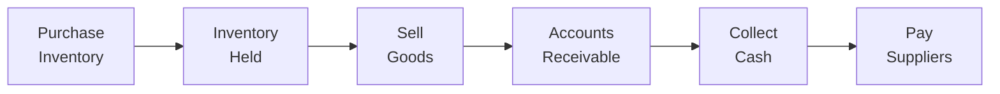

## Introduction

Operating efficiency and working capital management might sound, well, a bit dry at first—like a topic you’d slog through in an accounting class. But trust me, once you see how impactful these can be for a company’s profitability and cash flow, it’s actually pretty exciting. In the context of equity investments, a firm’s ability to efficiently manage its operations influences everything from its short-term liquidity to its long-term growth prospects. After all, if a company can’t handle the cycle of buying inventory, paying suppliers, converting inventory into sales, and collecting receivables in a timely manner, it might struggle to generate stable cash flows and consistent returns for equity holders.

In this section, we’ll explore how to assess a firm’s operating efficiency by analyzing key metrics such as inventory turnover, receivables turnover, and payables management. We’ll also dig into the dynamics of working capital—why it matters, where companies go wrong, and how improvements in technology or process can free up cash for other strategic investments. And hey, I’ll throw in a personal anecdote or two. I once knew a small bakery owner who discovered that better inventory tracking meant less wasted dough (literally). Actually, that taught me more about day-to-day finance than an entire stack of textbooks—sometimes real life is the best teacher.

Anyway, let’s dive in!

## Understanding Operating Efficiency

Operating efficiency touches on how productively a company manages its resources—both physical and financial—to create value. If you think about it, every dollar put into production (raw materials, labor, overhead) must come out the other side in the form of sales revenue. The speed and effectiveness of each step in that process can dramatically affect a company’s profitability. 

Some key indicators of operating efficiency include:
• Inventory turnover (how quickly inventory is sold and replaced)  
• Receivables turnover (how fast a company collects its credit sales)  
• Payables period (how long it takes a company to pay its suppliers)  

### The Cash Conversion Cycle (CCC)

Let’s define the CCC, or cash conversion cycle, which is basically the time it takes to convert paid-for inventory into cash from sales. Formally, CCC can be expressed as:

  
( Days of Inventory Outstanding ) + ( Days of Sales Outstanding ) – ( Days Payable Outstanding ).  
  

In typical notation, you’ll see:  
CC C = DIO + DSO – DPO  

Where:  
• DIO (Days of Inventory Outstanding) = (Average Inventory ÷ Cost of Goods Sold) × 365  
• DSO (Days of Sales Outstanding) = (Average Accounts Receivable ÷ Revenue) × 365  
• DPO (Days Payable Outstanding) = (Average Accounts Payable ÷ Cost of Goods Sold) × 365  

A shorter CCC often implies a more efficient operational cycle. The faster a company converts its resources into cash, the less it needs external financing to run its operations. 

### Why It Matters for Equity Investors

Operating efficiency is central to equity analysis. Investors want to see that a company’s shareholders aren’t footing the bill for operational inefficiencies. If a company’s working capital is tied up in bloated inventory or overdue receivables, that’s cash that can’t be used for growth projects, R&D, or paying dividends. Over time, continuous inefficiency can throttle a company’s ability to expand profitably—which hurts shareholders. 

## Key Metrics for Operating Efficiency

Let’s break down a few core metrics that help analysts gauge operating efficiency. I’m going to reference them in a slightly informal way, adding a bit of color commentary about where pitfalls might lie.

### Inventory Turnover

Inventory turnover indicates how many times a company sells and replaces its inventory within a particular period (usually a year). The formula:

  
Inventory Turnover = Cost of Goods Sold ÷ Average Inventory  

A higher inventory turnover ratio typically signals strong demand or efficient inventory management. If you’re analyzing a retail chain, for instance, you might see it turning inventory 10 or 12 times a year, depending on the industry. Meanwhile, a small local electronics store (in some cases) might have a lower turnover because of bulky, slow-moving items. 

• A cautionary tale: If turnover is too high, the firm might be missing out on sales because it’s stocking too little.  
• If turnover is too low, it might be stuck with obsolete or unsold goods, tying up valuable capital.  

### Receivables Turnover

Receivables turnover measures how quickly a firm collects its credit sales. The formula:

  
Receivables Turnover = Credit Sales ÷ Average Accounts Receivable  

In practice, people often estimate credit sales by total sales if credit sales data aren’t readily available. If the ratio is high, the company is generally doing a good job collecting payments—though you also want to check whether the firm is offering extremely short credit terms that might hamper future sales. If the ratio is low, then a chunk of sales might be sitting in accounts receivable for too long. That can lead to liquidity crunches, especially if the firm is incurring expenses it can’t cover with timely cash inflows.

### Payables Period

The payables period is the average number of days a company takes to pay its suppliers. You’ll sometimes see it expressed as a ratio or as an actual number of days:

  
Days Payable Outstanding (DPO) = (Average Accounts Payable ÷ Cost of Goods Sold) × 365  

Longer payable periods help the company hold on to cash longer—but push them too far, and the company could strain supplier relationships. That can lead to supply chain disruptions or a demand for stricter credit terms from suppliers.

### Merging It All Together in a Mermaid Diagram

Below is a simple illustration of how these flows fit into the overall operating cycle:

Notice how the entire loop from inventory purchase to collecting cash forms the basis of the cash conversion cycle. The longer this process takes, the more capital is at risk of being tied up or borrowed.

## Working Capital Basics

Working capital equals current assets minus current liabilities. It’s the money used to fund a company’s short-term operational needs—like paying for inventory, salaries, rent, and yes, utility bills. If a company has insufficient working capital, it may struggle to stay afloat in the short term. If it has too much working capital, it could be missing out on higher-return investments.

A positive working capital balance means a company has more short-term assets than short-term liabilities, usually a healthy sign. But you want to look at the composition of those assets. Are they mostly stuck in slow-moving inventory or in overdue receivables? Quick ratio and current ratio can help refine the analysis:

• Current Ratio = Current Assets ÷ Current Liabilities  
• Quick Ratio (a.k.a. Acid-Test) = (Cash + Marketable Securities + Accounts Receivable) ÷ Current Liabilities  

### Identifying Inefficiencies

• High Days of Inventory: Perhaps the firm is overproducing or the product has lost market appeal.  
• High Days Receivable: Might indicate weak credit policies or slow collection strategies.  
• Low Days Payable: Possibly the firm is paying suppliers prematurely, missing out on better financing terms.  

Each of these scenarios could hamper the firm’s short-term cash availability.

## Impact of Supply Chain and Vendor Terms

Working capital management isn’t just about what happens inside the company’s four walls; it’s also about external relationships—namely, suppliers and customers.

### Supply Chain Relationships

Consider a manufacturer that sources raw materials from multiple suppliers. If one supplier demands up-front payments while another supplier offers 60-day terms, the manufacturer’s net working capital will vary based on how it allocates orders or schedules production. Similarly, if the manufacturer invests in stronger supplier relationships, it could negotiate better terms. That negotiation might mean longer payables periods, or even volume discounts that reduce the cost of goods sold. Both outcomes improve the firm’s operational and financial standing.

### Vendor Terms and Early Payment Discounts

Some suppliers offer discounts for early payment (e.g., “2% discount if paid within 10 days”). Whether the firm should take advantage of this depends on the implied annualized interest rate relative to other financing costs. It might be beneficial if the cost of capital is high. If the firm’s cost of capital is low, maybe it would rather hold onto the cash a bit longer.

## Patterns in Working Capital Fluctuations

Working capital needs can shift due to seasonality or expansion. For example, consider a toy retailer ramping up for holiday demand. It might build inventory in the fall and see more credit sales in December, so working capital usage will skyrocket for a couple of months each year.

• Seasonal Demand: If you see big swings in the company’s working capital from quarter to quarter, check if it’s simply seasonal.  
• Expansion Phases: When a company is in rapid growth, it needs to buy more inventory and maybe give more lenient credit terms initially to gain market share. That can balloon working capital before profit from the new expansions starts rolling in.  

Keep these fluctuations in mind when analyzing a firm’s liquidity. Sometimes a short-run spike in accounts receivable isn’t a problem, provided the long-term strategy and sales pipeline justify it.

## Technology and Process Improvements

Ever heard of “Just-in-Time” (JIT)? It’s an inventory strategy that aims to reduce waste by receiving inventory only as needed. Many companies adopt JIT to cut holding costs and free up working capital. Another big game-changer is automation—replacing labor-intensive tasks with technology so that processes become faster (or less error-prone). 

### Case Study: Small Bakery, Big Turnaround

I had a friend (let’s call him Martin) who ran a small bakery. He started to notice he was either running out of flour or had too much. It turned out his ordering schedule was random: sometimes he’d order every few days, sometimes every two weeks. Martin implemented a simple digital ordering system that tracked average usage and predicted next week’s demand based on daily sales. Sure, it wasn’t a fancy AI system, but it worked. Within two months, his flour inventory turnover improved (no more stale flour), and his payables stabilized. That freed up a modest chunk of cash, which Martin then used to expand his product line. The moral of the story? Even small technology or organizational improvements can have a massive impact on operating efficiency—especially noticeable in smaller businesses.

## Strategies for Improving Working Capital

Analysts often pay close attention to how management deals with working capital. Some strategies can include:

• Tighter credit terms: Speed up receivable collections by offering discounts for early payment or limiting the number of net days.  
• Improved supplier negotiations: Extend payables without damaging supplier relationships.  
• Process enhancements: Implement JIT inventory, warehouse management systems, or other automation tools.  
• Inventory rationalization: Eliminate slow-moving products, reduce overstocking, optimize reorder quantities.  

The potential upside is huge. Freeing up cash locked in working capital allows the firm to invest in growth opportunities, pay down debt, or pay dividends.

## Financial Statement Analysis Considerations

When reviewing the financials:

1. Look at the Balance Sheet and note the composition of current assets vs. current liabilities. Check for environmental, social, or governance factors if they affect supply chain or vendor policies (see Chapter 10 on ESG for more).  
2. Examine the Income Statement, particularly the Cost of Goods Sold (COGS), to see how inventory levels relate to production costs.  
3. Delve into the Cash Flow Statement to see if increases in receivables or inventory are draining cash from operating activities.  

Under IFRS or US GAAP, certain treatments of inventory (e.g., FIFO vs. LIFO) can alter reported cost of goods sold. So, if you’re analyzing cross-border firms, keep an eye on differences in accounting policies.

## Common Pitfalls and Challenges

• Focusing Too Much on Short-Term: Sometimes management will push for very low inventory to make the books look good. That can cause inventory stockouts and lead to lost sales and frustrated customers.  
• Neglecting Customer Relationships: Overly tight credit terms may drive away potential buyers, especially if competitors offer more flexible options.  
• Over-Reliance on Supplier Financing: Having extremely long payables periods can strain supplier relationships or lead to less favorable pricing in the future.  
• Blind Spots in Seasonality: Analysts not factoring in typical seasonal variations might mistakenly conclude that the firm is either in trouble or is extremely efficient.  

## Best Practices

• Benchmark Against Industry Norms: Whether it’s inventory turnover or average collection periods, compare the target firm’s ratios to peers.  
• Track Trends Over Time: A single snapshot is useful but often not enough. Look at how operating efficiency metrics evolve over multiple periods.  
• Tie to Strategy: If the company is investing in better process technology, you should see improvements in the CCC over time.  
• Evaluate Management Commentary: In conference calls or quarterly reports, management often discusses working capital changes. Pay attention to reasons behind big swings.  

## Exam Relevance and Professional Standards

In the CFA® Level I exam, you’ll often see scenario-based questions that require you to calculate or interpret liquidity ratios and working capital metrics. For instance, you might be given partial financial statements and asked how a change in receivables turnover affects the firm’s cash flow. Or you might need to identify which company (out of several) is likely to face a liquidity crunch based on working capital metrics.

Adhering to the CFA Institute Code of Ethics and Standards of Professional Conduct, analysts must ensure that they’re using complete, reliable financial data and not misleading clients with superficial ratio analysis. Thorough due diligence and transparent communication about working capital risks are crucial for upholding professional and ethical standards in the investment industry.

## Practical Example

Let’s walk through a quick (and slightly simplified) example. Suppose you have a retail company called ABC Co.

• Beginning Inventory: $50,000  
• Ending Inventory: $70,000  
• COGS: $360,000  
• Beginning A/R: $40,000  
• Ending A/R: $60,000  
• Sales: $400,000  
• Beginning A/P: $30,000  
• Ending A/P: $50,000  

Step 1: Average Inventory = ($50,000 + $70,000) / 2 = $60,000  
Inventory Turnover = COGS / Average Inventory = $360,000 / $60,000 = 6 times  

Average Days of Inventory = 365 / 6 ≈ 61 days  

Step 2: Average Receivables = ($40,000 + $60,000) / 2 = $50,000  
Receivables Turnover = Credit Sales / Average Receivables = $400,000 / $50,000 = 8 times  

Days Sales Outstanding (DSO) = 365 / 8 ≈ 46 days  

Step 3: Average Payables = ($30,000 + $50,000) / 2 = $40,000  
Payables Turnover = COGS / Average Payables = $360,000 / $40,000 = 9 times  
Days Payable Outstanding (DPO) = 365 / 9 ≈ 41 days  

Step 4: CCC = Days of Inventory + Days Sales Outstanding – Days Payable Outstanding  
CCC = 61 + 46 – 41 = 66 days  

Interpretation: ABC Co. needs about 66 days to convert cash outflows (for inventory) into cash inflows (from sales). An analyst would compare this to the firm’s historical average and to peers in the industry to see how well ABC Co. is managing its working capital now versus the past or vs. its competitors.

## Final Exam Tips

• Double-check your ratio calculations. It’s easy to slip up on which “average” values go in the denominator.  
• Pay close attention to the difference between cost of goods sold and sales—inventory turnover uses COGS, but receivables turnover typically uses sales (credit sales if available).  
• Remember that a single ratio can hide deeper issues like seasonality or changes in accounting policy.  
• Practice scenario-based questions under time pressure, so you get used to quickly identifying red flags in a firm’s working capital management.  
• Explore short-answer or essay-type questions (if relevant to your exam level) that ask you to explain the impact of adjusting credit terms or adopting JIT on the CCC.

## References and Further Reading

• Brealey, R. A., Myers, S. C., & Allen, F. (latest edition). “Principles of Corporate Finance.”  
• Stevenson, W. J. “Operations Management.”  
• Harvard Business Review case studies on supply chain management.  
• The CFA Institute Code of Ethics and Standards of Professional Conduct for guidelines on diligence, objectivity, and transparency.

-----

## Test Your Knowledge: Working Capital & Operating Efficiency



### A retail company with a long payables period is most likely to:

- [ ] Improve its relationships with suppliers.
- [x] Retain cash longer before paying suppliers.
- [ ] Overstate inventory on the balance sheet.
- [ ] Increase its receivables turnover ratio.

> **Explanation:** A longer payables period generally means the company can hold on to its cash longer before settling supplier invoices. This may strain supplier relationships over time.

### Which ratio directly measures how efficiently a firm converts its inventory into sales?

- [ ] Current Ratio
- [ ] Quick Ratio
- [x] Inventory Turnover
- [ ] Asset Turnover

> **Explanation:** Inventory turnover (COGS ÷ Average Inventory) shows how quickly a firm moves its inventory through the sales process, which is essential for operating efficiency.

### If a firm’s Days Sales Outstanding (DSO) is increasing significantly:

- [x] The firm might be taking longer to collect from its customers.
- [ ] The firm’s sales are increasing at an unprecedented rate.
- [ ] The firm’s payable period is decreasing proportionally.
- [ ] The firm is lowering its prices drastically.

> **Explanation:** A rising DSO suggests that customers are taking more time to pay, which could lead to cash flow challenges.

### The Cash Conversion Cycle (CCC) is typically calculated as:

- [ ] DSO + DPO – DIO
- [ ] DIO + DPO – DSO
- [x] DIO + DSO – DPO
- [ ] (COGS + Sales) – Inventory

> **Explanation:** The standard formula is Days of Inventory Outstanding plus Days Sales Outstanding minus Days Payable Outstanding.

### When analyzing seasonal businesses, an analyst should:

- [x] Compare ratios across similar seasons in previous years.
- [ ] Focus solely on annual financial statements.
- [x] Adjust for cyclical factors that impact inventory and receivables.
- [ ] Ignore changes in sales mix over different periods.

> **Explanation:** Seasonal businesses experience fluctuations that can distort short-term liquidity metrics, so comparing the same season year-over-year and adjusting for cyclical variations is crucial.

### A benefit of maintaining too little inventory is:

- [ ] Complete avoidance of stockouts.
- [x] Reduced holding costs.
- [ ] Simplified financial statements.
- [ ] Elimination of sales returns.

> **Explanation:** While being understocked can cause other problems (like lost sales), it does help a company reduce storage and holding costs.

### A significant slowdown in inventory turnover without a drop in sales volume might indicate:

- [x] The firm is carrying obsolete or slow-moving stock.
- [ ] The firm drastically cut back on production.
- [x] Poorly managed stock levels or inaccurate demand forecasts.
- [ ] A surge in the quick ratio.

> **Explanation:** If sales are stable but turnover slows, it usually points to inefficiencies in inventory management or forecasting, leading to excess or mismatched inventory.

### Which of the following is a direct advantage of Just-in-Time (JIT) inventory management?

- [x] Lower carrying costs and reduced storage needs.
- [ ] Increased payables due to longer payment terms.
- [ ] Higher Days Sales Outstanding.
- [ ] Complete elimination of receivables.

> **Explanation:** JIT strategies aim to minimize inventory on hand, reducing holding costs and storage requirements.

### If management shortens credit terms for customers, the most direct impact is likely:

- [x] Decrease in Days Sales Outstanding (DSO).
- [ ] Increase in Days Inventory Outstanding (DIO).
- [ ] Increase in working capital.
- [ ] Decrease in payables turnover.

> **Explanation:** Shortening credit terms accelerates customer payments, leading to a lower average collection period—i.e., a decrease in DSO.

### Determining a company’s working capital position primarily involves checking whether:

- [x] Current assets exceed current liabilities.
- [ ] Total assets exceed total liabilities.
- [ ] The accounts payable balance is increasing.
- [ ] The company invests heavily in long-term projects.

> **Explanation:** Working capital is defined as current assets minus current liabilities, so the first step is to see if short-term assets exceed short-term obligations.


