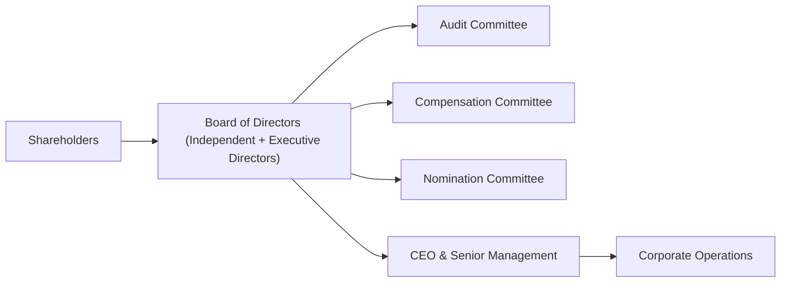

## Overview

Corporate governance. Even the phrase sounds a little dry, right? But believe me, once you start diving into the details, it’s quite interesting (and, trust me, I never thought I’d hear myself say that when I was first handed a stack of board reports!). Governance basically refers to the checks and balances within a company’s leadership structure: it’s how power is exercised, decisions are made, and accountability is upheld. For equity analysts, corporate governance is more than a box-ticking exercise; it can directly affect the company’s risk, return potential, and just how confidently investors can trust the board to look after their money. 

In this section, we’ll walk through the key elements of corporate governance that every equity analyst should consider. We’ll explore how governance influences a firm’s cost of capital, shapes its reputation, and even shifts its fundamental valuation metrics. We’ll share a few stories of my experiences—like that investor call where I realized just how influential an independent board can be. Then we’ll discuss frameworks, committees, and a bunch of other practical points. Let’s roll.

## Key Components of Governance Structures

### Board Composition and Director Independence

A board of directors is at the heart of governance. It oversees the firm’s strategy, senior management appointments, major capital decisions, and more. But not all boards are created equal. Some boards have mostly company insiders (think executives who also serve as directors), while others have a healthy mix of independent directors—individuals who don’t have close ties to the company.

In general, the more independent a board, the better it can monitor management and protect shareholder interests. An independent board is less likely to “rubber stamp” decisions, especially when they smell potential conflicts of interest. They’re the ones who—at least in theory—can challenge overly risk-happy management teams or push for accountability if results aren’t delivered. 

Personal Anecdote: I once analyzed a consumer goods firm where the CEO’s best friend from college was the chairman of the board. Big surprise: the compensation committee basically gave the CEO anything he wanted. But the stock was depressed because many investors believed the board was too cozy to push back against questionable acquisitions. Talk about a red flag.

### Committee Structure and Oversight

Beyond the board itself, committees do a lot of the heavy lifting. Think of them like specialized teams:

• Audit Committee: Ensures the accuracy and integrity of the company’s financial reporting. They also interact with external auditors to confirm there’s no suspicious number fudging.  
• Compensation (Remuneration) Committee: Structures executive pay packages, including salaries, bonuses, and share-based incentives.  
• Nomination (Governance) Committee: Manages the selection and appointment of directors to the board, making sure the team has the right collective skillset.

If these committees are independent and properly staffed, they can balance out a lot of potential problems—like a CEO awarding themselves humongous bonuses or a CFO using conveniently “creative” accounting practices. Analysts often look for the presence of skilled, ethical, and genuinely independent committee members. 

### Shareholder Rights and Voting Mechanisms

There are different voting structures out there: one-share-one-vote might be the simplest and considered among the fairest. Then you get dual-class structures, where certain share classes carry more voting rights than others. This setup can preserve control for founding families or original owners, but it can also hamper minority shareholders’ influence. 

From an analyst’s point of view, limited shareholder rights can sometimes signal a governance risk. Sure, companies with these structures might still do well, but the misalignment between controlling shareholders and the broader investor base can lead to big drama if (or when) something goes wrong.

## The Influence of Executive Compensation

### Aligning Executive Pay with Shareholder Interests

Executive compensation can be hotly debated. The key question is: does the CEO’s paycheck motivate them to create long-term, sustainable value, or does it press them to chase short-term earnings bumps?

If the compensation plan is heavily weighted toward, say, a one-year earnings-per-share (EPS) target, you might see top managers cut a ton of corners—slashing R&D, piling on cheap debt, or doing anything else to hit that short-term goal. Conversely, if compensation is tied to long-term growth metrics (like three-to-five-year rolling average ROE or free cash flow), then in theory, managers have greater incentive to plan for the company’s future health. 

In my opinion, you want to see balanced performance metrics here. Overemphasis on a single measure can cause executives to “game” the system, which might show up (unpleasantly) in the stock price down the line.  

### Ethical and Transparent Disclosure

Let’s be real: sometimes it’s not just about the numbers, but how sincerely the firm discloses them. Does the company bury the details of executive compensation in a 50-page footnote, or do they clearly break it out in the proxy statement? Uniformly, top-tier governance usually includes transparent, easy-to-read disclosures.

## Mitigating Conflicts of Interest and Fostering Ethical Practices

### Whistleblower Policies and Corporate Culture

A robust whistleblower policy is more than a legal or compliance formality—it’s a marker that employees feel safe reporting wrongdoing without fear of reprisal. That matters immensely. If employees sense the top brass will sweep controversies under the rug, you could be dealing with the next big corporate scandal, which almost always hits the share price.

### Risk Management Framework

Companies face a range of risks—financial, operational, reputational, you name it. Strong governance typically includes enterprise risk management (ERM) to identify these threats early, track them carefully, and respond in an organized way. A well-structured ERM approach, overseen by the board and relevant committees, helps reduce “nasty surprises,” from accounting improprieties to cybersecurity lapses.

## Governance and Its Impact on Valuation

### Lower Cost of Capital and Reduced Risk Premiums

One big reason analysts track governance so closely? It can lower a company’s cost of capital. Investors often see strong governance as a sign of stability and reliability, which effectively reduces perceived risk. If equity holders think a firm is less risky, they require a lower rate of return to hold its shares.

Let’s illustrate conceptually. Suppose we define:

Rᵉ = Rᶠ + β × (Equity Risk Premium) + G_adj

• Rᵉ = Required return on equity  
• Rᶠ = Risk-free rate  
• β = Beta (sensitivity to broad market moves)  
• Equity Risk Premium = Additional return demanded by equity investors  
• G_adj = Possible incremental premium (or discount) due to governance

In a company with exceptionally strong governance, G_adj might be negative, lowering the overall required return. Meanwhile, a poorly governed firm might face a higher G_adj, pushing up its cost of equity. Over the long term, that difference in cost of capital can profoundly affect how the market values the firm.

### Operational Performance Stability

Companies with solid governance often have more disciplined strategic planning and oversight. They tend to avoid impulsive acquisitions (like, “Hey, we’re a bakery. Let’s buy a drone company!”). Over time, such discipline translates into more consistent earnings and cash flow. And guess what? More consistency often attracts more investors, which leads to higher equity valuations.

### Preventing Corporate Scandals

Nobody wants to invest in the next Enron—trust me. If a governance framework lacks necessary checks, managers might manipulate earnings or assume unsustainable risk. Once discovered, the scandal can obliterate shareholder value. For analysts, a track record of questionable governance or a board that fails to heed red flags should raise eyebrows. And if you spot it early, you might save your portfolio from a nasty surprise.

## Practical Integration in Equity Analysis

### Governance Checklist

Every analyst has their own style, but here’s a straightforward “checklist approach” you might use:

1. Board of Directors:  
   - Independence: Proportion of independent directors  
   - Skills: Does the board collectively have expertise relevant to the business?  
2. Committees:  
   - Audit: Independence, financial literacy  
   - Compensation: Transparent pay structures  
   - Nomination: Thorough selection processes  
3. Shareholder Rights:  
   - Voting: One share, one vote vs. dual-class structure  
   - Minority protection: Mechanisms for smaller investors  
4. Transparency and Ethics:  
   - Disclosure quality: Simplified and clear or labyrinthine?  
   - Whistleblower: Existence of protective policies  
5. Risk Management:  
   - ERM programs: Well-documented frameworks  
   - Stress testing: Are they up front about major risks?

After grading a firm on these points, you can decide whether governance factors warrant a discount or premium in your valuation models.

### Adjusting Your Valuation Models

Some analysts make an explicit numerical adjustment for governance—perhaps a 50-basis-point tweak to the discount rate for a top-notch structure. Others incorporate it more qualitatively, by adjusting scenario outcomes or weighting certain case analyses. For instance, you might reduce the downside probability if strong governance is likely to mitigate worst-case outcomes.

No universal formula exists for applying these adjustments (so if you’re hoping for a neat “apply 3% discount for independent audit committees,” you’ll be disappointed). It’s more about building a consistent approach to evaluate governance across your watchlist.

## Visual Representation of Governance Structure

Below is a simple Mermaid diagram illustrating relationships among shareholders, the board, and management. The committees are subsets of the board with specialized oversight roles.

This diagram highlights how governance lines typically flow. Shareholders elect the board, which oversees specialized committees, which then monitor specific areas of the company. Management handles daily operations, guided (and sometimes restrained) by the board’s directives.

## Common Pitfalls and Best Practices

• Overemphasizing One Aspect: Some analysts fixate on a single governance factor—like executive comp—and ignore broader issues, such as a toothless audit committee. You want the full picture.  
• Blindly Trusting Labels: “Independent directors” isn’t a magic phrase. Sometimes these directors are friends of the CEO or owe special favors. Investigate backgrounds.  
• Not Checking Track Records: Past corporate scandals or repeated restatements of financials are serious red flags. Review historical patterns, not just current statements of “we have robust governance.”  
• Maintaining Consistency: Develop a systematic approach to evaluating governance across different companies and sectors. Let’s face it: if you judge Company A harshly for minor issues but ignore bigger problems at Company B, your valuations will be all over the place.  

## Final Exam Tips

• You may encounter scenario-based questions where you’re given details about a company’s board composition, committee effectiveness, or compensation structures. Practice recognizing red flags such as entrenched boards, nepotistic relationships, or lack of committee independence.  
• For essay-style questions, be ready to discuss how governance affects risk, cost of capital, and ultimately valuation. Your answer should show an understanding of both the conceptual side (why governance matters) and the practical application (how you’d adjust your models).  
• Factor in multi-asset settings: If you’re analyzing a firm that’s part of a broader portfolio, consider how poor governance at one company could affect overall risk management and correlation with other holdings.  
• Time management: In the constructed-response portion of the exam, structure your governance argument logically—start with the overall governance environment, proceed to specific elements (board, committees, compensation), and conclude with the impact on valuation.  

## References

• Rezaee, Zabihollah. “Corporate Governance and Ethics.” John Wiley & Sons.  
• CFA Institute. “Corporate Governance Manual.” Available at: [https://www.cfainstitute.org](https://www.cfainstitute.org)  
• OECD Principles of Corporate Governance. Available at: [https://www.oecd.org](https://www.oecd.org)  

## Test Your Knowledge of Corporate Governance in Equity Analysis



### A board of directors primarily composed of independent members can:
- [ ] Guarantee a company’s success, regardless of industry conditions.
- [ ] Eliminate all conflicts of interest within the organization.
- [x] Better monitor management and potentially reduce risk for shareholders.
- [ ] Ensure executive compensation is tied exclusively to short-term targets.

> **Explanation:** Independent board members are considered more effective at overseeing management due to fewer conflicts of interest. This does not guarantee success or eliminate all corporate issues, but it can reduce risk.

### To encourage long-term shareholder value, executive compensation plans should:
- [ ] Be tied exclusively to quarterly EPS targets.
- [x] Include both near-term and multi-year performance metrics.
- [ ] Incentivize cost-cutting above all else.
- [ ] Avoid any use of stock options.

> **Explanation:** Plans that balance near-term metrics (like quarterly EPS) and longer-term goals (like three- to five-year ROE) are more likely to align with sustainable shareholder value.

### Which of the following is often considered a strong indicator of robust corporate governance?
- [x] Transparent whistleblower policies and open disclosure mechanisms.
- [ ] A board structure comprised mostly of family members.
- [ ] Lack of shareholder voting rights on key issues.
- [ ] The absence of an audit committee.

> **Explanation:** Transparent whistleblower policies show that the firm encourages ethical reporting and is serious about rooting out misconduct.

### One potential way an analyst might quantitatively incorporate governance into valuation is by:
- [ ] Establishing a universal 5% discount for any firm with an audit committee.
- [ ] Ignoring governance altogether to simplify the model.
- [x] Adjusting the required return on equity based on perceived governance quality.
- [ ] Removing all intangible assets from the balance sheet.

> **Explanation:** Some analysts modify the discount rate (or risk premium) to reflect governance quality. There’s no universal standard, but higher perceived governance risk can lead to higher required returns.

### A dual-class share structure typically:
- [ ] Enhances minority shareholders’ voting power.
- [ ] Guarantees the company’s founder complete immunity from legal issues.
- [x] Concentrates voting control in the hands of specific share classes.
- [ ] Has no impact on how share price is valued in the market.

> **Explanation:** Dual-class structures generally allow certain shareholder groups—often founders or insiders—to retain superior voting rights, potentially limiting minority shareholder influence.

### The compensation committee’s main function is to:
- [ ] Approve new product launches and marketing budgets.
- [x] Evaluate and set executive pay packages.
- [ ] Oversee federal tax filing compliance.
- [ ] Conduct external audits of the company’s financial statements.

> **Explanation:** A compensation committee, typically comprised of independent directors, is responsible for planning executive pay to align with corporate strategy and shareholder interests.

### A company with frequent financial restatements due to errors or irregularities might indicate:
- [x] Weak oversight from either the board or the audit committee.
- [ ] Strong independence of directors.
- [x] Potential red flags regarding management integrity.
- [ ] Impeccable corporate culture.

> **Explanation:** Repeated restatements often suggest shortcomings in governance oversight or deeper problems with corporate culture and financial controls.

### An audit committee’s independence is crucial because it:
- [x] Helps ensure objective financial reporting and reduces the risk of fraud.
- [ ] Guarantees stock price appreciation.
- [ ] Makes investment decisions on behalf of the company’s pension plan.
- [ ] Replaces external auditors when needed.

> **Explanation:** An independent audit committee can impartially oversee the accuracy of a firm’s financial statements, reducing the risk of hidden irregularities.

### An example of a corporate governance red flag is:
- [x] A CEO serving simultaneously as both chairman and chair of the compensation committee.
- [ ] An adequately sized board with a majority of independent directors.
- [ ] Clear and transparent disclosure of executive pay.
- [ ] Term limits for board members.

> **Explanation:** When one individual holds too many decision-making positions, checks and balances can be compromised.

### Strong corporate governance generally:
- [x] True
- [ ] False

> **Explanation:** Most research indicates that well-structured governance frameworks can lead to higher investor confidence and potentially lower cost of capital.


