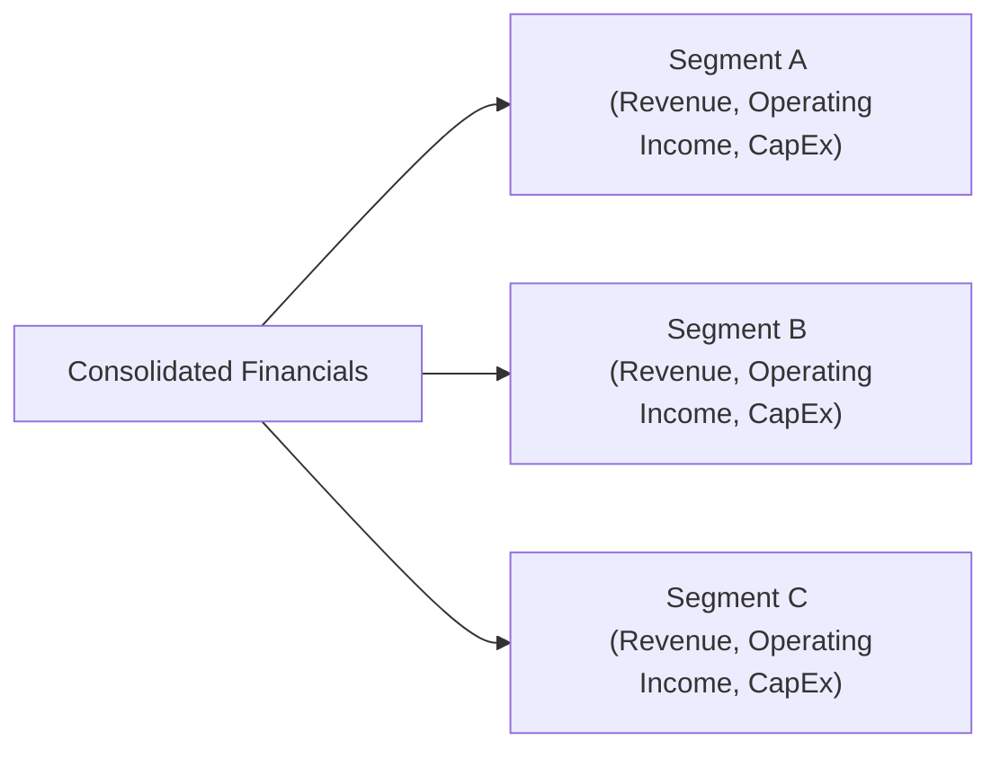

## Overview

Segment reporting might sound dry at first, but it’s sort of a behind-the-scenes pass to a company’s inner workings. Whenever I examine a large conglomerate, I'm always curious about which divisions are generating the lion’s share of profits—or, maybe, which parts are practically burning cash. By analyzing how a firm breaks out its business lines or geographic regions, we can get a much clearer sense of where the real value lies. Also, it helps us see what management might be trying to hide (or at least gloss over).

In this section, we’ll dive into the fundamentals of segment reporting, check out some differences in disclosure requirements around the world, and figure out how all of this affects an equity analyst’s view of a firm’s performance and risk profile. We’ll also sprinkle in some pitfalls, best practices, and common strategies that can help you stand out when performing your own segment analysis—especially come exam time.

## The Importance of Segment Reporting

At its core, segment reporting breaks a firm's performance into smaller parts. One division might sell electronics to Latin America, while another might produce medical devices for Europe. Each segment requires its own resources (capital expenditures, human talent, R&D). And each segment faces slightly different competitive challenges and growth opportunities. This is crucial for equity analysis because:

• It reveals hidden profitability drivers. You can learn, for instance, that a consumer goods company’s beverages segment is extremely profitable while its snack foods segment lags.  
• It helps model future growth. You can identify segments that are expanding fast (maybe in emerging markets) versus those that have plateaued.  
• It highlights divergences between the company’s strategic narrative and real outcomes. For instance, some firms tout a big pivot to “tech-driven solutions,” even though it’s only 10% of total revenue.  

Segment reporting is also a key tool if you’re spotting potential spin-off opportunities. Divisions that consistently produce high margins might unlock more shareholder value if they stand on their own. Conversely, loss-making divisions might need to be fixed or sold off.  

## Key Financial Elements in Segment Disclosures

Segment reporting typically covers at least three major data points:

• Revenue  
• Operating income (or profit)  
• Capital expenditures (CapEx)  

Each of these can be examined over time to understand both short-term and long-term trends:

• Segment-level revenue: This shows how each line of business or geographic region contributes to total sales. If a segment grows 20% year over year while the overall company grows just 5%, you know where management should focus its resources.  
• Segment-level operating income: This indicates each segment’s profitability, net of the direct operating costs. Some segments might sustain losses. Others might be major cash cows.  
• Segment-level capital expenditures: This indicates how much the company is investing to maintain or expand a particular segment. A high CapEx relative to the segment’s revenue could potentially pay off if demand is growing—or become a drag on overall performance if returns on those investments don’t materialize.  

Understanding these factors helps you grasp how the company’s capital allocation strategy plays out in practice. You might discover that certain segments are “subsidizing” others—a phenomenon known as cross-subsidization.

## Identifying Cross-Subsidization

Cross-subsidization occurs when the revenue and cash flow from profitable segments fund the losses or excessive capital needs of other divisions. On one occasion, I was looking at a large industrial conglomerate—let’s call it Universal Manufacturing. They had an aerospace segment that was raking in huge profits, while their legacy railroad equipment division was barely breaking even. In the consolidated statements, everything looked decent, but by breaking it down you could see that the underperforming railroad unit had become a perpetual sinkhole. For an analyst, that might raise red flags about strategy or capital allocation. If the underperforming division cannot be turned around, it might be a candidate for divestiture or spin-off.

Beyond that, cross-subsidization can also mask the true risk profile of the more profitable segments. If those star segments face cyclical shifts or unexpected downturns, the entire corporate structure could weaken much faster than expected.  

## Segment Growth Rates: The Compass for Corporate Strategy

By calculating the growth rates of each segment (annual, quarterly, or even monthly in some cases), you can track which part of the business is driving the firm’s future prospects. And if those growth rates keep climbing while top management invests accordingly in R&D, marketing, and distribution, then your forecast might show that segment as a key driver of equity value.  

On the flip side, if you see a segment that is losing momentum or consistently underperforming compared to industry peers, that’s a big question mark. Why is it lagging? Are there serious structural issues? Is the firm’s strategy (or resource allocation) misaligned with where the real opportunities might be?

## Matching Segments with Strategic Focus

A big question an analyst typically asks is: does the way the firm reports segments actually align with its strategic narrative? Sometimes management lumps different operations into one “other” or “corporate” segment that, ironically, might represent 30% of total revenue. This could indicate:  

• A desire to de-emphasize certain results. (Who wants to highlight a money-losing business line if they can just hide it in “Corporate Misc.”?)  
• A genuine difficulty in segment allocation if costs and revenues are shared among divisions.  
• Potential synergy that is not clearly reported.  

If a company’s annual report touts a big push in sustainability solutions or advanced technologies, it’s reasonable to expect a new or separate segment that details those efforts. If all you see is “other” or “miscellaneous,” you might want to investigate further to see if the strategic talk matches the financial walk.

## Variations in Segment Accounting Standards (IFRS vs. US GAAP)

The two main frameworks for segment disclosure are:

• IFRS 8 (Operating Segments)  
• ASC 280 (Segment Reporting) in US GAAP  

Both standards mandate that companies identify reportable segments based on the “management approach” (i.e., how management internally reviews performance). However, differences exist in definitions, threshold requirements for separate disclosure, and the measure of segment profit or loss. Let’s do a quick breakdown:

• IFRS 8 uses an approach that emphasizes management’s perspective, such that segments are consistent with the ones used internally to make resource allocation decisions.  
• ASC 280 is fairly similar but has certain rules on quantitative thresholds: for example, a segment must be reported separately if its revenue or profit/loss is 10% or more of the combined amounts of all segments.  

In practice, you’ll see a lot of overlap, but there can be subtle differences in how intangible assets, certain overhead allocations, or product lines are accounted for in segment disclosures. These differences might reduce comparability across firms, especially if you’re looking at an international peer group.

## Frequent Changes in Segment Disclosures

Companies sometimes reshuffle their reportable segments—from merging multiple product lines into a single segment to further disaggregating segments for more precision. A few reasons for these changes:

• Major acquisitions or divestitures.  
• Shifting corporate strategy (maybe they decided to pivot to e-commerce and now see that as a standalone unit).  
• Regulatory or accounting standard changes, requiring more granular disclosures.  
• The desire to highlight a strong segment or camouflage a weak one (yes, that happens).  

As an equity analyst, you want to be mindful of these changes because they can complicate period-over-period comparisons. If the firm’s segment definitions keep evolving, it’s harder to track consistent revenue or margin trends. Always check the footnotes to see how the firm is explaining the shift in segments. Are they restating historical data to match new segment definitions? 

## Spin-Offs, Divestitures, and the Analyst’s Perspective

When you see a segment that’s consistently high-performing or has a distinctly different business model, it may be prime spin-off material. Spin-offs often aim to unlock hidden value—especially if an investor base is attributing a lower valuation multiple to the entire conglomerate due to less-favored units. On the flip side, loss-making segments can lead to partial or complete divestitures. These corporate actions can dramatically alter a firm’s valuation, so keep them on your radar.  

A strategic rationale for a spin-off could be that the profitable segment is overshadowed by the older or slower-growing units. As an analyst, do some scenario analysis: What if that segment was valued on a stand-alone basis, perhaps with a higher price-to-earnings (P/E) ratio typical in that industry? The results might surprise you and indicate a potential upside in the stock price.

## Implications for Equity Valuation

1. More Accurate Forecasting:  
   Segment data allows for more precise forecasts of revenue, margins, and capital expenditures. This, in turn, fuels more reliable valuation models (e.g., a Dividend Discount Model or a Free Cash Flow to Equity approach).  

2. Risk Assessment:  
   Is the company heavily reliant on one or two segments for its income? That might be a concentration risk or something that’s more cyclical. Alternatively, are there multiple segments with stable, diversified revenue streams?  

3. Comparison to Peers:  
   Segment breakdowns facilitate “apples-to-apples” comparisons with select peers—especially helpful when the lines of business overlap. If you only looked at consolidated numbers, you’d lose that nuance.  

4. Red Flags and Corporate Governance:  
   Inconsistent or unclear segment disclosures can be a red flag for governance issues. If a company keeps changing its segment presentation method, you might question whether management is focusing on short-term optics at the expense of long-term transparency.

## Diagram of Segment Reporting

Below is a simple illustration of how a company might organize its segments. While this is a straightforward diagram, real-world segment structures can get more complex.

## Simplified Case Study: ABC Tech Conglomerate

Let’s consider a hypothetical company, ABC Tech Conglomerate. They report three main segments:

• Software Solutions (Segment S)  
• Hardware Manufacturing (Segment H)  
• Cloud Services & Data Centers (Segment C)  

Last year, consolidated earnings showed 10% overall growth. But the segment disclosures revealed:  

• Software Solutions (S) grew 28% in revenue and 25% in operating profit.  
• Hardware Manufacturing (H) was actually flat in revenue and faced intense competition, with operating profit down 5%.  
• Cloud Services (C) grew 15% in revenue, but had a big jump in CapEx that ate into profitability.  

If you only looked at consolidated figures, you might go, “Cool, 10% overall growth—seems decent.” But now you see that the software business is the real gem, hardware is stagnant, and cloud has potential but needs heavy investment. For your equity valuation, you might forecast higher near-term growth for software, while assigning a lower multiple or growth rate for hardware. For the cloud segment, you’d factor in big capital spending that might pay off down the road, or maybe not—so you run a few scenarios. This is where segment analysis provides that deeper insight that average (or aggregated) numbers mask.

## Best Practices and Common Pitfalls

• Best Practices:  
  – Consistently track segment-level margins and growth.  
  – Compare segment disclosures across different years to detect changes in definitions.  
  – Review how peers in similar industries report their segments.  
  – Question “unallocated” or “other” categories.  

• Common Pitfalls:  
  – Overlooking disclaimers or footnotes. They often reveal intangible items, inter-segment eliminations, or reclassifications that can drastically change your conclusions.  
  – Failing to restate historical data when new segment definitions appear, which can lead to faulty trend analysis.  
  – Ignoring potential cross-subsidization. If one segment looks suspiciously profitable while another is bearing seemingly inflated costs, dig deeper.  

## Exam Tips for Segment Reporting

1. Stay on Top of Standards:  
   Know the basic differences between IFRS 8 and US GAAP’s ASC 280, especially the threshold for identifying reportable segments.  

2. Look for Big Shifts in Segment Definitions:  
   An exam prompt might present a scenario where management changes the segments. Show you’re aware of how that complicates analysis.  

3. Watch for Cross-Subsidization and Spin-Off Potential:  
   In a case-study or item-set question, identify whether the profitable division is propping up other divisions. This is a classic exam angle.  

4. Perform Simple Ratio and Margin Analysis:  
   On the exam, you might be asked to compute or interpret segment-level margins. Keep your calculations straightforward and watch for any line items that get reallocated.  

5. Connect segment insights to your final valuation:  
   They might ask, “Which segment is undervalued or overvalued if spun off?” or “How does segment data change your discount rate assumptions or risk assessment?” Show your ability to integrate segment data into a bigger investment conclusion.  

## References and Further Reading

• CFA Institute. (Latest Edition). “International Financial Statement Analysis.”  
• IFRS 8 (Operating Segments) and ASC 280 (Segment Reporting) for detailed guidelines.  
• Brokerage Analyst Reports—especially those that dissect large conglomerates.  
• Company annual reports and footnotes for segment-level commentary.  

------------------------------------------------------------------------------------------

## Test Your Knowledge: Segment Reporting in Action



### Which of the following best describes the purpose of segment reporting?

- [ ] To simplify a company’s financial statements by combining all business lines.
- [x] To provide detailed information about the company’s distinct lines of business or geographic regions.
- [ ] To reduce regulatory scrutiny of the firm’s operations.
- [ ] To mask unprofitable divisions in consolidated statements.

> **Explanation:** Segment reporting is intended to give stakeholders a clearer view of how various parts of a company perform individually. It does the opposite of masking divisions—it helps highlight them.

### Why might a company frequently change the way it groups its operating segments?

- [ ] To avoid confusion among investors.
- [x] To reflect shifting corporate strategies or new acquisitions, and sometimes to emphasize certain performance metrics.
- [ ] To guarantee compliance with IFRS 15.
- [ ] To eliminate the need for footnotes in financial statements.

> **Explanation:** Companies often do this to align segment reporting with how management currently sees the business. This can also happen after a reorganization or major acquisition.

### Under US GAAP (ASC 280), what is one common threshold for determining whether a segment must be reported separately?

- [ ] 5% of global net worth.
- [x] 10% of the company’s combined revenue or profit/loss.
- [ ] 25% of total segment margin.
- [ ] 50% of total assets.

> **Explanation:** ASC 280 identifies segments that exceed 10% of total revenue, operating profit (or loss), or combined assets as generally required to be reported separately.

### Which of these can indicate cross-subsidization between segments?

- [x] One profitable segment consistently funding losses in another segment.
- [ ] All segments are equally profitable.
- [ ] Each segment reports identical profit margins.
- [ ] Neither segment invests significantly in R&D.

> **Explanation:** Cross-subsidization happens when a profitable segment’s cash flow is used to cover losses of another segment or division.

### Which statement about IFRS 8 is correct?

- [ ] It requires all companies to report segment data in exactly the same format.
- [ ] It prohibits geographic segmentation if product lines are already disclosed.
- [x] It uses the “management approach,” where segments align with how the business is managed internally.
- [ ] It mandates combining small segments into one “other” category with no detail.

> **Explanation:** IFRS 8 focuses on how management internally evaluates and monitors business units, thus making the segment reporting consistent with internal reporting practices.

### A high-growth technology segment within a mature conglomerate is best described as:

- [ ] A guaranteed spin-off candidate.
- [ ] An unrelated business line that should be ignored in valuations.
- [ ] A negligible driver of future cash flow.
- [x] A segment that may justify higher valuation multiples if considered independently.

> **Explanation:** High-growth tech segments often command higher valuation multiples, so if it's overshadowed in a conglomerate, it might signal hidden value.

### Which scenario could prompt a company to separately disclose a new segment?

- [x] A recent major acquisition that operates in a distinct market.
- [ ] A minor rebranding of its existing product line.
- [ ] A desire to reduce compliance with IFRS 8.
- [ ] A short-term financial restatement two quarters ago.

> **Explanation:** Significant acquisitions often cause management to re-evaluate how segments are structured, leading to a new, separately disclosed segment if it meets reporting thresholds.

### If information about a major loss-making segment is buried in “other” categories for multiple reporting periods, what should an analyst question?

- [ ] Corporate communications about share price volatility.
- [x] Management’s capital allocation strategy and transparency.
- [ ] The company’s retained earnings balance.
- [ ] Dividend reinvestment plans (DRIPs) in the segment.

> **Explanation:** Losses hidden in “other” categories might point to a lack of transparency or questionable capital allocation choices.

### What is a key difference between segment-level data and consolidated financials?

- [ ] Consolidated statements typically show more detail regarding each product line.
- [ ] Segment-level data is irrelevant if the company is large.
- [x] Segment-level data helps pinpoint the profitability and growth of specific business units, which is otherwise obscured in the consolidated totals.
- [ ] There is no difference in how each set of data can be used.

> **Explanation:** Segment-level data breaks down performance by individual unit or region, providing deeper insights than consolidated aggregates alone.

### True or False: Frequent restatements of historical segment data can complicate trend analysis.

- [x] True
- [ ] False

> **Explanation:** When companies change segment definitions or reorganize their structures, they often restate historical figures. This can make it tricky to compare performance across different reporting periods.


