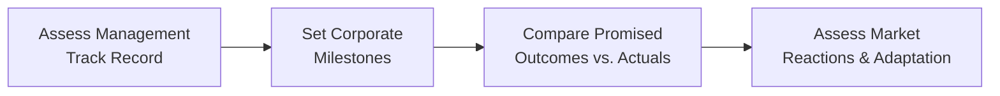

## The Importance of Management Quality

Imagine you’re weighing two similar companies—both with strong earnings, good market share, and decent product lines. You dig deeper, and discover that one management team has a knack for consistently hitting strategic goals, while the other seems to fall short. Suddenly, the difference is night and day. Evaluating management doesn’t just help you spot the difference between future winners and potential underperformers; it’s also a key part of building a solid investment thesis. 

In this section, we’ll take a close look at how an equity analyst can consider the backgrounds of top executives, track records for delivering on corporate strategy, approaches to short- vs. long-term objectives, compensation structures, communication style, and even some intangible factors like corporate culture. We’ll also dip into some personal anecdotes—because we’ve all had those moments with a CFO who couldn’t meet the forecast (and not in a good way!). 

## Background Checks on Senior Leadership

When you study a company for investment (or even for your own curiosity), the first step is to learn about the folks at the top. Typically, you’d examine:

• CEO (Chief Executive Officer): Often the face of the company, responsible for casting the vision and owning overall strategy. Check the CEO’s track record in prior roles. Maybe they built a small startup into a major industry competitor. Or perhaps they oversaw a high-profile merger or turnaround. Industry-specific experience can be just as critical: a CEO with deep knowledge of pharmaceuticals might be more effective leading a biotech firm, for instance.

• CFO (Chief Financial Officer): The CFO influences decisions about capital structure, budgeting, and investor relations. You want to see if they’ve navigated tough markets before, if they’re transparent about numbers, and if they set realistic targets. In my opinion, a CFO who consistently “massages” earnings or underestimates expenses to show a pretty picture is a red flag—though, let’s be honest, some analysts might say they’re just “managing the Street’s expectations.”

• Other Key Executives: Depending on the company, you might also check out the Chief Operating Officer (COO), the Chief Technology Officer (CTO), or anyone else who significantly shapes strategy. Their educational background, experience in relevant fields, and prior achievements can reveal their capacity to execute effectively.

### Personal Tidbit: The Not-So-Transparent CFO

I once tracked a specialty retail company whose CFO could spin the most elaborate stories during earnings calls—lots of “We’re focusing on synergy improvements,” but intangible details. Eventually, a major inventory overhang popped up out of nowhere, leading to a big earnings miss. The lesson: watch out for CFOs who rely on vague lingo without facts or data. Over time, you can spot the consistent pattern of either delivering transparency or dodging tough questions.

## Evaluating Strategy Execution

Even the most inspiring strategic plan won’t mean much if leadership can’t translate it into real-world results. For investors and analysts, assessing strategy execution involves:

• Tracking Deliverables: Has the management team normally met the milestones they set out? For instance, if they promised a new plant to expand production or a global rollout of a product line, did it materialize on time and within budget?

• Consistency Over Time: A single year of strong results can be luck, but multiple periods of hitting growth targets suggests a pattern of good planning and follow-through. If management’s historical track record shows frequent restatements of earnings or abrupt strategic pivots, it could be a sign of weak strategy execution.

• Adaptability: A true test of a team’s quality is whether they can pivot when the environment changes—such as new competition, new regulations, or a global recession. Did the management respond effectively and keep pushing the company forward?

It’s helpful to look backward at the company’s annual reports, investor presentations, and press releases to piece together the puzzle of whether stated goals turned into confirmable actions. Often, an analyst will map out timelines for major announcements and real outcomes, then compare them. That alone might highlight if there’s a mismatch between promises and performance.

In the diagram above, the process of evaluating management’s track record starts with reviewing historical performance and continues through setting milestones and comparing actual results to what was promised. The final step is seeing how well (or poorly) those achievements align with changing market realities.

## Short-Term vs. Long-Term Focus

Markets can be impatient. Often, there’s pressure for management to deliver strong quarterly earnings, sometimes even at the expense of R&D or brand-building that might pay off years down the line. You’ll want to figure out how management balances these conflicting priorities:

• Short-Termism: Some teams might cut R&D budgets or slash marketing to bump up quarterly profits (and possibly their own performance bonuses). This can cause short-term stock price boosts but might hurt competitive advantage down the road.

• Long-Term Investments: Others display a willingness to invest money in new technologies, expansions, or strategic products, even if it temporarily reduces margins. They argue it’ll generate sustainable growth.

Observing the company’s conference calls, presentations, and capital allocation patterns provides clues. A CEO who frequently highlights “vision three to five years out” but sacrifices short-term metrics in the process might face market criticism—yet that strategy might produce stronger returns eventually.

### Quick Example

Consider a tech company that invests heavily in AI research. Short-term profits dip because of high R&D costs. If the board and CEO communicate a solid rationale for these expenses and show potential largest-in-the-industry innovations, markets might buy in. On the other hand, a short-term-oriented CEO might just cut that budget to impress analysts with cost savings, ignoring the potential loss of future advantage.

## Compensation and Incentives

It’s always a good idea to “follow the money.” If management’s bonuses, stock options, and other perks are tied to specific measures—like share price, revenue targets, or net income—then guess what they’ll focus on? That’s right: those measures. 

### Key Compensation Elements

• Equity Ownership or Stock Options: If executives have significant equity stakes, they typically have skin in the game. If the company thrives, so do they. That tends to encourage more long-term thinking (assuming they can’t just dump shares tomorrow).

• Performance-Based Bonuses: These could be tied to metrics such as EBITDA growth, free cash flow, or earnings per share (EPS) improvement. A balanced scorecard might also include non-financial factors like sustainability or employee development.

• Clawback Provisions: More boards are adopting rules that require execs to repay bonuses if fraudulent accounting or restatements occur. That’s a good sign that the board is serious about accountability.

In your analysis, check annual proxy statements for clarity around how compensation is structured. This is often one of the best windows into management’s real incentives.

### A Cautionary Tale

A few years back, I was following a manufacturing firm whose CEO got a special bonus if short-term profitability targets were hit before a certain date. Surprise, surprise—the firm rapidly cut staff, froze important capital spending, and sold off non-core assets to pump profits. The CEO met the target and left the year after with a golden parachute. The company, starved of growth potential, struggled for years after. Let’s just say, analyzing executive pay can help you spot red flags early.

## Communication Style and Transparency

Listening to management on earnings calls, investor conferences, and in regulatory filings can give you a sense of how open and honest they are—or how good they are at glossing over the details. Cards on the table: the best management teams own their mistakes and talk plainly about obstacles. Meanwhile, some executives bury unpleasant truths in fine print.

### Signals of Sound Management Communication

• Clear, Plain Language: Do they explain what went wrong (or right) in accessible terms, or do they prefer endless jargon? 
• Consistent Story: Are they reiterating the same strategic priorities and repeating the same key performance indicators (KPIs) to measure progress?
• Willingness to Address Challenges: Do they hide from tough issues, or do they provide a frank discussion of the competition, global market possible slowdowns, or product failures?

As an analyst, you should also track how management handles Q&A sessions. Do they show humility, or do they simply deflect? Has the CFO addressed any underlying accounting complexities in a direct manner?

## Adaptability in Competitive Markets

The pace of disruption and the speed with which entire industries can change (tech, automotive, consumer electronics) demand that leadership be ready to pivot. Management that ignores major threats can quickly cause a firm to lose both relevance and investor confidence.

### Red Flags

• Failure to Acknowledge New Rivalry: If a direct competitor enters the market with a more innovative approach, does leadership respond with an effective plan? Or do they dismiss it entirely and hope the threat fades?

• Defensive vs. Proactive Strategies: Defensive strategies (cost-cutting, staff reductions) aren’t necessarily bad, but if they’re the only response, you might see serious issues with sustaining growth. Proactive steps might include retooling product lines, exploring strategic partnerships, or investing in advanced manufacturing or data analytics.

## Corporate Culture and Talent Development

Sometimes culture is dismissed as too fuzzy. But if you talk to big institutional investors, they pay close attention to how a culture fosters creativity, open communication, and accountability. Analysts often glean clues about culture from:

• Turnover Rates: Are key employees leaving too often? Frequent departures can hint at internal discord. 
• Employee Development Programs: Companies that champion leadership pipelines and professional development demonstrate a commitment to long-term growth in human capital.
• Risk Management: A risk-aware but forward-thinking culture tends to set clear guidelines yet remains capable of innovation.

A culture that encourages diverse perspectives might be more agile and better equipped to handle strategic pivots. In contrast, a rigid, top-down culture might resist new ideas.

## Analytical Tools and Governance Insights

You can blend both qualitative and quantitative approaches to evaluate management quality. Some typical tools:

• Governance Scoring Models: Agencies like MSCI ESG Research or S&P Global provide governance scores that factor in executive alignment with shareholders, board independence, and transparency. 
• Forensic Analysis of Earnings Quality: Analysts can spot patterns in accruals or one-off adjustments that may highlight overly aggressive (or downright suspicious) accounting practices.
• Industry Benchmarks: For example, if your target firm invests far less in experimental R&D compared with the industry average—yet claims to be “cutting-edge”—you might suspect a mismatch between words and actions.

Meanwhile, we can’t ignore global reporting standards. Whether a firm follows IFRS or US GAAP can sometimes influence how certain items are recognized or reported. The CFA Institute Code of Ethics and Standards of Professional Conduct encourages thorough due diligence so members or candidates can have a reasonable basis for their analyses. This means you should be mindful of the relevant accounting principles and how management might interpret them.

## Putting It All Together: A Brief Case Example

Take a fictitious company, OrionTech, a mid-cap technology supplier. Its CEO is well respected in the industry with a history of successful expansions. The CFO has a background in large-scale manufacturing and is known for consistently guiding earnings forecasts with a tight margin of error. The leadership invests in R&D for new AI-driven tools, even though it compresses short-term profits. The board then ties the CEO’s performance bonus partly to “innovation cycle achievements” and partly to net income growth. On quarterly calls, they highlight hits and misses—always clarifying how they plan to improve. Over the last three years, OrionTech has outpaced peers in launching new products and scoring major contracts.

Compare that to TechNova, a competitor with a CEO who soared into the role from a marketing background but has no experience in scaled engineering or manufacturing. Their CFO turned over three times in two years. They speak vaguely about “reimagining next-gen solutions,” but specifics are lacking. Their only consistent success so far is showing short-term cost cuts (like slashing marketing, ironically) to inflate near-term margins. You might guess which might have more stable shareholder value in the future.

## Conclusion and Exam Tips

Assessing management quality and strategy execution isn’t a quick box-ticking exercise. It’s subjective, nuanced, and sometimes shaped by intangible factors like culture or leadership style. In advanced exam scenarios (and real life), you often have to weigh conflicting evidence—for instance, strong historical performance but questionable executive pay structures. 

For the CFA exam, especially scenario-based questions, keep these tips in mind:

• Show how you gather evidence: reference conference calls, regulatory filings, management track records, compensation details.  
• Focus on alignment of incentives: does management pay revolve around short-term or long-term goals, or a balanced mix?  
• Watch for “red flag” language: repeated restatements, abrupt strategic changes, or overly rosy guidance without transparency.  
• Use good ethics: Standard V(A) “Diligence and Reasonable Basis” calls for thorough research on leadership before providing an investment recommendation.

When you practice essay or item-set questions, bring management considerations into your overall conclusion. Even if the financial metrics are solid, a misaligned or untested management team can drastically alter the risk profile—and that’s exactly the sort of layered thinking the exam might test.

## References for Further Study

• Collins, Jim. Good to Great. Explores how leadership quality impacts corporate transitions from average to stellar.  
• MSCI ESG Research. Provides governance ratings that can support your qualitative assessments.  
• Proxy Statements. Look at the company’s annual proxy for executive compensation details.  
• CFA Institute Code of Ethics and Standards of Professional Conduct. Guide to best practices in due diligence and professional behavior.

---

## Test Your Knowledge: Assessing Management Quality in Equity Analysis



### Which tool commonly helps investors measure whether management is truly delivering on promised strategic milestones?

- [ ] Price-to-Earnings (P/E) multiple trends
- [ ] Industry concentration indexes
- [x] Historical timeline comparison of stated goals vs. actual results
- [ ] Vertical common-size statements

> **Explanation:** Comparing management’s publicly stated goals (e.g., product launches, production expansions) against the actual outcomes over time is one of the most direct ways to verify the consistency and authenticity of strategy execution.

### When evaluating short-term vs. long-term management focus, which approach is generally viewed as a red flag?

- [ ] Investing heavily in R&D for future technology
- [x] Aggressive cost-cutting to meet quarterly targets at the expense of long-term growth
- [ ] Exploring strategic partnerships
- [ ] Allocating capital to product innovation

> **Explanation:** Over-emphasizing quarterly earnings by dramatic cost-cutting can boost short-term metrics but may hurt the company’s competitiveness over time. Investors typically watch for this as a sign of short-termism.

### What is typically an advantage of having top executives with significant stock ownership?

- [x] Alignment of executive interests with those of shareholders
- [ ] Immediate focus on maximizing short-term revenue
- [ ] Elimination of all principal-agent problems
- [ ] Avoidance of capital market fluctuations

> **Explanation:** When executives hold a substantial stake in the firm, they share in the upside (and downside) of company performance, creating better alignment with shareholders’ interests. This often discourages myopic behavior.

### Which of the following indicates transparent management communication?

- [x] Willingness to address competitive threats openly during earnings calls
- [ ] Vague references to “organizational synergy” without metrics
- [ ] Consistent deflection of challenging investor questions
- [ ] Repetitive usage of jargon without clarifying details

> **Explanation:** Management that openly addresses threats and questions—backed up with data or a clear plan—signals greater transparency. A consistent, frank communication style helps analysts and investors make informed decisions.

### If a company’s CFO receives a performance-based bonus tied exclusively to short-term EPS growth, what is a potential risk?

- [x] Reduced R&D or marketing spending to inflate profits
- [ ] A primary focus on long-term strategic initiatives
- [x] Encouraging the CFO to pursue cost-cutting measures at the expense of future growth
- [ ] Enhanced risk analysis of the competitive environment

> **Explanation:** Tying compensation solely to short-term profit metrics can incentivize leaders to reduce essential future-oriented spending or even engage in earnings manipulation. Balanced incentives usually mitigate this.

### What does a high turnover rate among top executives often signal?

- [x] Possible internal turmoil or lack of consistent strategic direction
- [ ] Reliable and stable corporate environment
- [ ] Strong alignment with long-term shareholder interests
- [ ] Greater transparency in corporate governance

> **Explanation:** Rapid changes in senior leadership can disrupt strategic execution and create organizational instability. Investors often interpret frequent turnover as a red flag that warrants further investigation.

### What is a possible indication that management might be overlooking key competitive threats?

- [x] Dismissing new entrants into the market as irrelevant without further analysis
- [ ] Establishing an R&D partnership with tech innovators
- [x] Emphasizing product expansions within existing markets
- [ ] Cutting underperforming product lines after a thorough review

> **Explanation:** If management simply dismisses competitors or new market entrants without detailing a response, it can suggest complacency. A proactive approach—like forming partnerships, investing in new tech, or pivoting strategy—often signals better awareness.

### How can corporate culture shape a company’s strategy execution?

- [x] A supportive culture can encourage creativity and better decision-making
- [ ] A strong culture always leads to short-term earnings growth
- [ ] Culture has no impact on strategic results
- [ ] Culture only matters at entry-level positions

> **Explanation:** A company culture fostering open communication, collaboration, and prudent risk-taking tends to enhance effective strategy execution. Conversely, dysfunctional culture can hamper innovation and efficient operations.

### Why might an analyst consult MSCI ESG governance scores?

- [x] To access a third-party assessment of executive alignment, transparency, and board independence
- [ ] To evaluate the company’s supply chain carbon footprint only
- [ ] To track short-term earnings guidance from management
- [ ] To predict changes in monetary policy

> **Explanation:** ESG governance scores often include factors such as board independence, executive compensation alignment, and transparency, helping analysts confirm or challenge their qualitative assessment of management quality.

### True or False: A CEO with no prior industry expertise can never effectively lead a company in that industry.

- [x] True
- [ ] False

> **Explanation:** While it’s not always a deal-breaker, a strong background in the relevant industry typically better equips a CEO to navigate challenges and leverage opportunities. An absolute statement that they “never” can be effective is generally too rigid. However, broad leadership skills and adaptability can compensate for limited industry experience under certain circumstances; so thoughtful analysis is key.


