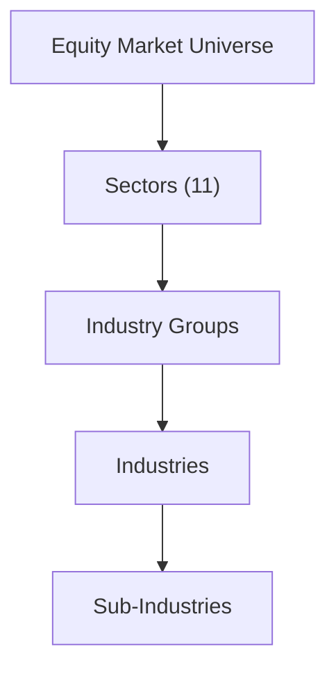

## Introduction

Industry classification systems help us group companies into sectors, industry groups, and subsectors with similar economic activities. When you’re analyzing an equity, you typically want to see how it stacks up against its closest peers, whether in terms of growth rates, profit margins, or even intangible factors like brand strength and consumer loyalty. The point is: you really need a consistent way to compare apples to apples (and not, as they say, apples to oranges).

I remember personally grappling with an early research project—years ago—where I tried to benchmark a U.S.-listed auto manufacturer against a South American tire supplier. Um, let’s just say the results were all over the place! That’s when I realized that grouping companies properly can spare you from misguided conclusions and lots of wasted time. In the bigger picture, classification systems bring order to a complex universe of firms and help equity analysts focus on the right data. So anyway, let’s walk through how classification systems work, why they matter, and how you can apply them in your practice.

## The Rationale Behind Classification

We often think about grouping companies so we can:

• Compare performance measures among peers (e.g., margins, revenue growth, leverage).  
• Build sector-based strategies, such as rotating out of cyclical sectors and into defensive sectors depending on economic forecasts.  
• Study cross-sectional behavior, like how technology companies might respond to rising rates or how consumer discretionary names typically react to changes in disposable income.  
• Simplify watchlists and screens to ensure we’re evaluating “like with like.”

Classification is not a mere administrative or bureaucratic exercise. Instead, it’s fundamental to robust equity research, risk control (by allocating sector exposure carefully), and portfolio construction—especially at the advanced portfolio-management level. If you’re a CFA Level III candidate, for instance, you might be weaving your knowledge of derivatives and multi-asset strategies into broader sector bets, so it’s essential to have consistent sector definitions across your portfolio.

## Major Classification Systems

### Global Industry Classification Standard (GICS)

GICS was developed by MSCI and S&P Global. It sorts the equity market into four distinct layers:

1. Sectors (11 total)  
2. Industry Groups  
3. Industries  
4. Sub-Industries  

It’s one of the most popular systems globally, used by major indexes like the S&P 500. GICS focuses on companies’ principal business activities, specifically emphasizing revenue sources. For example, if over half of a company’s revenue is derived from software products, GICS is likely to categorize it in the Information Technology sector within the Software & Services industry group—despite the presence of other business lines. This is appealing to many global equity analysts because it straddles industries and geographies, giving consistent definitions across markets.

Below is a simplified Mermaid diagram illustrating the GICS hierarchy:

### Industry Classification Benchmark (ICB)

ICB is maintained by FTSE Russell. It’s somewhat comparable to GICS but uses a different naming convention. ICB also goes from a broad macro structure (Industries or Supersectors) down to narrower classifications (Sectors). The idea is, again, grouping companies based on their main economic activities. Large index providers (e.g., FTSE) often rely on ICB as the backbone for constructing a variety of global equity benchmarks.

Where might you see subtle differences? Well, technology stocks might be carved up differently. Some might end up in a “Technology Hardware” vs. “Software & Computer Services” category in ICB, whereas GICS might group them under “Information Technology” but highlight different sub-industries. This means comparing a GICS-based index and an ICB-based index can occasionally yield different sector weightings.

### North American Industry Classification System (NAICS)

NAICS is the standard used by federal agencies in the U.S., Canada, and Mexico for classifying business establishments. It’s extremely detailed in some arenas—particularly in manufacturing—because it aims to capture production processes and supply chains accurately. NAICS is widely used for economic and statistical analysis, so if you’re reading, say, U.S. Census Bureau data or certain industry-specific surveys, you’ll see NAICS codes as a standard reference. This can be invaluable if you’re analyzing small-cap or private firms and you want to see broader economic data that matches them.

### Standard Industrial Classification (SIC)

SIC is the older predecessor to NAICS in the United States. It uses a four-digit code to classify firms. While it’s still in use—mostly for historical data sets—it’s less comprehensive and flexible compared to NAICS. SIC was often criticized for not keeping pace with emerging industries (like advanced technology or biotech). Frankly, if you’re analyzing something like a software-as-a-service provider, you might not get the granularity you want with SIC. Even so, historical time-series data often rely on SIC codes, so as an analyst, you might still come across them.

## Comparing and Contrasting the Systems

The main differences among GICS, ICB, NAICS, and SIC stem from the classification basis:

• GICS & ICB: International focus, mostly used by equity index providers and financial markets. Revenue is a major determinant for classification in GICS, whereas ICB combines a macro approach (e.g., “Technology,” “Consumer,” “Financials”) with narrower groupings beneath.  
• NAICS & SIC: North America–focused. NAICS replaced SIC to capture nuances in services, entertainment, tech, and other growth areas. The classification logic revolves around production processes (especially in manufacturing) and is used primarily for statistical and business census purposes.

When you do a deep competitive analysis—especially if you’re looking at companies with multinational exposure—you might find mismatches between a firm’s GICS classification and its NAICS code. This can happen if a conglomerate has multiple revenue streams that fall into different categories. Overall, GICS is the go-to for many portfolio managers because it’s widely adopted in the global financial community and is well integrated into major equity indexes.

## Practical Applications

1. Peer Comparisons:  
   By aligning companies in the same GICS (or ICB) sub-industry, you can fairly compare metrics like price-to-earnings ratios or EBIT margins. You don’t want to compare a purely digital platform company with a heavy manufacturing firm when you're concerned about, say, capital expenditure intensity.

2. Sector Rotation Strategies:  
   Some managers adjust portfolio exposures based on macroeconomic cycles. If you believe an economic expansion is coming, you might overweight cyclical sectors such as Consumer Discretionary or Materials. If you’re concerned about a downturn, you might pivot to defensive sectors such as Consumer Staples or Utilities. Classification systems like GICS make these sector definitions consistent across your research, strategy backtesting, and risk management.

3. Thematic Investing:  
   Industry classification helps you find companies that fit certain themes—like renewable energy, e-commerce, or artificial intelligence. You can screen by sub-industry codes or sector labels, piecing together a more targeted watchlist.

4. Identifying Emerging Sectors:  
   Over time, new industries may appear (e.g., green hydrogen) or existing sub-industries may shift. GICS and ICB periodically revise their frameworks to include these evolving categories. Keeping an eye on these changes helps you spot growth opportunities.

5. Benchmark Construction:  
   Mutual funds and ETFs often track sector-specific or broader market indexes. These benchmarks rely on established classification frameworks, ensuring stocks are included or excluded on a systematic basis. Passive investors, in particular, benefit from these consistent classifications.

## Limitations and Challenges

1. Conglomerates and Multi-Segment Firms:  
   A large corporation might generate 45% of revenue from consumer electronics, 30% from financial services, and 25% from media. GICS or ICB might toss it into “Technology Hardware” based on the plurality of revenue, but that shoe might fit poorly. This can mislead a naive peer comparison (e.g., ignoring the substantial financial operations). Analysts need to delve deeper and manually adjust their comparisons.

2. Subjectivity in Revenue Splits:  
   It’s not always straightforward to parse a company’s financial statements to see which line of business truly dominates. Some companies don’t disclose segment-level revenue in maximum detail, or they consistently restructure. So classification is partly reliant on how well a firm reports its internal segments.

3. Inconsistent Adoption Across Jurisdictions:  
   NAICS might be standard in the U.S., but if you’re analyzing a firm headquartered in Europe, they might primarily refer to ICB or some local system. It’s on you, the analyst, to unify these frameworks when building peer groups.

4. Dynamic Nature of Industries:  
   The line between “technology” and “communication services” has blurred significantly with the rise of digital media, streaming content, and social media platforms. Classifications often lag behind real-world corporate transformations. So you might see sudden reclassifications when GICS or ICB updates their definitions.

## Best Practices for Analysts

• Validate Revenue Streams:  
  Don’t just trust that a firm is “tech.” Investigate annual reports or 10-K filings to verify the main sources of revenue. If you find a mismatch between classification and real economic activity, consider reassigning it in your personal analysis.  

• Compare Multiple Classifications:  
  Sometimes it’s enlightening to see how a company is classified under two systems, such as GICS vs. NAICS, especially if you suspect a firm spans multiple industries.

• Watch for Corporate Restructuring:  
  A firm may divest a large business line or acquire an unrelated company. Keep an eye on classification changes that occur after major M&A events—a lag can exist between the transaction and the official reclassification.

• Use “Functional” Classification:  
  Sometimes a rough classification by function (e.g., cyclical vs. defensive, growth vs. value) is more intuitive for portfolio management. This approach complements, rather than replaces, official classification systems.

• Document Your Peer Group Criteria:  
  Make sure you note if you’re using GICS sub-industry or ICB sector or some combination. Consistency is key so your peers and clients can follow your logic.

## Exam Relevance

For advanced CFA candidates—particularly at Level III, where portfolio management is at the forefront—industry classification systems tie directly to sector-based strategies, factor investing, and index replication. You might see item set or essay questions requiring you to:

• Justify a sector rotation approach based on an economic scenario.  
• Evaluate the suitability of comparing two companies that have different classification codes.  
• Discuss the effect on risk and return when a portfolio is rebalanced to align with a different industry classification framework.

A best practice on the exam: always look at how the classification logic might alter the approach to analyzing a portfolio’s sector composition. Demonstrate that you can identify mismatches and articulate how they might bias performance or risk metrics.

## Final Exam Tips

• Pay attention to the rationale behind why classification systems differ. It’s not just about memorizing acronyms but understanding how the differences could change your investment decisions.  
• Practice explaining how you’d handle conglomerates or multiple business lines. Show that you appreciate the importance of “drilling down” into financial statements.  
• Don’t forget that classification systems can and do change. Be prepared to discuss how that might affect the weighting of certain sectors in an index or a portfolio.

## References

• Harvard Business School Technical Note: “Measuring Industry Concentration and Classification Systems.”  
• Global Industry Classification Standard (GICS) documentation:  
  https://www.msci.com/gics  
• NAICS official resources:  
  https://www.census.gov/naics  
• “Equity Asset Valuation,” CFA Institute.  
• FTSE Russell ICB framework: https://www.ftserussell.com/data/industry-classification-benchmark-icb  

---

## Test Your Knowledge: Industry Classification Systems in Equity Analysis



### 1. Which of the following best describes the primary purpose of industry classification systems?

- [x] To group companies by similar economic activities for more accurate peer comparisons
- [ ] To standardize tax treatment for corporations in different jurisdictions
- [ ] To eliminate the need for fundamental analysis by analysts
- [ ] To enforce regulatory compliance under IFRS and US GAAP

> **Explanation:** Classification systems such as GICS or ICB help categorize firms based on similar economic activities, facilitating consistent peer group comparisons.

### 2. Under the Global Industry Classification Standard (GICS), what is the broadest level of categorization?

- [x] Sector
- [ ] Sub-industry
- [ ] Index
- [ ] Market capitalization range

> **Explanation:** In GICS, the broadest level is the “Sector,” which then narrows down into industry groups, industries, and sub-industries.

### 3. Which of the following is considered a challenge when classifying large conglomerates?

- [x] Their business activities can span multiple categories, complicating straightforward classification
- [ ] They have only a single source of revenue, making classification too uniform
- [ ] They always fit neatly into one classification code without confusion
- [ ] Regulators prohibit conglomerates from listing under multiple codes

> **Explanation:** The biggest challenge is that conglomerates derive revenue from multiple industry segments, often complicating classification within a single system.

### 4. What is one advantage of NAICS over older SIC codes?

- [x] NAICS provides greater granularity, especially for service and emerging industries
- [ ] SIC is more updated and widely used universally than NAICS
- [ ] NAICS completely eliminates the need for a global classification system
- [ ] NAICS is a purely revenue-based classification, unlike GICS

> **Explanation:** NAICS is more detailed and better reflects modern industries, whereas SIC is older and less flexible.

### 5. In GICS, how is a company’s primary classification typically determined?

- [x] By analyzing the dominant source of revenue
- [ ] By its total number of employees
- [ ] By its oldest line of business on record
- [ ] By where it is listed geographically

> **Explanation:** GICS classifies companies based on the primary revenue driver and main economic activity.

### 6. Which classification system is commonly used by government agencies in the U.S., Canada, and Mexico?

- [x] NAICS
- [ ] GICS
- [ ] ICB
- [ ] SIC

> **Explanation:** NAICS (North American Industry Classification System) is used by government agencies for statistical and business classification across these three countries.

### 7. Which of the following statements is TRUE about the Industry Classification Benchmark (ICB)?

- [x] It is maintained by FTSE Russell and uses different sector names than GICS
- [ ] It is primarily used for U.S. government statistics in the manufacturing sector
- [ ] It replaced SIC in the United States
- [ ] It classifies only private, non-listed companies

> **Explanation:** ICB is a global classification framework managed by FTSE Russell. It doesn’t replace SIC or focus solely on manufacturing.

### 8. How does the dynamic nature of modern industries affect classification frameworks?

- [x] Rapid innovation can lead to redefinitions that re-map companies to new or revised categories
- [ ] There are no changes necessary; classification remains constant despite innovation
- [ ] Investors have less need for classification systems
- [ ] It immediately renders all older frameworks obsolete

> **Explanation:** As industries evolve, frameworks like GICS or ICB may update their categories to reflect new business models and sector definitions.

### 9. When analyzing a “tech company” across different classification systems, what might you discover?

- [x] The company might be classified differently depending on the system’s criteria for revenue or business activities
- [ ] Tech companies are uniformly classified under the consumer discretionary sector
- [ ] Tech companies are prohibited from listing in GICS
- [ ] No major differences typically emerge across classification systems

> **Explanation:** Classification systems have unique approaches to determining where a company fits, so a tech company might land in varying sub-sectors or categories.

### 10. True or False: GICS and ICB are generally more international in scope, whereas NAICS and SIC cater more to North American structures.

- [x] True
- [ ] False

> **Explanation:** GICS and ICB are primarily designed for global equity markets, while NAICS and SIC center on North American contexts and statistical uses.


