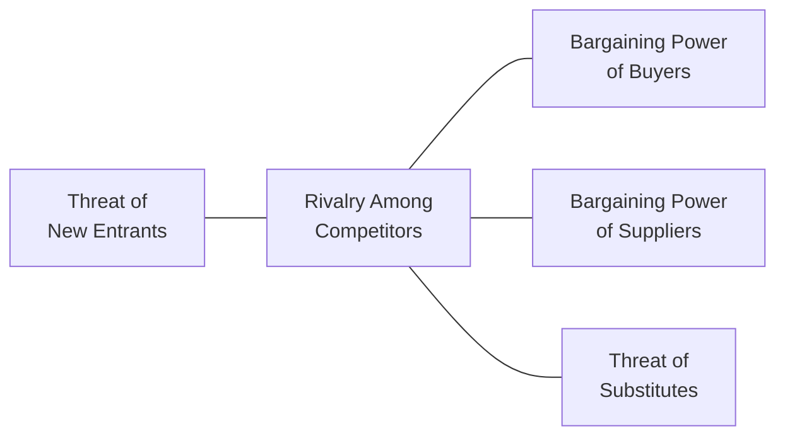

## Overview and Core Concepts

Sometimes I like to think back to my first real taste of competitive industry analysis. It was during an internship, years ago, when my boss looked over my shoulder at a naïve PowerPoint chart and said, “So, have you run it through Porter’s Five Forces yet?” Actually, I hadn’t—and, to be honest, at that moment, I barely knew what those five forces were. Yet as soon as I started using the framework, it felt like someone handed me the industry equivalent of a magic decoder ring. Suddenly, everything about company positioning made more sense.

Porter’s Five Forces is a classic for a reason—it seamlessly distills industry-level competitiveness into five main components. Once you understand each force, you can better gauge why some players thrive while others falter. This is crucial in equity valuation and broader investment decisions. After all, if you can anticipate how these forces might evolve, you can spot which companies have room to excel and which might get squeezed by intensifying competition.

Below is a quick visual overview of the Five Forces. Think of it like a star shape, with Rivalry in the center and the other four forces orbiting around it:

Each force affects how an industry’s overall profits get shared among participants. The final outcome—industry-wide profitability—stems from the interplay of these five forces. Let’s walk through them one by one, exploring their strategic insights and tying them back to equity investments.

## Threat of New Entrants

When analyzing the threat of new entrants, ask a simple question: how easy or hard is it for newcomers to break into this industry? If it’s relatively easy, expect more participants eventually, which usually drives down prices, squeezes profits, and increases the need for constant innovation or differentiation.

• Barriers to Entry: Does the industry require large capital outlays, complex licensing, or special technology? If so, new entrants might be deterred, thus preserving existing firms’ margins. In industries like commercial aviation, certification requirements, high up-front capital (planes are pricey!), and regulated gates at airports make it tougher for a new firm to just pop in.

• Regulatory Hurdles: Sectors like banking or healthcare often have substantial regulatory oversight. High compliance costs deter casual newcomers. Think of large banks that face Basel III capital requirements—such measures can dissuade smaller players from joining the game.

• Switching Costs: If customers face significant financial or psychological “costs” to change providers, that can also shield incumbents. An example might be enterprise software. Companies rarely swap providers lightly because the migration is both expensive and risky.

When evaluating equity investments, keep an eye on how management strategies might raise barriers—like patenting new processes or building out brand loyalty. Also monitor how new technologies can quickly lower barriers. With the rise of low-code software platforms, for example, you might see a new wave of digital entrants challenging established firms.

## Threat of Substitute Products or Services

Substitutes are any alternatives that address the same needs. If you’re a smartphone manufacturer, tablets or laptops might be partly substitutable. If you’re a coffee shop, energy drinks or at-home espresso makers can act as substitutes. A high threat of substitutes occurs if buyers have plenty of options to accomplish their goals, and switching from your product to an alternative is fairly hassle-free.

• Price Sensitivity: If substitutes offer a lower price or superior features, customers may bolt—and quickly. Look at the photography industry before and after smartphones gained high-quality cameras. The demand for dedicated digital cameras in the casual consumer segment plummeted.

• Technology Disruption: Emerging digital tools often create new substitutes. Retailers that once competed with brick-and-mortar neighbors now face global competitive pressure from e-commerce or social media marketplaces. 

• Market Maturity: In a mature market—like certain consumer goods—substitutes pop up more easily. Firms often must differentiate heavily (with brand, unique features, or convenience) to protect margins.

Evaluating the potential for substitutes helps you judge a company’s long-term revenue stability. If a firm consistently invests in research and development or brand-building, it may hold off substitutes better than competitors.

## Bargaining Power of Buyers

Buyers’ power can be substantial if they purchase large volumes, have few switching costs, or can easily pit competitor firms against each other. It’s like when you step into a bustling wholesale food market—buyers with big orders can often negotiate more favorable terms.

• Buyer Concentration: A small number of large buyers implies that each buyer wields significant leverage. Maybe you’ve seen how supermarkets can dictate terms to smaller suppliers (refrigerated shelf space is a big deal). In capital markets, a handful of big institutional investors can drive tough negotiations for large equity stakes.

• Price Sensitivity and Switching Costs: If buyers can just click a button and switch to a competitor (imagine consumer electronics or online subscription services), their power is enhanced. Companies might have to slash prices or add perks to keep big buyers happy.

• Product Differentiation: If an industry’s offerings are highly commoditized—think sugar, steel, or raw materials—buyers might be able to force lower prices. If the product is more specialized (like high-end semiconductors or patented biotech drugs), the tables turn.

When analyzing equity opportunities, investigate whether the firm’s largest customers are demanding and powerful (e.g., large retailers), or fragmented with lower negotiating clout (e.g., many small individual buyers). That dynamic can significantly influence margins and growth strategies.

## Bargaining Power of Suppliers

On the flip side, suppliers can hold sway if they offer unique or scarce inputs. Specialists in essential components or raw materials may drive up prices or impose stringent contract terms if their offerings are hard to replace.

• Supplier Concentration: Industries that rely on just a few specialized suppliers often see higher input costs. If you only have one or two advanced chip manufacturers that can produce the specialized chips you need, you’ll lack leverage in price negotiations.

• Switching Costs: If changing suppliers involves retooling a factory, adjusting your entire supply chain, training staff on new materials, or losing certifications, a supplier can push for higher margins—knowing you’ll not want to endure that hassle.

• Forward Integration: Sometimes suppliers threaten to move downstream. If, say, an auto parts manufacturer can itself start building entire vehicles or specialized subassemblies, it can reshape the industry’s competitive boundaries.

As an equity analyst, watch for signs that suppliers are capturing a bigger slice of the profit pie. Are raw material costs surging? Are companies having to accept unfavorable contract terms to ensure supply availability? These signals might hint at margin compression.

## Rivalry Among Competitors

At the center of the framework sits rivalry—how intensely firms in an industry jockey for market share. High rivalry often means frequent price competition, extensive marketing campaigns, or product differentiation wars.

• Concentration and Number of Competitors: If there are many similar-sized competitors, rivalry is often fierce. Think of the extremely fragmented restaurant industry, with new concepts popping up daily. In oligopolies with just a handful of major players, competition can still be intense, but sometimes they quietly maintain stable market shares through recognized competitive boundaries.

• Industry Growth and Capacity: If the market is shrinking or barely growing, every competitor fights harder for a piece of the same pie. Overcapacity and cyclical downturns—common in industries like shipping or steel—fuel intense price wars.

• Exit Barriers: When it’s difficult for firms to exit (due to specialized assets or high closure costs), they often remain and compete aggressively rather than bow out gracefully. Airlines, for instance, can’t easily convert their fleets into something else. They stay and fight, sometimes pushing prices to unsustainably low levels.

From an investor’s viewpoint, stable or moderate rivalry usually fosters healthier margin structures. Watch for signals of intensifying rivalry—like a wave of new expansions or persistent price cuts. That might undermine the industry’s earnings outlook.

## Strategic Positioning and Digital Disruption

Porter’s framework isn’t just a snapshot; it’s a jumping-off point for deeper discussions about differentiation, cost leadership, or niche strategies. Also, the rise of e-commerce and digital platforms can shift each force unexpectedly. The threat of new entrants might skyrocket if an industry’s distribution or marketing can be done cheaply online. Substitutes might spike if digital solutions replicate what used to require physical presence. Setting up robust data analytics to track buyer behavior can mitigate buyer power. Meanwhile, rivalry may intensify as digital marketing lowers barriers to customer reach.

A few real-world glimpses:

• Video Streaming: The shift from traditional cable to streaming services changed the threat of substitute products. Suddenly, big telecoms faced nimble streaming entrants. This also empowered viewers (buyers) with flexible, month-to-month subscriptions, raising their bargaining power.

• Ride-Sharing Services: Traditional taxi companies once had local regulations as a barrier to new entrants. But along came app-based platforms that circumvented many of those barriers, shaking the entire industry’s profitability structure.

## Historical Patterns, Trends, and Alliances

Porter’s Five Forces isn’t just forward-looking; it’s also a useful lens for interpreting history. For instance, you might notice an industry that’s gone through repeated boom-and-bust cycles or consolidation waves. That might suggest potential M&A activity ahead if incumbents need to merge to reduce capacity and stabilize profits. Alternatively, suppliers and buyers sometimes form alliances or cooperative networks if that enables them to gain bargaining strength. Joint ventures can reshape industry boundaries, perhaps lowering rivalry or forging new barriers for entrants.

Especially relevant is how alliances can reduce the intensity of a single force. For example, major airlines forming alliances to share routes and streamline loyalty programs can reduce direct rivalry and raise switching costs for customers.

## Applications for Equity Analysts

1. Margin Outlook: Understanding the interplay of forces reveals margin stability (or fragility). An industry with high buyer power yet moderate supplier power might see stable but capped margins. Another industry with minimal new entrants but fearsome rivalry might experience unpredictable swings.

2. Strategic Moves: Firms can adopt cost leadership (like a discount retailer) or product differentiation (like a luxury automobile maker). Each choice influences how they address the five forces. A cost leader might rely on high volumes to offset buyer leverage, while a differentiator might reduce buyer power by creating brand loyalty.

3. Risk Analysis: For equity analysts, the Five Forces model provides a systematic risk assessment. If you see a wave of digital disruption that lowers entry barriers, that’s a red flag for incumbents. If suppliers are consolidating, that’s a red flag for buyer margins.

4. Valuation Inputs: You can feed industry-specific insights from the Five Forces into your forecast assumptions in Discounted Cash Flow (DCF) models. For example, if you infer rising supplier power, you might factor in lower operating margins over time. Or if you anticipate new entrants, you might discount a growth projection.

5. Actionable Insights: In practice, you don’t just read about the forces; you measure them. Scrutinize supply chain structures, check concentration ratios, watch for announcements of expansions or new technologies. For instance, if a major competitor invests heavily in advanced automation, it might gain a cost advantage (cranking up rivalry or pressuring smaller peers to exit).

## Best Practices and Pitfalls

• Avoid Oversimplification: The framework is a starting point, not a conclusive, formulaic output. Real industries are complicated, with overlapping forces or dynamic changes that might defy the neat boxes.

• Stay Alert to External Shocks: Macroeconomic or global events (like trade wars, pandemics, or resource crises) can instantly reorder forces. During commodity price spikes, supplier power might become the dominating force.

• Combine Tools: Pair Five Forces with other analyses, such as the PESTLE framework (see Section 7.4) for macro factors, or with scenario planning (Chapter 8) for capturing uncertainties. That holistic approach yields stronger insights.

• Refresh Regularly: Forces can shift quickly—especially in tech-driven markets. Revisit your analysis every time there’s a major regulatory change, a disruptive technology emerges, or a competitor tries an innovative approach.

## Exam Tips for CFA Candidates

In constructing or responding to essay sets or item sets related to industry analysis, Porter’s Five Forces is a recurrent favorite for testing your strategic thinking. Remember to:

• Reference Specifically: Link each force to clear evidence—like referencing data that indicates high barriers to entry or an example of intense rivalry. 
• Synthesize: Show how forces combine. For instance, if buyer power is high but supplier power is low, highlight how that might shape margin outcomes.
• Tie It to Valuation: Explaining how Five Forces insights change your discount rates, cash flow projections, or multiple-based valuations can demonstrate mastery of real-world applications. 
• Stay Flexible: Don’t assume all forces are equally weighted. Some industries may be more heavily influenced by a single force (e.g., pharmaceuticals often revolve around patent protection and regulatory barriers).

Building a coherent Five Forces analysis is part art, part science—just like investing. Stating “buyer power is high” without real examples or data is less persuasive than linking it to actual metrics or recent developments (e.g., a merger of major retail chains). And if you recall your personal experiences—those “lightbulb” moments—while writing exam answers or constructing portfolio recommendations, it helps you stay grounded in real-world logic rather than drifting into theoretical abstractions.

## References and Further Reading

• Michael E. Porter, “Competitive Strategy: Techniques for Analyzing Industries and Competitors.”  
• “Porter’s Five Forces: Understand Competitive Forces and Stay Ahead of the Competition,” Harvard Business Review.  
• CFA Institute, Official Curriculum Readings on Equity Investments and Industry Analysis.  
• Industry-Specific Case Studies from McKinsey & Company or Deloitte Research.  
• Historical M&A reports from sources like S&P Global or Thomson Reuters.

## Mastering Competitive Dynamics: Porter’s Five Forces Exam Questions



### Which force is primarily concerned with how easily newcomers can enter an industry and compete?

- [ ] Rivalry among existing competitors
- [x] Threat of new entrants
- [ ] Bargaining power of buyers
- [ ] Threat of substitute products

> **Explanation:** The threat of new entrants looks at barriers to entry such as capital requirements, regulation, and brand loyalty that may deter or enable new players.

### In Porter’s Five Forces model, which force is likely most critical in a market where powerful customers can force product price reductions?

- [ ] Threat of new entrants
- [ ] Rivalry among existing competitors
- [x] Bargaining power of buyers
- [ ] Bargaining power of suppliers

> **Explanation:** If customers can negotiate dramatically lower prices, it shows strong buyer power, significantly impacting margins.

### A well-known recipe for a profitable industry is high barriers to entry, moderate competition, and limited substitutes. Which statement aligns best with high barriers to entry?

- [x] Entrants face significant capital costs or regulatory restrictions to enter.
- [ ] Industry participants can easily exit if demand slows.
- [ ] Buyers can switch suppliers with minimal cost.
- [ ] Suppliers have low bargaining power and can’t set prices at will.

> **Explanation:** High barriers to entry typically involve large initial capital outlays, strict regulations, or intellectual property hurdles, discouraging new entrants.

### In an industry where exiting is extremely costly (e.g., specialized equipment and high shutdown costs), what is the likely effect on rivalry?

- [ ] Decreases rivalry since firms are freer to leave.
- [x] Increases rivalry, as firms continue competing rather than exiting.
- [ ] No significant impact on rivalry.
- [ ] Eliminates buyer power.

> **Explanation:** When exit barriers are high, companies often remain in the market even if profits are low, intensifying competition.

### Imagine you’re analyzing a tech hardware firm facing a single supplier that holds proprietary chip technology. Which statement describes the supplier’s position?

- [ ] Supplier has no bargaining leverage because it competes with many others.
- [ ] Supplier faces high buyer switching costs.
- [x] Supplier holds strong bargaining power due to technological uniqueness.
- [ ] Supplier faces intense rivalry from technology substitutes.

> **Explanation:** With proprietary technology, that single supplier dominates inputs for the tech firm and can exert significant power.

### When a key competitor releases a product that drastically reduces the time and cost required for customers to switch, which force is primarily affected?

- [ ] Threat of new entrants
- [ ] Bargaining power of suppliers
- [x] Threat of substitute products
- [ ] Rivalry among existing competitors

> **Explanation:** If the new product can function as a clearly viable alternative, it heightens the threat of substitution and shifts buyer preferences.

### In markets like basic steel or bulk commodities, which factor is likely to increase buyer power?

- [ ] Patented product features
- [x] Low product differentiation
- [ ] High switching costs
- [ ] Few large customers

> **Explanation:** Commoditized markets often offer minimal differentiation. This scenario allows buyers to shop around easily and demand lower pricing.

### If a firm has a unique distribution network that rivals cannot replicate, which Porter force does this primarily strengthen for the firm?

- [x] Barrier against new entrants
- [ ] Threat of substitutes
- [ ] Bargaining power of buyers
- [ ] Bargaining power of suppliers

> **Explanation:** A proprietary distribution channel is an effective barrier, restricting how easily new firms or smaller competitors can reach customers at scale.

### How can digital disruption typically affect the threat of new entrants?

- [x] By lowering barriers to entry, allowing new players to enter with less capital.
- [ ] By increasing the cost of technology adoption.
- [ ] By completely removing the threat of substitutes.
- [ ] By making rivals less price-competitive overall.

> **Explanation:** Online platforms and scalable digital infrastructure often reduce capital expenditure and logistical requirements, enabling new firms to launch quickly.

### True or False: A market with no direct competitors is guaranteed to have no threat of substitute products.

- [ ] True
- [x] False

> **Explanation:** Even if there are no direct competitors, indirect goods or services can serve as substitutes, posing a threat to profitability.


