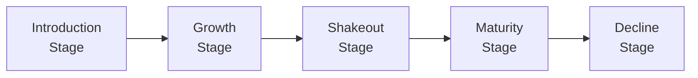

## Overview

Ever find yourself scratching your head about why technology gadgets seem to boom one year and go stale the next? Or why some old-school industries, like steel or automotive, just keep chugging along? Well, these shifts often mirror an industry’s life cycle—a fascinating framework describing how sectors rise, peak, and sometimes fade. In this section, we’ll explore how industries transition through introduction, growth, shakeout, maturity, and decline. We’ll also examine how and why market shares shift among key players. If you’re preparing for the CFA exam or just eager to evaluate equities more effectively, this topic is especially critical because it helps explain company performance trends and informs valuation assumptions.

## Understanding the Industry Life Cycle

An industry life cycle has several stages: introduction, growth, shakeout, maturity, and decline. Each stage is characterized by distinct economic conditions, competitive movements, operating structures, and investor perceptions. Although most textbooks portray this as a clean, linear flow, real-world industries can skip stages, loop back, or experience more than one stage simultaneously in different geographic markets.

Below is a diagram illustrating these five stages and their typical progression:

Let’s explore each stage in more detail.

### Introduction Stage

In the introduction stage, an industry is new and often formed around a pioneering product or technology. You might see minimal competition, small-scale production, and relatively high costs per unit. Margins can swing widely because so few players exist. Often, there’s a big question mark about whether the product will really catch on.

• Key Features:  
  – Low or negative profits, as companies spend heavily on research, product development, and marketing.  
  – High R&D costs, frequent product revisions, and uncertainty.  
  – Small user base that typically consists of early adopters.  

• Example:  
  Think back to the early days of electric vehicles (EVs) when only a handful of smaller, specialized companies made them for niche buyers. The idea was novel, but it hadn’t gained big-time traction yet.

### Growth Stage

Once an industry’s product or service charms the broader market, we typically see the growth stage. Suddenly, there’s robust demand, revenue is climbing at a quick pace, and new entrants are joining the party. Quite often, that intense competition fosters rapid innovation.

• Key Features:  
  – Strong sales growth (significant year-over-year top-line increases).  
  – Optimistic investor sentiment, as more players see potential.  
  – Demand grows faster than supply, so there can be healthy margins.

• Example:  
  Smartphones in the late 2000s had staggering revenue growth rates. New players around the world jumped in, while consumer adoption soared.

### Shakeout Stage

Now, here’s where things get intense. The shakeout period emerges when growth rates slow a bit, and the competitive fire ignites. Companies with weaker business models or inefficient cost structures may merge with stronger firms, exit entirely, or become acquisition targets. You’ll notice more emphasis on operational efficiency, cost-cutting, and capturing whatever remains of the still-growing market.

• Key Features:  
  – Consolidations and mergers become common.  
  – Profit margins may narrow as competition intensifies.  
  – Firms unable to keep up with cost or innovation demands exit the market.

• Example:  
  Online streaming services began consolidating a few years after launch. Many smaller players exited or got acquired, leaving a handful of significant providers that still jockey for market share today.

### Maturity Stage

At maturity, many industries slow down to a predictable pace that tends to mirror the overall economy’s GDP growth. Market share for leading companies stabilizes (though not always perfectly). Products and services become quite standardized, so it’s less about radical innovation and more about incremental improvements and cost control.

• Key Features:  
  – Stable revenues aligned with broader economic cycles.  
  – Emphasis on operating efficiency, cost leadership, and incremental innovation.  
  – Market leadership can remain fixed for extended periods unless there’s a major shake-up.

• Example:  
  Let’s say the personal care and hygiene sector in many developed markets. Growth typically keeps pace with population shifts or slight changes in consumer preferences, but radical leaps in product design are less frequent.

### Decline Stage

Eventually, demand for an industry’s product may taper off. This decline can be triggered by technology obsolescence, shifting consumer preferences, or simply market saturation. The decline stage often runs in parallel with strategic repositioning—some companies may exit gracefully, while others find ways to pivot.

• Key Features:  
  – Decreasing demand, with revenues steadily falling.  
  – Firms may aggressively trim costs, discontinue products, or explore new markets.  
  – Potential for reinvention or transformation (e.g., adopting new technology, merging with a more innovative firm).

• Example:  
  Consider how the film-based photography industry was largely overshadowed by digital imaging. Some traditional players pivoted to digital solutions, while others vanished altogether.  

## Tracking and Analyzing Market Share Trends

Market share measures a company’s fractional ownership of total industry sales—whether by revenue, units sold, or customer count. Observing shifts in market share can reveal which companies are excelling, which are faltering, and how overall industry power dynamics change over time.

### Why Market Share Matters

Market share is a leading indicator of competitive strength. Suppose a company is experiencing rising market share—this typically signals stronger brand loyalty, product differentiation, or cost advantages. If market share slides, managers and analysts want to know why. Is the product lagging in innovation? Has pricing become uncompetitive?

### How Market Share Evolves in Each Stage

– Introduction Stage: Market share is often very fragmented. Nobody really knows which player will dominate.  
– Growth Stage: Market share can swing wildly. Companies that innovate effectively and race ahead in distribution can seize large shares.  
– Shakeout Stage: The market share gap between strong and weak players can widen significantly. Some smaller competitors may merge or vanish.  
– Maturity Stage: Market shares tend to stabilize. Leaders often hold consistent shares; smaller firms occupy niches.  
– Decline Stage: The total market is shrinking—perhaps quickly. Companies that can pivot or adopt new niches might re-establish growth. Others fade.

### Quantitative vs. Qualitative Signals

Sometimes we want a neat, objective measure. Other times, there’s a need for a more nuanced perspective.

• Quantitative Assessments:  
  – Revenue Growth Rates or Compound Annual Growth Rate (CAGR).  
  – Changes in profitability margins such as operating margin or net margin.  
  – M&A data to see how many acquisitions are happening in the sector.  

• Qualitative Assessments:  
  – Technology shifts or new regulatory frameworks.  
  – Consumer behavior changes (e.g., sustainability demands, big data trends, societal attitudes).  
  – Shifts in brand perception and quality of customer experience.

Well, let me tell you about a time I tried to forecast market share in the consumer electronics industry. I noticed so many new entrants jumping in with their own versions of, say, fitness wearables. Within a year or two, though, many had folded or formed partnerships with bigger firms. So early on, things looked chaotic, but by watching both the revenue data and the press releases about deals, I could see the domain was headed for consolidation. That was a classic sign of a shakeout.

## Using the Industry Life Cycle to Inform Equity Valuation

For CFA candidates—and equity analysts in general—understanding the stage of an industry helps you craft better financial models. If the industry is in the growth stage, you might apply higher-than-average sales growth rates and potentially more robust capital expenditures. By contrast, a mature industry typically calls for more conservative top-line growth assumptions and stable, possibly lower margins.

### Linking Growth Stage to Valuation Assumptions

• Growth and the Dividend Discount Model (DDM): A younger, growth-oriented sector might have smaller or zero payouts but high reinvestment, meaning you might use a multi-stage DDM that starts with a high growth rate.  
• Free Cash Flow (FCF) Projections: In early stages, FCF to equity might be negative due to heavy investments. It often turns positive in the shakeout or maturity stages.  
• Market Multiples: Industries in growth or shakeout stages might trade at higher P/E multiples if investors expect future earnings to expand rapidly. In contrast, maturing industries may command steadier multiples that align more with overall economic growth.

### Best Practices

• Forecast with context: Always align your projection horizon with where the industry stands in its life cycle.  
• Be mindful of catalysts: Look for signals that might push the industry from one stage to the next. Government regulations, major product breakthroughs, or shifting consumer tastes can accelerate transitions.  
• Don’t ignore cyclical patterns: Even a “mature” industry may experience cyclical demand due to macro factors.  

## Strategies to Keep in Mind

Here are a few ways you can handle the complexities of analyzing industry stage and market share:

• Scenario Analysis: Build multiple scenarios to capture uncertainty. Perhaps the industry leaps ahead faster than expected, or maybe it stagnates if economic conditions weaken.  
• Sensitivity Analysis: Stress-test your assumptions about margin stability, revenue growth, or R&D expenditures.  
• Industry Comparables: Compare the industry’s growth and profitability with similar sectors in different regions. Some industries that are mature in one region might only be in the growth stage elsewhere.  

## Potential for Rejuvenation

You might assume that once an industry hits maturity or decline, it’s game over. But not so fast. Disruptive innovations or new applications can breathe fresh life into an older sector. Think about how the automotive industry is being revitalized by electric and autonomous vehicles. Or the agricultural sector adopting advanced robotics and data analytics. Because of these breakthroughs, we like to say that life cycles are dynamic, not set in stone.

## Common Pitfalls

• Overgeneralizing the entire industry: Different companies within the same industry might occupy different strategic niches. One could be in expansion mode while another is trying to fend off bankruptcy.  
• Ignoring external shocks: A big change in interest rates, trade policies, or consumer tastes can abruptly shift an industry’s path.  
• Failing to revisit your assumptions: Industries evolve, so your “growth stage” call from last year might become “shakeout” this year. Periodically reassessing is crucial.  
• Missing the data puzzle: Market share data can be tricky to confirm, especially in fragmented industries or private firm-dominated segments.

## Integrating the Life Cycle Concept into CFA-Level Analyses

Within the CFA curriculum, these concepts tie into multiple areas:

• Equity Valuation: Understanding how an industry’s life cycle influences growth assumptions in valuation models.  
• Corporate Finance: Evaluating capital budgeting and cost of capital in different life cycle stages.  
• Portfolio Management: Deciding how much portfolio allocation to give an industry poised for growth or in decline.  

Take a top-down approach when analyzing equities: start by sizing up the overall industry life cycle, then slice down to the specific company’s position and strategic maneuvers.

## Additional Resources

For further learning, you might explore:
• “Equity Asset Valuation,” CFA Institute: Offers insights into linking life cycle stages with specific valuation models.  
• Grant, R.M., “Contemporary Strategy Analysis”: Contains a deep dive into how industry evolution affects competitive dynamics.  
• Boston Consulting Group (BCG) publications on market share and growth: They have famous frameworks (like the Growth-Share Matrix) that help clarify how market share shifts can inform strategic decisions.

## Glossary

• Industry Life Cycle: The sequence of stages—introduction, growth, shakeout, maturity, and decline—that industries typically follow.  
• Shakeout Stage: A period of consolidation when growth slows, competition intensifies, and marginal firms exit or merge.  
• Market Share Trends: Changes in the relative percentage of total industry sales captured by different players.  
• Mature Industry: A stable phase in which growth aligns with overall economic growth, and competition is often based on efficiency.  
• Decline Stage: A downturn in total demand, often leading to exits or pivots.  
• CAGR (Compound Annual Growth Rate): The annualized growth rate of a metric (revenue, earnings, etc.) over multiple periods.  
• Consolidation: Mergers and acquisitions that reduce the number of competing firms in an industry.  
• Disruptive Innovation: A major technological or business-model shift that alters an industry’s competitive dynamics.

## References, Suggested Readings, and Links

• “Equity Asset Valuation,” CFA Institute.  
• Grant, R.M., “Contemporary Strategy Analysis.”  
• BCG Publications on market share, particularly regarding the BCG Growth-Share Matrix and industry transition case studies.

---

## Test Your Knowledge: Industry Life Cycles and Market Share Trends



### Which stage of the industry life cycle typically features a large number of new entrants and robust revenue growth?  
- [ ] Introduction  
- [x] Growth  
- [ ] Shakeout  
- [ ] Maturity  

> **Explanation:** Growth is characterized by strong revenue expansion and new players entering to capitalize on market opportunities.

### During which stage do weaker firms typically exit or merge, while stronger companies fight for dominance?  
- [ ] Introduction  
- [ ] Growth  
- [x] Shakeout  
- [ ] Decline  

> **Explanation:** The shakeout phase sees intensified competition, forcing weaker competitors out and often leading to consolidation.

### In a mature industry, what is the primary mode of competitive advantage?  
- [ ] Radical new inventions  
- [ ] Speculative gains  
- [x] Efficiency and cost leadership  
- [ ] Branding with no emphasis on cost control  

> **Explanation:** Once the market is stable and growth mirrors the broader economy, competition generally focuses on margin optimization and incremental improvements.

### Which metric is NOT typically used to help identify an industry’s stage?  
- [ ] Revenue growth rates  
- [ ] Market share distribution  
- [ ] Innovation frequency  
- [x] Dividend payout ratio of the S&P 500 as a whole  

> **Explanation:** While a general dividend payout ratio might provide peripheral market insights, it’s not a direct indicator of a single industry’s life cycle or market share trends.

### Select the statement(s) that accurately describe the decline stage.  
- [x] Demand for the product falls  
- [ ] Industry players experience above-average profit margins  
- [x] Firms may exit or pivot to alternative markets  
- [ ] Revenue growth consistently outpaces GDP  

> **Explanation:** Decline features falling demand, leading to exits, downsizing, or strategic redirections.

### If you see a sudden surge in R&D expenses among the main players in an already mature industry, which scenario is MOST likely?  
- [x] A disruptive technology is on the horizon  
- [ ] The industry is about to shrink significantly  
- [ ] Companies are preparing to reduce product lines  
- [ ] Demand has fully stabilized, with minimal future innovation  

> **Explanation:** A spike in R&D often signals renewed competition or an anticipated disruptive innovation, which could rejuvenate a tired market.

### What is the BEST explanation for market share volatility during the growth stage?  
- [x] Rapid demand expansion and frequent product innovation  
- [ ] High consumer familiarity and stable demand  
- [x] Entry of multiple new competitors  
- [ ] Static product design and pricing structures  

> **Explanation:** Fast-changing consumer preferences, new product variants, and incoming competitors can drive significant shifts in who holds how much market share.

### Which of the following describes a potential pitfall in analyzing an industry’s life cycle?  
- [ ] Adjusting valuation assumptions over time  
- [ ] Incorporating M&A trends  
- [ ] Considering both quantitative and qualitative signals  
- [x] Overlooking external shocks or catalysts  

> **Explanation:** Failing to account for major external factors (like regulatory changes or new consumer trends) can derail an otherwise sound life cycle analysis.

### In which stage might price wars and margin squeezes be most intense?  
- [ ] Introduction  
- [ ] Growth  
- [x] Shakeout  
- [ ] Maturity  

> **Explanation:** Intensifying competition and flattening demand in the shakeout stage often trigger price wars and margin pressure as firms fight for market share.

### True or False: An industry in decline has no chance of rebounding or re-entering a growth phase through innovation.  
- [x] True  
- [ ] False  

> **Explanation:** Actually, the correct answer is false in broad practice. But let’s interpret the statement: The question says, “True or False: An industry in decline has no chance of rebounding.” This statement is false. Declining industries can discover new markets or adopt disruptive tech that restarts the growth cycle.


