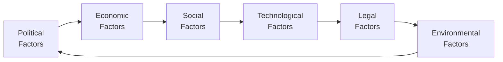

Imagine you’re trying to figure out why certain industries transform almost overnight—why a technology you’ve never heard of suddenly makes a product obsolete, or why new taxes raise prices on everyday items. This is where the PESTLE framework becomes a life-saver for equity analysts. PESTLE stands for Political, Economic, Social, Technological, Legal, and Environmental factors. It helps you assess the macro-level forces—beyond a specific company’s control—that can shape performance, impact valuations, or even jeopardize an entire sector. 

Below, we’ll walk through each component of PESTLE, then see how we can tie them all together for more dynamic equity analysis. We’ll also look at a real-world example (I once got burned analyzing a solar energy stock without ticking through all of these factors—ouch!) and explore how you can integrate PESTLE findings with standard industry metrics. Let’s jump in.

Political Factors  
Political factors revolve around everything from government stability to international trade agreements. Think of how a change in administration might spark new policies: a new government could give generous subsidies to renewables, or it might ramp up tariffs on steel imports.  
• Government Stability & Policy: Markets tend to prize predictability. For instance, a stable political regime often means consistent business policies and smoother capital flows. But a volatile political climate (e.g., frequent leadership changes) can leave business regulations in flux.  
• Trade Agreements & Tariffs: If you’re analyzing a consumer electronics company that relies on importing components, your cost assumptions might be massively affected by sudden changes in import/export tariffs.  
• Lobbying & Political Influence: Certain industries—big pharma, energy—often engage heavily with governments. Regulators or lawmakers might impose additional constraints or benefits based on lobbying successes or failures.  

Economic Factors  
Economic factors underpin supply, demand, and the cost of capital. These are the macroeconomic drivers—like GDP growth, interest rates, and inflation—that shape an industry’s opportunity set.  
• GDP & Disposable Income: If GDP is surging, consumers and businesses have more spending power. Conversely, during economic downturns, discretionary sectors (e.g., luxury goods) often feel the pinch.  
• Interest Rates & Monetary Policy: Equity valuations are strongly influenced by interest rates. When rates are low, the cost of capital is cheaper, enabling both corporations (for borrowing) and investors (seeking higher-yielding assets like equities).  
• Inflation & Currency Fluctuations: A spike in inflation might erode consumer purchasing power—or for certain industries (e.g., consumer staples), pass-through cost adjustments might be easier. Currency changes affect export-driven sectors or multinational firms.  
• Employment Levels & Consumer Confidence: More jobs generally translate to higher consumer confidence. This, in turn, can bolster consumer-facing industries (retail, travel, entertainment).  

Social Factors  
Social forces revolve around shifting cultural norms, demographics, and lifestyle preferences. These changes can feel subtle at first, but they’re often the biggest game-changers in terms of long-term demand.  
• Demographics: An aging population might drive new demand for healthcare services, while a rising middle class in emerging markets could fuel consumption of consumer goods or financial services.  
• Lifestyle & Cultural Shifts: Trends like health-conscious eating have sparked entire new verticals (plant-based meats, organic everything). Meanwhile, a shift toward remote work has upended commercial real estate demand.  
• Social Media & Influencers: Yes, it’s part of the landscape now. Positive or negative buzz can go viral, drastically affecting how consumers view certain products.  
• Education & Social Mobility: When a society places greater importance on higher education, it can alter job market dynamics, from wage expectations to industries competing for high-skilled workers.  

Technological Factors  
Technology is notorious for redrawing the boundaries of entire industries in a blink.  
• R&D and Innovation: Autonomous vehicles, AI-driven supply chains, and advanced robotics can quickly raise the competitive bar. Companies not investing enough risk falling behind.  
• Digital Platforms & Automation: Many old-school industries are still figuring out how to handle e-commerce or on-demand services. Similarly, widespread automation can reshape labor costs and productivity metrics.  
• Disruption & Platform Wars: Streaming services, ridesharing apps, and fintech disruptors are well-known examples. Disruption shifts value from traditional incumbents to agile newcomers.  
• Intellectual Property & Patent Issues: High-tech industries rely heavily on patents. A strong patent can confer a near-monopoly for a while, whereas a patent expiry can mean sudden competition.  

Legal Factors  
Rules and regulations can make or break a business model.  
• Regulations & Compliance: Think banking capital requirements or emission standards for automakers. Non-compliance can trigger fines, brand damage, or even operational shutdowns.  
• Antitrust & Competition Laws: Regulators watch for monopolistic behavior. Large mergers can be blocked or subjected to stringent conditions.  
• Consumer Protection: Recalls, data privacy, and safety standards can weigh heavily on product design and marketing. In certain sectors, a big class-action lawsuit can have vast financial repercussions.  
• Ongoing Litigation: Lawsuits in areas like pharmaceuticals, oil spills, or data breaches can not only be expensive but also damage long-term brand equity.  

Environmental Factors  
Environmental considerations have risen dramatically in prominence, and it’s no longer optional for many businesses to ignore them.  
• Climate Change & Resource Scarcity: Even if you’re analyzing a retail company, disruptions in raw material supply (like cotton, cocoa, or industrial metals) can add up. Meanwhile, industries in areas prone to flooding or wildfires face long-term strategic threats.  
• Sustainability & Carbon Footprints: Regulatory bodies might impose green taxes or mandate emissions caps. Firms that invest early in sustainable practices might attract socially responsible investors, while laggards risk reputational backlash.  
• Consumer Perception: “Greenwashing” allegations or genuine eco-friendly brand positioning can shift market sentiment. In many sectors, consumers are demanding transparency regarding sourcing and production methods.  
• Environmental Taxes & Levies: Some governments levy taxes specifically designed to curb environmental harm, which can rapidly inflate operating costs if a firm relies on emissions-heavy processes or nonrenewable resources.  

Diagram: Linking PESTLE to Industry Analysis

Below is a simplified Mermaid diagram visualizing how PESTLE factors link together. The lines indicate ways that changes in one area can cascade into others.

Integration with Industry Metrics  
The PESTLE framework works best when you layer these macro insights atop industry-specific KPIs. For example:  
• Pharmaceuticals might focus closely on Legal and Environmental factors (patent laws, FDA approvals, hazardous waste disposal).  
• Food and Beverage companies monitor Social factors (health trends, dietary guidelines) and Technological factors (manufacturing efficiency).  
• Tech companies watch out for Political developments (trade barriers for tech exports), or transformations in the Economic climate that affect venture funding.  
• Energy producers track global climate accords (Environmental), carbon taxes (Political and Environmental), and emerging technologies like solar/wind storage (Technological).  

Regularly updating your PESTLE analysis is crucial—your brand-new pipeline of eco-friendly packaging can be undermined if the government changes direction on subsidies. Or maybe a competitor obtains new patents that shift the industry’s technological baseline. The main point? Always keep scanning for external signals.

Best Practices and Common Pitfalls  
• Stay Holistic: Don’t focus on just one factor—like a new tax policy—without also checking for consumer behavior shifts or technological disruptions.  
• Think Forward, Not Just Backward: PESTLE factors are dynamic. The best analysts forecast how trends might play out, rather than just summarizing what’s happened.  
• Avoid Overcomplication: It’s easy to get swamped in details. Prioritize the key macro forces likely to exert the biggest influence on industry fundamentals.  
• Document and Update: Keep a log of relevant events and trends. Markets move fast, so revisiting your PESTLE assumptions every few months can prevent major blind spots.  

Practical Example & Case Study  
A few years back, I was excited about a solar energy manufacturer. Economically, the sector looked great: demand was growing, costs of solar panels had dropped drastically, and consumer sentiment was shifting toward greener solutions. But I soon realized I had overlooked the Environmental and Political interplay in certain emerging markets. Specifically, the local government ended up cutting subsidies to push local manufacturing, leading to fierce domestic competition and drastically lower margins for foreign-based producers. That’s a prime example of how quickly Political changes can drive shifts in an industry’s “Economic” and “Environmental” realities, ultimately impacting a company’s prospects if you don’t keep that wide-angle lens on.

Final Exam Tips  
• Use PESTLE to contextualize your equity research. The CFA exam may present scenario-based questions requiring you to spot which external factors matter most.  
• Practice scanning headlines: a single bullet point in the exam might hint at new anti-pollution laws or a shift in consumer sentiment. Show you can connect the dots among multiple PESTLE factors.  
• Bring in specific, relevant data: references to GDP growth rates, interest rate movements, or known legislative changes can make your essay answers more compelling. Focus on real, easy-to-explain stats.  
• Time Management: In constructed-response questions, you might be asked to integrate PESTLE with a financial forecast. Practice writing concise answers that show your thinking clearly without wandering off track.

Glossary  
• PESTLE (Political, Economic, Social, Technological, Legal, Environmental): A strategic tool to assess macro-level external factors shaping an industry.  
• Macroeconomic Drivers: Overall economic conditions such as GDP, inflation, and employment that guide the market’s performance and consumer behavior.  
• Demographics: Statistical data (e.g., age, income, education) used to anticipate shifts in consumer trends.  
• Regulatory Environment: Rules enforced by authorities that steer how businesses operate, including capital requirements, environmental mandates, etc.  
• Sustainability: Commitment to minimizing environmental impact and focusing on long-term ecological balance.  
• Automation: Using machines and technology to carry out tasks with minimal human input. Major cost-saver but can raise social and labor concerns.  
• Green Taxes/Levies: Government-imposed fees designed to reduce environmental damage, potentially increasing corporate costs.  
• Human Rights Due Diligence: Processes that ensure a company identifies and addresses social impacts of its operations—becoming increasingly scrutinized by regulators and consumers alike.  

References and Suggested Readings  
• “PESTEL Analysis for Risk Management,” Federation of European Risk Management Associations.  
• David, F.R. (2021). Strategic Management: Concepts and Cases. This text offers a robust discussion on analyzing macroenvironmental factors.  
• World Bank’s “Ease of Doing Business” reports, which provide country-by-country insight into legal setups and regulatory burdens.

--------------------------------------------------------------------------------

## PESTLE Framework in Industry Analysis: 10 Essential Practice Questions



### Among the Political factors in a PESTLE analysis, which of the following aspects is most relevant for determining foreign investment flows?

- [ ] Demographic trends in the target country
- [ ] Consumer ethical preferences
- [x] Government stability and trade policies
- [ ] Patent expirations 

> **Explanation:** Foreign investment decisions are heavily tied to a stable government regime and transparent trade policies. This can affect risk perceptions and returns for investors.

### When analyzing Economic factors, which indicator directly influences the cost of capital for companies seeking to finance new projects?

- [ ] Population growth
- [ ] Adoption of digital platforms
- [x] Interest rates set by central banks
- [ ] Climate change initiatives

> **Explanation:** Interest rates are key drivers of the cost of borrowing. Lower rates typically reduce financing costs and can stimulate project initiation and equity investments.

### How might Social factors most strongly influence the retail apparel industry?

- [x] Shifting cultural norms and lifestyle changes
- [ ] Changes in tax codes
- [ ] Patent law enforcement
- [ ] Carbon emissions regulations

> **Explanation:** Fashion is heavily driven by cultural shifts, lifestyle changes, and demographic tastes. Rapid trends and fads often hinge on social momentum.

### In a PESTLE analysis, which Technological factor could pose a major risk to an established logistics firm?

- [ ] Fluctuations in currency exchange rates
- [x] Rapid adoption of autonomous trucking
- [ ] Changes in healthcare regulations
- [ ] Worldwide rise in consumer wellness campaigns

> **Explanation:** Autonomous trucking could disrupt the logistics sector by cutting labor costs and possibly lowering the competitive advantage of traditional operators relying on large driver fleets.

### Which of the following best describes a Legal factor that might affect equity valuations in the financial services sector?

- [ ] AI-based supply chain optimization
- [ ] Rising disposable income
- [ ] Aging population in developed markets
- [x] Stricter capital adequacy requirements for banks

> **Explanation:** Legal mandates such as banks’ capital adequacy requirements can affect profitability and leverage, and thus equity valuations.

### An investor preparing a PESTLE analysis suspects new “green taxes” are about to be imposed on high-emission sectors. How might these taxes be classified within the framework?

- [x] Both Political and Environmental elements
- [ ] Strictly Social elements
- [ ] Strictly Legal elements
- [ ] Only Economic elements

> **Explanation:** Green taxes connect a Political motivation (governments wanting to reduce emissions) with Environmental objectives, demonstrating the interplay between multiple PESTLE categories.

### When Social and Technological trends intersect, which runner-up factor in the PESTLE framework is most likely to see rapid changes?

- [ ] Political stability
- [ ] Interest rates
- [x] Legal regulations
- [ ] Green taxes

> **Explanation:** Rapid shifts in consumer preferences (Social) enabled by new technologies (Technological) often push governments to update regulations (Legal). Think of the way ridesharing platforms forced regulators to create new rules.

### A shift in Political leadership leads to immediate removal of renewable energy subsidies. Which area of the PESTLE framework will be most directly impacted next?

- [ ] Consumer spending on luxury goods
- [x] Economic feasibility of clean energy projects
- [ ] Demographic composition of the region
- [ ] Liability risk for manufacturing defects

> **Explanation:** Removing subsidies changes the Economic landscape for renewable energy, often altering project viability and equity valuations in the sector.

### Why is it necessary to revisit or update a PESTLE analysis on a regular basis?

- [x] Macro-level trends can shift quickly, influencing multiple factors simultaneously
- [ ] Companies usually change their corporate structure every few weeks
- [ ] Regulatory bodies require monthly updates of PESTLE documentation
- [ ] The PESTLE framework only factors in short-term market events

> **Explanation:** Politics, technology, legal rulings, and more can evolve rapidly, so a static analysis can quickly become outdated and expose investors to risk.

### True or False: A PESTLE analysis should be performed only after you have completed a company’s financial statement analysis.

- [ ] True
- [x] False

> **Explanation:** While some may prefer to start with company-level data, others begin with the broader macro context. Often, it’s valuable to iterate: gather some company data, perform a PESTLE check, then refine your financial forecasting accordingly.


