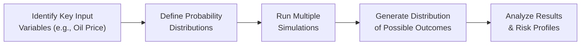

### Introduction

Industry and competitive analysis can feel a bit like detective work—sometimes you’re piecing together clues from financial statements, economic data, or even social media to discover the real story behind an industry’s performance. You might wonder, “Is it as complicated as it sounds?” Well, yes and no. Fortunately, a variety of quantitative tools help streamline this detective work. Whether you’re measuring profitability through ratio analysis or using regression techniques to forecast demand, these methods can illuminate who’s winning in the marketplace and why.

This section highlights several data-driven approaches to industry and competitive analysis. While quantitative methods may sound intimidating when you first hear terms like “Monte Carlo simulation” or “cluster analysis,” it helps to remember these are just fancy ways of asking, “What if?” or “How do these companies really stack up?” Let’s explore the common tools, best practices, prevalent pitfalls, and ways to incorporate both data-driven and qualitative factors into your analysis.

### Ratio Analysis

Ratio analysis is foundational to comparing companies and gauging overall industry health. Ratios help you quickly see whether a firm is more (or less) profitable, more (or less) indebted, and more (or less) efficient than its peers. As you’ll recall, ratio categories include:

• Liquidity (e.g., current ratio, quick ratio)  
• Efficiency (e.g., inventory turnover, days sales outstanding, asset turnover)  
• Profitability (e.g., net profit margin, return on equity)  
• Leverage/Solvency (e.g., debt-to-equity ratio, interest coverage ratio)

#### Common Usage
Within a specific industry, certain ratios hold more weight. For example, in capital-intensive industries such as utilities, analysts pay extra attention to leverage and interest coverage, whereas a software-as-a-service (SaaS) firm might warrant closer scrutiny of retention rates and net margins. If you’re analyzing a retail company, watch efficiency ratios like inventory turnover. Meanwhile, a commercial bank begs you to stress test capital adequacy ratios or loan-to-deposit metrics.

#### Best Practices and Pitfalls
• Benchmark against industry norms. A current ratio of 1.5 might look great in one sector but not so in another.  
• Examine trends in the ratios over multiple reporting periods; a single point in time might be misleading.  
• Cross-check with other data sources—ratios can morph if management changes accounting assumptions (e.g., depreciation methods).  

### Trend Analysis

Trend analysis usually involves looking at how revenue, profit margins, or even operating cash flow evolve over time. Think of it as analyzing the trajectory of a company or an entire sector. For instance, if you notice that a consumer goods company’s quarterly sales have risen steadily for three years while the rest of the industry is relatively flat, that’s a positive indication of outperformance—perhaps tied to marketing, brand loyalty, or expanded distribution networks.

#### Implementation Tips
• Use a rolling average (e.g., 3-year or 5-year average) to smooth out volatility.  
• Look for inflection points in the data (e.g., sudden spikes or dips). Are they seasonal or structural?  
• Whenever possible, standardize metrics across companies and time to ensure apples-to-apples comparisons.  

### Regression Analysis and Time-Series Forecasting

Sometimes you can’t just eyeball trends; you may need statistical help to establish relationships between variables (regression) or predict future demand based on historical patterns (time-series forecasting). For cyclical industries like autos or energy, regression might be used to see how a firm’s output relates to GDP growth, interest rates, or commodity prices. Time-series forecasting in cyclical or seasonal industries (like retail for holiday seasons) helps you anticipate peaks and troughs in demand.

A simple approach, for instance, is a linear regression where you regress sales (dependent variable) on economic indicators (independent variables). Another approach is an ARIMA model (AutoRegressive Integrated Moving Average) for time-series forecasting, which attempts to model the momentum, seasonality, or mean reversion in data.

#### Quick Example in Python

Below is a simplified example of how you might run a regression in Python to see if changes in GDP can predict sales of a particular industry:

```python
import pandas as pd
import statsmodels.api as sm

X = df[['GDP_Growth']]  
y = df['Industry_Sales']
X = sm.add_constant(X)  # Add intercept term

model = sm.OLS(y, X).fit()
print(model.summary())
```

You’d interpret the coefficient on `GDP_Growth` to see how strongly the industry sales react to broader economic expansions or contractions.

### Cluster Analysis

Sometimes you need additional clarity on how companies group together by shared characteristics. That’s where cluster analysis steps in. This machine-learning technique lumps together firms with similar operating or financial metrics. In healthcare, for instance, you might find that a “medical devices” cluster has distinctly different margins and growth drivers than a “pharmaceuticals” cluster, even though both belong to the broader healthcare sector.

• Identify key metrics (e.g., revenue growth, R&D spend, margin profile).  
• Standardize all inputs so that outsized metrics don’t dominate.  
• Apply an algorithm (like k-means) to group companies.  
• Interpret the clusters and label them (e.g., “High-growth, R&D-intensive,” “Stable, dividend-paying,” etc.).  

Though cluster analysis is more advanced than your typical ratio analysis, the payoff is a fresh perspective on an industry’s segments and competitive landscapes.

### Monte Carlo Simulations

If you’ve ever worried about “worst-case” or “best-case” scenarios, Monte Carlo simulations are your friend. These simulations incorporate randomness into key input variables—like commodity prices, exchange rates, or demand fluctuations—and create a distribution of potential outcomes. You might run thousands of iterations to see the probable distribution of a company’s earnings before interest and taxes (EBIT). This technique is especially powerful for commodity-driven or highly uncertain industries such as mining or petroleum.

#### Simple Schematic Diagram

Below is a small Mermaid diagram illustrating the Monte Carlo process flow:



### Scenario Analysis

Scenario analysis might sound similar to Monte Carlo simulation, but it’s a bit different. Rather than randomizing many variables at once, scenario analysis picks a few plausible states of the world—like optimistic, baseline, and pessimistic—and works out how a firm or industry might respond. Think about potential regulatory changes or the arrival of a new competitor. For each scenario, you estimate financial statements or segment performance. This structured approach is helpful both for internal strategic planning and for investor presentations.

A personal anecdote: I once helped forecast the performance of a small manufacturing firm under three distinct “trade policy” scenarios. The difference between them was a matter of tariffs and supply chain disruptions. By quantifying each scenario, we could see that while the baseline was fairly rosy, the pessimistic scenario suggested a significant margin squeeze—critical for deciding how aggressively to invest in new facilities.

### Big Data and Real-Time Analytics

In a digital world, data moves at the speed of light—okay, maybe figuratively, but it’s still really fast. Advanced analytics and big data can track real-time consumer sentiment on social media, map out foot traffic patterns, or analyze website clicks. These tools might reveal leading indicators of demand shifts before they show up in quarterly earnings. Firms in e-commerce, for instance, can see emerging consumer trends immediately in clickstream data, letting them pivot more quickly than traditionally published industry data might allow.

### Balancing Numbers with Qualitative Insights

Quantitative analysis is powerful but never forget the intangible factors—changes in consumer behavior, disruptive technology, or management quality. You can have the best ratio analysis in the world, but if you miss the fact that a competitor’s new product is about to make your technology obsolete, well, your ratio-based conclusion could be outdated tomorrow. Always cross-check data-driven insights with a gut check on broader market and competitive forces.

### Practical Mermaid Diagram: Industry & Competitive Analysis Workflow

Below is a higher-level workflow integrating the major quantitative tools:


In practice, you may not employ all these steps every time. Analyzing a small consumer goods firm might not require a full-blown Monte Carlo approach, but it’s useful to know these tools exist. 

### Integration with Prior Topics

In Section 7.1, you learned about overall industry classification systems, and in Section 7.2, you explored Porter’s Five Forces. Try combining those frameworks with the output you get from ratio analysis or cluster analysis. For example, a high “Barrier to Entry” rating (from Porter’s model) might manifest as consistently strong profit margins across the industry, which you can confirm via ratio analysis. Similarly, if an industry is in decline (Section 7.3 on life cycles), you might see it in downward trending sales data that appear even before the financial press picks it up.

### Conclusion and Best Practices

• Thoroughly define your data sources, and check them for consistency—garbage in, garbage out.  
• Be mindful of outliers when forecasting—past performance might not reflect sudden structural shifts.  
• Combine multiple tools (ratios, regressions, clusters) for a holistic view—no single measure can tell the entire story.  
• Use scenario analysis to plan for changes that are not easily modeled in your data (e.g., regulatory, technological).  
• Remember the qualitative dimension—always cross-check the story behind the numbers.

Whether you’re an aspiring equity analyst, a portfolio manager, or even an individual investor trying to make sense of new opportunities, these quantitative tools arm you with structured ways to separate fact from fancy. And yes, it’s a lot of fun—like I said, it’s detective work, but with a data-driven twist.

### References and Suggested Readings

• “Quantitative Investment Analysis,” CFA Institute. A deep dive into the statistical and numerical methods used in finance.  
• “Financial Modeling” by Simon Benninga. Expands on ratio analysis, forecasting, and scenario planning, with detailed examples.  
• McKinsey’s Capital Projects & Infrastructure reports. Useful for industry modeling templates and data-driven examples.  
• Company 10-Ks, industry association reports, and government data repositories, which provide raw data for your analyses.  

--------------------------------------------------------------------------------

## Assess Your Mastery of Quantitative Tools for Industry & Competitive Analysis



### Which category of ratios is most often emphasized for capital-intensive industries such as utilities?

- [ ] Liquidity ratios (e.g., current ratio)
- [ ] Efficiency ratios (e.g., asset turnover)
- [x] Leverage and solvency ratios (e.g., debt-to-equity)
- [ ] Profitability ratios (e.g., return on equity)

> **Explanation:** Utilities typically carry high levels of debt and fixed assets, so analysts focus heavily on leverage and solvency ratios.  

### What is a key difference between scenario analysis and Monte Carlo simulations?

- [ ] Scenario analysis requires a large number of random iterations.
- [x] Scenario analysis focuses on a few plausible states of the world, while Monte Carlo uses probabilistic distributions.
- [ ] Monte Carlo simulations always produce more accurate forecasts.
- [ ] Monte Carlo simulations are exclusively used for regulatory risk models.

> **Explanation:** Unlike Monte Carlo methods that randomly generate thousands of simulations, scenario analysis uses structured narratives (e.g., optimistic, pessimistic, most likely).  

### When applying cluster analysis to identify subgroups of companies within an industry, what is a key best practice?

- [ ] Collect incomplete data for more diverse results.
- [ ] Avoid normalizing the data so extreme values stand out.
- [x] Standardize the variables so they are comparable on the same scale.
- [ ] Assume a single cluster is enough for initial insights.

> **Explanation:** Cluster analysis can be biased by variables with larger numeric ranges; scaling data to a standard measure (e.g., z-scores) ensures no single variable dominates.  

### In a linear regression model relating an industry’s sales to GDP growth, what is the “dependent” variable?

- [ ] GDP growth
- [x] Industry sales
- [ ] Time
- [ ] The slope coefficient

> **Explanation:** The dependent variable is what you are trying to predict. In this case, it is the industry’s sales.  

### Which of the following is true about ratio analysis across different industries?

- [x] A “good” ratio can vary dramatically between industries.
- [ ] Ratios behave uniformly regardless of differences in business models.
- [x] Benchmarks should be taken from only one period to establish consistency.
- [ ] Only profitability ratios matter across all industries.

> **Explanation:** Ratios must be interpreted in the context of an industry’s specific dynamics. You also typically look at multiple periods to establish trends.  

### In time-series forecasting, why might you use a rolling average for a cyclical industry?

- [x] To smooth out short-term fluctuations and reveal underlying trends.
- [ ] To eliminate all seasonal effects from the data.
- [ ] To guarantee perfectly accurate predictions.
- [ ] To transform dependent variables into constant values.

> **Explanation:** Rolling averages help reduce noise and highlight fundamental patterns over time—especially in cyclical industries.  

### Which of the following statements about balancing quantitative and qualitative insights is most accurate?

- [x] Quantitative data can overlook factors like consumer sentiment or technology shifts that are not reflected in past data.  
- [ ] Qualitative insights are less relevant once you have robust quantitative models.  
- [x] Relying solely on fundamentals and ignoring market disruptions is typically risk-free.  
- [ ] Monte Carlo simulations can replace strategic judgment entirely.

> **Explanation:** It’s essential to cross-check numerical findings with the broader business context. A purely numbers-based approach could miss disruptive changes.  

### Which of the following is a key benefit of using big data analytics for industry analysis?

- [ ] It makes ratio analysis unnecessary.
- [x] It can provide near real-time insights into consumer trends or competitor activities.
- [ ] It entirely eliminates uncertainty from forecasts.
- [ ] It only applies to technology industries.

> **Explanation:** Big data platforms can process massive volumes of varied information (e.g., social media, web traffic) to give timely signals about market shifts.  

### In practice, cluster analysis is common for which reason?

- [x] It can group companies with similar operational or financial metrics, revealing niches within larger sectors.
- [ ] It ensures all companies are unique outliers.
- [ ] It avoids the need to compare ratio by ratio.
- [ ] It automatically solves for the best number of segments without user input.

> **Explanation:** Clustering helps identify overlapping traits, providing a new lens to classify companies that may not be obvious through simple ratio comparisons.  

### True or False: A single “snapshot” ratio analysis is usually enough to judge a company’s competitiveness in its industry.

- [x] True
- [ ] False

> **Explanation:** This is a trick question—technically, the statement is false. A single snapshot rarely gives the full picture, as industry conditions and company fundamentals evolve. Trends and multi-period analyses are crucial.


