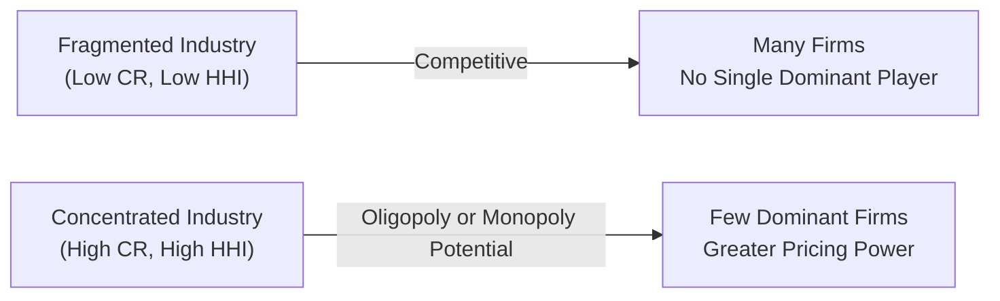

## Introduction

I still remember my first real brush with industry concentration measures. During a summer internship, my boss handed me a huge Excel file packed with revenue data for various companies and said, “Calculate CR4 and HHI; let’s see if it’s worth launching new product lines here.” I stared at the spreadsheets, thinking, “Uh…I hope I don’t mess this up.” That was the day I learned how crucial concentration ratios can be when evaluating the competitive landscape.

In this section, we’ll explore two popular ways to understand how “crowded” or “dominated” an industry truly is: concentration ratios and the Herfindahl–Hirschman Index (HHI). These metrics are central to industry and competitive analysis, guiding everyone from corporate strategists to regulatory authorities. The CFA curriculum—especially in the context of equity investments—emphasizes these measures because they have direct implications for risk, valuation, and investment decision-making. Let’s see why.

## Understanding Concentration Ratios

A “concentration ratio” is a quick snapshot of how much of the total market—often measured by sales, capacity, or output—is controlled by the top N firms (common measures are CR4 or CR8). For instance, CR4 sums the market shares of the four largest firms in an industry, expressed as a percentage. If the top four firms command 75% of total market sales, we say the CR4 is 75%.

• High CR4 (e.g., > 60%) typically signals an oligopolistic or near-monopolistic market, where a handful of large players can wield significant power over pricing, product availability, and even industry-wide innovation.  
• Moderate CR4 (roughly 40–60%) suggests that the industry has a few significant competitors, but smaller firms can still be influential, and pricing strategies can remain somewhat aggressive.  
• Low CR4 (under ~40%) indicates a relatively fragmented market. Many firms coexist, each with a relatively small slice of the total pie, often driving healthy competition and potentially reducing profitability for incumbents.

### Example: CR4 in the Airline Industry

Let’s say we have an airline industry in Country X with total annual passenger revenue of \$100 billion. Four firms account for \$25 billion, \$20 billion, \$10 billion, and \$5 billion in revenue, respectively, while dozens of smaller airlines split the remaining \$40 billion. Then:

• CR4 = (25 + 20 + 10 + 5) / 100 = 60%.  

This 60% ratio suggests moderate concentration. The top four airlines collectively hold more than half the market, which can grant them some bargaining power over suppliers (think plane manufacturers) and give them a strong influence on ticket prices.

## The Herfindahl–Hirschman Index (HHI)

While a concentration ratio sums up market share percentages, the Herfindahl–Hirschman Index (HHI) goes one step further. By summing the squares of each firm’s market share, HHI puts more weight on the largest players. This can help analysts, investors, and regulators spot markets where one or two firms dominate heavily—even if the CR4 might appear moderate.

Mathematically:


\text{HHI} = \sum_{i=1}^{N} \left( s_i \right)^2,


where \\(s_i\\) is the market share (in decimal form) of firm \\(i\\). If a single firm controls 100% of a market, the HHI is \\(1.00^2 = 1.0\\); in percentage terms, that can be expressed as 10,000. If there are many firms all with tiny market shares, the HHI will be closer to zero.

### HHI Thresholds in Merger Review

Regulators often use HHI thresholds to decide whether a proposed merger might harm competition. For instance, in the United States:

• HHI below 1,500: Industry is considered unconcentrated.  
• HHI between 1,500 and 2,500: Moderately concentrated.  
• HHI above 2,500: Highly concentrated.

If a merger would push an industry’s HHI above 2,500 or significantly increase it, regulators might demand changes or block the deal altogether. These thresholds aren’t carved in stone globally—other jurisdictions have their own guidelines. But the core principle remains: the more the market share is concentrated in a few hands, the higher the HHI, the greater the regulatory scrutiny.

### Quick Python Example

Below is a tiny Python snippet that calculates HHI from a hypothetical set of market shares (in decimals). It squares each share and sums them up, multiplying by 10,000 if you want the typical US Department of Justice format.

```python
market_shares = [0.20, 0.15, 0.10, 0.10, 0.05, 0.05, 0.35]  # in decimal form
hhi_raw = sum([share**2 for share in market_shares])
hhi_doj_format = hhi_raw * 10000

print("Raw HHI:", hhi_raw)
print("DOJ-style HHI:", hhi_doj_format)
```

If you run this, you’ll get a sense of how a single large share (0.35) heavily influences the HHI relative to smaller shares.

## Practical Considerations in Industry Analysis

### Comparing Concentration Over Time

Observing changes in CR8 (the top eight firms) or HHI annually can reveal whether an industry is consolidating (perhaps due to mergers or acquisitions) or fragmenting (maybe because new entrants are popping up). This is particularly relevant in sectors like technology or pharmaceuticals, where dynamic changes can drastically alter competitive landscapes.

• If CR4 is steadily climbing from 50% to 65% over a few years, it might hint that dominant players are actively purchasing smaller rivals.  
• If HHI rises sharply, we could see more regulatory scrutiny. For an analyst, you might forecast potential disruptions for smaller players or consider that higher concentration often pairs with higher margins for incumbents.

### Pricing Power and Barriers to Entry

In highly concentrated industries—telecom, for example—leading firms often enjoy greater pricing power. Why? Because there are fewer close competitors to undercut them. This can be a plus from an investor’s viewpoint (higher margins, stable revenues) but also invites antitrust attention.

Moreover, higher concentration often suggests higher barriers to entry. Large players have the resources to obstruct newcomers: bigger marketing budgets, tighter supplier networks, or even patent protection. By contrast, a fragmented industry with low CR4 or HHI might offer a friendlier environment for startups looking to carve out a niche.

### Innovation Implications

A hotly debated question is whether industry concentration fosters or stifles innovation:

• One school of thought holds that when concentration is high, firms have the “room” (i.e., profitability) to invest in R&D and new product development.  
• Another viewpoint suggests that concentrated markets can become complacent once they’ve secured dominant positions, thereby reducing their incentive to innovate.

In reality, you’ll need more than just a CR4 or HHI figure to know for sure. You might consider:

• Research and Development (R&D) spending as a percentage of sales.  
• Patent filings and success rates.  
• The pace of new product introductions.

By merging concentration data with these additional metrics, you get a richer perspective on whether the leadership is using its stronghold to innovate—or simply to block newcomers.

## Beyond Concentration: Additional Metrics

Concentration ratios alone do not guarantee collusive behavior or “bad” market dynamics. In fact, certain industries may remain fiercely competitive even with a moderately high CR4, particularly if buyer power is strong or if products have few switching costs. That said, combining concentration metrics with other financial and strategic measures can give a clearer picture of an industry’s competitive nature.

Below is a simple Mermaid diagram contrasting a fragmented and a concentrated industry:



### Global vs. Regional Markets

Market boundaries matter. An industry might look extremely concentrated in a single country yet be relatively unconcentrated on a global scale. Many telecom or automotive industries, for example, have strong domestic champions but face fierce competition once we zoom out internationally.

• Always clarify your “market definition.” A CR4 of 80% in your region might drop to 40% when comparing globally.  
• For equity research, this matters in both forecasting future earnings (domestic growth potential) and understanding risk factors (international competition).

## Conclusion and Exam Tips

Concentration ratios like CR4 or CR8 and the Herfindahl–Hirschman Index (HHI) are core quantitative tools for analyzing industry structure. They help identify which players call the shots and how the broader competitive environment might evolve. As an analyst—in equity research, corporate strategy, or regulatory review—you’ll find yourself using these measures frequently to assess everything from potential new product viability to the risk of antitrust challenges.

When preparing for the exam:  
• Practice calculating CR4 (or CR8) and HHI from hypothetical data sets.  
• Understand how changes in HHI reflect mergers or market exits.  
• Be comfortable discussing the limitations of these measures and their relationship to strategic considerations like pricing power and barriers to entry.  

Above all, remember that numbers never exist in a vacuum. A high CR4 might signal a cozy oligopoly—or merely be a snapshot of a region within a fiercely competitive global industry. Always interpret concentration metrics in context.

## References, Suggested Readings, and Links

• US Department of Justice’s “Horizontal Merger Guidelines”:  
  https://www.justice.gov/atr/horizontal-merger-guidelines-08192010

• Pepall, Lynne, and Dan Richards. “Industrial Organization: Theory and Practice.” A go-to resource for deeper discussions on concentration measures.

• Eurostat and OECD Databases:  
  Explore these for international market concentration data, sector overviews, and historical trends.

## Sample Exam Questions: Mastering Concentration Ratios and HHI



### Which metric specifically puts greater weight on firms with larger market shares?

- [ ] CR4
- [ ] CR8
- [x] HHI
- [ ] Sales Per Employee

> **Explanation:** The Herfindahl–Hirschman Index (HHI) squares each market share before summing, weighting larger firms more heavily.

### If the combined market share of the top four firms in an industry is 45%, what is the general level of concentration?

- [ ] Highly concentrated
- [ ] Moderately concentrated
- [x] Low to moderate concentration
- [ ] Monopolistic

> **Explanation:** A CR4 of 45% is generally considered low to moderate. It suggests some major players but also space for competition.

### A merger between two large firms increases HHI from 2,400 to 2,570. Which best describes the likely regulatory viewpoint in the US?

- [x] The market was moderately concentrated and is now considered highly concentrated.
- [ ] The market remains unconcentrated, so no action is needed.
- [ ] The merger decreases competition concerns.
- [ ] The merger is more likely to be approved without scrutiny.

> **Explanation:** A jump above 2,500 is considered by U.S. guidelines to be in “high concentration” territory and draws regulatory attention.

### How might concentration ratios fail to capture actual industry competitiveness?

- [ ] They ignore the presence of competitive global players.
- [x] They can overlook strong buyer power or switching costs.
- [ ] They undervalue R&D intensity.
- [ ] They double count market shares.

> **Explanation:** Even with high concentration, buyer power or low switching costs can maintain strong competition.

### For an industry with five equal players, each holding 20% market share, what is the raw HHI (not multiplied by 10,000)?

- [ ] 0.04
- [x] 0.20
- [ ] 0.25
- [ ] 2,000

> **Explanation:** HHI = 5 × (0.20)² = 5 × 0.04 = 0.20.

### Which of the following is a potential benefit of a highly concentrated market segment?

- [ ] Guaranteed collusive behavior
- [x] Potentially higher profit margins for large incumbents
- [ ] Lack of regulatory oversight
- [ ] Insufficient scale for capital-intensive products

> **Explanation:** Concentration can lead to stronger pricing power and higher margins, but it also invites regulatory scrutiny.

### What factor might cause a fragmented industry to become more concentrated over time?

- [ ] An increase in consumer demand for variety
- [ ] High costs for acquiring smaller rivals
- [x] A wave of mergers and acquisitions among the top firms
- [ ] Reduced prevalence of outsourcing

> **Explanation:** Consolidation through M&A is a common driver of higher industry concentration.

### Why might regulators block a merger in a highly concentrated sector?

- [x] To prevent a dominant firm from raising prices or excluding new entrants
- [ ] To reduce government revenue from corporate taxes
- [ ] To avoid confusion in calculating concentration ratios
- [ ] To encourage direct foreign investment

> **Explanation:** In a highly concentrated industry, a merger can exacerbate price-fixing risks or barriers to entry, leading regulators to block the deal.

### Which of the following best describes a limitation of CR4 for analyzing industry competition?

- [ ] It double counts the largest firm.
- [x] It omits the distribution of market share among the top four firms.
- [ ] It can only be used in consumer goods industries.
- [ ] It immediately suggests collusion.

> **Explanation:** CR4 lumps together the top four market shares without showing how equally or unequally those shares are distributed, which can mask nuanced competitive dynamics.

### True or False: A high HHI always indicates that firms are engaging in collusion.

- [x] True
- [ ] False

> **Explanation:** This is a bit of a trick. In most analyses, a high HHI signals a concentrated market, but not necessarily active collusion. However, many candidates often overgeneralize that a high HHI forces collusion. It does not—though concerns about collusion or unfair market power may increase with higher HHI. (If you feel the question is ambiguous, that’s intentional practice for real-world nuances!)


